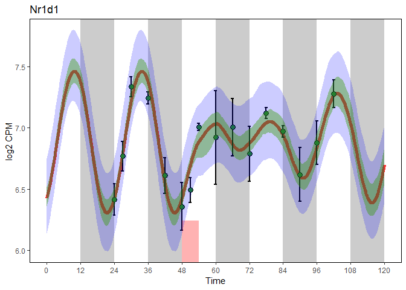

Package
=======

load packages

``` r
library(SWDMr)
library(optimx)
library(ggplot2)
library(doSNOW)
```

    ## Loading required package: foreach

    ## Loading required package: iterators

    ## Loading required package: snow

Prepare data
============

Sleep-wake data per hour

``` r
# Data
# ****** Prepare Sleep-Wake data ****** 
files <- list.files(path="../data/Sleep_States/",pattern = paste("^","BL6",sep=""),full.names = T)
SWdf<-Read_SW(files,concattimesec = 360) # 300 = 5min, 180 = 3 min, 360 = 6min
SWdf<-SWdf_AddLD(SWdf) # Add Light and Dark
SWdf<-SWdf_DayMerging(SWdf,Daysformat=list(c(1,2),c(1,2),3,4,c(1,2)),concattimesec=360)
SWdf<-SWdf_AddSD(SWdf,c(48,54))
head(SWdf)
```

    ##         NREM         REM       Wake      Sleep LenW LenS Day Time Light
    ## 1 0.03273148 0.001296296 0.06597222 0.03402778 59.5 30.5   1  0.1     1
    ## 2 0.03648148 0.002824074 0.06069444 0.03930556 55.0 35.0   1  0.2     1
    ## 3 0.04069444 0.004351852 0.05495370 0.04504630 49.5 40.5   1  0.3     1
    ## 4 0.04986111 0.002824074 0.04731481 0.05268519 42.5 47.5   1  0.4     1
    ## 5 0.06240741 0.003611111 0.03398148 0.06601852 30.5 59.5   1  0.5     1
    ## 6 0.06763889 0.009907407 0.02245370 0.07754630 20.5 69.5   1  0.6     1
    ##   Dark SD
    ## 1    0  0
    ## 2    0  0
    ## 3    0  0
    ## 4    0  0
    ## 5    0  0
    ## 6    0  0

Explained variable is gene expression

``` r
# ***** Prepare Gene expression data ******
# Gene expression
load("../data/CHor2018_TimeCourse_NormalizedData_Genes.RData")
# Meta data
load("../data/CHor2018_TimeCourse_MetaData.RData")
# Remove data sampled 7days after SD
rna_expr<-rna_expr[,rna_meta$time<100]
rna_meta<-rna_meta[rna_meta$time<100,]
# Row = samples, column = gene
rna_expr<-t(rna_expr)
#rna_expr<-2^rna_expr
rna_expr<-as.data.frame(rna_expr)
# Add time factor
rna_expr$Time<-rna_meta$time+24
head(rna_expr[,c("Arntl","Dbp","Time")])
```

    ##          Arntl      Dbp Time
    ## ZT0A  5.944392 4.898669   24
    ## ZT0B  5.977196 4.750183   24
    ## ZT0H  5.849927 5.281751   24
    ## J70N1 5.860580 4.980111   24
    ## T3N2  5.835763 5.282515   27
    ## T3N3  5.900950 5.159076   27

``` r
#rna_expr<-rna_expr[-which(rna_expr$Time %in% c(51,54)),]
```

Run fitting
===========

Build swdmr object

``` r
swdmr <- SWDMr(SWdist=SWdf, Gexp=rna_expr)
swdmr
```

    ## This is a SWDMr object
    ## This object contains:  17185 Genes Over 56 Time points
    ## Your force data frame contain 1200 values with the following possible forces:NREM;REM;Wake;Sleep;LenW;LenS;Day;Time;Light;Dark;SD

Initiate a Driven Damped Harmonic Oscillator \[DDHO\] model for a gene

``` r
Gene<-"Nr1d1"
model<-initDDHOmodel(swdmr,VarExp = Gene)
```

Set some parameter of our model

``` r
# Mean expression in baseline between highest and lowest value
MeanPerTime<-aggregate(rna_expr[rna_meta$SD_NSD == "NSD",Gene],list(rna_meta$time[rna_meta$SD_NSD == "NSD"]),mean)
MeanGeneExprInBaseline<-(max(MeanPerTime$x)+min(MeanPerTime$x))/2

# Fix the intercepts
model<-FixIntercept(model,MeanGeneExprInBaseline)
# Add sleep-wake force

model<-AddForce(model,"Wake")
model<-AddForce(model,"Sleep")
#model<-AddForce(model,"REM")
# model<-AddForce(model,"SD")
# model<-AddForce(model,"Light")
# model<-AddForce(model,"Dark")

# Start is set at intercept with speed of 0
model<-SetYinitMode(model,mode = "Intercept_0",values = c(0,48))
# We replicate baseline for 20 day
model<-ReplicateDrivingForce(model,c(0.1,24.0),20)
# A sin-wave force is applied with a period of 24h
#model<-AddSinF(model,FixPer = 24)
# Compute the fit using RSS
model<-SetFittingValue(model,value = "RSS")
# Penalize the fitting for unstable value for 10 replicated days
model<-PenalizeUnstableFit(model,value = T,PredictedValueInterval = c(0,48), StabilityDayCheck = 10)
```

summary of the model

``` r
model
```

    ## ~~~~~~~~ This is a S4 SWDMr_DDHO object ~~~~~~~~ 
    ## 
    ## Display the current setting for your fitting
    ## 
    ## ~~~~~~~~~~~ Current parameter setting ~~~~~~~~~~ 
    ## 
    ## * [free parameters] omega (Core parameter) 
    ## * [free parameters] loggamma (Core parameter) 
    ## * [free parameters] Wake (Forces) 
    ## * [free parameters] Sleep (Forces) 
    ## 
    ## 
    ## * [fixed parameters] intercept (Core parameter) : 6.84537089043882

Fit data with optimx

``` r
# Get objective function
objfun<-SWDMrGetEvalFun(model)
# Limits of the model
# params<-c(Wake=0,Sleep=0,loggamma=log(1e-1),omega=2*pi/23.8,AmpSin=1e-2,PhiSin=2.5)
# lower<-c(Wake=-Inf,Sleep=-Inf,loggamma=-Inf,omega=2*pi/30,AmpSin=0,PhiSin=0)
# upper<-c(Wake=Inf,Sleep=Inf,loggamma=Inf,omega=2*pi/18,AmpSin=Inf,PhiSin=2*pi)

params<-c(Wake=0,Sleep=0,loggamma=log(1e-1),omega=2*pi/23.8)
lower<-c(Wake=-Inf,Sleep=-Inf,loggamma=-Inf,omega=2*pi/30)
upper<-c(Wake=Inf,Sleep=Inf,loggamma=Inf,omega=2*pi/18)
# 
# params<-c(Wake=0,REM=0,loggamma=log(1e-1),omega=2*pi/23.8,AmpSin=1e-2,PhiSin=2.5)
# lower<-c(Wake=-Inf,REM=-Inf,loggamma=-Inf,omega=2*pi/30,AmpSin=0,PhiSin=0)
# upper<-c(Wake=Inf,REM=Inf,loggamma=Inf,omega=2*pi/18,AmpSin=Inf,PhiSin=2*pi)

# 

# Fit
optimxres<-optimx(params,objfun,method=c("nlminb"),lower = lower,upper=upper)
#optimxres<-rbind(optimxres,optimx(params,objfun,method=c("newuoa")))
#optimxres<-optimx(params,objfun,method=c("newuoa"))
optimxres
```

    ##             Wake     Sleep  loggamma     omega    value fevals gevals
    ## nlminb -0.170706 0.2660671 -2.649143 0.2745982 2.165233     38    114
    ##        niter convcode kkt1 kkt2 xtime
    ## nlminb    25        0 TRUE TRUE  0.27

Get fit

``` r
out<-SWDMrFit(model,params = optimxres[1,])
par(mfrow=c(2,1))
plot(out$time,out$y1,type="l",ylab="Position",xlab="Time")
plot(out$time,out$y2,type="l",ylab="Speed",xlab="Time")
```


Get some statistics for the fit

``` r
SWDMrStats(model,out,detailed = T)
```

    ##   Variable      RSS       NLL       BIC BIC_flat  BayesFactor       AIC
    ## 1    Nr1d1 2.165233 -11.61851 -3.110263 46.52304 1.668269e-11 -172.1581
    ##          R2     AdjR2    Fstat        pvalF numdf rdf  n k ErrorVariance
    ## 1 0.6677783 0.6486117 34.84066 1.735945e-12     3  52 56 4    0.03866487

Plot fit and gene expression using ggplot2

``` r
SWDMr:::StandardFittingPlot(model,optimxres[1,])
```


Compute confidence interval using empirical bootstrap

``` r
# See http://sia.webpopix.org/nonlinearRegression.html
EmpBoot<-function(model, optimxres, params, upper, lower, nboot = 100, NCORES = 7){
  
  out<-SWDMrFit(model,params = optimxres[1,])
  
  F <- matrix(nrow=nboot,ncol=length(out$y1))
  Y <- matrix(nrow=nboot,ncol=length(out$y1))
  
  pred<-SWDMrFit(model,params = optimxres[1,])
  predv<-pred$y1
  names(predv)<-pred$time
  predval<-predv[as.character(model@Gexp[,"Time"])]
  
  stats<-SWDMrStats(model,out,detailed = T)
  model2<-model
  
  paramsboot<-as.numeric(optimxres[1,names(params)])
  names(paramsboot)<-names(params)
  
  cl <- makeCluster(NCORES)
  #clusterExport(cl,c("lower","upper","model2","stats"))
  registerDoSNOW(cl)
  
  B <- foreach(i = 1:nboot,.packages=c("SWDMr","optimx"),.combine="rbind") %dopar% {
    n<-length(model2@Gexp[,1])
    model2@Gexp[,1]<- predval + sqrt(stats[["ErrorVariance"]])*rnorm(n)
    objfunboot<-SWDMrGetEvalFun(model2)
    #optimxresboot<-optimx(paramsboot,objfunboot,method=c("nlminb"),lower = lower,upper=upper)
    optimxresboot<-optimx(paramsboot,objfunboot,method=c("newuoa"))
    
    return(as.numeric(optimxresboot[1,names(params)]))
  }
  stopCluster(cl)
  
  for (l in 1:nrow(B)){
    bootpar<-B[l,]
    names(bootpar)<-names(params)
    outboot<-SWDMrFit(model,params = bootpar)
    F[l,] <- outboot$y1
    Y[l,] <- outboot$y1 + rnorm(1,0,sqrt(stats[["ErrorVariance"]]))
  }
  
  level <- 0.95
  alpha <- 1 - level
  df.mc<-data.frame(Time=out$time)
  df.mc[c("lwr.conf","upr.conf")] <- t(apply(F,MARGIN=2,function(x) quantile(x,c(alpha/2,1-alpha/2))))
  df.mc[c("lwr.pred","upr.pred")] <- t(apply(Y,MARGIN=2,function(x) quantile(x,c(alpha/2,1-alpha/2))))
  df.mc<-df.mc[df.mc$Time>0,]
  V.mc <- cov(B)
  
  se.mc <- sqrt(diag(V.mc))
  
  t.stat <- paramsboot/se.mc
  p.value <- 2*(1 - pt(abs(t.stat),51))
  
  Est.pvals<-cbind(Estimate=paramsboot,SE=se.mc,Tstat=t.stat,p.value)
  
  
  b <- c(apply(B,MARGIN=2,function(x) quantile(x,alpha/2)),
         apply(B,MARGIN=2,function(x) quantile(x,1-alpha/2)))
  ci.mc=matrix(b,ncol=2)
  row.names(ci.mc) <- names(paramsboot)
  colnames(ci.mc) <- c(paste0((1-level)/2*100,"%"),paste0((1+level)/2*100,"%"))

  return(list(B=B,Y=Y,F=F,CI=ci.mc,Est.pvals=Est.pvals,df.mc=df.mc))
}

EmpBootres<-EmpBoot(model,optimxres,params,upper,lower,nboot=100)
EmpBootres$CI
```

    ##                2.5%       97.5%
    ## Wake     -0.2799427 -0.05960265
    ## Sleep     0.1278566  0.38434884
    ## loggamma -3.2736733 -2.23639376
    ## omega     0.2663072  0.28519504

``` r
EmpBootres$Est.pvals
```

    ##            Estimate          SE     Tstat      p.value
    ## Wake     -0.1707060 0.059443625 -2.871730 5.932853e-03
    ## Sleep     0.2660671 0.068861198  3.863818 3.166132e-04
    ## loggamma -2.6491430 0.285855162 -9.267431 1.616041e-12
    ## omega     0.2745982 0.004552131 60.322994 0.000000e+00

``` r
p<-SWDMr:::StandardFittingPlot(model,optimxres[1,])
p <- p + annotate("ribbon",x=EmpBootres$df.mc$Time, ymin=EmpBootres$df.mc$lwr.pred, ymax=EmpBootres$df.mc$upr.pred, alpha=0.2, fill="blue")
p <- p + annotate("ribbon",x=EmpBootres$df.mc$Time, ymin=EmpBootres$df.mc$lwr.conf, ymax=EmpBootres$df.mc$upr.conf, alpha=0.4, fill="#339900")
p
```



``` r
Fmod<-SWDMr:::AllForceApplied(model,optimxres[1,])
Fmod
```

    ##        Time         Wake        Sleep  FstringConst         Fdamp
    ## 1    -479.9 -0.011261857 9.053673e-03 -8.305201e-07 -1.555743e-05
    ## 2    -479.8 -0.010360908 1.045792e-02 -2.446644e-06 -1.475267e-05
    ## 3    -479.7 -0.009380929 1.198534e-02 -3.033598e-06  3.723026e-06
    ## 4    -479.6 -0.008076925 1.401780e-02 -4.024783e-07  4.557229e-05
    ## 5    -479.5 -0.005800844 1.756536e-02  8.864315e-06  1.281220e-04
    ## 6    -479.4 -0.003832983 2.063252e-02  2.879196e-05  2.454674e-04
    ## 7    -479.3 -0.003358799 2.137159e-02  6.163595e-05  3.703493e-04
    ## 8    -479.2 -0.003501054 2.114987e-02  1.075989e-04  4.915086e-04
    ## 9    -479.1 -0.003208641 2.160563e-02  1.666988e-04  6.167161e-04
    ## 10   -479.0 -0.002947840 2.201213e-02  2.393302e-04  7.452793e-04
    ## 11   -478.9 -0.003382509 2.133464e-02  3.251754e-04  8.645412e-04
    ## 12   -478.8 -0.004449421 1.967172e-02  4.226328e-04  9.630805e-04
    ## 13   -478.7 -0.005350370 1.826748e-02  5.296559e-04  1.043961e-03
    ## 14   -478.6 -0.006014227 1.723277e-02  6.445932e-04  1.111520e-03
    ## 15   -478.5 -0.006132773 1.704800e-02  7.665511e-04  1.175631e-03
    ## 16   -478.4 -0.005927293 1.736827e-02  8.954725e-04  1.242112e-03
    ## 17   -478.3 -0.005018441 1.878483e-02  1.032283e-03  1.323573e-03
    ## 18   -478.2 -0.005073763 1.869861e-02  1.177644e-03  1.402470e-03
    ## 19   -478.1 -0.005642783 1.781171e-02  1.330786e-03  1.469499e-03
    ## 20   -478.0 -0.005563752 1.793489e-02  1.491067e-03  1.536376e-03
    ## 21   -477.9 -0.003011065 2.191358e-02  1.660850e-03  1.647644e-03
    ## 22   -477.8 -0.003872498 2.057093e-02  1.841562e-03  1.741361e-03
    ## 23   -477.7 -0.005034248 1.876019e-02  2.031045e-03  1.812167e-03
    ## 24   -477.6 -0.005271339 1.839066e-02  2.227752e-03  1.876839e-03
    ## 25   -477.5 -0.006836145 1.595171e-02  2.429750e-03  1.911437e-03
    ## 26   -477.4 -0.006678084 1.619807e-02  2.635500e-03  1.947205e-03
    ## 27   -477.3 -0.005690201 1.773781e-02  2.845923e-03  1.999065e-03
    ## 28   -477.2 -0.005698104 1.772549e-02  3.061770e-03  2.048916e-03
    ## 29   -477.1 -0.004994732 1.882178e-02  3.283509e-03  2.109555e-03
    ## 30   -477.0 -0.004544258 1.952391e-02  3.512041e-03  2.176302e-03
    ## 31   -476.9 -0.004781350 1.915437e-02  3.747350e-03  2.236671e-03
    ## 32   -476.8 -0.005579559 1.791026e-02  3.988216e-03  2.280544e-03
    ## 33   -476.7 -0.004575870 1.947463e-02  4.234619e-03  2.340488e-03
    ## 34   -476.6 -0.004789253 1.914205e-02  4.487093e-03  2.394404e-03
    ## 35   -476.5 -0.006188094 1.696178e-02  4.743855e-03  2.420925e-03
    ## 36   -476.4 -0.005745523 1.765158e-02  5.003763e-03  2.453419e-03
    ## 37   -476.3 -0.005508431 1.802112e-02  5.267254e-03  2.488114e-03
    ## 38   -476.2 -0.006551635 1.639515e-02  5.533328e-03  2.501890e-03
    ## 39   -476.1 -0.007997894 1.414097e-02  5.799374e-03  2.487618e-03
    ## 40   -476.0 -0.006583247 1.634588e-02  6.065165e-03  2.497079e-03
    ## 41   -475.9 -0.005476819 1.807039e-02  6.332926e-03  2.524542e-03
    ## 42   -475.8 -0.005563752 1.793489e-02  6.603421e-03  2.548347e-03
    ## 43   -475.7 -0.004718125 1.925291e-02  6.877157e-03  2.585314e-03
    ## 44   -475.6 -0.003872498 2.057093e-02  7.155531e-03  2.635321e-03
    ## 45   -475.5 -0.005761329 1.762695e-02  7.437296e-03  2.648948e-03
    ## 46   -475.4 -0.006417283 1.660456e-02  7.719771e-03  2.648663e-03
    ## 47   -475.3 -0.006393573 1.664151e-02  8.002133e-03  2.646818e-03
    ## 48   -475.2 -0.003761855 2.074338e-02  8.286725e-03  2.690438e-03
    ## 49   -475.1 -0.003445733 2.123610e-02  8.576149e-03  2.737427e-03
    ## 50   -475.0 -0.004915702 1.894496e-02  8.869042e-03  2.755531e-03
    ## 51   -474.9 -0.004852477 1.904351e-02  9.163809e-03  2.772576e-03
    ## 52   -474.8 -0.004552161 1.951159e-02  9.460565e-03  2.792832e-03
    ## 53   -474.7 -0.005516334 1.800880e-02  9.758433e-03  2.793465e-03
    ## 54   -474.6 -0.005295048 1.835370e-02  1.005647e-02  2.795985e-03
    ## 55   -474.5 -0.006338252 1.672774e-02  1.035366e-02  2.777581e-03
    ## 56   -474.4 -0.006006324 1.724509e-02  1.064910e-02  2.763203e-03
    ## 57   -474.3 -0.005453110 1.810735e-02  1.094343e-02  2.756823e-03
    ## 58   -474.2 -0.004449421 1.967172e-02  1.123795e-02  2.766510e-03
    ## 59   -474.1 -0.003603794 2.098974e-02  1.153419e-02  2.789293e-03
    ## 60   -474.0 -0.003912013 2.050934e-02  1.183245e-02  2.804264e-03
    ## 61   -473.9 -0.004070075 2.026298e-02  1.213203e-02  2.814173e-03
    ## 62   -473.8 -0.006464701 1.653065e-02  1.243025e-02  2.778731e-03
    ## 63   -473.7 -0.006962594 1.575462e-02  1.272411e-02  2.732477e-03
    ## 64   -473.6 -0.006085354 1.712191e-02  1.301379e-02  2.700308e-03
    ## 65   -473.5 -0.006101160 1.709728e-02  1.329993e-02  2.666053e-03
    ## 66   -473.4 -0.004899896 1.896960e-02  1.358348e-02  2.651690e-03
    ## 67   -473.3 -0.005461013 1.809503e-02  1.386485e-02  2.625321e-03
    ## 68   -473.2 -0.006654374 1.623502e-02  1.414217e-02  2.575654e-03
    ## 69   -473.1 -0.007665966 1.465833e-02  1.441314e-02  2.506166e-03
    ## 70   -473.0 -0.007239201 1.532349e-02  1.467703e-02  2.442978e-03
    ## 71   -472.9 -0.006377767 1.666615e-02  1.493494e-02  2.393928e-03
    ## 72   -472.8 -0.005595365 1.788562e-02  1.518829e-02  2.357528e-03
    ## 73   -472.7 -0.005800844 1.756536e-02  1.543748e-02  2.315910e-03
    ## 74   -472.6 -0.006037936 1.719582e-02  1.568193e-02  2.268572e-03
    ## 75   -472.5 -0.005587462 1.789794e-02  1.592169e-02  2.227983e-03
    ## 76   -472.4 -0.004457324 1.965940e-02  1.615813e-02  2.206378e-03
    ## 77   -472.3 -0.005626977 1.783635e-02  1.639106e-02  2.162183e-03
    ## 78   -472.2 -0.005287145 1.836602e-02  1.661954e-02  2.122801e-03
    ## 79   -472.1 -0.004789253 1.914205e-02  1.684423e-02  2.091076e-03
    ## 80   -472.0 -0.004196523 2.006589e-02  1.706603e-02  2.068689e-03
    ## 81   -471.9 -0.003674922 2.087888e-02  1.728588e-02  2.054308e-03
    ## 82   -471.8 -0.005018441 1.878483e-02  1.750282e-02  2.014266e-03
    ## 83   -471.7 -0.006282931 1.681396e-02  1.771420e-02  1.950199e-03
    ## 84   -471.6 -0.007839833 1.438733e-02  1.791720e-02  1.857052e-03
    ## 85   -471.5 -0.006851951 1.592707e-02  1.811118e-02  1.780975e-03
    ## 86   -471.4 -0.007555323 1.483078e-02  1.829633e-02  1.691416e-03
    ## 87   -471.3 -0.006938884 1.579158e-02  1.847248e-02  1.612329e-03
    ## 88   -471.2 -0.006709696 1.614880e-02  1.864039e-02  1.536720e-03
    ## 89   -471.1 -0.005800844 1.756536e-02  1.880108e-02  1.476872e-03
    ## 90   -471.0 -0.005295048 1.835370e-02  1.895583e-02  1.425454e-03
    ## 91   -470.9 -0.005745523 1.765158e-02  1.910463e-02  1.365207e-03
    ## 92   -470.8 -0.007571129 1.480614e-02  1.924521e-02  1.271450e-03
    ## 93   -470.7 -0.007515808 1.489237e-02  1.937583e-02  1.178395e-03
    ## 94   -470.6 -0.005864069 1.746681e-02  1.949811e-02  1.114885e-03
    ## 95   -470.5 -0.005468916 1.808271e-02  1.961397e-02  1.058109e-03
    ## 96   -470.4 -0.005302952 1.834139e-02  1.972392e-02  1.003929e-03
    ## 97   -470.3 -0.005603268 1.787330e-02  1.982778e-02  9.439634e-04
    ## 98   -470.2 -0.006053742 1.717118e-02  1.992480e-02  8.755904e-04
    ## 99   -470.1 -0.007484195 1.494164e-02  2.001314e-02  7.812554e-04
    ## 100  -470.0 -0.006496313 1.648138e-02  2.009237e-02  7.048060e-04
    ## 101  -469.9 -0.007571129 1.480614e-02  2.016242e-02  6.089907e-04
    ## 102  -469.8 -0.005121181 1.862470e-02  2.022462e-02  5.575568e-04
    ## 103  -469.7 -0.006298737 1.678933e-02  2.028019e-02  4.848393e-04
    ## 104  -469.6 -0.005555849 1.794721e-02  2.032874e-02  4.256615e-04
    ## 105  -469.5 -0.005603268 1.787330e-02  2.037093e-02  3.657261e-04
    ## 106  -469.4 -0.005239727 1.843993e-02  2.040709e-02  3.124915e-04
    ## 107  -469.3 -0.005848262 1.749145e-02  2.043700e-02  2.484276e-04
    ## 108  -469.2 -0.008709169 1.303236e-02  2.045733e-02  1.330564e-04
    ## 109  -469.1 -0.009839306 1.127090e-02  2.046431e-02 -1.974076e-06
    ## 110  -469.0 -0.008724975 1.300773e-02  2.045802e-02 -1.159642e-04
    ## 111  -468.9 -0.007381456 1.510177e-02  2.044091e-02 -2.048452e-04
    ## 112  -468.8 -0.007017915 1.566840e-02  2.041471e-02 -2.863926e-04
    ## 113  -468.7 -0.007484195 1.494164e-02  2.037941e-02 -3.755557e-04
    ## 114  -468.6 -0.008709169 1.303236e-02  2.033347e-02 -4.858902e-04
    ## 115  -468.5 -0.008875133 1.277368e-02  2.027566e-02 -5.980739e-04
    ## 116  -468.4 -0.009483669 1.182520e-02  2.020537e-02 -7.199875e-04
    ## 117  -468.3 -0.009807694 1.132017e-02  2.012185e-02 -8.463422e-04
    ## 118  -468.2 -0.009799791 1.133249e-02  2.002493e-02 -9.710282e-04
    ## 119  -468.1 -0.006243415 1.687555e-02  1.991823e-02 -1.029997e-03
    ## 120  -468.0 -0.009159644 1.233024e-02  1.980250e-02 -1.140346e-03
    ## 121  -467.9 -0.014027927 4.742400e-03  1.967040e-02 -1.336819e-03
    ## 122  -467.8 -0.016296104 1.207156e-03  1.951530e-02 -1.571789e-03
    ## 123  -467.7 -0.016896737 2.709943e-04  1.933471e-02 -1.814751e-03
    ## 124  -467.6 -0.016999476 1.108613e-04  1.912827e-02 -2.056488e-03
    ## 125  -467.5 -0.016359329 1.108613e-03  1.889685e-02 -2.283438e-03
    ## 126  -467.4 -0.017038992 4.927169e-05  1.864074e-02 -2.519325e-03
    ## 127  -467.3 -0.016928349 2.217226e-04  1.835978e-02 -2.749663e-03
    ## 128  -467.2 -0.016643839 6.651678e-04  1.805472e-02 -2.971183e-03
    ## 129  -467.1 -0.015900951 1.823052e-03  1.772696e-02 -3.175518e-03
    ## 130  -467.0 -0.015545314 2.377359e-03  1.737795e-02 -3.369617e-03
    ## 131  -466.9 -0.016612227 7.144395e-04  1.700743e-02 -3.579048e-03
    ## 132  -466.8 -0.015308222 2.746897e-03  1.661604e-02 -3.760809e-03
    ## 133  -466.7 -0.015339834 2.697625e-03  1.620547e-02 -3.939033e-03
    ## 134  -466.6 -0.015007906 3.214978e-03  1.577643e-02 -4.107058e-03
    ## 135  -466.5 -0.013237621 5.974192e-03  1.533140e-02 -4.238901e-03
    ## 136  -466.4 -0.014581141 3.880145e-03  1.487124e-02 -4.390850e-03
    ## 137  -466.3 -0.014383564 4.188093e-03  1.439530e-02 -4.534867e-03
    ## 138  -466.2 -0.014502110 4.003325e-03  1.390413e-02 -4.676600e-03
    ## 139  -466.1 -0.012565861 7.021215e-03  1.339994e-02 -4.778916e-03
    ## 140  -466.0 -0.013174397 6.072735e-03  1.288449e-02 -4.887890e-03
    ## 141  -465.9 -0.012858274 6.565452e-03  1.235795e-02 -4.986726e-03
    ## 142  -465.8 -0.010985250 9.484800e-03  1.182292e-02 -5.047354e-03
    ## 143  -465.7 -0.014502110 4.003325e-03  1.127826e-02 -5.167160e-03
    ## 144  -465.6 -0.013545840 5.493793e-03  1.072200e-02 -5.265001e-03
    ## 145  -465.5 -0.010993153 9.472482e-03  1.015801e-02 -5.312181e-03
    ## 146  -465.4 -0.011435724 8.782678e-03  9.588789e-03 -5.363015e-03
    ## 147  -465.3 -0.013308749 5.863331e-03  9.012581e-03 -5.443226e-03
    ## 148  -465.2 -0.014920972 3.350475e-03  8.426517e-03 -5.547844e-03
    ## 149  -465.1 -0.014359855 4.225047e-03  7.830097e-03 -5.637442e-03
    ## 150  -465.0 -0.013466810 5.616972e-03  7.225242e-03 -5.706075e-03
    ## 151  -464.9 -0.013814544 5.074984e-03  6.612987e-03 -5.776205e-03
    ## 152  -464.8 -0.013371973 5.764787e-03  5.993938e-03 -5.833523e-03
    ## 153  -464.7 -0.013522131 5.530747e-03  5.368887e-03 -5.888761e-03
    ## 154  -464.6 -0.014178085 4.508359e-03  4.737571e-03 -5.951010e-03
    ## 155  -464.5 -0.012850371 6.577770e-03  4.101157e-03 -5.984416e-03
    ## 156  -464.4 -0.010977347 9.497118e-03  3.463235e-03 -5.979325e-03
    ## 157  -464.3 -0.011451530 8.758042e-03  2.825638e-03 -5.978326e-03
    ## 158  -464.2 -0.011546367 8.610227e-03  2.188295e-03 -5.974552e-03
    ## 159  -464.1 -0.012723922 6.774857e-03  1.550460e-03 -5.987543e-03
    ## 160  -464.0 -0.013530034 5.518429e-03  9.107084e-04 -6.010475e-03
    ## 161  -463.9 -0.012739729 6.750221e-03  2.695219e-04 -6.014483e-03
    ## 162  -463.8 -0.012858274 6.565452e-03 -3.719634e-04 -6.016080e-03
    ## 163  -463.7 -0.014185988 4.496041e-03 -1.014655e-03 -6.037081e-03
    ## 164  -463.6 -0.013300846 5.875649e-03 -1.658484e-03 -6.037441e-03
    ## 165  -463.5 -0.013569550 5.456839e-03 -2.302368e-03 -6.038107e-03
    ## 166  -463.4 -0.012471025 7.169030e-03 -2.945023e-03 -6.014429e-03
    ## 167  -463.3 -0.014367758 4.212729e-03 -3.586746e-03 -6.020590e-03
    ## 168  -463.2 -0.013846157 5.025712e-03 -4.228381e-03 -6.012782e-03
    ## 169  -463.1 -0.013182300 6.060418e-03 -4.868306e-03 -5.988544e-03
    ## 170  -463.0 -0.013166494 6.085053e-03 -5.505399e-03 -5.959692e-03
    ## 171  -462.9 -0.012660698 6.873400e-03 -6.138701e-03 -5.917449e-03
    ## 172  -462.8 -0.014312437 4.298955e-03 -6.768866e-03 -5.900832e-03
    ## 173  -462.7 -0.013609065 5.395250e-03 -7.396352e-03 -5.867219e-03
    ## 174  -462.6 -0.013395682 5.727834e-03 -8.019825e-03 -5.825589e-03
    ## 175  -462.5 -0.013727611 5.210481e-03 -8.638960e-03 -5.785858e-03
    ## 176  -462.4 -0.015071130 3.116434e-03 -9.254933e-03 -5.766279e-03
    ## 177  -462.3 -0.013822447 5.062666e-03 -9.867393e-03 -5.719996e-03
    ## 178  -462.2 -0.012605377 6.959626e-03 -1.047353e-02 -5.647802e-03
    ## 179  -462.1 -0.012866177 6.553134e-03 -1.107203e-02 -5.576575e-03
    ## 180  -462.0 -0.013980509 4.816307e-03 -1.166380e-02 -5.521748e-03
    ## 181  -461.9 -0.012526346 7.082805e-03 -1.224813e-02 -5.436944e-03
    ## 182  -461.8 -0.011293469 9.004401e-03 -1.282204e-02 -5.326429e-03
    ## 183  -461.7 -0.010171235 1.075355e-02 -1.338291e-02 -5.192461e-03
    ## 184  -461.6 -0.011435724 8.782678e-03 -1.393056e-02 -5.078330e-03
    ## 185  -461.5 -0.010637515 1.002679e-02 -1.446510e-02 -4.946798e-03
    ## 186  -461.4 -0.009467863 1.184984e-02 -1.498434e-02 -4.791392e-03
    ## 187  -461.3 -0.009293996 1.212084e-02 -1.548671e-02 -4.630347e-03
    ## 188  -461.2 -0.008890940 1.274905e-02 -1.597139e-02 -4.459692e-03
    ## 189  -461.1 -0.007752899 1.452283e-02 -1.643667e-02 -4.266374e-03
    ## 190  -461.0 -0.008037409 1.407938e-02 -1.688150e-02 -4.076341e-03
    ## 191  -460.9 -0.009270286 1.215779e-02 -1.730716e-02 -3.906809e-03
    ## 192  -460.8 -0.010226556 1.066732e-02 -1.771557e-02 -3.752775e-03
    ## 193  -460.7 -0.010345102 1.048255e-02 -1.810757e-02 -3.599143e-03
    ## 194  -460.6 -0.010179138 1.074123e-02 -1.848295e-02 -3.440898e-03
    ## 195  -460.5 -0.011372500 8.881222e-03 -1.884252e-02 -3.302694e-03
    ## 196  -460.4 -0.009515281 1.177593e-02 -1.918548e-02 -3.129504e-03
    ## 197  -460.3 -0.007871445 1.433806e-02 -1.950833e-02 -2.925551e-03
    ## 198  -460.2 -0.007547420 1.484310e-02 -1.980908e-02 -2.714995e-03
    ## 199  -460.1 -0.009649633 1.156653e-02 -2.008936e-02 -2.541779e-03
    ## 200  -460.0 -0.009807694 1.132017e-02 -2.035129e-02 -2.370722e-03
    ## 201  -459.9 -0.009791888 1.134481e-02 -2.059494e-02 -2.198805e-03
    ## 202  -459.8 -0.009720761 1.145567e-02 -2.082015e-02 -2.025165e-03
    ## 203  -459.7 -0.008724975 1.300773e-02 -2.102588e-02 -1.833277e-03
    ## 204  -459.6 -0.009665439 1.154189e-02 -2.121204e-02 -1.658316e-03
    ## 205  -459.5 -0.010273975 1.059341e-02 -2.138014e-02 -1.494312e-03
    ## 206  -459.4 -0.010447842 1.032242e-02 -2.153091e-02 -1.333475e-03
    ## 207  -459.3 -0.009957852 1.108613e-02 -2.166406e-02 -1.163937e-03
    ## 208  -459.2 -0.010803479 9.768112e-03 -2.177997e-02 -1.009963e-03
    ## 209  -459.1 -0.010653321 1.000215e-02 -2.187933e-02 -8.536074e-04
    ## 210  -459.0 -0.009546893 1.172666e-02 -2.196097e-02 -6.777676e-04
    ## 211  -458.9 -0.007579032 1.479382e-02 -2.202201e-02 -4.671841e-04
    ## 212  -458.8 -0.007057430 1.560681e-02 -2.206014e-02 -2.483308e-04
    ## 213  -458.7 -0.008606430 1.319249e-02 -2.207651e-02 -5.875587e-05
    ## 214  -458.6 -0.010139623 1.080282e-02 -2.207420e-02  1.018894e-04
    ## 215  -458.5 -0.010827189 9.731158e-03 -2.205548e-02  2.489318e-04
    ## 216  -458.4 -0.011451530 8.758042e-03 -2.202175e-02  3.834964e-04
    ## 217  -458.3 -0.010598000 1.008838e-02 -2.197292e-02  5.322108e-04
    ## 218  -458.2 -0.008574817 1.324177e-02 -2.190635e-02  7.159482e-04
    ## 219  -458.1 -0.008851424 1.281064e-02 -2.182056e-02  8.928668e-04
    ## 220  -458.0 -0.008559011 1.326640e-02 -2.171571e-02  1.073139e-03
    ## 221  -457.9 -0.009981561 1.104918e-02 -2.159313e-02  1.225691e-03
    ## 222  -457.8 -0.011775556 8.253008e-03 -2.145611e-02  1.343909e-03
    ## 223  -457.7 -0.010898316 9.620297e-03 -2.130573e-02  1.476097e-03
    ## 224  -457.6 -0.011981035 7.932742e-03 -2.114241e-02  1.586726e-03
    ## 225  -457.5 -0.012802953 6.651678e-03 -2.096819e-02  1.680568e-03
    ## 226  -457.4 -0.012984723 6.368366e-03 -2.078424e-02  1.769210e-03
    ## 227  -457.3 -0.013292943 5.887967e-03 -2.059123e-02  1.850341e-03
    ## 228  -457.2 -0.012897790 6.503863e-03 -2.038930e-02  1.936634e-03
    ## 229  -457.1 -0.013403585 5.715516e-03 -2.017876e-02  2.011746e-03
    ## 230  -457.0 -0.014130667 4.582267e-03 -1.996102e-02  2.071711e-03
    ## 231  -456.9 -0.014976294 3.264249e-03 -1.973781e-02  2.114452e-03
    ## 232  -456.8 -0.013277136 5.912602e-03 -1.950850e-02  2.185934e-03
    ## 233  -456.7 -0.011301372 8.992083e-03 -1.926979e-02  2.290886e-03
    ## 234  -456.6 -0.011064280 9.361621e-03 -1.901978e-02  2.397651e-03
    ## 235  -456.5 -0.012012647 7.883470e-03 -1.875944e-02  2.484766e-03
    ## 236  -456.4 -0.011886198 8.080557e-03 -1.848982e-02  2.571680e-03
    ## 237  -456.3 -0.012478928 7.156713e-03 -1.821163e-02  2.645365e-03
    ## 238  -456.2 -0.012550055 7.045851e-03 -1.792579e-02  2.715261e-03
    ## 239  -456.1 -0.012502637 7.119759e-03 -1.763259e-02  2.783479e-03
    ## 240  -456.0 -0.012210224 7.575522e-03 -1.733196e-02  2.854396e-03
    ## 241  -455.9 -0.011261857 9.053673e-03 -1.702301e-02  2.939765e-03
    ## 242  -455.8 -0.010360908 1.045792e-02 -1.670423e-02  3.038564e-03
    ## 243  -455.7 -0.009380929 1.198534e-02 -1.637413e-02  3.152049e-03
    ## 244  -455.6 -0.008076925 1.401780e-02 -1.603084e-02  3.285874e-03
    ## 245  -455.5 -0.005800844 1.756536e-02 -1.567128e-02  3.457316e-03
    ## 246  -455.4 -0.003832983 2.063252e-02 -1.529174e-02  3.660426e-03
    ## 247  -455.3 -0.003358799 2.137159e-02 -1.489030e-02  3.867902e-03
    ## 248  -455.2 -0.003501054 2.114987e-02 -1.446711e-02  4.068446e-03
    ## 249  -455.1 -0.003208641 2.160563e-02 -1.402250e-02  4.269792e-03
    ## 250  -455.0 -0.002947840 2.201213e-02 -1.355640e-02  4.471211e-03
    ## 251  -454.9 -0.003382509 2.133464e-02 -1.306950e-02  4.660017e-03
    ## 252  -454.8 -0.004449421 1.967172e-02 -1.256375e-02  4.824759e-03
    ## 253  -454.7 -0.005350370 1.826748e-02 -1.204155e-02  4.968474e-03
    ## 254  -454.6 -0.006014227 1.723277e-02 -1.150492e-02  5.095476e-03
    ## 255  -454.5 -0.006132773 1.704800e-02 -1.095511e-02  5.215618e-03
    ## 256  -454.4 -0.005927293 1.736827e-02 -1.039255e-02  5.334699e-03
    ## 257  -454.3 -0.005018441 1.878483e-02 -9.816671e-03  5.465316e-03
    ## 258  -454.2 -0.005073763 1.869861e-02 -9.227185e-03  5.589909e-03
    ## 259  -454.1 -0.005642783 1.781171e-02 -8.625230e-03  5.699167e-03
    ## 260  -454.0 -0.005563752 1.793489e-02 -8.011817e-03  5.804797e-03
    ## 261  -453.9 -0.003011065 2.191358e-02 -7.384955e-03  5.951338e-03
    ## 262  -453.8 -0.003872498 2.057093e-02 -6.743589e-03  6.076846e-03
    ## 263  -453.7 -0.005034248 1.876019e-02 -6.090247e-03  6.175962e-03
    ## 264  -453.6 -0.005271339 1.839066e-02 -5.426848e-03  6.265466e-03
    ## 265  -453.5 -0.006836145 1.595171e-02 -4.755696e-03  6.321423e-03
    ## 266  -453.4 -0.006678084 1.619807e-02 -4.078698e-03  6.375086e-03
    ## 267  -453.3 -0.005690201 1.773781e-02 -3.395303e-03  6.441389e-03
    ## 268  -453.2 -0.005698104 1.772549e-02 -2.705128e-03  6.502243e-03
    ## 269  -453.1 -0.004994732 1.882178e-02 -2.008070e-03  6.570462e-03
    ## 270  -453.0 -0.004544258 1.952391e-02 -1.303593e-03  6.641384e-03
    ## 271  -452.9 -0.004781350 1.915437e-02 -5.920733e-04  6.702543e-03
    ## 272  -452.8 -0.005579559 1.791026e-02  1.249081e-04  6.743845e-03
    ## 273  -452.7 -0.004575870 1.947463e-02  8.469740e-04  6.797883e-03
    ## 274  -452.6 -0.004789253 1.914205e-02  1.574304e-03  6.842586e-03
    ## 275  -452.5 -0.006188094 1.696178e-02  2.304764e-03  6.856617e-03
    ## 276  -452.4 -0.005745523 1.765158e-02  3.036866e-03  6.873375e-03
    ## 277  -452.3 -0.005508431 1.802112e-02  3.770702e-03  6.889125e-03
    ## 278  -452.2 -0.006551635 1.639515e-02  4.504931e-03  6.880783e-03
    ## 279  -452.1 -0.007997894 1.414097e-02  5.236605e-03  6.841259e-03
    ## 280  -452.0 -0.006583247 1.634588e-02  5.965167e-03  6.822374e-03
    ## 281  -451.9 -0.005476819 1.807039e-02  6.692512e-03  6.818442e-03
    ## 282  -451.8 -0.005563752 1.793489e-02  7.419083e-03  6.807847e-03
    ## 283  -451.7 -0.004718125 1.925291e-02  8.145069e-03  6.807455e-03
    ## 284  -451.6 -0.003872498 2.057093e-02  8.871553e-03  6.817196e-03
    ## 285  -451.5 -0.005761329 1.762695e-02  9.596982e-03  6.787696e-03
    ## 286  -451.4 -0.006417283 1.660456e-02  1.031837e-02  6.741481e-03
    ## 287  -451.3 -0.006393573 1.664151e-02  1.103460e-02  6.690953e-03
    ## 288  -451.2 -0.003761855 2.074338e-02  1.174773e-02  6.683194e-03
    ## 289  -451.1 -0.003445733 2.123610e-02  1.246007e-02  6.676168e-03
    ## 290  -451.0 -0.004915702 1.894496e-02  1.316998e-02  6.637676e-03
    ## 291  -450.9 -0.004852477 1.904351e-02  1.387559e-02  6.595609e-03
    ## 292  -450.8 -0.004552161 1.951159e-02  1.457676e-02  6.554296e-03
    ## 293  -450.7 -0.005516334 1.800880e-02  1.527234e-02  6.490969e-03
    ## 294  -450.6 -0.005295048 1.835370e-02  1.596115e-02  6.427200e-03
    ## 295  -450.5 -0.006338252 1.672774e-02  1.664192e-02  6.340246e-03
    ## 296  -450.4 -0.006006324 1.724509e-02  1.731352e-02  6.255125e-03
    ## 297  -450.3 -0.005453110 1.810735e-02  1.797635e-02  6.175877e-03
    ## 298  -450.2 -0.004449421 1.967172e-02  1.863148e-02  6.110639e-03
    ## 299  -450.1 -0.003603794 2.098974e-02  1.928025e-02  6.056514e-03
    ## 300  -450.0 -0.003912013 2.050934e-02  1.992272e-02  5.992664e-03
    ## 301  -449.9 -0.004070075 2.026298e-02  2.055802e-02  5.921912e-03
    ## 302  -449.8 -0.006464701 1.653065e-02  2.118325e-02  5.804042e-03
    ## 303  -449.7 -0.006962594 1.575462e-02  2.179525e-02  5.673667e-03
    ## 304  -449.6 -0.006085354 1.712191e-02  2.239401e-02  5.555762e-03
    ## 305  -449.5 -0.006101160 1.709728e-02  2.298000e-02  5.434228e-03
    ## 306  -449.4 -0.004899896 1.896960e-02  2.355402e-02  5.331121e-03
    ## 307  -449.3 -0.005461013 1.809503e-02  2.411633e-02  5.214621e-03
    ## 308  -449.2 -0.006654374 1.623502e-02  2.466489e-02  5.073512e-03
    ## 309  -449.1 -0.007665966 1.465833e-02  2.519729e-02  4.911350e-03
    ## 310  -449.0 -0.007239201 1.532349e-02  2.571267e-02  4.754334e-03
    ## 311  -448.9 -0.006377767 1.666615e-02  2.621200e-02  4.610380e-03
    ## 312  -448.8 -0.005595365 1.788562e-02  2.669660e-02  4.478081e-03
    ## 313  -448.7 -0.005800844 1.756536e-02  2.716676e-02  4.339645e-03
    ## 314  -448.6 -0.006037936 1.719582e-02  2.762181e-02  4.194651e-03
    ## 315  -448.5 -0.005587462 1.789794e-02  2.806172e-02  4.055646e-03
    ## 316  -448.4 -0.004457324 1.965940e-02  2.848778e-02  3.934947e-03
    ## 317  -448.3 -0.005626977 1.783635e-02  2.889973e-02  3.791057e-03
    ## 318  -448.2 -0.005287145 1.836602e-02  2.929657e-02  3.651458e-03
    ## 319  -448.1 -0.004789253 1.914205e-02  2.967890e-02  3.519075e-03
    ## 320  -448.0 -0.004196523 2.006589e-02  3.004759e-02  3.395665e-03
    ## 321  -447.9 -0.003674922 2.087888e-02  3.040354e-02  3.279977e-03
    ## 322  -447.8 -0.005018441 1.878483e-02  3.074577e-02  3.138420e-03
    ## 323  -447.7 -0.006282931 1.681396e-02  3.107161e-02  2.972708e-03
    ## 324  -447.6 -0.007839833 1.438733e-02  3.137823e-02  2.777865e-03
    ## 325  -447.5 -0.006851951 1.592707e-02  3.166498e-02  2.600116e-03
    ## 326  -447.4 -0.007555323 1.483078e-02  3.193206e-02  2.408987e-03
    ## 327  -447.3 -0.006938884 1.579158e-02  3.217932e-02  2.228506e-03
    ## 328  -447.2 -0.006709696 1.614880e-02  3.240754e-02  2.051755e-03
    ## 329  -447.1 -0.005800844 1.756536e-02  3.261777e-02  1.891090e-03
    ## 330  -447.0 -0.005295048 1.835370e-02  3.281133e-02  1.739255e-03
    ## 331  -446.9 -0.005745523 1.765158e-02  3.298826e-02  1.579062e-03
    ## 332  -446.8 -0.007571129 1.480614e-02  3.314634e-02  1.385902e-03
    ## 333  -446.7 -0.007515808 1.489237e-02  3.328390e-02  1.194060e-03
    ## 334  -446.6 -0.005864069 1.746681e-02  3.340261e-02  1.032447e-03
    ## 335  -446.5 -0.005468916 1.808271e-02  3.350448e-02  8.783199e-04
    ## 336  -446.4 -0.005302952 1.834139e-02  3.359011e-02  7.276110e-04
    ## 337  -446.3 -0.005603268 1.787330e-02  3.365939e-02  5.720036e-04
    ## 338  -446.2 -0.006053742 1.717118e-02  3.371169e-02  4.089426e-04
    ## 339  -446.1 -0.007484195 1.494164e-02  3.374526e-02  2.209372e-04
    ## 340  -446.0 -0.006496313 1.648138e-02  3.375980e-02  5.189863e-05
    ## 341  -445.9 -0.007571129 1.480614e-02  3.375534e-02 -1.353630e-04
    ## 342  -445.8 -0.005121181 1.862470e-02  3.373334e-02 -2.770396e-04
    ## 343  -445.7 -0.006298737 1.678933e-02  3.369516e-02 -4.387369e-04
    ## 344  -445.6 -0.005555849 1.794721e-02  3.364054e-02 -5.855736e-04
    ## 345  -445.5 -0.005603268 1.787330e-02  3.357028e-02 -7.317904e-04
    ## 346  -445.4 -0.005239727 1.843993e-02  3.348487e-02 -8.698739e-04
    ## 347  -445.3 -0.005848262 1.749145e-02  3.338424e-02 -1.017300e-03
    ## 348  -445.2 -0.008709169 1.303236e-02  3.326522e-02 -1.214496e-03
    ## 349  -445.1 -0.009839306 1.127090e-02  3.312421e-02 -1.429762e-03
    ## 350  -445.0 -0.008724975 1.300773e-02  3.296146e-02 -1.622349e-03
    ## 351  -444.9 -0.007381456 1.510177e-02  3.277960e-02 -1.788141e-03
    ## 352  -444.8 -0.007017915 1.566840e-02  3.258054e-02 -1.944869e-03
    ## 353  -444.7 -0.007484195 1.494164e-02  3.236445e-02 -2.107436e-03
    ## 354  -444.6 -0.008709169 1.303236e-02  3.213000e-02 -2.289356e-03
    ## 355  -444.5 -0.008875133 1.277368e-02  3.187614e-02 -2.471267e-03
    ## 356  -444.4 -0.009483669 1.182520e-02  3.160247e-02 -2.661008e-03
    ## 357  -444.3 -0.009807694 1.132017e-02  3.130843e-02 -2.853254e-03
    ## 358  -444.2 -0.009799791 1.133249e-02  3.099409e-02 -3.041859e-03
    ## 359  -444.1 -0.006243415 1.687555e-02  3.066324e-02 -3.162741e-03
    ## 360  -444.0 -0.009159644 1.233024e-02  3.031687e-02 -3.332964e-03
    ## 361  -443.9 -0.014027927 4.742400e-03  2.994786e-02 -3.587242e-03
    ## 362  -443.8 -0.016296104 1.207156e-03  2.954979e-02 -3.877919e-03
    ## 363  -443.7 -0.016896737 2.709943e-04  2.912041e-02 -4.174462e-03
    ## 364  -443.6 -0.016999476 1.108613e-04  2.865958e-02 -4.467631e-03
    ## 365  -443.5 -0.016359329 1.108613e-03  2.816840e-02 -4.743839e-03
    ## 366  -443.4 -0.017038992 4.927169e-05  2.764740e-02 -5.026787e-03
    ## 367  -443.3 -0.016928349 2.217226e-04  2.709664e-02 -5.301971e-03
    ## 368  -443.2 -0.016643839 6.651678e-04  2.651712e-02 -5.566103e-03
    ## 369  -443.1 -0.015900951 1.823052e-03  2.591047e-02 -5.810801e-03
    ## 370  -443.0 -0.015545314 2.377359e-03  2.527840e-02 -6.042997e-03
    ## 371  -442.9 -0.016612227 7.144395e-04  2.462087e-02 -6.288250e-03
    ## 372  -442.8 -0.015308222 2.746897e-03  2.393878e-02 -6.503544e-03
    ## 373  -442.7 -0.015339834 2.697625e-03  2.323404e-02 -6.713004e-03
    ## 374  -442.6 -0.015007906 3.214978e-03  2.250763e-02 -6.909961e-03
    ## 375  -442.5 -0.013237621 5.974192e-03  2.176228e-02 -7.068426e-03
    ## 376  -442.4 -0.014581141 3.880145e-03  2.099907e-02 -7.244684e-03
    ## 377  -442.3 -0.014383564 4.188093e-03  2.021762e-02 -7.410694e-03
    ## 378  -442.2 -0.014502110 4.003325e-03  1.941871e-02 -7.572104e-03
    ## 379  -442.1 -0.012565861 7.021215e-03  1.860481e-02 -7.691783e-03
    ## 380  -442.0 -0.013174397 6.072735e-03  1.777792e-02 -7.815810e-03
    ## 381  -441.9 -0.012858274 6.565452e-03  1.693846e-02 -7.927392e-03
    ## 382  -441.8 -0.010985250 9.484800e-03  1.608927e-02 -7.998468e-03
    ## 383  -441.7 -0.014502110 4.003325e-03  1.522946e-02 -8.126430e-03
    ## 384  -441.6 -0.013545840 5.493793e-03  1.435730e-02 -8.230146e-03
    ## 385  -441.5 -0.010993153 9.472482e-03  1.347691e-02 -8.280932e-03
    ## 386  -441.4 -0.011435724 8.782678e-03  1.259102e-02 -8.333117e-03
    ## 387  -441.3 -0.013308749 5.863331e-03  1.169812e-02 -8.412437e-03
    ## 388  -441.2 -0.014920972 3.350475e-03  1.079558e-02 -8.513940e-03
    ## 389  -441.1 -0.014359855 4.225047e-03  9.883131e-03 -8.598216e-03
    ## 390  -441.0 -0.013466810 5.616972e-03  8.962932e-03 -8.659340e-03
    ## 391  -440.9 -0.013814544 5.074984e-03  8.036250e-03 -8.719795e-03
    ## 392  -440.8 -0.013371973 5.764787e-03  7.103919e-03 -8.765295e-03
    ## 393  -440.7 -0.013522131 5.530747e-03  6.166961e-03 -8.806595e-03
    ## 394  -440.6 -0.014178085 4.508359e-03  5.225335e-03 -8.852812e-03
    ## 395  -440.5 -0.012850371 6.577770e-03  4.280432e-03 -8.868119e-03
    ## 396  -440.4 -0.010977347 9.497118e-03  3.336059e-03 -8.842890e-03
    ## 397  -440.3 -0.011451530 8.758042e-03  2.394266e-03 -8.819743e-03
    ## 398  -440.2 -0.011546367 8.610227e-03  1.455195e-03 -8.791842e-03
    ## 399  -440.1 -0.012723922 6.774857e-03  5.183089e-04 -8.778760e-03
    ## 400  -440.0 -0.013530034 5.518429e-03 -4.176109e-04 -8.773705e-03
    ## 401  -439.9 -0.012739729 6.750221e-03 -1.351881e-03 -8.747847e-03
    ## 402  -439.8 -0.012858274 6.565452e-03 -2.283167e-03 -8.717736e-03
    ## 403  -439.7 -0.014185988 4.496041e-03 -3.212181e-03 -8.705221e-03
    ## 404  -439.6 -0.013300846 5.875649e-03 -4.138663e-03 -8.670298e-03
    ## 405  -439.5 -0.013569550 5.456839e-03 -5.061346e-03 -8.633950e-03
    ## 406  -439.4 -0.012471025 7.169030e-03 -5.978763e-03 -8.571569e-03
    ## 407  -439.3 -0.014367758 4.212729e-03 -6.891032e-03 -8.537378e-03
    ## 408  -439.2 -0.013846157 5.025712e-03 -7.798823e-03 -8.487612e-03
    ## 409  -439.1 -0.013182300 6.060418e-03 -8.700347e-03 -8.419852e-03
    ## 410  -439.0 -0.013166494 6.085053e-03 -9.594317e-03 -8.345959e-03
    ## 411  -438.9 -0.012660698 6.873400e-03 -1.047961e-02 -8.257198e-03
    ## 412  -438.8 -0.014312437 4.298955e-03 -1.135674e-02 -8.192633e-03
    ## 413  -438.7 -0.013609065 5.395250e-03 -1.222599e-02 -8.109689e-03
    ## 414  -438.6 -0.013395682 5.727834e-03 -1.308590e-02 -8.017390e-03
    ## 415  -438.5 -0.013727611 5.210481e-03 -1.393600e-02 -7.925700e-03
    ## 416  -438.4 -0.015071130 3.116434e-03 -1.477733e-02 -7.852921e-03
    ## 417  -438.3 -0.013822447 5.062666e-03 -1.560942e-02 -7.752245e-03
    ## 418  -438.2 -0.012605377 6.959626e-03 -1.642932e-02 -7.624515e-03
    ## 419  -438.1 -0.012866177 6.553134e-03 -1.723559e-02 -7.496657e-03
    ## 420  -438.0 -0.013980509 4.816307e-03 -1.802905e-02 -7.384155e-03
    ## 421  -437.9 -0.012526346 7.082805e-03 -1.880885e-02 -7.240684e-03
    ## 422  -437.8 -0.011293469 9.004401e-03 -1.957194e-02 -7.070560e-03
    ## 423  -437.7 -0.010171235 1.075355e-02 -2.031558e-02 -6.876093e-03
    ## 424  -437.6 -0.011435724 8.782678e-03 -2.103949e-02 -6.700623e-03
    ## 425  -437.5 -0.010637515 1.002679e-02 -2.174373e-02 -6.506967e-03
    ## 426  -437.4 -0.009467863 1.184984e-02 -2.242600e-02 -6.288702e-03
    ## 427  -437.3 -0.009293996 1.212084e-02 -2.308465e-02 -6.064115e-03
    ## 428  -437.2 -0.008890940 1.274905e-02 -2.371881e-02 -5.829289e-03
    ## 429  -437.1 -0.007752899 1.452283e-02 -2.432668e-02 -5.571224e-03
    ## 430  -437.0 -0.008037409 1.407938e-02 -2.490718e-02 -5.315919e-03
    ## 431  -436.9 -0.009270286 1.215779e-02 -2.546152e-02 -5.080644e-03
    ## 432  -436.8 -0.010226556 1.066732e-02 -2.599158e-02 -4.860447e-03
    ## 433  -436.7 -0.010345102 1.048255e-02 -2.649816e-02 -4.640288e-03
    ## 434  -436.6 -0.010179138 1.074123e-02 -2.698100e-02 -4.415201e-03
    ## 435  -436.5 -0.011372500 8.881222e-03 -2.744088e-02 -4.209895e-03
    ## 436  -436.4 -0.009515281 1.177593e-02 -2.787700e-02 -3.969394e-03
    ## 437  -436.3 -0.007871445 1.433806e-02 -2.828582e-02 -3.697972e-03
    ## 438  -436.2 -0.007547420 1.484310e-02 -2.866533e-02 -3.419844e-03
    ## 439  -436.1 -0.009649633 1.156653e-02 -2.901717e-02 -3.179001e-03
    ## 440  -436.0 -0.009807694 1.132017e-02 -2.934345e-02 -2.940316e-03
    ## 441  -435.9 -0.009791888 1.134481e-02 -2.964423e-02 -2.700819e-03
    ## 442  -435.8 -0.009720761 1.145567e-02 -2.991938e-02 -2.459698e-03
    ## 443  -435.7 -0.008724975 1.300773e-02 -3.016785e-02 -2.200477e-03
    ## 444  -435.6 -0.009665439 1.154189e-02 -3.038959e-02 -1.958383e-03
    ## 445  -435.5 -0.010273975 1.059341e-02 -3.058611e-02 -1.727493e-03
    ## 446  -435.4 -0.010447842 1.032242e-02 -3.075819e-02 -1.500066e-03
    ## 447  -435.3 -0.009957852 1.108613e-02 -3.090558e-02 -1.264282e-03
    ## 448  -435.2 -0.010803479 9.768112e-03 -3.102867e-02 -1.044453e-03
    ## 449  -435.1 -0.010653321 1.000215e-02 -3.112821e-02 -8.226817e-04
    ## 450  -435.0 -0.009546893 1.172666e-02 -3.120309e-02 -5.819098e-04
    ## 451  -434.9 -0.007579032 1.479382e-02 -3.125047e-02 -3.069237e-04
    ## 452  -434.8 -0.007057430 1.560681e-02 -3.126811e-02 -2.424196e-05
    ## 453  -434.7 -0.008606430 1.319249e-02 -3.125720e-02  2.285432e-04
    ## 454  -434.6 -0.010139623 1.080282e-02 -3.122091e-02  4.517375e-04
    ## 455  -434.5 -0.010827189 9.731158e-03 -3.116158e-02  6.606253e-04
    ## 456  -434.4 -0.011451530 8.758042e-03 -3.108069e-02  8.562902e-04
    ## 457  -434.3 -0.010598000 1.008838e-02 -3.097821e-02  1.065319e-03
    ## 458  -434.2 -0.008574817 1.324177e-02 -3.085162e-02  1.308546e-03
    ## 459  -434.1 -0.008851424 1.281064e-02 -3.069950e-02  1.544089e-03
    ## 460  -434.0 -0.008559011 1.326640e-02 -3.052213e-02  1.782084e-03
    ## 461  -433.9 -0.009981561 1.104918e-02 -3.032091e-02  1.991419e-03
    ## 462  -433.8 -0.011775556 8.253008e-03 -3.009925e-02  2.165443e-03
    ## 463  -433.7 -0.010898316 9.620297e-03 -2.985834e-02  2.352428e-03
    ## 464  -433.6 -0.011981035 7.932742e-03 -2.959869e-02  2.516811e-03
    ## 465  -433.5 -0.012802953 6.651678e-03 -2.932247e-02  2.663327e-03
    ## 466  -433.4 -0.012984723 6.368366e-03 -2.903096e-02  2.803534e-03
    ## 467  -433.3 -0.013292943 5.887967e-03 -2.872496e-02  2.935091e-03
    ## 468  -433.2 -0.012897790 6.503863e-03 -2.840472e-02  3.070638e-03
    ## 469  -433.1 -0.013403585 5.715516e-03 -2.807069e-02  3.193805e-03
    ## 470  -433.0 -0.014130667 4.582267e-03 -2.772439e-02  3.300599e-03
    ## 471  -432.9 -0.014976294 3.264249e-03 -2.736769e-02  3.388916e-03
    ## 472  -432.8 -0.013277136 5.912602e-03 -2.700011e-02  3.504695e-03
    ## 473  -432.7 -0.011301372 8.992083e-03 -2.661846e-02  3.652640e-03
    ## 474  -432.6 -0.011064280 9.361621e-03 -2.622101e-02  3.801073e-03
    ## 475  -432.5 -0.012012647 7.883470e-03 -2.580885e-02  3.928508e-03
    ## 476  -432.4 -0.011886198 8.080557e-03 -2.538318e-02  4.054373e-03
    ## 477  -432.3 -0.012478928 7.156713e-03 -2.494487e-02  4.165620e-03
    ## 478  -432.2 -0.012550055 7.045851e-03 -2.449498e-02  4.271672e-03
    ## 479  -432.1 -0.012502637 7.119759e-03 -2.403394e-02  4.374621e-03
    ## 480  -432.0 -0.012210224 7.575522e-03 -2.356186e-02  4.478829e-03
    ## 481  -431.9 -0.011261857 9.053673e-03 -2.307797e-02  4.596034e-03
    ## 482  -431.8 -0.010360908 1.045792e-02 -2.258094e-02  4.725201e-03
    ## 483  -431.7 -0.009380929 1.198534e-02 -2.206943e-02  4.867572e-03
    ## 484  -431.6 -0.008076925 1.401780e-02 -2.154173e-02  5.028790e-03
    ## 485  -431.5 -0.005800844 1.756536e-02 -2.099492e-02  5.226124e-03
    ## 486  -431.4 -0.003832983 2.063252e-02 -2.042545e-02  5.453613e-03
    ## 487  -431.3 -0.003358799 2.137159e-02 -1.983156e-02  5.683950e-03
    ## 488  -431.2 -0.003501054 2.114987e-02 -1.921357e-02  5.905830e-03
    ## 489  -431.1 -0.003208641 2.160563e-02 -1.857195e-02  6.126979e-03
    ## 490  -431.0 -0.002947840 2.201213e-02 -1.790682e-02  6.346669e-03
    ## 491  -430.9 -0.003382509 2.133464e-02 -1.721902e-02  6.552206e-03
    ## 492  -430.8 -0.004449421 1.967172e-02 -1.651067e-02  6.732140e-03
    ## 493  -430.7 -0.005350370 1.826748e-02 -1.578434e-02  6.889506e-03
    ## 494  -430.6 -0.006014227 1.723277e-02 -1.504220e-02  7.028621e-03
    ## 495  -430.5 -0.006132773 1.704800e-02 -1.428567e-02  7.159338e-03
    ## 496  -430.4 -0.005927293 1.736827e-02 -1.351534e-02  7.287458e-03
    ## 497  -430.3 -0.005018441 1.878483e-02 -1.273081e-02  7.425584e-03
    ## 498  -430.2 -0.005073763 1.869861e-02 -1.193196e-02  7.556160e-03
    ## 499  -430.1 -0.005642783 1.781171e-02 -1.112008e-02  7.669882e-03
    ## 500  -430.0 -0.005563752 1.793489e-02 -1.029635e-02  7.778464e-03
    ## 501  -429.9 -0.003011065 2.191358e-02 -9.458932e-03  7.926453e-03
    ## 502  -429.8 -0.003872498 2.057093e-02 -8.606936e-03  8.051914e-03
    ## 503  -429.7 -0.005034248 1.876019e-02 -7.743050e-03  8.149500e-03
    ## 504  -429.6 -0.005271339 1.839066e-02 -6.869348e-03  8.236002e-03
    ## 505  -429.5 -0.006836145 1.595171e-02 -5.988291e-03  8.287498e-03
    ## 506  -429.4 -0.006678084 1.619807e-02 -5.101941e-03  8.335254e-03
    ## 507  -429.3 -0.005690201 1.773781e-02 -4.209900e-03  8.394219e-03
    ## 508  -429.2 -0.005698104 1.772549e-02 -3.311938e-03  8.446319e-03
    ## 509  -429.1 -0.004994732 1.882178e-02 -2.408100e-03  8.504385e-03
    ## 510  -429.0 -0.004544258 1.952391e-02 -1.498000e-03  8.563773e-03
    ## 511  -428.9 -0.004781350 1.915437e-02 -5.821611e-04  8.612034e-03
    ## 512  -428.8 -0.005579559 1.791026e-02  3.376932e-04  8.639096e-03
    ## 513  -428.7 -0.004575870 1.947463e-02  1.261043e-03  8.677569e-03
    ## 514  -428.6 -0.004789253 1.914205e-02  2.187927e-03  8.705405e-03
    ## 515  -428.5 -0.006188094 1.696178e-02  3.116074e-03  8.701288e-03
    ## 516  -428.4 -0.005745523 1.765158e-02  4.043861e-03  8.698640e-03
    ## 517  -428.3 -0.005508431 1.802112e-02  4.971245e-03  8.693749e-03
    ## 518  -428.2 -0.006551635 1.639515e-02  5.896757e-03  8.663556e-03
    ## 519  -428.1 -0.007997894 1.414097e-02  6.817321e-03  8.600995e-03
    ## 520  -428.0 -0.006583247 1.634588e-02  7.732254e-03  8.557914e-03
    ## 521  -427.9 -0.005476819 1.807039e-02  8.643330e-03  8.528651e-03
    ## 522  -427.8 -0.005563752 1.793489e-02  9.550870e-03  8.491620e-03
    ## 523  -427.7 -0.004718125 1.925291e-02  1.045495e-02  8.463713e-03
    ## 524  -427.6 -0.003872498 2.057093e-02  1.135654e-02  8.444887e-03
    ## 525  -427.5 -0.005761329 1.762695e-02  1.225397e-02  8.385801e-03
    ## 526  -427.4 -0.006417283 1.660456e-02  1.314415e-02  8.309005e-03
    ## 527  -427.3 -0.006393573 1.664151e-02  1.402586e-02  8.226935e-03
    ## 528  -427.2 -0.003761855 2.074338e-02  1.490106e-02  8.186703e-03
    ## 529  -427.1 -0.003445733 2.123610e-02  1.577195e-02  8.146302e-03
    ## 530  -427.0 -0.004915702 1.894496e-02  1.663681e-02  8.073567e-03
    ## 531  -426.9 -0.004852477 1.904351e-02  1.749368e-02  7.996418e-03
    ## 532  -426.8 -0.004552161 1.951159e-02  1.834232e-02  7.919218e-03
    ## 533  -426.7 -0.005516334 1.800880e-02  1.918150e-02  7.819232e-03
    ## 534  -426.6 -0.005295048 1.835370e-02  2.000997e-02  7.718064e-03
    ## 535  -426.5 -0.006338252 1.672774e-02  2.082637e-02  7.593005e-03
    ## 536  -426.4 -0.006006324 1.724509e-02  2.162949e-02  7.469106e-03
    ## 537  -426.3 -0.005453110 1.810735e-02  2.241968e-02  7.350440e-03
    ## 538  -426.2 -0.004449421 1.967172e-02  2.319793e-02  7.245181e-03
    ## 539  -426.1 -0.003603794 2.098974e-02  2.396552e-02  7.150464e-03
    ## 540  -426.0 -0.003912013 2.050934e-02  2.472246e-02  7.045485e-03
    ## 541  -425.9 -0.004070075 2.026298e-02  2.546781e-02  6.933104e-03
    ## 542  -425.8 -0.006464701 1.653065e-02  2.619863e-02  6.773139e-03
    ## 543  -425.7 -0.006962594 1.575462e-02  2.691171e-02  6.600236e-03
    ## 544  -425.6 -0.006085354 1.712191e-02  2.760699e-02  6.439407e-03
    ## 545  -425.5 -0.006101160 1.709728e-02  2.828490e-02  6.274588e-03
    ## 546  -425.4 -0.004899896 1.896960e-02  2.894621e-02  6.127870e-03
    ## 547  -425.3 -0.005461013 1.809503e-02  2.959114e-02  5.967467e-03
    ## 548  -425.2 -0.006654374 1.623502e-02  3.021763e-02  5.782199e-03
    ## 549  -425.1 -0.007665966 1.465833e-02  3.082324e-02  5.575656e-03
    ## 550  -425.0 -0.007239201 1.532349e-02  3.140708e-02  5.374073e-03
    ## 551  -424.9 -0.006377767 1.666615e-02  3.197011e-02  5.185401e-03
    ## 552  -424.8 -0.005595365 1.788562e-02  3.251364e-02  5.008266e-03
    ## 553  -424.7 -0.005800844 1.756536e-02  3.303795e-02  4.824913e-03
    ## 554  -424.6 -0.006037936 1.719582e-02  3.354235e-02  4.634952e-03
    ## 555  -424.5 -0.005587462 1.789794e-02  3.402681e-02  4.450968e-03
    ## 556  -424.4 -0.004457324 1.965940e-02  3.449263e-02  4.285308e-03
    ## 557  -424.3 -0.005626977 1.783635e-02  3.493954e-02  4.096512e-03
    ## 558  -424.2 -0.005287145 1.836602e-02  3.536656e-02  3.912094e-03
    ## 559  -424.1 -0.004789253 1.914205e-02  3.577430e-02  3.735011e-03
    ## 560  -424.0 -0.004196523 2.006589e-02  3.616365e-02  3.567054e-03
    ## 561  -423.9 -0.003674922 2.087888e-02  3.653550e-02  3.407004e-03
    ## 562  -423.8 -0.005018441 1.878483e-02  3.688892e-02  3.221302e-03
    ## 563  -423.7 -0.006282931 1.681396e-02  3.722126e-02  3.011695e-03
    ## 564  -423.6 -0.007839833 1.438733e-02  3.752971e-02  2.773236e-03
    ## 565  -423.5 -0.006851951 1.592707e-02  3.781365e-02  2.552182e-03
    ## 566  -423.4 -0.007555323 1.483078e-02  3.807332e-02  2.318089e-03
    ## 567  -423.3 -0.006938884 1.579158e-02  3.830862e-02  2.095016e-03
    ## 568  -423.2 -0.006709696 1.614880e-02  3.852035e-02  1.876072e-03
    ## 569  -423.1 -0.005800844 1.756536e-02  3.870962e-02  1.673644e-03
    ## 570  -423.0 -0.005295048 1.835370e-02  3.887779e-02  1.480504e-03
    ## 571  -422.9 -0.005745523 1.765158e-02  3.902494e-02  1.279491e-03
    ## 572  -422.8 -0.007571129 1.480614e-02  3.914893e-02  1.046024e-03
    ## 573  -422.7 -0.007515808 1.489237e-02  3.924811e-02  8.144133e-04
    ## 574  -422.6 -0.005864069 1.746681e-02  3.932424e-02  6.135978e-04
    ## 575  -422.5 -0.005468916 1.808271e-02  3.937939e-02  4.208595e-04
    ## 576  -422.4 -0.005302952 1.834139e-02  3.941420e-02  2.321548e-04
    ## 577  -422.3 -0.005603268 1.787330e-02  3.942865e-02  3.919176e-05
    ## 578  -422.2 -0.006053742 1.717118e-02  3.942217e-02 -1.605615e-04
    ## 579  -422.1 -0.007484195 1.494164e-02  3.939309e-02 -3.845727e-04
    ## 580  -422.0 -0.006496313 1.648138e-02  3.934117e-02 -5.889084e-04
    ## 581  -421.9 -0.007571129 1.480614e-02  3.926652e-02 -8.107370e-04
    ## 582  -421.8 -0.005121181 1.862470e-02  3.917070e-02 -9.862296e-04
    ## 583  -421.7 -0.006298737 1.678933e-02  3.905513e-02 -1.180972e-03
    ## 584  -421.6 -0.005555849 1.794721e-02  3.891962e-02 -1.360063e-03
    ## 585  -421.5 -0.005603268 1.787330e-02  3.876510e-02 -1.537725e-03
    ## 586  -421.4 -0.005239727 1.843993e-02  3.859210e-02 -1.706426e-03
    ## 587  -421.3 -0.005848262 1.749145e-02  3.840067e-02 -1.883627e-03
    ## 588  -421.2 -0.008709169 1.303236e-02  3.818772e-02 -2.109735e-03
    ## 589  -421.1 -0.009839306 1.127090e-02  3.794975e-02 -2.353038e-03
    ## 590  -421.0 -0.008724975 1.300773e-02  3.768708e-02 -2.572771e-03
    ## 591  -420.9 -0.007381456 1.510177e-02  3.740246e-02 -2.764803e-03
    ## 592  -420.8 -0.007017915 1.566840e-02  3.709790e-02 -2.946852e-03
    ## 593  -420.7 -0.007484195 1.494164e-02  3.677366e-02 -3.133810e-03
    ## 594  -420.6 -0.008709169 1.303236e-02  3.642850e-02 -3.339177e-03
    ## 595  -420.5 -0.008875133 1.277368e-02  3.606149e-02 -3.543581e-03
    ## 596  -420.4 -0.009483669 1.182520e-02  3.567231e-02 -3.754851e-03
    ## 597  -420.3 -0.009807694 1.132017e-02  3.526052e-02 -3.967653e-03
    ## 598  -420.2 -0.009799791 1.133249e-02  3.482629e-02 -4.175831e-03
    ## 599  -420.1 -0.006243415 1.687555e-02  3.437352e-02 -4.315297e-03
    ## 600  -420.0 -0.009159644 1.233024e-02  3.390330e-02 -4.503106e-03
    ## 601  -419.9 -0.014027927 4.742400e-03  3.340862e-02 -4.773967e-03
    ## 602  -419.8 -0.016296104 1.207156e-03  3.288316e-02 -5.080220e-03
    ## 603  -419.7 -0.016896737 2.709943e-04  3.232479e-02 -5.391325e-03
    ## 604  -419.6 -0.016999476 1.108613e-04  3.173347e-02 -5.698039e-03
    ## 605  -419.5 -0.016359329 1.108613e-03  3.111040e-02 -5.986771e-03
    ## 606  -419.4 -0.017038992 4.927169e-05  3.045624e-02 -6.281223e-03
    ## 607  -419.3 -0.016928349 2.217226e-04  2.977114e-02 -6.566886e-03
    ## 608  -419.2 -0.016643839 6.651678e-04  2.905623e-02 -6.840474e-03
    ## 609  -419.1 -0.015900951 1.823052e-03  2.831323e-02 -7.093603e-03
    ## 610  -419.0 -0.015545314 2.377359e-03  2.754396e-02 -7.333207e-03
    ## 611  -418.9 -0.016612227 7.144395e-04  2.674849e-02 -7.584846e-03
    ## 612  -418.8 -0.015308222 2.746897e-03  2.592784e-02 -7.805507e-03
    ## 613  -418.7 -0.015339834 2.697625e-03  2.508403e-02 -8.019319e-03
    ## 614  -418.6 -0.015007906 3.214978e-03  2.421814e-02 -8.219615e-03
    ## 615  -418.5 -0.013237621 5.974192e-03  2.333299e-02 -8.380412e-03
    ## 616  -418.4 -0.014581141 3.880145e-03  2.242980e-02 -8.557998e-03
    ## 617  -418.3 -0.014383564 4.188093e-03  2.150827e-02 -8.724342e-03
    ## 618  -418.2 -0.014502110 4.003325e-03  2.056931e-02 -8.885096e-03
    ## 619  -418.1 -0.012565861 7.021215e-03  1.961548e-02 -9.003137e-03
    ## 620  -418.0 -0.013174397 6.072735e-03  1.864888e-02 -9.124552e-03
    ## 621  -417.9 -0.012858274 6.565452e-03  1.767004e-02 -9.232558e-03
    ## 622  -417.8 -0.010985250 9.484800e-03  1.668191e-02 -9.299102e-03
    ## 623  -417.7 -0.014502110 4.003325e-03  1.568369e-02 -9.421586e-03
    ## 624  -417.6 -0.013545840 5.493793e-03  1.467375e-02 -9.518891e-03
    ## 625  -417.5 -0.010993153 9.472482e-03  1.365631e-02 -9.562342e-03
    ## 626  -417.4 -0.011435724 8.782678e-03  1.263421e-02 -9.606281e-03
    ## 627  -417.3 -0.013308749 5.863331e-03  1.160603e-02 -9.676456e-03
    ## 628  -417.2 -0.014920972 3.350475e-03  1.056922e-02 -9.767930e-03
    ## 629  -417.1 -0.014359855 4.225047e-03  9.523630e-03 -9.841305e-03
    ## 630  -417.0 -0.013466810 5.616972e-03  8.471493e-03 -9.890670e-03
    ## 631  -416.9 -0.013814544 5.074984e-03  7.414171e-03 -9.938525e-03
    ## 632  -416.8 -0.013371973 5.764787e-03  6.352589e-03 -9.970597e-03
    ## 633  -416.7 -0.013522131 5.530747e-03  5.287854e-03 -9.997659e-03
    ## 634  -416.6 -0.014178085 4.508359e-03  4.220013e-03 -1.002884e-02
    ## 635  -416.5 -0.012850371 6.577770e-03  3.150538e-03 -1.002834e-02
    ## 636  -416.4 -0.010977347 9.497118e-03  2.083322e-03 -9.986539e-03
    ## 637  -416.3 -0.011451530 8.758042e-03  1.020491e-03 -9.946079e-03
    ## 638  -416.2 -0.011546367 8.610227e-03 -3.773190e-05 -9.900140e-03
    ## 639  -416.1 -0.012723922 6.774857e-03 -1.091809e-03 -9.868314e-03
    ## 640  -416.0 -0.013530034 5.518429e-03 -2.142885e-03 -9.843829e-03
    ## 641  -415.9 -0.012739729 6.750221e-03 -3.190203e-03 -9.797874e-03
    ## 642  -415.8 -0.012858274 6.565452e-03 -4.232359e-03 -9.747019e-03
    ## 643  -415.7 -0.014185988 4.496041e-03 -5.269997e-03 -9.713132e-03
    ## 644  -415.6 -0.013300846 5.875649e-03 -6.302793e-03 -9.656231e-03
    ## 645  -415.5 -0.013569550 5.456839e-03 -7.329414e-03 -9.597319e-03
    ## 646  -415.4 -0.012471025 7.169030e-03 -8.348332e-03 -9.511809e-03
    ## 647  -415.3 -0.014367758 4.212729e-03 -9.359607e-03 -9.453946e-03
    ## 648  -415.2 -0.013846157 5.025712e-03 -1.036385e-02 -9.379985e-03
    ## 649  -415.1 -0.013182300 6.060418e-03 -1.135922e-02 -9.287531e-03
    ## 650  -415.0 -0.013166494 6.085053e-03 -1.234438e-02 -9.188466e-03
    ## 651  -414.9 -0.012660698 6.873400e-03 -1.331816e-02 -9.074077e-03
    ## 652  -414.8 -0.014312437 4.298955e-03 -1.428100e-02 -8.983452e-03
    ## 653  -414.7 -0.013609065 5.395250e-03 -1.523318e-02 -8.874036e-03
    ## 654  -414.6 -0.013395682 5.727834e-03 -1.617317e-02 -8.754877e-03
    ## 655  -414.5 -0.013727611 5.210481e-03 -1.710046e-02 -8.635964e-03
    ## 656  -414.4 -0.015071130 3.116434e-03 -1.801607e-02 -8.535618e-03
    ## 657  -414.3 -0.013822447 5.062666e-03 -1.891946e-02 -8.407058e-03
    ## 658  -414.2 -0.012605377 6.959626e-03 -1.980769e-02 -8.251147e-03
    ## 659  -414.1 -0.012866177 6.553134e-03 -2.067927e-02 -8.094837e-03
    ## 660  -414.0 -0.013980509 4.816307e-03 -2.153499e-02 -7.953634e-03
    ## 661  -413.9 -0.012526346 7.082805e-03 -2.237398e-02 -7.781236e-03
    ## 662  -413.8 -0.011293469 9.004401e-03 -2.319315e-02 -7.581983e-03
    ## 663  -413.7 -0.010171235 1.075355e-02 -2.398977e-02 -7.358207e-03
    ## 664  -413.6 -0.011435724 8.782678e-03 -2.476353e-02 -7.153274e-03
    ## 665  -413.5 -0.010637515 1.002679e-02 -2.551445e-02 -6.930021e-03
    ## 666  -413.4 -0.009467863 1.184984e-02 -2.624025e-02 -6.682050e-03
    ## 667  -413.3 -0.009293996 1.212084e-02 -2.693926e-02 -6.427672e-03
    ## 668  -413.2 -0.008890940 1.274905e-02 -2.761060e-02 -6.162991e-03
    ## 669  -413.1 -0.007752899 1.452283e-02 -2.825246e-02 -5.875029e-03
    ## 670  -413.0 -0.008037409 1.407938e-02 -2.886376e-02 -5.589812e-03
    ## 671  -412.9 -0.009270286 1.215779e-02 -2.944572e-02 -5.324628e-03
    ## 672  -412.8 -0.010226556 1.066732e-02 -3.000020e-02 -5.074551e-03
    ## 673  -412.7 -0.010345102 1.048255e-02 -3.052802e-02 -4.824560e-03
    ## 674  -412.6 -0.010179138 1.074123e-02 -3.102892e-02 -4.569714e-03
    ## 675  -412.5 -0.011372500 8.881222e-03 -3.150370e-02 -4.334742e-03
    ## 676  -412.4 -0.009515281 1.177593e-02 -3.195155e-02 -4.064690e-03
    ## 677  -412.3 -0.007871445 1.433806e-02 -3.236896e-02 -3.763855e-03
    ## 678  -412.2 -0.007547420 1.484310e-02 -3.275394e-02 -3.456470e-03
    ## 679  -412.1 -0.009649633 1.156653e-02 -3.310814e-02 -3.186550e-03
    ## 680  -412.0 -0.009807694 1.132017e-02 -3.343367e-02 -2.918987e-03
    ## 681  -411.9 -0.009791888 1.134481e-02 -3.373065e-02 -2.650831e-03
    ## 682  -411.8 -0.009720761 1.145567e-02 -3.399895e-02 -2.381291e-03
    ## 683  -411.7 -0.008724975 1.300773e-02 -3.423755e-02 -2.093910e-03
    ## 684  -411.6 -0.009665439 1.154189e-02 -3.444644e-02 -1.823934e-03
    ## 685  -411.5 -0.010273975 1.059341e-02 -3.462715e-02 -1.565460e-03
    ## 686  -411.4 -0.010447842 1.032242e-02 -3.478050e-02 -1.310765e-03
    ## 687  -411.3 -0.009957852 1.108613e-02 -3.490626e-02 -1.048047e-03
    ## 688  -411.2 -0.010803479 9.768112e-03 -3.500487e-02 -8.016371e-04
    ## 689  -411.1 -0.010653321 1.000215e-02 -3.507712e-02 -5.536539e-04
    ## 690  -411.0 -0.009546893 1.172666e-02 -3.512193e-02 -2.870570e-04
    ## 691  -410.9 -0.007579032 1.479382e-02 -3.513651e-02  1.335044e-05
    ## 692  -410.8 -0.007057430 1.560681e-02 -3.511866e-02  3.210338e-04
    ## 693  -410.7 -0.008606430 1.319249e-02 -3.506962e-02  5.983850e-04
    ## 694  -410.6 -0.010139623 1.080282e-02 -3.499260e-02  8.456943e-04
    ## 695  -410.5 -0.010827189 9.731158e-03 -3.489000e-02  1.078231e-03
    ## 696  -410.4 -0.011451530 8.758042e-03 -3.476333e-02  1.297065e-03
    ## 697  -410.3 -0.010598000 1.008838e-02 -3.461264e-02  1.528768e-03
    ## 698  -410.2 -0.008574817 1.324177e-02 -3.443544e-02  1.794161e-03
    ## 699  -410.1 -0.008851424 1.281064e-02 -3.423038e-02  2.051350e-03
    ## 700  -410.0 -0.008559011 1.326640e-02 -3.399778e-02  2.310456e-03
    ## 701  -409.9 -0.009981561 1.104918e-02 -3.373912e-02  2.540357e-03
    ## 702  -409.8 -0.011775556 8.253008e-03 -3.345785e-02  2.734390e-03
    ## 703  -409.7 -0.010898316 9.620297e-03 -3.315523e-02  2.940815e-03
    ## 704  -409.6 -0.011981035 7.932742e-03 -3.283183e-02  3.124059e-03
    ## 705  -409.5 -0.012802953 6.651678e-03 -3.248987e-02  3.288848e-03
    ## 706  -409.4 -0.012984723 6.368366e-03 -3.213071e-02  3.446727e-03
    ## 707  -409.3 -0.013292943 5.887967e-03 -3.175521e-02  3.595349e-03
    ## 708  -409.2 -0.012897790 6.503863e-03 -3.136368e-02  3.747346e-03
    ## 709  -409.1 -0.013403585 5.715516e-03 -3.095663e-02  3.886338e-03
    ## 710  -409.0 -0.014130667 4.582267e-03 -3.053567e-02  4.008324e-03
    ## 711  -408.9 -0.014976294 3.264249e-03 -3.010272e-02  4.111196e-03
    ## 712  -408.8 -0.013277136 5.912602e-03 -2.965737e-02  4.240883e-03
    ## 713  -408.7 -0.011301372 8.992083e-03 -2.919651e-02  4.402086e-03
    ## 714  -408.6 -0.011064280 9.361621e-03 -2.871846e-02  4.563120e-03
    ## 715  -408.5 -0.012012647 7.883470e-03 -2.822440e-02  4.702495e-03
    ## 716  -408.4 -0.011886198 8.080557e-03 -2.771559e-02  4.839635e-03
    ## 717  -408.3 -0.012478928 7.156713e-03 -2.719297e-02  4.961487e-03
    ## 718  -408.2 -0.012550055 7.045851e-03 -2.665768e-02  5.077470e-03
    ## 719  -408.1 -0.012502637 7.119759e-03 -2.611021e-02  5.189676e-03
    ## 720  -408.0 -0.012210224 7.575522e-03 -2.555075e-02  5.302464e-03
    ## 721  -407.9 -0.011261857 9.053673e-03 -2.497860e-02  5.427569e-03
    ## 722  -407.8 -0.010360908 1.045792e-02 -2.439251e-02  5.563955e-03
    ## 723  -407.7 -0.009380929 1.198534e-02 -2.379121e-02  5.712865e-03
    ## 724  -407.6 -0.008076925 1.401780e-02 -2.317305e-02  5.879940e-03
    ## 725  -407.5 -0.005800844 1.756536e-02 -2.253519e-02  6.082449e-03
    ## 726  -407.4 -0.003832983 2.063252e-02 -2.187416e-02  6.314436e-03
    ## 727  -407.3 -0.003358799 2.137159e-02 -2.118827e-02  6.548591e-03
    ## 728  -407.2 -0.003501054 2.114987e-02 -2.047790e-02  6.773612e-03
    ## 729  -407.1 -0.003208641 2.160563e-02 -1.974361e-02  6.997229e-03
    ## 730  -407.0 -0.002947840 2.201213e-02 -1.898558e-02  7.218715e-03
    ## 731  -406.9 -0.003382509 2.133464e-02 -1.820473e-02  7.425380e-03
    ## 732  -406.8 -0.004449421 1.967172e-02 -1.740323e-02  7.605778e-03
    ## 733  -406.7 -0.005350370 1.826748e-02 -1.658374e-02  7.762950e-03
    ## 734  -406.6 -0.006014227 1.723277e-02 -1.574850e-02  7.901214e-03
    ## 735  -406.5 -0.006132773 1.704800e-02 -1.489900e-02  8.030431e-03
    ## 736  -406.4 -0.005927293 1.736827e-02 -1.403589e-02  8.156408e-03
    ## 737  -406.3 -0.005018441 1.878483e-02 -1.315884e-02  8.291752e-03
    ## 738  -406.2 -0.005073763 1.869861e-02 -1.226780e-02  8.418916e-03
    ## 739  -406.1 -0.005642783 1.781171e-02 -1.136413e-02  8.528601e-03
    ## 740  -406.0 -0.005563752 1.793489e-02 -1.044907e-02  8.632529e-03
    ## 741  -405.9 -0.003011065 2.191358e-02 -9.520852e-03  8.775255e-03
    ## 742  -405.8 -0.003872498 2.057093e-02 -8.578651e-03  8.894854e-03
    ## 743  -405.7 -0.005034248 1.876019e-02 -7.625216e-03  8.985985e-03
    ## 744  -405.6 -0.005271339 1.839066e-02 -6.662685e-03  9.065449e-03
    ## 745  -405.5 -0.006836145 1.595171e-02 -5.693580e-03  9.109333e-03
    ## 746  -405.4 -0.006678084 1.619807e-02 -4.720024e-03  9.148913e-03
    ## 747  -405.3 -0.005690201 1.773781e-02 -3.741678e-03  9.199149e-03
    ## 748  -405.2 -0.005698104 1.772549e-02 -2.758371e-03  9.241976e-03
    ## 749  -405.1 -0.004994732 1.882178e-02 -1.770206e-03  9.290238e-03
    ## 750  -405.0 -0.004544258 1.952391e-02 -7.768520e-04  9.339299e-03
    ## 751  -404.9 -0.004781350 1.915437e-02  2.211129e-04  9.376724e-03
    ## 752  -404.8 -0.005579559 1.791026e-02  1.221911e-03  9.392451e-03
    ## 753  -404.7 -0.004575870 1.947463e-02  2.224969e-03  9.419104e-03
    ## 754  -404.6 -0.004789253 1.914205e-02  3.230276e-03  9.434645e-03
    ## 755  -404.5 -0.006188094 1.696178e-02  4.235510e-03  9.417772e-03
    ## 756  -404.4 -0.005745523 1.765158e-02  5.239000e-03  9.401920e-03
    ## 757  -404.3 -0.005508431 1.802112e-02  6.240656e-03  9.383390e-03
    ## 758  -404.2 -0.006551635 1.639515e-02  7.238962e-03  9.339135e-03
    ## 759  -404.1 -0.007997894 1.414097e-02  8.230799e-03  9.262104e-03
    ## 760  -404.0 -0.006583247 1.634588e-02  9.215441e-03  9.204158e-03
    ## 761  -403.9 -0.005476819 1.807039e-02  1.019462e-02  9.159650e-03
    ## 762  -403.8 -0.005563752 1.793489e-02  1.116862e-02  9.107006e-03
    ## 763  -403.7 -0.004718125 1.925291e-02  1.213747e-02  9.063135e-03
    ## 764  -403.6 -0.003872498 2.057093e-02  1.310211e-02  9.028007e-03
    ## 765  -403.5 -0.005761329 1.762695e-02  1.406084e-02  8.952294e-03
    ## 766  -403.4 -0.006417283 1.660456e-02  1.501053e-02  8.858564e-03
    ## 767  -403.3 -0.006393573 1.664151e-02  1.594993e-02  8.759267e-03
    ## 768  -403.2 -0.003761855 2.074338e-02  1.688096e-02  8.701528e-03
    ## 769  -403.1 -0.003445733 2.123610e-02  1.780581e-02  8.643357e-03
    ## 770  -403.0 -0.004915702 1.894496e-02  1.872271e-02  8.552604e-03
    ## 771  -402.9 -0.004852477 1.904351e-02  1.962969e-02  8.457204e-03
    ## 772  -402.8 -0.004552161 1.951159e-02  2.052648e-02  8.361535e-03
    ## 773  -402.7 -0.005516334 1.800880e-02  2.141184e-02  8.242878e-03
    ## 774  -402.6 -0.005295048 1.835370e-02  2.228448e-02  8.122852e-03
    ## 775  -402.5 -0.006338252 1.672774e-02  2.314303e-02  7.978765e-03
    ## 776  -402.4 -0.006006324 1.724509e-02  2.398627e-02  7.835681e-03
    ## 777  -402.3 -0.005453110 1.810735e-02  2.481452e-02  7.697690e-03
    ## 778  -402.2 -0.004449421 1.967172e-02  2.562876e-02  7.572982e-03
    ## 779  -402.1 -0.003603794 2.098974e-02  2.643026e-02  7.458706e-03
    ## 780  -402.0 -0.003912013 2.050934e-02  2.721903e-02  7.334075e-03
    ## 781  -401.9 -0.004070075 2.026298e-02  2.799410e-02  7.201962e-03
    ## 782  -401.8 -0.006464701 1.653065e-02  2.875254e-02  7.022203e-03
    ## 783  -401.7 -0.006962594 1.575462e-02  2.949111e-02  6.829459e-03
    ## 784  -401.6 -0.006085354 1.712191e-02  3.020978e-02  6.648756e-03
    ## 785  -401.5 -0.006101160 1.709728e-02  3.090896e-02  6.464045e-03
    ## 786  -401.4 -0.004899896 1.896960e-02  3.158941e-02  6.297434e-03
    ## 787  -401.3 -0.005461013 1.809503e-02  3.225136e-02  6.117151e-03
    ## 788  -401.2 -0.006654374 1.623502e-02  3.289276e-02  5.912029e-03
    ## 789  -401.1 -0.007665966 1.465833e-02  3.351115e-02  5.685676e-03
    ## 790  -401.0 -0.007239201 1.532349e-02  3.410567e-02  5.464339e-03
    ## 791  -400.9 -0.006377767 1.666615e-02  3.467727e-02  5.255984e-03
    ## 792  -400.8 -0.005595365 1.788562e-02  3.522728e-02  5.059253e-03
    ## 793  -400.7 -0.005800844 1.756536e-02  3.575599e-02  4.856402e-03
    ## 794  -400.6 -0.006037936 1.719582e-02  3.626271e-02  4.647058e-03
    ## 795  -400.5 -0.005587462 1.789794e-02  3.674743e-02  4.443819e-03
    ## 796  -400.4 -0.004457324 1.965940e-02  3.721147e-02  4.259044e-03
    ## 797  -400.3 -0.005626977 1.783635e-02  3.765458e-02  4.051287e-03
    ## 798  -400.2 -0.005287145 1.836602e-02  3.807577e-02  3.848077e-03
    ## 799  -400.1 -0.004789253 1.914205e-02  3.847569e-02  3.652382e-03
    ## 800  -400.0 -0.004196523 2.006589e-02  3.885524e-02  3.466006e-03
    ## 801  -399.9 -0.003674922 2.087888e-02  3.921535e-02  3.287742e-03
    ## 802  -399.8 -0.005018441 1.878483e-02  3.955509e-02  3.084046e-03
    ## 803  -399.7 -0.006282931 1.681396e-02  3.987184e-02  2.856673e-03
    ## 804  -399.6 -0.007839833 1.438733e-02  4.016282e-02  2.600691e-03
    ## 805  -399.5 -0.006851951 1.592707e-02  4.042744e-02  2.362366e-03
    ## 806  -399.4 -0.007555323 1.483078e-02  4.066596e-02  2.111266e-03
    ## 807  -399.3 -0.006938884 1.579158e-02  4.087831e-02  1.871462e-03
    ## 808  -399.2 -0.006709696 1.614880e-02  4.106532e-02  1.636073e-03
    ## 809  -399.1 -0.005800844 1.756536e-02  4.122813e-02  1.417496e-03
    ## 810  -399.0 -0.005295048 1.835370e-02  4.136814e-02  1.208512e-03
    ## 811  -398.9 -0.005745523 1.765158e-02  4.148546e-02  9.919728e-04
    ## 812  -398.8 -0.007571129 1.480614e-02  4.157797e-02  7.433045e-04
    ## 813  -398.7 -0.007515808 1.489237e-02  4.164408e-02  4.968271e-04
    ## 814  -398.6 -0.005864069 1.746681e-02  4.168556e-02  2.814882e-04
    ## 815  -398.5 -0.005468916 1.808271e-02  4.170454e-02  7.457829e-05
    ## 816  -398.4 -0.005302952 1.834139e-02  4.170168e-02 -1.279380e-04
    ## 817  -398.3 -0.005603268 1.787330e-02  4.167702e-02 -3.343448e-04
    ## 818  -398.2 -0.006053742 1.717118e-02  4.163000e-02 -5.471664e-04
    ## 819  -398.1 -0.007484195 1.494164e-02  4.155901e-02 -7.838633e-04
    ## 820  -398.0 -0.006496313 1.648138e-02  4.146386e-02 -1.000495e-03
    ## 821  -397.9 -0.007571129 1.480614e-02  4.134468e-02 -1.234225e-03
    ## 822  -397.8 -0.005121181 1.862470e-02  4.120308e-02 -1.421216e-03
    ## 823  -397.7 -0.006298737 1.678933e-02  4.104053e-02 -1.627048e-03
    ## 824  -397.6 -0.005555849 1.794721e-02  4.085689e-02 -1.816817e-03
    ## 825  -397.5 -0.005603268 1.787330e-02  4.065310e-02 -2.004738e-03
    ## 826  -397.4 -0.005239727 1.843993e-02  4.042978e-02 -2.183275e-03
    ## 827  -397.3 -0.005848262 1.749145e-02  4.018699e-02 -2.369884e-03
    ## 828  -397.2 -0.008709169 1.303236e-02  3.992171e-02 -2.604969e-03
    ## 829  -397.1 -0.009839306 1.127090e-02  3.963047e-02 -2.856812e-03
    ## 830  -397.0 -0.008724975 1.300773e-02  3.931364e-02 -3.084648e-03
    ## 831  -396.9 -0.007381456 1.510177e-02  3.897403e-02 -3.284341e-03
    ## 832  -396.8 -0.007017915 1.566840e-02  3.861367e-02 -3.473607e-03
    ## 833  -396.7 -0.007484195 1.494164e-02  3.823290e-02 -3.667334e-03
    ## 834  -396.6 -0.008709169 1.303236e-02  3.783050e-02 -3.879023e-03
    ## 835  -396.5 -0.008875133 1.277368e-02  3.740561e-02 -4.089297e-03
    ## 836  -396.4 -0.009483669 1.182520e-02  3.695795e-02 -4.305988e-03
    ## 837  -396.3 -0.009807694 1.132017e-02  3.648712e-02 -4.523757e-03
    ## 838  -396.2 -0.009799791 1.133249e-02  3.599334e-02 -4.736450e-03
    ## 839  -396.1 -0.006243415 1.687555e-02  3.548057e-02 -4.879977e-03
    ## 840  -396.0 -0.009159644 1.233024e-02  3.494994e-02 -5.071396e-03
    ## 841  -395.9 -0.014027927 4.742400e-03  3.439449e-02 -5.345413e-03
    ## 842  -395.8 -0.016296104 1.207156e-03  3.380794e-02 -5.654370e-03
    ## 843  -395.7 -0.016896737 2.709943e-04  3.318822e-02 -5.967730e-03
    ## 844  -395.6 -0.016999476 1.108613e-04  3.253533e-02 -6.276249e-03
    ## 845  -395.5 -0.016359329 1.108613e-03  3.185053e-02 -6.566340e-03
    ## 846  -395.4 -0.017038992 4.927169e-05  3.113451e-02 -6.861705e-03
    ## 847  -395.3 -0.016928349 2.217226e-04  3.038749e-02 -7.147839e-03
    ## 848  -395.2 -0.016643839 6.651678e-04  2.961062e-02 -7.421457e-03
    ## 849  -395.1 -0.015900951 1.823052e-03  2.880568e-02 -7.674180e-03
    ## 850  -395.0 -0.015545314 2.377359e-03  2.797454e-02 -7.912945e-03
    ## 851  -394.9 -0.016612227 7.144395e-04  2.711732e-02 -8.163316e-03
    ## 852  -394.8 -0.015308222 2.746897e-03  2.623507e-02 -8.382282e-03
    ## 853  -394.7 -0.015339834 2.697625e-03  2.532986e-02 -8.593977e-03
    ## 854  -394.6 -0.015007906 3.214978e-03  2.440282e-02 -8.791741e-03
    ## 855  -394.5 -0.013237621 5.974192e-03  2.345682e-02 -8.949593e-03
    ## 856  -394.4 -0.014581141 3.880145e-03  2.249311e-02 -9.123828e-03
    ## 857  -394.3 -0.014383564 4.188093e-03  2.151144e-02 -9.286418e-03
    ## 858  -394.2 -0.014502110 4.003325e-03  2.051275e-02 -9.443023e-03
    ## 859  -394.1 -0.012565861 7.021215e-03  1.949967e-02 -9.556525e-03
    ## 860  -394.0 -0.013174397 6.072735e-03  1.847432e-02 -9.673017e-03
    ## 861  -393.9 -0.012858274 6.565452e-03  1.743728e-02 -9.775723e-03
    ## 862  -393.8 -0.010985250 9.484800e-03  1.639152e-02 -9.836595e-03
    ## 863  -393.7 -0.014502110 4.003325e-03  1.533630e-02 -9.953045e-03
    ## 864  -393.6 -0.013545840 5.493793e-03  1.427003e-02 -1.004396e-02
    ## 865  -393.5 -0.010993153 9.472482e-03  1.319696e-02 -1.008067e-02
    ## 866  -393.4 -0.011435724 8.782678e-03  1.211996e-02 -1.011752e-02
    ## 867  -393.3 -0.013308749 5.863331e-03  1.103765e-02 -1.018028e-02
    ## 868  -393.2 -0.014920972 3.350475e-03  9.947531e-03 -1.026401e-02
    ## 869  -393.1 -0.014359855 4.225047e-03  8.849463e-03 -1.032933e-02
    ## 870  -393.0 -0.013466810 5.616972e-03  7.745729e-03 -1.037032e-02
    ## 871  -392.9 -0.013814544 5.074984e-03  6.637720e-03 -1.040950e-02
    ## 872  -392.8 -0.013371973 5.764787e-03  5.526390e-03 -1.043261e-02
    ## 873  -392.7 -0.013522131 5.530747e-03  4.412879e-03 -1.045042e-02
    ## 874  -392.6 -0.014178085 4.508359e-03  3.297263e-03 -1.047208e-02
    ## 875  -392.5 -0.012850371 6.577770e-03  2.181043e-03 -1.046178e-02
    ## 876  -392.4 -0.010977347 9.497118e-03  1.068139e-03 -1.040994e-02
    ## 877  -392.3 -0.011451530 8.758042e-03 -3.929445e-05 -1.035918e-02
    ## 878  -392.2 -0.011546367 8.610227e-03 -1.141010e-03 -1.030271e-02
    ## 879  -392.1 -0.012723922 6.774857e-03 -2.237444e-03 -1.026012e-02
    ## 880  -392.0 -0.013530034 5.518429e-03 -3.329717e-03 -1.022466e-02
    ## 881  -391.9 -0.012739729 6.750221e-03 -4.417051e-03 -1.016752e-02
    ## 882  -391.8 -0.012858274 6.565452e-03 -5.498019e-03 -1.010528e-02
    ## 883  -391.7 -0.014185988 4.496041e-03 -6.573244e-03 -1.005981e-02
    ## 884  -391.6 -0.013300846 5.875649e-03 -7.642384e-03 -9.991157e-03
    ## 885  -391.5 -0.013569550 5.456839e-03 -8.704085e-03 -9.920321e-03
    ## 886  -391.4 -0.012471025 7.169030e-03 -9.756804e-03 -9.822729e-03
    ## 887  -391.3 -0.014367758 4.212729e-03 -1.080058e-02 -9.752636e-03
    ## 888  -391.2 -0.013846157 5.025712e-03 -1.183602e-02 -9.666306e-03
    ## 889  -391.1 -0.013182300 6.060418e-03 -1.286126e-02 -9.561355e-03
    ## 890  -391.0 -0.013166494 6.085053e-03 -1.387494e-02 -9.449675e-03
    ## 891  -390.9 -0.012660698 6.873400e-03 -1.487590e-02 -9.322564e-03
    ## 892  -390.8 -0.014312437 4.298955e-03 -1.586456e-02 -9.219120e-03
    ## 893  -390.7 -0.013609065 5.395250e-03 -1.684118e-02 -9.096799e-03
    ## 894  -390.6 -0.013395682 5.727834e-03 -1.780423e-02 -8.964658e-03
    ## 895  -390.5 -0.013727611 5.210481e-03 -1.875320e-02 -8.832696e-03
    ## 896  -390.4 -0.015071130 3.116434e-03 -1.968908e-02 -8.719247e-03
    ## 897  -390.3 -0.013822447 5.062666e-03 -2.061136e-02 -8.577536e-03
    ## 898  -390.2 -0.012605377 6.959626e-03 -2.151707e-02 -8.408440e-03
    ## 899  -390.1 -0.012866177 6.553134e-03 -2.240471e-02 -8.238920e-03
    ## 900  -390.0 -0.013980509 4.816307e-03 -2.327509e-02 -8.084491e-03
    ## 901  -389.9 -0.012526346 7.082805e-03 -2.412733e-02 -7.898863e-03
    ## 902  -389.8 -0.011293469 9.004401e-03 -2.495834e-02 -7.686383e-03
    ## 903  -389.7 -0.010171235 1.075355e-02 -2.576539e-02 -7.449396e-03
    ## 904  -389.6 -0.011435724 8.782678e-03 -2.654817e-02 -7.231276e-03
    ## 905  -389.5 -0.010637515 1.002679e-02 -2.730671e-02 -6.994871e-03
    ## 906  -389.4 -0.009467863 1.184984e-02 -2.803872e-02 -6.733792e-03
    ## 907  -389.3 -0.009293996 1.212084e-02 -2.874255e-02 -6.466359e-03
    ## 908  -389.2 -0.008890940 1.274905e-02 -2.941732e-02 -6.188686e-03
    ## 909  -389.1 -0.007752899 1.452283e-02 -3.006123e-02 -5.887805e-03
    ## 910  -389.0 -0.008037409 1.407938e-02 -3.067321e-02 -5.589749e-03
    ## 911  -388.9 -0.009270286 1.215779e-02 -3.125448e-02 -5.311817e-03
    ## 912  -388.8 -0.010226556 1.066732e-02 -3.180692e-02 -5.049092e-03
    ## 913  -388.7 -0.010345102 1.048255e-02 -3.233136e-02 -4.786561e-03
    ## 914  -388.6 -0.010179138 1.074123e-02 -3.282754e-02 -4.519292e-03
    ## 915  -388.5 -0.011372500 8.881222e-03 -3.329629e-02 -4.272022e-03
    ## 916  -388.4 -0.009515281 1.177593e-02 -3.373680e-02 -3.989807e-03
    ## 917  -388.3 -0.007871445 1.433806e-02 -3.414558e-02 -3.676949e-03
    ## 918  -388.2 -0.007547420 1.484310e-02 -3.452066e-02 -3.357693e-03
    ## 919  -388.1 -0.009649633 1.156653e-02 -3.486370e-02 -3.076058e-03
    ## 920  -388.0 -0.009807694 1.132017e-02 -3.517684e-02 -2.796946e-03
    ## 921  -387.9 -0.009791888 1.134481e-02 -3.546019e-02 -2.517415e-03
    ## 922  -387.8 -0.009720761 1.145567e-02 -3.571366e-02 -2.236680e-03
    ## 923  -387.7 -0.008724975 1.300773e-02 -3.593626e-02 -1.938291e-03
    ## 924  -387.6 -0.009665439 1.154189e-02 -3.612798e-02 -1.657503e-03
    ## 925  -387.5 -0.010273975 1.059341e-02 -3.629037e-02 -1.388417e-03
    ## 926  -387.4 -0.010447842 1.032242e-02 -3.642428e-02 -1.123318e-03
    ## 927  -387.3 -0.009957852 1.108613e-02 -3.652951e-02 -8.504101e-04
    ## 928  -387.2 -0.010803479 9.768112e-03 -3.660651e-02 -5.940301e-04
    ## 929  -387.1 -0.010653321 1.000215e-02 -3.665610e-02 -3.363035e-04
    ## 930  -387.0 -0.009546893 1.172666e-02 -3.667723e-02 -6.019530e-05
    ## 931  -386.9 -0.007579032 1.479382e-02 -3.666711e-02  2.494861e-04
    ## 932  -386.8 -0.007057430 1.560681e-02 -3.662360e-02  5.662007e-04
    ## 933  -386.7 -0.008606430 1.319249e-02 -3.654794e-02  8.523352e-04
    ## 934  -386.6 -0.010139623 1.080282e-02 -3.644339e-02  1.108175e-03
    ## 935  -386.5 -0.010827189 9.731158e-03 -3.631236e-02  1.348985e-03
    ## 936  -386.4 -0.011451530 8.758042e-03 -3.615639e-02  1.575831e-03
    ## 937  -386.3 -0.010598000 1.008838e-02 -3.597555e-02  1.815280e-03
    ## 938  -386.2 -0.008574817 1.324177e-02 -3.576740e-02  2.088148e-03
    ## 939  -386.1 -0.008851424 1.281064e-02 -3.553060e-02  2.352539e-03
    ## 940  -386.0 -0.008559011 1.326640e-02 -3.526552e-02  2.618571e-03
    ## 941  -385.9 -0.009981561 1.104918e-02 -3.497364e-02  2.855117e-03
    ## 942  -385.8 -0.011775556 8.253008e-03 -3.465846e-02  3.055512e-03
    ## 943  -385.7 -0.010898316 9.620297e-03 -3.432127e-02  3.268012e-03
    ## 944  -385.6 -0.011981035 7.932742e-03 -3.396267e-02  3.457043e-03
    ## 945  -385.5 -0.012802953 6.651678e-03 -3.358491e-02  3.627327e-03
    ## 946  -385.4 -0.012984723 6.368366e-03 -3.318938e-02  3.790410e-03
    ## 947  -385.3 -0.013292943 5.887967e-03 -3.277696e-02  3.943940e-03
    ## 948  -385.2 -0.012897790 6.503863e-03 -3.234801e-02  4.100548e-03
    ## 949  -385.1 -0.013403585 5.715516e-03 -3.190307e-02  4.243854e-03
    ## 950  -385.0 -0.014130667 4.582267e-03 -3.144377e-02  4.369855e-03
    ## 951  -384.9 -0.014976294 3.264249e-03 -3.097206e-02  4.476441e-03
    ## 952  -384.8 -0.013277136 5.912602e-03 -3.048758e-02  4.609543e-03
    ## 953  -384.7 -0.011301372 8.992083e-03 -2.998723e-02  4.773859e-03
    ## 954  -384.6 -0.011064280 9.361621e-03 -2.946939e-02  4.937705e-03
    ## 955  -384.5 -0.012012647 7.883470e-03 -2.893525e-02  5.079591e-03
    ## 956  -384.4 -0.011886198 8.080557e-03 -2.838611e-02  5.218940e-03
    ## 957  -384.3 -0.012478928 7.156713e-03 -2.782294e-02  5.342701e-03
    ## 958  -384.2 -0.012550055 7.045851e-03 -2.724690e-02  5.460293e-03
    ## 959  -384.1 -0.012502637 7.119759e-03 -2.665854e-02  5.573810e-03
    ## 960  -384.0 -0.012210224 7.575522e-03 -2.605806e-02  5.687610e-03
    ## 961  -383.9 -0.011261857 9.053673e-03 -2.544480e-02  5.813430e-03
    ## 962  -383.8 -0.010360908 1.045792e-02 -2.481754e-02  5.950237e-03
    ## 963  -383.7 -0.009380929 1.198534e-02 -2.417504e-02  6.099275e-03
    ## 964  -383.6 -0.008076925 1.401780e-02 -2.351568e-02  6.266186e-03
    ## 965  -383.5 -0.005800844 1.756536e-02 -2.283665e-02  6.468243e-03
    ## 966  -383.4 -0.003832983 2.063252e-02 -2.213452e-02  6.699490e-03
    ## 967  -383.3 -0.003358799 2.137159e-02 -2.140762e-02  6.932622e-03
    ## 968  -383.2 -0.003501054 2.114987e-02 -2.065637e-02  7.156339e-03
    ## 969  -383.1 -0.003208641 2.160563e-02 -1.988134e-02  7.378373e-03
    ## 970  -383.0 -0.002947840 2.201213e-02 -1.908277e-02  7.598000e-03
    ## 971  -382.9 -0.003382509 2.133464e-02 -1.826158e-02  7.802536e-03
    ## 972  -382.8 -0.004449421 1.967172e-02 -1.741999e-02  7.980535e-03
    ## 973  -382.7 -0.005350370 1.826748e-02 -1.656068e-02  8.135043e-03
    ## 974  -382.6 -0.006014227 1.723277e-02 -1.568591e-02  8.270384e-03
    ## 975  -382.5 -0.006132773 1.704800e-02 -1.479721e-02  8.396420e-03
    ## 976  -382.4 -0.005927293 1.736827e-02 -1.389525e-02  8.518964e-03
    ## 977  -382.3 -0.005018441 1.878483e-02 -1.297974e-02  8.650626e-03
    ## 978  -382.2 -0.005073763 1.869861e-02 -1.205064e-02  8.773865e-03
    ## 979  -382.1 -0.005642783 1.781171e-02 -1.110934e-02  8.879385e-03
    ## 980  -382.0 -0.005563752 1.793489e-02 -1.015710e-02  8.978915e-03
    ## 981  -381.9 -0.003011065 2.191358e-02 -9.192194e-03  9.117014e-03
    ## 982  -381.8 -0.003872498 2.057093e-02 -8.213806e-03  9.231761e-03
    ## 983  -381.7 -0.005034248 1.876019e-02 -7.224713e-03  9.317821e-03
    ## 984  -381.6 -0.005271339 1.839066e-02 -6.227077e-03  9.392000e-03
    ## 985  -381.5 -0.006836145 1.595171e-02 -5.223440e-03  9.430392e-03
    ## 986  -381.4 -0.006678084 1.619807e-02 -4.215950e-03  9.464277e-03
    ## 987  -381.3 -0.005690201 1.773781e-02 -3.204287e-03  9.508621e-03
    ## 988  -381.2 -0.005698104 1.772549e-02 -2.188302e-03  9.545366e-03
    ## 989  -381.1 -0.004994732 1.882178e-02 -1.168117e-03  9.587359e-03
    ## 990  -381.0 -0.004544258 1.952391e-02 -1.434217e-04  9.629973e-03
    ## 991  -380.9 -0.004781350 1.915437e-02  8.851881e-04  9.660778e-03
    ## 992  -380.8 -0.005579559 1.791026e-02  1.915916e-03  9.669719e-03
    ## 993  -380.7 -0.004575870 1.947463e-02  2.948172e-03  9.689424e-03
    ## 994  -380.6 -0.004789253 1.914205e-02  3.981928e-03  9.697864e-03
    ## 995  -380.5 -0.006188094 1.696178e-02  5.014845e-03  9.673742e-03
    ## 996  -380.4 -0.005745523 1.765158e-02  6.045237e-03  9.650500e-03
    ## 997  -380.3 -0.005508431 1.802112e-02  7.073001e-03  9.624444e-03
    ## 998  -380.2 -0.006551635 1.639515e-02  8.096605e-03  9.572536e-03
    ## 999  -380.1 -0.007997894 1.414097e-02  9.112918e-03  9.487731e-03
    ## 1000 -380.0 -0.006583247 1.634588e-02  1.012120e-02  9.421895e-03
    ## 1001 -379.9 -0.005476819 1.807039e-02  1.112317e-02  9.369390e-03
    ## 1002 -379.8 -0.005563752 1.793489e-02  1.211911e-02  9.308648e-03
    ## 1003 -379.7 -0.004718125 1.925291e-02  1.310902e-02  9.256583e-03
    ## 1004 -379.6 -0.003872498 2.057093e-02  1.409385e-02  9.213175e-03
    ## 1005 -379.5 -0.005761329 1.762695e-02  1.507188e-02  9.129101e-03
    ## 1006 -379.4 -0.006417283 1.660456e-02  1.603998e-02  9.026936e-03
    ## 1007 -379.3 -0.006393573 1.664151e-02  1.699688e-02  8.919136e-03
    ## 1008 -379.2 -0.003761855 2.074338e-02  1.794450e-02  8.852834e-03
    ## 1009 -379.1 -0.003445733 2.123610e-02  1.888502e-02  8.786048e-03
    ## 1010 -379.0 -0.004915702 1.894496e-02  1.981668e-02  8.686632e-03
    ## 1011 -378.9 -0.004852477 1.904351e-02  2.073749e-02  8.582529e-03
    ## 1012 -378.8 -0.004552161 1.951159e-02  2.164718e-02  8.478126e-03
    ## 1013 -378.7 -0.005516334 1.800880e-02  2.254451e-02  8.350708e-03
    ## 1014 -378.6 -0.005295048 1.835370e-02  2.342817e-02  8.221902e-03
    ## 1015 -378.5 -0.006338252 1.672774e-02  2.429682e-02  8.069022e-03
    ## 1016 -378.4 -0.006006324 1.724509e-02  2.514921e-02  7.917139e-03
    ## 1017 -378.3 -0.005453110 1.810735e-02  2.598568e-02  7.770351e-03
    ## 1018 -378.2 -0.004449421 1.967172e-02  2.680720e-02  7.636852e-03
    ## 1019 -378.1 -0.003603794 2.098974e-02  2.761505e-02  7.513799e-03
    ## 1020 -378.0 -0.003912013 2.050934e-02  2.840922e-02  7.380412e-03
    ## 1021 -377.9 -0.004070075 2.026298e-02  2.918876e-02  7.239570e-03
    ## 1022 -377.8 -0.006464701 1.653065e-02  2.995075e-02  7.051115e-03
    ## 1023 -377.7 -0.006962594 1.575462e-02  3.069195e-02  6.849715e-03
    ## 1024 -377.6 -0.006085354 1.712191e-02  3.141231e-02  6.660401e-03
    ## 1025 -377.5 -0.006101160 1.709728e-02  3.211228e-02  6.467132e-03
    ## 1026 -377.4 -0.004899896 1.896960e-02  3.279260e-02  6.292020e-03
    ## 1027 -377.3 -0.005461013 1.809503e-02  3.345352e-02  6.103300e-03
    ## 1028 -377.2 -0.006654374 1.623502e-02  3.409300e-02  5.889811e-03
    ## 1029 -377.1 -0.007665966 1.465833e-02  3.470858e-02  5.655167e-03
    ## 1030 -377.0 -0.007239201 1.532349e-02  3.529940e-02  5.425620e-03
    ## 1031 -376.9 -0.006377767 1.666615e-02  3.586645e-02  5.209142e-03
    ## 1032 -376.8 -0.005595365 1.788562e-02  3.641103e-02  5.004380e-03
    ## 1033 -376.7 -0.005800844 1.756536e-02  3.693346e-02  4.793597e-03
    ## 1034 -376.6 -0.006037936 1.719582e-02  3.743307e-02  4.576424e-03
    ## 1035 -376.5 -0.005587462 1.789794e-02  3.790985e-02  4.365462e-03
    ## 1036 -376.4 -0.004457324 1.965940e-02  3.836512e-02  4.173080e-03
    ## 1037 -376.3 -0.005626977 1.783635e-02  3.879866e-02  3.957833e-03
    ## 1038 -376.2 -0.005287145 1.836602e-02  3.920949e-02  3.747255e-03
    ## 1039 -376.1 -0.004789253 1.914205e-02  3.959828e-02  3.544321e-03
    ## 1040 -376.0 -0.004196523 2.006589e-02  3.996592e-02  3.350839e-03
    ## 1041 -375.9 -0.003674922 2.087888e-02  4.031338e-02  3.165604e-03
    ## 1042 -375.8 -0.005018441 1.878483e-02  4.063973e-02  2.955078e-03
    ## 1043 -375.7 -0.006282931 1.681396e-02  4.094237e-02  2.721021e-03
    ## 1044 -375.6 -0.007839833 1.438733e-02  4.121853e-02  2.458503e-03
    ## 1045 -375.5 -0.006851951 1.592707e-02  4.146765e-02  2.213796e-03
    ## 1046 -375.4 -0.007555323 1.483078e-02  4.169000e-02  1.956470e-03
    ## 1047 -375.3 -0.006938884 1.579158e-02  4.188551e-02  1.710600e-03
    ## 1048 -375.2 -0.006709696 1.614880e-02  4.205506e-02  1.469308e-03
    ## 1049 -375.1 -0.005800844 1.756536e-02  4.219977e-02  1.244996e-03
    ## 1050 -375.0 -0.005295048 1.835370e-02  4.232109e-02  1.030447e-03
    ## 1051 -374.9 -0.005745523 1.765158e-02  4.241913e-02  8.085152e-04
    ## 1052 -374.8 -0.007571129 1.480614e-02  4.249180e-02  5.546303e-04
    ## 1053 -374.7 -0.007515808 1.489237e-02  4.253752e-02  3.031150e-04
    ## 1054 -374.6 -0.005864069 1.746681e-02  4.255809e-02  8.291904e-05
    ## 1055 -374.5 -0.005468916 1.808271e-02  4.255564e-02 -1.286644e-04
    ## 1056 -374.4 -0.005302952 1.834139e-02  4.253086e-02 -3.356686e-04
    ## 1057 -374.3 -0.005603268 1.787330e-02  4.248382e-02 -5.463756e-04
    ## 1058 -374.2 -0.006053742 1.717118e-02  4.241397e-02 -7.633079e-04
    ## 1059 -374.1 -0.007484195 1.494164e-02  4.231973e-02 -1.003924e-03
    ## 1060 -374.0 -0.006496313 1.648138e-02  4.220090e-02 -1.224283e-03
    ## 1061 -373.9 -0.007571129 1.480614e-02  4.205767e-02 -1.461544e-03
    ## 1062 -373.8 -0.005121181 1.862470e-02  4.189165e-02 -1.651871e-03
    ## 1063 -373.7 -0.006298737 1.678933e-02  4.170434e-02 -1.860843e-03
    ## 1064 -373.6 -0.005555849 1.794721e-02  4.149560e-02 -2.053553e-03
    ## 1065 -373.5 -0.005603268 1.787330e-02  4.126643e-02 -2.244217e-03
    ## 1066 -373.4 -0.005239727 1.843993e-02  4.101743e-02 -2.425298e-03
    ## 1067 -373.3 -0.005848262 1.749145e-02  4.074871e-02 -2.614251e-03
    ## 1068 -373.2 -0.008709169 1.303236e-02  4.045725e-02 -2.851480e-03
    ## 1069 -373.1 -0.009839306 1.127090e-02  4.013961e-02 -3.105267e-03
    ## 1070 -373.0 -0.008724975 1.300773e-02  3.979620e-02 -3.334846e-03
    ## 1071 -372.9 -0.007381456 1.510177e-02  3.942982e-02 -3.536082e-03
    ## 1072 -372.8 -0.007017915 1.566840e-02  3.904255e-02 -3.726691e-03
    ## 1073 -372.7 -0.007484195 1.494164e-02  3.863472e-02 -3.921561e-03
    ## 1074 -372.6 -0.008709169 1.303236e-02  3.820517e-02 -4.134194e-03
    ## 1075 -372.5 -0.008875133 1.277368e-02  3.775302e-02 -4.345215e-03
    ## 1076 -372.4 -0.009483669 1.182520e-02  3.727804e-02 -4.562453e-03
    ## 1077 -372.3 -0.009807694 1.132017e-02  3.677984e-02 -4.780574e-03
    ## 1078 -372.2 -0.009799791 1.133249e-02  3.625867e-02 -4.993424e-03
    ## 1079 -372.1 -0.006243415 1.687555e-02  3.571850e-02 -5.136913e-03
    ## 1080 -372.0 -0.009159644 1.233024e-02  3.516048e-02 -5.328101e-03
    ## 1081 -371.9 -0.014027927 4.742400e-03  3.457767e-02 -5.601697e-03
    ## 1082 -371.8 -0.016296104 1.207156e-03  3.396383e-02 -5.910043e-03
    ## 1083 -371.7 -0.016896737 2.709943e-04  3.331688e-02 -6.222603e-03
    ## 1084 -371.6 -0.016999476 1.108613e-04  3.263687e-02 -6.530137e-03
    ## 1085 -371.5 -0.016359329 1.108613e-03  3.192505e-02 -6.819059e-03
    ## 1086 -371.4 -0.017038992 4.927169e-05  3.118216e-02 -7.113073e-03
    ## 1087 -371.3 -0.016928349 2.217226e-04  3.040841e-02 -7.397677e-03
    ## 1088 -371.2 -0.016643839 6.651678e-04  2.960498e-02 -7.669589e-03
    ## 1089 -371.1 -0.015900951 1.823052e-03  2.877369e-02 -7.920431e-03
    ## 1090 -371.0 -0.015545314 2.377359e-03  2.791639e-02 -8.157143e-03
    ## 1091 -370.9 -0.016612227 7.144395e-04  2.703325e-02 -8.405292e-03
    ## 1092 -370.8 -0.015308222 2.746897e-03  2.612532e-02 -8.621870e-03
    ## 1093 -370.7 -0.015339834 2.697625e-03  2.519470e-02 -8.831014e-03
    ## 1094 -370.6 -0.015007906 3.214978e-03  2.424253e-02 -9.026066e-03
    ## 1095 -370.5 -0.013237621 5.974192e-03  2.327169e-02 -9.181050e-03
    ## 1096 -370.4 -0.014581141 3.880145e-03  2.228346e-02 -9.352262e-03
    ## 1097 -370.3 -0.014383564 4.188093e-03  2.127760e-02 -9.511680e-03
    ## 1098 -370.2 -0.014502110 4.003325e-03  2.025507e-02 -9.664965e-03
    ## 1099 -370.1 -0.012565861 7.021215e-03  1.921849e-02 -9.775005e-03
    ## 1100 -370.0 -0.013174397 6.072735e-03  1.817004e-02 -9.887895e-03
    ## 1101 -369.9 -0.012858274 6.565452e-03  1.711028e-02 -9.986862e-03
    ## 1102 -369.8 -0.010985250 9.484800e-03  1.604221e-02 -1.004386e-02
    ## 1103 -369.7 -0.014502110 4.003325e-03  1.496511e-02 -1.015631e-02
    ## 1104 -369.6 -0.013545840 5.493793e-03  1.387738e-02 -1.024310e-02
    ## 1105 -369.5 -0.010993153 9.472482e-03  1.278329e-02 -1.027557e-02
    ## 1106 -369.4 -0.011435724 8.782678e-03  1.168575e-02 -1.030806e-02
    ## 1107 -369.3 -0.013308749 5.863331e-03  1.058336e-02 -1.036635e-02
    ## 1108 -369.2 -0.014920972 3.350475e-03  9.473636e-03 -1.044550e-02
    ## 1109 -369.1 -0.014359855 4.225047e-03  8.356465e-03 -1.050613e-02
    ## 1110 -369.0 -0.013466810 5.616972e-03  7.234131e-03 -1.054233e-02
    ## 1111 -368.9 -0.013814544 5.074984e-03  6.108039e-03 -1.057663e-02
    ## 1112 -368.8 -0.013371973 5.764787e-03  4.979151e-03 -1.059477e-02
    ## 1113 -368.7 -0.013522131 5.530747e-03  3.848616e-03 -1.060752e-02
    ## 1114 -368.6 -0.014178085 4.508359e-03  2.716521e-03 -1.062404e-02
    ## 1115 -368.5 -0.012850371 6.577770e-03  1.584374e-03 -1.060853e-02
    ## 1116 -368.4 -0.010977347 9.497118e-03  4.561038e-04 -1.055139e-02
    ## 1117 -368.3 -0.011451530 8.758042e-03 -6.661276e-04 -1.049527e-02
    ## 1118 -368.2 -0.011546367 8.610227e-03 -1.782066e-03 -1.043337e-02
    ## 1119 -368.1 -0.012723922 6.774857e-03 -2.892141e-03 -1.038530e-02
    ## 1120 -368.0 -0.013530034 5.518429e-03 -3.997468e-03 -1.034429e-02
    ## 1121 -367.9 -0.012739729 6.750221e-03 -5.097261e-03 -1.028156e-02
    ## 1122 -367.8 -0.012858274 6.565452e-03 -6.190089e-03 -1.021368e-02
    ## 1123 -367.7 -0.014185988 4.496041e-03 -7.276572e-03 -1.016253e-02
    ## 1124 -367.6 -0.013300846 5.875649e-03 -8.356361e-03 -1.008816e-02
    ## 1125 -367.5 -0.013569550 5.456839e-03 -9.428100e-03 -1.001158e-02
    ## 1126 -367.4 -0.012471025 7.169030e-03 -1.049024e-02 -9.908205e-03
    ## 1127 -367.3 -0.014367758 4.212729e-03 -1.154283e-02 -9.832310e-03
    ## 1128 -367.2 -0.013846157 5.025712e-03 -1.258645e-02 -9.740160e-03
    ## 1129 -367.1 -0.013182300 6.060418e-03 -1.361925e-02 -9.629374e-03
    ## 1130 -367.0 -0.013166494 6.085053e-03 -1.463988e-02 -9.511849e-03
    ## 1131 -366.9 -0.012660698 6.873400e-03 -1.564715e-02 -9.378887e-03
    ## 1132 -366.8 -0.014312437 4.298955e-03 -1.664150e-02 -9.269591e-03
    ## 1133 -366.7 -0.013609065 5.395250e-03 -1.762319e-02 -9.141421e-03
    ## 1134 -366.6 -0.013395682 5.727834e-03 -1.859069e-02 -9.003439e-03
    ## 1135 -366.5 -0.013727611 5.210481e-03 -1.954349e-02 -8.865649e-03
    ## 1136 -366.4 -0.015071130 3.116434e-03 -2.048258e-02 -8.746387e-03
    ## 1137 -366.3 -0.013822447 5.062666e-03 -2.140744e-02 -8.598885e-03
    ## 1138 -366.2 -0.012605377 6.959626e-03 -2.231511e-02 -8.424022e-03
    ## 1139 -366.1 -0.012866177 6.553134e-03 -2.320412e-02 -8.248763e-03
    ## 1140 -366.0 -0.013980509 4.816307e-03 -2.407524e-02 -8.088629e-03
    ## 1141 -365.9 -0.012526346 7.082805e-03 -2.492762e-02 -7.897333e-03
    ## 1142 -365.8 -0.011293469 9.004401e-03 -2.575817e-02 -7.679227e-03
    ## 1143 -365.7 -0.010171235 1.075355e-02 -2.656415e-02 -7.436658e-03
    ## 1144 -365.6 -0.011435724 8.782678e-03 -2.734527e-02 -7.213005e-03
    ## 1145 -365.5 -0.010637515 1.002679e-02 -2.810157e-02 -6.971119e-03
    ## 1146 -365.4 -0.009467863 1.184984e-02 -2.883077e-02 -6.704616e-03
    ## 1147 -365.3 -0.009293996 1.212084e-02 -2.953120e-02 -6.431819e-03
    ## 1148 -365.2 -0.008890940 1.274905e-02 -3.020200e-02 -6.148846e-03
    ## 1149 -365.1 -0.007752899 1.452283e-02 -3.084139e-02 -5.842733e-03
    ## 1150 -365.0 -0.008037409 1.407938e-02 -3.144828e-02 -5.539515e-03
    ## 1151 -364.9 -0.009270286 1.215779e-02 -3.202392e-02 -5.256496e-03
    ## 1152 -364.8 -0.010226556 1.066732e-02 -3.257020e-02 -4.988760e-03
    ## 1153 -364.7 -0.010345102 1.048255e-02 -3.308793e-02 -4.721299e-03
    ## 1154 -364.6 -0.010179138 1.074123e-02 -3.357690e-02 -4.449184e-03
    ## 1155 -364.5 -0.011372500 8.881222e-03 -3.403792e-02 -4.197155e-03
    ## 1156 -364.4 -0.009515281 1.177593e-02 -3.447020e-02 -3.910270e-03
    ## 1157 -364.3 -0.007871445 1.433806e-02 -3.487025e-02 -3.592836e-03
    ## 1158 -364.2 -0.007547420 1.484310e-02 -3.523612e-02 -3.269098e-03
    ## 1159 -364.1 -0.009649633 1.156653e-02 -3.556948e-02 -2.983080e-03
    ## 1160 -364.0 -0.009807694 1.132017e-02 -3.587247e-02 -2.699686e-03
    ## 1161 -363.9 -0.009791888 1.134481e-02 -3.614523e-02 -2.415976e-03
    ## 1162 -363.8 -0.009720761 1.145567e-02 -3.638767e-02 -2.131167e-03
    ## 1163 -363.7 -0.008724975 1.300773e-02 -3.659880e-02 -1.828813e-03
    ## 1164 -363.6 -0.009665439 1.154189e-02 -3.677863e-02 -1.544169e-03
    ## 1165 -363.5 -0.010273975 1.059341e-02 -3.692874e-02 -1.271340e-03
    ## 1166 -363.4 -0.010447842 1.032242e-02 -3.704998e-02 -1.002612e-03
    ## 1167 -363.3 -0.009957852 1.108613e-02 -3.714214e-02 -7.261922e-04
    ## 1168 -363.2 -0.010803479 9.768112e-03 -3.720572e-02 -4.664179e-04
    ## 1169 -363.1 -0.010653321 1.000215e-02 -3.724152e-02 -2.054168e-04
    ## 1170 -363.0 -0.009546893 1.172666e-02 -3.724852e-02  7.384457e-05
    ## 1171 -362.9 -0.007579032 1.479382e-02 -3.722395e-02  3.865562e-04
    ## 1172 -362.8 -0.007057430 1.560681e-02 -3.716567e-02  7.061766e-04
    ## 1173 -362.7 -0.008606430 1.319249e-02 -3.707493e-02  9.950913e-04
    ## 1174 -362.6 -0.010139623 1.080282e-02 -3.695502e-02  1.253585e-03
    ## 1175 -362.5 -0.010827189 9.731158e-03 -3.680834e-02  1.496920e-03
    ## 1176 -362.4 -0.011451530 8.758042e-03 -3.663647e-02  1.726162e-03
    ## 1177 -362.3 -0.010598000 1.008838e-02 -3.643948e-02  1.967878e-03
    ## 1178 -362.2 -0.008574817 1.324177e-02 -3.621494e-02  2.242883e-03
    ## 1179 -362.1 -0.008851424 1.281064e-02 -3.596153e-02  2.509278e-03
    ## 1180 -362.0 -0.008559011 1.326640e-02 -3.567963e-02  2.777182e-03
    ## 1181 -361.9 -0.009981561 1.104918e-02 -3.537075e-02  3.015469e-03
    ## 1182 -361.8 -0.011775556 8.253008e-03 -3.503839e-02  3.217472e-03
    ## 1183 -361.7 -0.010898316 9.620297e-03 -3.468384e-02  3.431447e-03
    ## 1184 -361.6 -0.011981035 7.932742e-03 -3.430774e-02  3.621819e-03
    ## 1185 -361.5 -0.012802953 6.651678e-03 -3.391235e-02  3.793312e-03
    ## 1186 -361.4 -0.012984723 6.368366e-03 -3.349906e-02  3.957470e-03
    ## 1187 -361.3 -0.013292943 5.887967e-03 -3.306877e-02  4.111941e-03
    ## 1188 -361.2 -0.012897790 6.503863e-03 -3.262186e-02  4.269359e-03
    ## 1189 -361.1 -0.013403585 5.715516e-03 -3.215888e-02  4.413341e-03
    ## 1190 -361.0 -0.014130667 4.582267e-03 -3.168147e-02  4.539886e-03
    ## 1191 -360.9 -0.014976294 3.264249e-03 -3.119162e-02  4.646885e-03
    ## 1192 -360.8 -0.013277136 5.912602e-03 -3.068894e-02  4.780269e-03
    ## 1193 -360.7 -0.011301372 8.992083e-03 -3.017038e-02  4.944737e-03
    ## 1194 -360.6 -0.011064280 9.361621e-03 -2.963431e-02  5.108605e-03
    ## 1195 -360.5 -0.012012647 7.883470e-03 -2.908195e-02  5.250384e-03
    ## 1196 -360.4 -0.011886198 8.080557e-03 -2.851461e-02  5.389499e-03
    ## 1197 -360.3 -0.012478928 7.156713e-03 -2.793327e-02  5.512900e-03
    ## 1198 -360.2 -0.012550055 7.045851e-03 -2.733911e-02  5.630007e-03
    ## 1199 -360.1 -0.012502637 7.119759e-03 -2.673268e-02  5.742913e-03
    ## 1200 -360.0 -0.012210224 7.575522e-03 -2.611421e-02  5.855980e-03
    ## 1201 -359.9 -0.011261857 9.053673e-03 -2.548304e-02  5.980947e-03
    ## 1202 -359.8 -0.010360908 1.045792e-02 -2.483797e-02  6.116780e-03
    ## 1203 -359.7 -0.009380929 1.198534e-02 -2.417776e-02  6.264726e-03
    ## 1204 -359.6 -0.008076925 1.401780e-02 -2.350083e-02  6.430428e-03
    ## 1205 -359.5 -0.005800844 1.756536e-02 -2.280435e-02  6.631162e-03
    ## 1206 -359.4 -0.003832983 2.063252e-02 -2.208492e-02  6.860972e-03
    ## 1207 -359.3 -0.003358799 2.137159e-02 -2.134088e-02  7.092556e-03
    ## 1208 -359.2 -0.003501054 2.114987e-02 -2.057266e-02  7.314615e-03
    ## 1209 -359.1 -0.003208641 2.160563e-02 -1.978085e-02  7.534885e-03
    ## 1210 -359.0 -0.002947840 2.201213e-02 -1.896569e-02  7.752643e-03
    ## 1211 -358.9 -0.003382509 2.133464e-02 -1.812811e-02  7.955206e-03
    ## 1212 -358.8 -0.004449421 1.967172e-02 -1.727036e-02  8.131132e-03
    ## 1213 -358.7 -0.005350370 1.826748e-02 -1.639510e-02  8.283469e-03
    ## 1214 -358.6 -0.006014227 1.723277e-02 -1.550463e-02  8.416541e-03
    ## 1215 -358.5 -0.006132773 1.704800e-02 -1.460046e-02  8.540215e-03
    ## 1216 -358.4 -0.005927293 1.736827e-02 -1.368330e-02  8.660305e-03
    ## 1217 -358.3 -0.005018441 1.878483e-02 -1.275285e-02  8.789426e-03
    ## 1218 -358.2 -0.005073763 1.869861e-02 -1.180908e-02  8.910036e-03
    ## 1219 -358.1 -0.005642783 1.781171e-02 -1.085341e-02  9.012844e-03
    ## 1220 -358.0 -0.005563752 1.793489e-02 -9.887089e-03  9.109580e-03
    ## 1221 -357.9 -0.003011065 2.191358e-02 -8.908401e-03  9.244807e-03
    ## 1222 -357.8 -0.003872498 2.057093e-02 -7.916543e-03  9.356606e-03
    ## 1223 -357.7 -0.005034248 1.876019e-02 -6.914297e-03  9.439645e-03
    ## 1224 -357.6 -0.005271339 1.839066e-02 -5.903834e-03  9.510733e-03
    ## 1225 -357.5 -0.006836145 1.595171e-02 -4.887704e-03  9.545967e-03
    ## 1226 -357.4 -0.006678084 1.619807e-02 -3.868060e-03  9.576629e-03
    ## 1227 -357.3 -0.005690201 1.773781e-02 -2.844592e-03  9.617688e-03
    ## 1228 -357.2 -0.005698104 1.772549e-02 -1.817153e-03  9.651089e-03
    ## 1229 -357.1 -0.004994732 1.882178e-02 -7.858761e-04  9.689682e-03
    ## 1230 -357.0 -0.004544258 1.952391e-02  2.495474e-04  9.728845e-03
    ## 1231 -356.9 -0.004781350 1.915437e-02  1.288514e-03  9.756147e-03
    ## 1232 -356.8 -0.005579559 1.791026e-02  2.329223e-03  9.761538e-03
    ## 1233 -356.7 -0.004575870 1.947463e-02  3.371079e-03  9.777650e-03
    ## 1234 -356.6 -0.004789253 1.914205e-02  4.414049e-03  9.782456e-03
    ## 1235 -356.5 -0.006188094 1.696178e-02  5.455792e-03  9.754662e-03
    ## 1236 -356.4 -0.005745523 1.765158e-02  6.494615e-03  9.727712e-03
    ## 1237 -356.3 -0.005508431 1.802112e-02  7.530413e-03  9.697918e-03
    ## 1238 -356.2 -0.006551635 1.639515e-02  8.561652e-03  9.642242e-03
    ## 1239 -356.1 -0.007997894 1.414097e-02  9.585196e-03  9.553643e-03
    ## 1240 -356.0 -0.006583247 1.634588e-02  1.060030e-02  9.483991e-03
    ## 1241 -355.9 -0.005476819 1.807039e-02  1.160869e-02  9.427649e-03
    ## 1242 -355.8 -0.005563752 1.793489e-02  1.261063e-02  9.363054e-03
    ## 1243 -355.7 -0.004718125 1.925291e-02  1.360615e-02  9.307122e-03
    ## 1244 -355.6 -0.003872498 2.057093e-02  1.459616e-02  9.259836e-03
    ## 1245 -355.5 -0.005761329 1.762695e-02  1.557896e-02  9.171877e-03
    ## 1246 -355.4 -0.006417283 1.660456e-02  1.655141e-02  9.065822e-03
    ## 1247 -355.3 -0.006393573 1.664151e-02  1.751225e-02  8.954130e-03
    ## 1248 -355.2 -0.003761855 2.074338e-02  1.846339e-02  8.883938e-03
    ## 1249 -355.1 -0.003445733 2.123610e-02  1.940703e-02  8.813265e-03
    ## 1250 -355.0 -0.004915702 1.894496e-02  2.034138e-02  8.709969e-03
    ## 1251 -354.9 -0.004852477 1.904351e-02  2.126447e-02  8.601997e-03
    ## 1252 -354.8 -0.004552161 1.951159e-02  2.217603e-02  8.493737e-03
    ## 1253 -354.7 -0.005516334 1.800880e-02  2.307482e-02  8.362477e-03
    ## 1254 -354.6 -0.005295048 1.835370e-02  2.395953e-02  8.229847e-03
    ## 1255 -354.5 -0.006338252 1.672774e-02  2.482882e-02  8.073164e-03
    ## 1256 -354.4 -0.006006324 1.724509e-02  2.568145e-02  7.917503e-03
    ## 1257 -354.3 -0.005453110 1.810735e-02  2.651776e-02  7.766962e-03
    ## 1258 -354.2 -0.004449421 1.967172e-02  2.733872e-02  7.629739e-03
    ## 1259 -354.1 -0.003603794 2.098974e-02  2.814561e-02  7.502995e-03
    ## 1260 -354.0 -0.003912013 2.050934e-02  2.893844e-02  7.365950e-03
    ## 1261 -353.9 -0.004070075 2.026298e-02  2.971625e-02  7.221487e-03
    ## 1262 -353.8 -0.006464701 1.653065e-02  3.047611e-02  7.029450e-03
    ## 1263 -353.7 -0.006962594 1.575462e-02  3.121481e-02  6.824509e-03
    ## 1264 -353.6 -0.006085354 1.712191e-02  3.193230e-02  6.631698e-03
    ## 1265 -353.5 -0.006101160 1.709728e-02  3.262902e-02  6.434978e-03
    ## 1266 -353.4 -0.004899896 1.896960e-02  3.330573e-02  6.256465e-03
    ## 1267 -353.3 -0.005461013 1.809503e-02  3.396269e-02  6.064393e-03
    ## 1268 -353.2 -0.006654374 1.623502e-02  3.459784e-02  5.847606e-03
    ## 1269 -353.1 -0.007665966 1.465833e-02  3.520874e-02  5.609718e-03
    ## 1270 -353.0 -0.007239201 1.532349e-02  3.579455e-02  5.376985e-03
    ## 1271 -352.9 -0.006377767 1.666615e-02  3.635624e-02  5.157380e-03
    ## 1272 -352.8 -0.005595365 1.788562e-02  3.689515e-02  4.949551e-03
    ## 1273 -352.7 -0.005800844 1.756536e-02  3.741157e-02  4.735764e-03
    ## 1274 -352.6 -0.006037936 1.719582e-02  3.790485e-02  4.515651e-03
    ## 1275 -352.5 -0.005587462 1.789794e-02  3.837499e-02  4.301817e-03
    ## 1276 -352.4 -0.004457324 1.965940e-02  3.882333e-02  4.106630e-03
    ## 1277 -352.3 -0.005626977 1.783635e-02  3.924964e-02  3.888648e-03
    ## 1278 -352.2 -0.005287145 1.836602e-02  3.965295e-02  3.675407e-03
    ## 1279 -352.1 -0.004789253 1.914205e-02  4.003393e-02  3.469881e-03
    ## 1280 -352.0 -0.004196523 2.006589e-02  4.039350e-02  3.273882e-03
    ## 1281 -351.9 -0.003674922 2.087888e-02  4.073262e-02  3.086206e-03
    ## 1282 -351.8 -0.005018441 1.878483e-02  4.105038e-02  2.873316e-03
    ## 1283 -351.7 -0.006282931 1.681396e-02  4.134418e-02  2.636972e-03
    ## 1284 -351.6 -0.007839833 1.438733e-02  4.161126e-02  2.372247e-03
    ## 1285 -351.5 -0.006851951 1.592707e-02  4.185106e-02  2.125413e-03
    ## 1286 -351.4 -0.007555323 1.483078e-02  4.206388e-02  1.866042e-03
    ## 1287 -351.3 -0.006938884 1.579158e-02  4.224965e-02  1.618208e-03
    ## 1288 -351.2 -0.006709696 1.614880e-02  4.240924e-02  1.375037e-03
    ## 1289 -351.1 -0.005800844 1.756536e-02  4.254380e-02  1.148930e-03
    ## 1290 -351.0 -0.005295048 1.835370e-02  4.265478e-02  9.326696e-04
    ## 1291 -350.9 -0.005745523 1.765158e-02  4.274231e-02  7.091122e-04
    ## 1292 -350.8 -0.007571129 1.480614e-02  4.280430e-02  4.536882e-04
    ## 1293 -350.7 -0.007515808 1.489237e-02  4.283917e-02  2.007203e-04
    ## 1294 -350.6 -0.005864069 1.746681e-02  4.284875e-02 -2.084095e-05
    ## 1295 -350.5 -0.005468916 1.808271e-02  4.283517e-02 -2.337022e-04
    ## 1296 -350.4 -0.005302952 1.834139e-02  4.279913e-02 -4.418962e-04
    ## 1297 -350.3 -0.005603268 1.787330e-02  4.274070e-02 -6.537049e-04
    ## 1298 -350.2 -0.006053742 1.717118e-02  4.265935e-02 -8.716504e-04
    ## 1299 -350.1 -0.007484195 1.494164e-02  4.255350e-02 -1.113191e-03
    ## 1300 -350.0 -0.006496313 1.648138e-02  4.242298e-02 -1.334386e-03
    ## 1301 -349.9 -0.007571129 1.480614e-02  4.226797e-02 -1.572394e-03
    ## 1302 -349.8 -0.005121181 1.862470e-02  4.209009e-02 -1.763381e-03
    ## 1303 -349.7 -0.006298737 1.678933e-02  4.189085e-02 -1.972923e-03
    ## 1304 -349.6 -0.005555849 1.794721e-02  4.167014e-02 -2.166116e-03
    ## 1305 -349.5 -0.005603268 1.787330e-02  4.142894e-02 -2.357174e-03
    ## 1306 -349.4 -0.005239727 1.843993e-02  4.116788e-02 -2.538562e-03
    ## 1307 -349.3 -0.005848262 1.749145e-02  4.088707e-02 -2.727734e-03
    ## 1308 -349.2 -0.008709169 1.303236e-02  4.058350e-02 -2.965095e-03
    ## 1309 -349.1 -0.009839306 1.127090e-02  4.025375e-02 -3.218929e-03
    ## 1310 -349.0 -0.008724975 1.300773e-02  3.989822e-02 -3.448468e-03
    ## 1311 -348.9 -0.007381456 1.510177e-02  3.951973e-02 -3.649580e-03
    ## 1312 -348.8 -0.007017915 1.566840e-02  3.912036e-02 -3.839979e-03
    ## 1313 -348.7 -0.007484195 1.494164e-02  3.870047e-02 -4.034558e-03
    ## 1314 -348.6 -0.008709169 1.303236e-02  3.825888e-02 -4.246815e-03
    ## 1315 -348.5 -0.008875133 1.277368e-02  3.779475e-02 -4.457378e-03
    ## 1316 -348.4 -0.009483669 1.182520e-02  3.730784e-02 -4.674078e-03
    ## 1317 -348.3 -0.009807694 1.132017e-02  3.679777e-02 -4.891581e-03
    ## 1318 -348.2 -0.009799791 1.133249e-02  3.626479e-02 -5.103733e-03
    ## 1319 -348.1 -0.006243415 1.687555e-02  3.571290e-02 -5.246447e-03
    ## 1320 -348.0 -0.009159644 1.233024e-02  3.514324e-02 -5.436782e-03
    ## 1321 -347.9 -0.014027927 4.742400e-03  3.454889e-02 -5.709450e-03
    ## 1322 -347.8 -0.016296104 1.207156e-03  3.392362e-02 -6.016794e-03
    ## 1323 -347.7 -0.016896737 2.709943e-04  3.326534e-02 -6.328278e-03
    ## 1324 -347.6 -0.016999476 1.108613e-04  3.257412e-02 -6.634665e-03
    ## 1325 -347.5 -0.016359329 1.108613e-03  3.185122e-02 -6.922369e-03
    ## 1326 -347.4 -0.017038992 4.927169e-05  3.109738e-02 -7.215097e-03
    ## 1327 -347.3 -0.016928349 2.217226e-04  3.031282e-02 -7.498346e-03
    ## 1328 -347.2 -0.016643839 6.651678e-04  2.949874e-02 -7.768837e-03
    ## 1329 -347.1 -0.015900951 1.823052e-03  2.865694e-02 -8.018194e-03
    ## 1330 -347.0 -0.015545314 2.377359e-03  2.778930e-02 -8.253358e-03
    ## 1331 -346.9 -0.016612227 7.144395e-04  2.689598e-02 -8.499897e-03
    ## 1332 -346.8 -0.015308222 2.746897e-03  2.597806e-02 -8.714806e-03
    ## 1333 -346.7 -0.015339834 2.697625e-03  2.503762e-02 -8.922223e-03
    ## 1334 -346.6 -0.015007906 3.214978e-03  2.407581e-02 -9.115491e-03
    ## 1335 -346.5 -0.013237621 5.974192e-03  2.309553e-02 -9.268637e-03
    ## 1336 -346.4 -0.014581141 3.880145e-03  2.209806e-02 -9.437958e-03
    ## 1337 -346.3 -0.014383564 4.188093e-03  2.108317e-02 -9.595434e-03
    ## 1338 -346.2 -0.014502110 4.003325e-03  2.005181e-02 -9.746728e-03
    ## 1339 -346.1 -0.012565861 7.021215e-03  1.900663e-02 -9.854729e-03
    ## 1340 -346.0 -0.013174397 6.072735e-03  1.794978e-02 -9.965535e-03
    ## 1341 -345.9 -0.012858274 6.565452e-03  1.688186e-02 -1.006237e-02
    ## 1342 -345.8 -0.010985250 9.484800e-03  1.580585e-02 -1.011721e-02
    ## 1343 -345.7 -0.014502110 4.003325e-03  1.472104e-02 -1.022745e-02
    ## 1344 -345.6 -0.013545840 5.493793e-03  1.362585e-02 -1.031199e-02
    ## 1345 -345.5 -0.010993153 9.472482e-03  1.252454e-02 -1.034217e-02
    ## 1346 -345.4 -0.011435724 8.782678e-03  1.142001e-02 -1.037235e-02
    ## 1347 -345.3 -0.013308749 5.863331e-03  1.031089e-02 -1.042828e-02
    ## 1348 -345.2 -0.014920972 3.350475e-03  9.194696e-03 -1.050505e-02
    ## 1349 -345.1 -0.014359855 4.225047e-03  8.071302e-03 -1.056327e-02
    ## 1350 -345.0 -0.013466810 5.616972e-03  6.943004e-03 -1.059705e-02
    ## 1351 -344.9 -0.013814544 5.074984e-03  5.811207e-03 -1.062889e-02
    ## 1352 -344.8 -0.013371973 5.764787e-03  4.676879e-03 -1.064455e-02
    ## 1353 -344.7 -0.013522131 5.530747e-03  3.541170e-03 -1.065480e-02
    ## 1354 -344.6 -0.014178085 4.508359e-03  2.404166e-03 -1.066880e-02
    ## 1355 -344.5 -0.012850371 6.577770e-03  1.267381e-03 -1.065076e-02
    ## 1356 -344.4 -0.010977347 9.497118e-03  1.347432e-04 -1.059107e-02
    ## 1357 -344.3 -0.011451530 8.758042e-03 -9.915835e-04 -1.053239e-02
    ## 1358 -344.2 -0.011546367 8.610227e-03 -2.111344e-03 -1.046793e-02
    ## 1359 -344.1 -0.012723922 6.774857e-03 -3.224967e-03 -1.041728e-02
    ## 1360 -344.0 -0.013530034 5.518429e-03 -4.333566e-03 -1.037369e-02
    ## 1361 -343.9 -0.012739729 6.750221e-03 -5.436356e-03 -1.030837e-02
    ## 1362 -343.8 -0.012858274 6.565452e-03 -6.531905e-03 -1.023790e-02
    ## 1363 -343.7 -0.014185988 4.496041e-03 -7.620833e-03 -1.018417e-02
    ## 1364 -343.6 -0.013300846 5.875649e-03 -8.702791e-03 -1.010721e-02
    ## 1365 -343.5 -0.013569550 5.456839e-03 -9.776424e-03 -1.002804e-02
    ## 1366 -343.4 -0.012471025 7.169030e-03 -1.084018e-02 -9.922096e-03
    ## 1367 -343.3 -0.014367758 4.212729e-03 -1.189411e-02 -9.843633e-03
    ## 1368 -343.2 -0.013846157 5.025712e-03 -1.293881e-02 -9.748923e-03
    ## 1369 -343.1 -0.013182300 6.060418e-03 -1.397241e-02 -9.635590e-03
    ## 1370 -343.0 -0.013166494 6.085053e-03 -1.499356e-02 -9.515530e-03
    ## 1371 -342.9 -0.012660698 6.873400e-03 -1.600109e-02 -9.380050e-03
    ## 1372 -342.8 -0.014312437 4.298955e-03 -1.699544e-02 -9.268251e-03
    ## 1373 -342.7 -0.013609065 5.395250e-03 -1.797685e-02 -9.137598e-03
    ## 1374 -342.6 -0.013395682 5.727834e-03 -1.894381e-02 -8.997153e-03
    ## 1375 -342.5 -0.013727611 5.210481e-03 -1.989581e-02 -8.856921e-03
    ## 1376 -342.4 -0.015071130 3.116434e-03 -2.083383e-02 -8.735242e-03
    ## 1377 -342.3 -0.013822447 5.062666e-03 -2.175738e-02 -8.585348e-03
    ## 1378 -342.2 -0.012605377 6.959626e-03 -2.266348e-02 -8.408120e-03
    ## 1379 -342.1 -0.012866177 6.553134e-03 -2.355067e-02 -8.230525e-03
    ## 1380 -342.0 -0.013980509 4.816307e-03 -2.441972e-02 -8.068085e-03
    ## 1381 -341.9 -0.012526346 7.082805e-03 -2.526979e-02 -7.874514e-03
    ## 1382 -341.8 -0.011293469 9.004401e-03 -2.609778e-02 -7.654166e-03
    ## 1383 -341.7 -0.010171235 1.075355e-02 -2.690098e-02 -7.409390e-03
    ## 1384 -341.6 -0.011435724 8.782678e-03 -2.767908e-02 -7.183567e-03
    ## 1385 -341.5 -0.010637515 1.002679e-02 -2.843212e-02 -6.939548e-03
    ## 1386 -341.4 -0.009467863 1.184984e-02 -2.915784e-02 -6.670950e-03
    ## 1387 -341.3 -0.009293996 1.212084e-02 -2.985457e-02 -6.396099e-03
    ## 1388 -341.2 -0.008890940 1.274905e-02 -3.052145e-02 -6.111113e-03
    ## 1389 -341.1 -0.007752899 1.452283e-02 -3.115671e-02 -5.803028e-03
    ## 1390 -341.0 -0.008037409 1.407938e-02 -3.175927e-02 -5.497884e-03
    ## 1391 -340.9 -0.009270286 1.215779e-02 -3.233037e-02 -5.212983e-03
    ## 1392 -340.8 -0.010226556 1.066732e-02 -3.287191e-02 -4.943410e-03
    ## 1393 -340.7 -0.010345102 1.048255e-02 -3.338471e-02 -4.674161e-03
    ## 1394 -340.6 -0.010179138 1.074123e-02 -3.386856e-02 -4.400304e-03
    ## 1395 -340.5 -0.011372500 8.881222e-03 -3.432427e-02 -4.146584e-03
    ## 1396 -340.4 -0.009515281 1.177593e-02 -3.475107e-02 -3.858056e-03
    ## 1397 -340.3 -0.007871445 1.433806e-02 -3.514547e-02 -3.539031e-03
    ## 1398 -340.2 -0.007547420 1.484310e-02 -3.550552e-02 -3.213753e-03
    ## 1399 -340.1 -0.009649633 1.156653e-02 -3.583290e-02 -2.926248e-03
    ## 1400 -340.0 -0.009807694 1.132017e-02 -3.612975e-02 -2.641420e-03
    ## 1401 -339.9 -0.009791888 1.134481e-02 -3.639622e-02 -2.356329e-03
    ## 1402 -339.8 -0.009720761 1.145567e-02 -3.663223e-02 -2.070195e-03
    ## 1403 -339.7 -0.008724975 1.300773e-02 -3.683679e-02 -1.766570e-03
    ## 1404 -339.6 -0.009665439 1.154189e-02 -3.700992e-02 -1.480711e-03
    ## 1405 -339.5 -0.010273975 1.059341e-02 -3.715320e-02 -1.206724e-03
    ## 1406 -339.4 -0.010447842 1.032242e-02 -3.726749e-02 -9.368945e-04
    ## 1407 -339.3 -0.009957852 1.108613e-02 -3.735259e-02 -6.594297e-04
    ## 1408 -339.2 -0.010803479 9.768112e-03 -3.740899e-02 -3.986682e-04
    ## 1409 -339.1 -0.010653321 1.000215e-02 -3.743752e-02 -1.367377e-04
    ## 1410 -339.0 -0.009546893 1.172666e-02 -3.743715e-02  1.433948e-04
    ## 1411 -338.9 -0.007579032 1.479382e-02 -3.740512e-02  4.569193e-04
    ## 1412 -338.8 -0.007057430 1.560681e-02 -3.733929e-02  7.772939e-04
    ## 1413 -338.7 -0.008606430 1.319249e-02 -3.724094e-02  1.066904e-03
    ## 1414 -338.6 -0.010139623 1.080282e-02 -3.711333e-02  1.326034e-03
    ## 1415 -338.5 -0.010827189 9.731158e-03 -3.695890e-02  1.569947e-03
    ## 1416 -338.4 -0.011451530 8.758042e-03 -3.677921e-02  1.799708e-03
    ## 1417 -338.3 -0.010598000 1.008838e-02 -3.657435e-02  2.041884e-03
    ## 1418 -338.2 -0.008574817 1.324177e-02 -3.634190e-02  2.317289e-03
    ## 1419 -338.1 -0.008851424 1.281064e-02 -3.608054e-02  2.584027e-03
    ## 1420 -338.0 -0.008559011 1.326640e-02 -3.579065e-02  2.852215e-03
    ## 1421 -337.9 -0.009981561 1.104918e-02 -3.547375e-02  3.090727e-03
    ## 1422 -337.8 -0.011775556 8.253008e-03 -3.513336e-02  3.292897e-03
    ## 1423 -337.7 -0.010898316 9.620297e-03 -3.477077e-02  3.506981e-03
    ## 1424 -337.6 -0.011981035 7.932742e-03 -3.438661e-02  3.697405e-03
    ## 1425 -337.5 -0.012802953 6.651678e-03 -3.398315e-02  3.868893e-03
    ## 1426 -337.4 -0.012984723 6.368366e-03 -3.356180e-02  4.032989e-03
    ## 1427 -337.3 -0.013292943 5.887967e-03 -3.312347e-02  4.187342e-03
    ## 1428 -337.2 -0.012897790 6.503863e-03 -3.266853e-02  4.344585e-03
    ## 1429 -337.1 -0.013403585 5.715516e-03 -3.219754e-02  4.488338e-03
    ## 1430 -337.0 -0.014130667 4.582267e-03 -3.171215e-02  4.614599e-03
    ## 1431 -336.9 -0.014976294 3.264249e-03 -3.121434e-02  4.721260e-03
    ## 1432 -336.8 -0.013277136 5.912602e-03 -3.070376e-02  4.854251e-03
    ## 1433 -336.7 -0.011301372 8.992083e-03 -3.017733e-02  5.018275e-03
    ## 1434 -336.6 -0.011064280 9.361621e-03 -2.963345e-02  5.181646e-03
    ## 1435 -336.5 -0.012012647 7.883470e-03 -2.907332e-02  5.322877e-03
    ## 1436 -336.4 -0.011886198 8.080557e-03 -2.849828e-02  5.461393e-03
    ## 1437 -336.3 -0.012478928 7.156713e-03 -2.790931e-02  5.584145e-03
    ## 1438 -336.2 -0.012550055 7.045851e-03 -2.730759e-02  5.700554e-03
    ## 1439 -336.1 -0.012502637 7.119759e-03 -2.669368e-02  5.812715e-03
    ## 1440 -336.0 -0.012210224 7.575522e-03 -2.606780e-02  5.924990e-03
    ## 1441 -335.9 -0.011261857 9.053673e-03 -2.542932e-02  6.049117e-03
    ## 1442 -335.8 -0.010360908 1.045792e-02 -2.477702e-02  6.184066e-03
    ## 1443 -335.7 -0.009380929 1.198534e-02 -2.410969e-02  6.331083e-03
    ## 1444 -335.6 -0.008076925 1.401780e-02 -2.342573e-02  6.495814e-03
    ## 1445 -335.5 -0.005800844 1.756536e-02 -2.272234e-02  6.695533e-03
    ## 1446 -335.4 -0.003832983 2.063252e-02 -2.199610e-02  6.924288e-03
    ## 1447 -335.3 -0.003358799 2.137159e-02 -2.124537e-02  7.154776e-03
    ## 1448 -335.2 -0.003501054 2.114987e-02 -2.047057e-02  7.375700e-03
    ## 1449 -335.1 -0.003208641 2.160563e-02 -1.967231e-02  7.594798e-03
    ## 1450 -335.0 -0.002947840 2.201213e-02 -1.885083e-02  7.811346e-03
    ## 1451 -334.9 -0.003382509 2.133464e-02 -1.800706e-02  8.012664e-03
    ## 1452 -334.8 -0.004449421 1.967172e-02 -1.714324e-02  8.187311e-03
    ## 1453 -334.7 -0.005350370 1.826748e-02 -1.626206e-02  8.338335e-03
    ## 1454 -334.6 -0.006014227 1.723277e-02 -1.536581e-02  8.470063e-03
    ## 1455 -334.5 -0.006132773 1.704800e-02 -1.445601e-02  8.592362e-03
    ## 1456 -334.4 -0.005927293 1.736827e-02 -1.353336e-02  8.711047e-03
    ## 1457 -334.3 -0.005018441 1.878483e-02 -1.259758e-02  8.838735e-03
    ## 1458 -334.2 -0.005073763 1.869861e-02 -1.164863e-02  8.957885e-03
    ## 1459 -334.1 -0.005642783 1.781171e-02 -1.068793e-02  9.059207e-03
    ## 1460 -334.0 -0.005563752 1.793489e-02 -9.716750e-03  9.154434e-03
    ## 1461 -333.9 -0.003011065 2.191358e-02 -8.733361e-03  9.288128e-03
    ## 1462 -333.8 -0.003872498 2.057093e-02 -7.736965e-03  9.398372e-03
    ## 1463 -333.7 -0.005034248 1.876019e-02 -6.730350e-03  9.479836e-03
    ## 1464 -333.6 -0.005271339 1.839066e-02 -5.715685e-03  9.549330e-03
    ## 1465 -333.5 -0.006836145 1.595171e-02 -4.695525e-03  9.582951e-03
    ## 1466 -333.4 -0.006678084 1.619807e-02 -3.672025e-03  9.611985e-03
    ## 1467 -333.3 -0.005690201 1.773781e-02 -2.644874e-03  9.651400e-03
    ## 1468 -333.2 -0.005698104 1.772549e-02 -1.613929e-03  9.683144e-03
    ## 1469 -333.1 -0.004994732 1.882178e-02 -5.793219e-04  9.720068e-03
    ## 1470 -333.0 -0.004544258 1.952391e-02  4.592522e-04  9.757549e-03
    ## 1471 -332.9 -0.004781350 1.915437e-02  1.501190e-03  9.783161e-03
    ## 1472 -332.8 -0.005579559 1.791026e-02  2.544689e-03  9.786854e-03
    ## 1473 -332.7 -0.004575870 1.947463e-02  3.589153e-03  9.801260e-03
    ## 1474 -332.6 -0.004789253 1.914205e-02  4.634550e-03  9.804354e-03
    ## 1475 -332.5 -0.006188094 1.696178e-02  5.678536e-03  9.774844e-03
    ## 1476 -332.4 -0.005745523 1.765158e-02  6.719421e-03  9.746175e-03
    ## 1477 -332.3 -0.005508431 1.802112e-02  7.757095e-03  9.714660e-03
    ## 1478 -332.2 -0.006551635 1.639515e-02  8.790028e-03  9.657262e-03
    ## 1479 -332.1 -0.007997894 1.414097e-02  9.815082e-03  9.566943e-03
    ## 1480 -332.0 -0.006583247 1.634588e-02  1.083152e-02  9.495573e-03
    ## 1481 -331.9 -0.005476819 1.807039e-02  1.184105e-02  9.437516e-03
    ## 1482 -331.8 -0.005563752 1.793489e-02  1.284395e-02  9.371210e-03
    ## 1483 -331.7 -0.004718125 1.925291e-02  1.384024e-02  9.313575e-03
    ## 1484 -331.6 -0.003872498 2.057093e-02  1.483085e-02  9.264591e-03
    ## 1485 -331.5 -0.005761329 1.762695e-02  1.581407e-02  9.174943e-03
    ## 1486 -331.4 -0.006417283 1.660456e-02  1.678675e-02  9.067209e-03
    ## 1487 -331.3 -0.006393573 1.664151e-02  1.774765e-02  8.953849e-03
    ## 1488 -331.2 -0.003761855 2.074338e-02  1.869868e-02  8.882001e-03
    ## 1489 -331.1 -0.003445733 2.123610e-02  1.964202e-02  8.809684e-03
    ## 1490 -331.0 -0.004915702 1.894496e-02  2.057590e-02  8.704759e-03
    ## 1491 -330.9 -0.004852477 1.904351e-02  2.149835e-02  8.595174e-03
    ## 1492 -330.8 -0.004552161 1.951159e-02  2.240910e-02  8.485316e-03
    ## 1493 -330.7 -0.005516334 1.800880e-02  2.330690e-02  8.352476e-03
    ## 1494 -330.6 -0.005295048 1.835370e-02  2.419047e-02  8.218286e-03
    ## 1495 -330.5 -0.006338252 1.672774e-02  2.505844e-02  8.060062e-03
    ## 1496 -330.4 -0.006006324 1.724509e-02  2.590960e-02  7.902880e-03
    ## 1497 -330.3 -0.005453110 1.810735e-02  2.674426e-02  7.750840e-03
    ## 1498 -330.2 -0.004449421 1.967172e-02  2.756343e-02  7.612141e-03
    ## 1499 -330.1 -0.003603794 2.098974e-02  2.836837e-02  7.483944e-03
    ## 1500 -330.0 -0.003912013 2.050934e-02  2.915908e-02  7.345471e-03
    ## 1501 -329.9 -0.004070075 2.026298e-02  2.993463e-02  7.199606e-03
    ## 1502 -329.8 -0.006464701 1.653065e-02  3.069209e-02  7.006192e-03
    ## 1503 -329.7 -0.006962594 1.575462e-02  3.142824e-02  6.799903e-03
    ## 1504 -329.6 -0.006085354 1.712191e-02  3.214303e-02  6.605771e-03
    ## 1505 -329.5 -0.006101160 1.709728e-02  3.283692e-02  6.407759e-03
    ## 1506 -329.4 -0.004899896 1.896960e-02  3.351066e-02  6.227982e-03
    ## 1507 -329.3 -0.005461013 1.809503e-02  3.416451e-02  6.034678e-03
    ## 1508 -329.2 -0.006654374 1.623502e-02  3.479643e-02  5.816690e-03
    ## 1509 -329.1 -0.007665966 1.465833e-02  3.540397e-02  5.577632e-03
    ## 1510 -329.0 -0.007239201 1.532349e-02  3.598630e-02  5.343761e-03
    ## 1511 -328.9 -0.006377767 1.666615e-02  3.654439e-02  5.123052e-03
    ## 1512 -328.8 -0.005595365 1.788562e-02  3.707958e-02  4.914153e-03
    ## 1513 -328.7 -0.005800844 1.756536e-02  3.759216e-02  4.699329e-03
    ## 1514 -328.6 -0.006037936 1.719582e-02  3.808151e-02  4.478214e-03
    ## 1515 -328.5 -0.005587462 1.789794e-02  3.854761e-02  4.263413e-03
    ## 1516 -328.4 -0.004457324 1.965940e-02  3.899180e-02  4.067295e-03
    ## 1517 -328.3 -0.005626977 1.783635e-02  3.941387e-02  3.848418e-03
    ## 1518 -328.2 -0.005287145 1.836602e-02  3.981284e-02  3.634318e-03
    ## 1519 -328.1 -0.004789253 1.914205e-02  4.018940e-02  3.427971e-03
    ## 1520 -328.0 -0.004196523 2.006589e-02  4.054446e-02  3.231187e-03
    ## 1521 -327.9 -0.003674922 2.087888e-02  4.087898e-02  3.042765e-03
    ## 1522 -327.8 -0.005018441 1.878483e-02  4.119207e-02  2.829166e-03
    ## 1523 -327.7 -0.006282931 1.681396e-02  4.148113e-02  2.592151e-03
    ## 1524 -327.6 -0.007839833 1.438733e-02  4.174339e-02  2.326794e-03
    ## 1525 -327.5 -0.006851951 1.592707e-02  4.197832e-02  2.079366e-03
    ## 1526 -327.4 -0.007555323 1.483078e-02  4.218619e-02  1.819441e-03
    ## 1527 -327.3 -0.006938884 1.579158e-02  4.236697e-02  1.571091e-03
    ## 1528 -327.2 -0.006709696 1.614880e-02  4.252150e-02  1.327443e-03
    ## 1529 -327.1 -0.005800844 1.756536e-02  4.265097e-02  1.100898e-03
    ## 1530 -327.0 -0.005295048 1.835370e-02  4.275681e-02  8.842394e-04
    ## 1531 -326.9 -0.005745523 1.765158e-02  4.283915e-02  6.603226e-04
    ## 1532 -326.8 -0.007571129 1.480614e-02  4.289592e-02  4.045784e-04
    ## 1533 -326.7 -0.007515808 1.489237e-02  4.292554e-02  1.513295e-04
    ## 1534 -326.6 -0.005864069 1.746681e-02  4.292984e-02 -7.047377e-05
    ## 1535 -326.5 -0.005468916 1.808271e-02  4.291095e-02 -2.835380e-04
    ## 1536 -326.4 -0.005302952 1.834139e-02  4.286959e-02 -4.918961e-04
    ## 1537 -326.3 -0.005603268 1.787330e-02  4.280582e-02 -7.038301e-04
    ## 1538 -326.2 -0.006053742 1.717118e-02  4.271912e-02 -9.218625e-04
    ## 1539 -326.1 -0.007484195 1.494164e-02  4.260792e-02 -1.163452e-03
    ## 1540 -326.0 -0.006496313 1.648138e-02  4.247203e-02 -1.384657e-03
    ## 1541 -325.9 -0.007571129 1.480614e-02  4.231167e-02 -1.622638e-03
    ## 1542 -325.8 -0.005121181 1.862470e-02  4.212843e-02 -1.813559e-03
    ## 1543 -325.7 -0.006298737 1.678933e-02  4.192385e-02 -2.022999e-03
    ## 1544 -325.6 -0.005555849 1.794721e-02  4.169780e-02 -2.216053e-03
    ## 1545 -325.5 -0.005603268 1.787330e-02  4.145129e-02 -2.406935e-03
    ## 1546 -325.4 -0.005239727 1.843993e-02  4.118494e-02 -2.588111e-03
    ## 1547 -325.3 -0.005848262 1.749145e-02  4.089885e-02 -2.777035e-03
    ## 1548 -325.2 -0.008709169 1.303236e-02  4.059004e-02 -3.014114e-03
    ## 1549 -325.1 -0.009839306 1.127090e-02  4.025507e-02 -3.267630e-03
    ## 1550 -325.0 -0.008724975 1.300773e-02  3.989437e-02 -3.496817e-03
    ## 1551 -324.9 -0.007381456 1.510177e-02  3.951074e-02 -3.697543e-03
    ## 1552 -324.8 -0.007017915 1.566840e-02  3.910629e-02 -3.887523e-03
    ## 1553 -324.7 -0.007484195 1.494164e-02  3.868135e-02 -4.081650e-03
    ## 1554 -324.6 -0.008709169 1.303236e-02  3.823477e-02 -4.293423e-03
    ## 1555 -324.5 -0.008875133 1.277368e-02  3.776569e-02 -4.503470e-03
    ## 1556 -324.4 -0.009483669 1.182520e-02  3.727389e-02 -4.719624e-03
    ## 1557 -324.3 -0.009807694 1.132017e-02  3.675900e-02 -4.936549e-03
    ## 1558 -324.2 -0.009799791 1.133249e-02  3.622126e-02 -5.148094e-03
    ## 1559 -324.1 -0.006243415 1.687555e-02  3.566467e-02 -5.290172e-03
    ## 1560 -324.0 -0.009159644 1.233024e-02  3.509038e-02 -5.479843e-03
    ## 1561 -323.9 -0.014027927 4.742400e-03  3.449148e-02 -5.751819e-03
    ## 1562 -323.8 -0.016296104 1.207156e-03  3.386172e-02 -6.058443e-03
    ## 1563 -323.7 -0.016896737 2.709943e-04  3.319904e-02 -6.369183e-03
    ## 1564 -323.6 -0.016999476 1.108613e-04  3.250350e-02 -6.674799e-03
    ## 1565 -323.5 -0.016359329 1.108613e-03  3.177637e-02 -6.961708e-03
    ## 1566 -323.4 -0.017038992 4.927169e-05  3.101837e-02 -7.253616e-03
    ## 1567 -323.3 -0.016928349 2.217226e-04  3.022975e-02 -7.536023e-03
    ## 1568 -323.2 -0.016643839 6.651678e-04  2.941170e-02 -7.805649e-03
    ## 1569 -323.1 -0.015900951 1.823052e-03  2.856602e-02 -8.054119e-03
    ## 1570 -323.0 -0.015545314 2.377359e-03  2.769460e-02 -8.288377e-03
    ## 1571 -322.9 -0.016612227 7.144395e-04  2.679759e-02 -8.533988e-03
    ## 1572 -322.8 -0.015308222 2.746897e-03  2.587609e-02 -8.747951e-03
    ## 1573 -322.7 -0.015339834 2.697625e-03  2.493216e-02 -8.954403e-03
    ## 1574 -322.6 -0.015007906 3.214978e-03  2.396697e-02 -9.146690e-03
    ## 1575 -322.5 -0.013237621 5.974192e-03  2.298342e-02 -9.298837e-03
    ## 1576 -322.4 -0.014581141 3.880145e-03  2.198279e-02 -9.467145e-03
    ## 1577 -322.3 -0.014383564 4.188093e-03  2.096484e-02 -9.623592e-03
    ## 1578 -322.2 -0.014502110 4.003325e-03  1.993053e-02 -9.773843e-03
    ## 1579 -322.1 -0.012565861 7.021215e-03  1.888251e-02 -9.880788e-03
    ## 1580 -322.0 -0.013174397 6.072735e-03  1.782294e-02 -9.990526e-03
    ## 1581 -321.9 -0.012858274 6.565452e-03  1.675241e-02 -1.008629e-02
    ## 1582 -321.8 -0.010985250 9.484800e-03  1.567392e-02 -1.014003e-02
    ## 1583 -321.7 -0.014502110 4.003325e-03  1.458673e-02 -1.024917e-02
    ## 1584 -321.6 -0.013545840 5.493793e-03  1.348928e-02 -1.033261e-02
    ## 1585 -321.5 -0.010993153 9.472482e-03  1.238583e-02 -1.036167e-02
    ## 1586 -321.4 -0.011435724 8.782678e-03  1.127928e-02 -1.039073e-02
    ## 1587 -321.3 -0.013308749 5.863331e-03  1.016826e-02 -1.044554e-02
    ## 1588 -321.2 -0.014920972 3.350475e-03  9.050288e-03 -1.052117e-02
    ## 1589 -321.1 -0.014359855 4.225047e-03  7.925236e-03 -1.057826e-02
    ## 1590 -321.0 -0.013466810 5.616972e-03  6.795401e-03 -1.061089e-02
    ## 1591 -320.9 -0.013814544 5.074984e-03  5.662189e-03 -1.064159e-02
    ## 1592 -320.8 -0.013371973 5.764787e-03  4.526568e-03 -1.065610e-02
    ## 1593 -320.7 -0.013522131 5.530747e-03  3.389687e-03 -1.066521e-02
    ## 1594 -320.6 -0.014178085 4.508359e-03  2.251635e-03 -1.067807e-02
    ## 1595 -320.5 -0.012850371 6.577770e-03  1.113923e-03 -1.065888e-02
    ## 1596 -320.4 -0.010977347 9.497118e-03 -1.952026e-05 -1.059805e-02
    ## 1597 -320.3 -0.011451530 8.758042e-03 -1.146531e-03 -1.053824e-02
    ## 1598 -320.2 -0.011546367 8.610227e-03 -2.266853e-03 -1.047264e-02
    ## 1599 -320.1 -0.012723922 6.774857e-03 -3.380918e-03 -1.042086e-02
    ## 1600 -320.0 -0.013530034 5.518429e-03 -4.489838e-03 -1.037614e-02
    ## 1601 -319.9 -0.012739729 6.750221e-03 -5.592830e-03 -1.030970e-02
    ## 1602 -319.8 -0.012858274 6.565452e-03 -6.688462e-03 -1.023812e-02
    ## 1603 -319.7 -0.014185988 4.496041e-03 -7.777354e-03 -1.018329e-02
    ## 1604 -319.6 -0.013300846 5.875649e-03 -8.859159e-03 -1.010523e-02
    ## 1605 -319.5 -0.013569550 5.456839e-03 -9.932523e-03 -1.002497e-02
    ## 1606 -319.4 -0.012471025 7.169030e-03 -1.099590e-02 -9.917951e-03
    ## 1607 -319.3 -0.014367758 4.212729e-03 -1.204933e-02 -9.838421e-03
    ## 1608 -319.2 -0.013846157 5.025712e-03 -1.309341e-02 -9.742657e-03
    ## 1609 -319.1 -0.013182300 6.060418e-03 -1.412629e-02 -9.628281e-03
    ## 1610 -319.0 -0.013166494 6.085053e-03 -1.514661e-02 -9.507191e-03
    ## 1611 -318.9 -0.012660698 6.873400e-03 -1.615319e-02 -9.370695e-03
    ## 1612 -318.8 -0.014312437 4.298955e-03 -1.714649e-02 -9.257894e-03
    ## 1613 -318.7 -0.013609065 5.395250e-03 -1.812674e-02 -9.126253e-03
    ## 1614 -318.6 -0.013395682 5.727834e-03 -1.909244e-02 -8.984836e-03
    ## 1615 -318.5 -0.013727611 5.210481e-03 -2.004307e-02 -8.843649e-03
    ## 1616 -318.4 -0.015071130 3.116434e-03 -2.097964e-02 -8.721031e-03
    ## 1617 -318.3 -0.013822447 5.062666e-03 -2.190162e-02 -8.570215e-03
    ## 1618 -318.2 -0.012605377 6.959626e-03 -2.280606e-02 -8.392083e-03
    ## 1619 -318.1 -0.012866177 6.553134e-03 -2.369148e-02 -8.213602e-03
    ## 1620 -318.0 -0.013980509 4.816307e-03 -2.455869e-02 -8.050295e-03
    ## 1621 -317.9 -0.012526346 7.082805e-03 -2.540681e-02 -7.855878e-03
    ## 1622 -317.8 -0.011293469 9.004401e-03 -2.623277e-02 -7.634703e-03
    ## 1623 -317.7 -0.010171235 1.075355e-02 -2.703385e-02 -7.389121e-03
    ## 1624 -317.6 -0.011435724 8.782678e-03 -2.780975e-02 -7.162511e-03
    ## 1625 -317.5 -0.010637515 1.002679e-02 -2.856051e-02 -6.917728e-03
    ## 1626 -317.4 -0.009467863 1.184984e-02 -2.928385e-02 -6.648388e-03
    ## 1627 -317.3 -0.009293996 1.212084e-02 -2.997814e-02 -6.372816e-03
    ## 1628 -317.2 -0.008890940 1.274905e-02 -3.064251e-02 -6.087132e-03
    ## 1629 -317.1 -0.007752899 1.452283e-02 -3.127517e-02 -5.778373e-03
    ## 1630 -317.0 -0.008037409 1.407938e-02 -3.187507e-02 -5.472576e-03
    ## 1631 -316.9 -0.009270286 1.215779e-02 -3.244343e-02 -5.187047e-03
    ## 1632 -316.8 -0.010226556 1.066732e-02 -3.298217e-02 -4.916871e-03
    ## 1633 -316.7 -0.010345102 1.048255e-02 -3.349211e-02 -4.647041e-03
    ## 1634 -316.6 -0.010179138 1.074123e-02 -3.397304e-02 -4.372630e-03
    ## 1635 -316.5 -0.011372500 8.881222e-03 -3.442577e-02 -4.118378e-03
    ## 1636 -316.4 -0.009515281 1.177593e-02 -3.484954e-02 -3.829345e-03
    ## 1637 -316.3 -0.007871445 1.433806e-02 -3.524085e-02 -3.509839e-03
    ## 1638 -316.2 -0.007547420 1.484310e-02 -3.559776e-02 -3.184106e-03
    ## 1639 -316.1 -0.009649633 1.156653e-02 -3.592195e-02 -2.896172e-03
    ## 1640 -316.0 -0.009807694 1.132017e-02 -3.621558e-02 -2.610939e-03
    ## 1641 -315.9 -0.009791888 1.134481e-02 -3.647878e-02 -2.325470e-03
    ## 1642 -315.8 -0.009720761 1.145567e-02 -3.671148e-02 -2.038982e-03
    ## 1643 -315.7 -0.008724975 1.300773e-02 -3.691269e-02 -1.735031e-03
    ## 1644 -315.6 -0.009665439 1.154189e-02 -3.708245e-02 -1.448872e-03
    ## 1645 -315.5 -0.010273975 1.059341e-02 -3.722232e-02 -1.174610e-03
    ## 1646 -315.4 -0.010447842 1.032242e-02 -3.733316e-02 -9.045316e-04
    ## 1647 -315.3 -0.009957852 1.108613e-02 -3.741480e-02 -6.268443e-04
    ## 1648 -315.2 -0.010803479 9.768112e-03 -3.746772e-02 -3.658863e-04
    ## 1649 -315.1 -0.010653321 1.000215e-02 -3.749274e-02 -1.037854e-04
    ## 1650 -315.0 -0.009546893 1.172666e-02 -3.748885e-02  1.764916e-04
    ## 1651 -314.9 -0.007579032 1.479382e-02 -3.745328e-02  4.901347e-04
    ## 1652 -314.8 -0.007057430 1.560681e-02 -3.738391e-02  8.106021e-04
    ## 1653 -314.7 -0.008606430 1.319249e-02 -3.728200e-02  1.100279e-03
    ## 1654 -314.6 -0.010139623 1.080282e-02 -3.715083e-02  1.359451e-03
    ## 1655 -314.5 -0.010827189 9.731158e-03 -3.699283e-02  1.603381e-03
    ## 1656 -314.4 -0.011451530 8.758042e-03 -3.680958e-02  1.833132e-03
    ## 1657 -314.3 -0.010598000 1.008838e-02 -3.660116e-02  2.075273e-03
    ## 1658 -314.2 -0.008574817 1.324177e-02 -3.636515e-02  2.350620e-03
    ## 1659 -314.1 -0.008851424 1.281064e-02 -3.610024e-02  2.617275e-03
    ## 1660 -314.0 -0.008559011 1.326640e-02 -3.580681e-02  2.885355e-03
    ## 1661 -313.9 -0.009981561 1.104918e-02 -3.548638e-02  3.123734e-03
    ## 1662 -313.8 -0.011775556 8.253008e-03 -3.514248e-02  3.325748e-03
    ## 1663 -313.7 -0.010898316 9.620297e-03 -3.477639e-02  3.539653e-03
    ## 1664 -313.6 -0.011981035 7.932742e-03 -3.438876e-02  3.729874e-03
    ## 1665 -313.5 -0.012802953 6.651678e-03 -3.398185e-02  3.901136e-03
    ## 1666 -313.4 -0.012984723 6.368366e-03 -3.355708e-02  4.064983e-03
    ## 1667 -313.3 -0.013292943 5.887967e-03 -3.311535e-02  4.219066e-03
    ## 1668 -313.2 -0.012897790 6.503863e-03 -3.265704e-02  4.376016e-03
    ## 1669 -313.1 -0.013403585 5.715516e-03 -3.218271e-02  4.519455e-03
    ## 1670 -313.0 -0.014130667 4.582267e-03 -3.169403e-02  4.645381e-03
    ## 1671 -312.9 -0.014976294 3.264249e-03 -3.119296e-02  4.751685e-03
    ## 1672 -312.8 -0.013277136 5.912602e-03 -3.067914e-02  4.884300e-03
    ## 1673 -312.7 -0.011301372 8.992083e-03 -3.014953e-02  5.047927e-03
    ## 1674 -312.6 -0.011064280 9.361621e-03 -2.960251e-02  5.210883e-03
    ## 1675 -312.5 -0.012012647 7.883470e-03 -2.903929e-02  5.351679e-03
    ## 1676 -312.4 -0.011886198 8.080557e-03 -2.846121e-02  5.489742e-03
    ## 1677 -312.3 -0.012478928 7.156713e-03 -2.786924e-02  5.612022e-03
    ## 1678 -312.2 -0.012550055 7.045851e-03 -2.726457e-02  5.727942e-03
    ## 1679 -312.1 -0.012502637 7.119759e-03 -2.664777e-02  5.839597e-03
    ## 1680 -312.0 -0.012210224 7.575522e-03 -2.601905e-02  5.951348e-03
    ## 1681 -311.9 -0.011261857 9.053673e-03 -2.537779e-02  6.074936e-03
    ## 1682 -311.8 -0.010360908 1.045792e-02 -2.472276e-02  6.209330e-03
    ## 1683 -311.7 -0.009380929 1.198534e-02 -2.405277e-02  6.355777e-03
    ## 1684 -311.6 -0.008076925 1.401780e-02 -2.336621e-02  6.519924e-03
    ## 1685 -311.5 -0.005800844 1.756536e-02 -2.266028e-02  6.719045e-03
    ## 1686 -311.4 -0.003832983 2.063252e-02 -2.193156e-02  6.947188e-03
    ## 1687 -311.3 -0.003358799 2.137159e-02 -2.117842e-02  7.177052e-03
    ## 1688 -311.2 -0.003501054 2.114987e-02 -2.040128e-02  7.397339e-03
    ## 1689 -311.1 -0.003208641 2.160563e-02 -1.960075e-02  7.615788e-03
    ## 1690 -311.0 -0.002947840 2.201213e-02 -1.877706e-02  7.831676e-03
    ## 1691 -310.9 -0.003382509 2.133464e-02 -1.793116e-02  8.032324e-03
    ## 1692 -310.8 -0.004449421 1.967172e-02 -1.706528e-02  8.206290e-03
    ## 1693 -310.7 -0.005350370 1.826748e-02 -1.618212e-02  8.356624e-03
    ## 1694 -310.6 -0.006014227 1.723277e-02 -1.528395e-02  8.487653e-03
    ## 1695 -310.5 -0.006132773 1.704800e-02 -1.437231e-02  8.609244e-03
    ## 1696 -310.4 -0.005927293 1.736827e-02 -1.344790e-02  8.727215e-03
    ## 1697 -310.3 -0.005018441 1.878483e-02 -1.251043e-02  8.854180e-03
    ## 1698 -310.2 -0.005073763 1.869861e-02 -1.155988e-02  8.972602e-03
    ## 1699 -310.1 -0.005642783 1.781171e-02 -1.059765e-02  9.073190e-03
    ## 1700 -310.0 -0.005563752 1.793489e-02 -9.625015e-03  9.167676e-03
    ## 1701 -309.9 -0.003011065 2.191358e-02 -8.640253e-03  9.300625e-03
    ## 1702 -309.8 -0.003872498 2.057093e-02 -7.642565e-03  9.410121e-03
    ## 1703 -309.7 -0.005034248 1.876019e-02 -6.634736e-03  9.490833e-03
    ## 1704 -309.6 -0.005271339 1.839066e-02 -5.618940e-03  9.559571e-03
    ## 1705 -309.5 -0.006836145 1.595171e-02 -4.597728e-03  9.592435e-03
    ## 1706 -309.4 -0.006678084 1.619807e-02 -3.573256e-03  9.620709e-03
    ## 1707 -309.3 -0.005690201 1.773781e-02 -2.545215e-03  9.659364e-03
    ## 1708 -309.2 -0.005698104 1.772549e-02 -1.513462e-03  9.690347e-03
    ## 1709 -309.1 -0.004994732 1.882178e-02 -4.781275e-04  9.726509e-03
    ## 1710 -309.0 -0.004544258 1.952391e-02  5.610929e-04  9.763230e-03
    ## 1711 -308.9 -0.004781350 1.915437e-02  1.603596e-03  9.788082e-03
    ## 1712 -308.8 -0.005579559 1.791026e-02  2.647579e-03  9.791017e-03
    ## 1713 -308.7 -0.004575870 1.947463e-02  3.692447e-03  9.804667e-03
    ## 1714 -308.6 -0.004789253 1.914205e-02  4.738167e-03  9.807008e-03
    ## 1715 -308.5 -0.006188094 1.696178e-02  5.782396e-03  9.776748e-03
    ## 1716 -308.4 -0.005745523 1.765158e-02  6.823444e-03  9.747334e-03
    ## 1717 -308.3 -0.005508431 1.802112e-02  7.861203e-03  9.715077e-03
    ## 1718 -308.2 -0.006551635 1.639515e-02  8.894140e-03  9.656943e-03
    ## 1719 -308.1 -0.007997894 1.414097e-02  9.919121e-03  9.565892e-03
    ## 1720 -308.0 -0.006583247 1.634588e-02  1.093540e-02  9.493797e-03
    ## 1721 -307.9 -0.005476819 1.807039e-02  1.194471e-02  9.435021e-03
    ## 1722 -307.8 -0.005563752 1.793489e-02  1.294731e-02  9.368004e-03
    ## 1723 -307.7 -0.004718125 1.925291e-02  1.394322e-02  9.309664e-03
    ## 1724 -307.6 -0.003872498 2.057093e-02  1.493337e-02  9.259984e-03
    ## 1725 -307.5 -0.005761329 1.762695e-02  1.591606e-02  9.169648e-03
    ## 1726 -307.4 -0.006417283 1.660456e-02  1.688815e-02  9.061235e-03
    ## 1727 -307.3 -0.006393573 1.664151e-02  1.784837e-02  8.947204e-03
    ## 1728 -307.2 -0.003761855 2.074338e-02  1.879866e-02  8.874696e-03
    ## 1729 -307.1 -0.003445733 2.123610e-02  1.974118e-02  8.801729e-03
    ## 1730 -307.0 -0.004915702 1.894496e-02  2.067419e-02  8.696165e-03
    ## 1731 -306.9 -0.004852477 1.904351e-02  2.159568e-02  8.585950e-03
    ## 1732 -306.8 -0.004552161 1.951159e-02  2.250541e-02  8.475475e-03
    ## 1733 -306.7 -0.005516334 1.800880e-02  2.340214e-02  8.342030e-03
    ## 1734 -306.6 -0.005295048 1.835370e-02  2.428456e-02  8.207247e-03
    ## 1735 -306.5 -0.006338252 1.672774e-02  2.515132e-02  8.048441e-03
    ## 1736 -306.4 -0.006006324 1.724509e-02  2.600121e-02  7.890691e-03
    ## 1737 -306.3 -0.005453110 1.810735e-02  2.683454e-02  7.738096e-03
    ## 1738 -306.2 -0.004449421 1.967172e-02  2.765232e-02  7.598856e-03
    ## 1739 -306.1 -0.003603794 2.098974e-02  2.845581e-02  7.470131e-03
    ## 1740 -306.0 -0.003912013 2.050934e-02  2.924503e-02  7.331145e-03
    ## 1741 -305.9 -0.004070075 2.026298e-02  3.001902e-02  7.184780e-03
    ## 1742 -305.8 -0.006464701 1.653065e-02  3.077488e-02  6.990882e-03
    ## 1743 -305.7 -0.006962594 1.575462e-02  3.150937e-02  6.784123e-03
    ## 1744 -305.6 -0.006085354 1.712191e-02  3.222245e-02  6.589537e-03
    ## 1745 -305.5 -0.006101160 1.709728e-02  3.291459e-02  6.391086e-03
    ## 1746 -305.4 -0.004899896 1.896960e-02  3.358653e-02  6.210886e-03
    ## 1747 -305.3 -0.005461013 1.809503e-02  3.423853e-02  6.017174e-03
    ## 1748 -305.2 -0.006654374 1.623502e-02  3.486856e-02  5.798794e-03
    ## 1749 -305.1 -0.007665966 1.465833e-02  3.547418e-02  5.559361e-03
    ## 1750 -305.0 -0.007239201 1.532349e-02  3.605454e-02  5.325131e-03
    ## 1751 -304.9 -0.006377767 1.666615e-02  3.661062e-02  5.104079e-03
    ## 1752 -304.8 -0.005595365 1.788562e-02  3.714377e-02  4.894854e-03
    ## 1753 -304.7 -0.005800844 1.756536e-02  3.765428e-02  4.679721e-03
    ## 1754 -304.6 -0.006037936 1.719582e-02  3.814152e-02  4.458314e-03
    ## 1755 -304.5 -0.005587462 1.789794e-02  3.860548e-02  4.243238e-03
    ## 1756 -304.4 -0.004457324 1.965940e-02  3.904751e-02  4.046862e-03
    ## 1757 -304.3 -0.005626977 1.783635e-02  3.946738e-02  3.827745e-03
    ## 1758 -304.2 -0.005287145 1.836602e-02  3.986414e-02  3.613421e-03
    ## 1759 -304.1 -0.004789253 1.914205e-02  4.023846e-02  3.406868e-03
    ## 1760 -304.0 -0.004196523 2.006589e-02  4.059126e-02  3.209895e-03
    ## 1761 -303.9 -0.003674922 2.087888e-02  4.092350e-02  3.021301e-03
    ## 1762 -303.8 -0.005018441 1.878483e-02  4.123429e-02  2.807547e-03
    ## 1763 -303.7 -0.006282931 1.681396e-02  4.152103e-02  2.570396e-03
    ## 1764 -303.6 -0.007839833 1.438733e-02  4.178098e-02  2.304919e-03
    ## 1765 -303.5 -0.006851951 1.592707e-02  4.201356e-02  2.057389e-03
    ## 1766 -303.4 -0.007555323 1.483078e-02  4.221909e-02  1.797378e-03
    ## 1767 -303.3 -0.006938884 1.579158e-02  4.239750e-02  1.548960e-03
    ## 1768 -303.2 -0.006709696 1.614880e-02  4.254968e-02  1.305261e-03
    ## 1769 -303.1 -0.005800844 1.756536e-02  4.267678e-02  1.078682e-03
    ## 1770 -303.0 -0.005295048 1.835370e-02  4.278025e-02  8.620066e-04
    ## 1771 -302.9 -0.005745523 1.765158e-02  4.286022e-02  6.380897e-04
    ## 1772 -302.8 -0.007571129 1.480614e-02  4.291462e-02  3.823621e-04
    ## 1773 -302.7 -0.007515808 1.489237e-02  4.294187e-02  1.291463e-04
    ## 1774 -302.6 -0.005864069 1.746681e-02  4.294381e-02 -9.260734e-05
    ## 1775 -302.5 -0.005468916 1.808271e-02  4.292256e-02 -3.056057e-04
    ## 1776 -302.4 -0.005302952 1.834139e-02  4.287885e-02 -5.138818e-04
    ## 1777 -302.3 -0.005603268 1.787330e-02  4.281274e-02 -7.257179e-04
    ## 1778 -302.2 -0.006053742 1.717118e-02  4.272372e-02 -9.436366e-04
    ## 1779 -302.1 -0.007484195 1.494164e-02  4.261019e-02 -1.185097e-03
    ## 1780 -302.0 -0.006496313 1.648138e-02  4.247201e-02 -1.406157e-03
    ## 1781 -301.9 -0.007571129 1.480614e-02  4.230936e-02 -1.643978e-03
    ## 1782 -301.8 -0.005121181 1.862470e-02  4.212386e-02 -1.834725e-03
    ## 1783 -301.7 -0.006298737 1.678933e-02  4.191703e-02 -2.043976e-03
    ## 1784 -301.6 -0.005555849 1.794721e-02  4.168876e-02 -2.236825e-03
    ## 1785 -301.5 -0.005603268 1.787330e-02  4.144004e-02 -2.427490e-03
    ## 1786 -301.4 -0.005239727 1.843993e-02  4.117151e-02 -2.608434e-03
    ## 1787 -301.3 -0.005848262 1.749145e-02  4.088326e-02 -2.797113e-03
    ## 1788 -301.2 -0.008709169 1.303236e-02  4.057233e-02 -3.033933e-03
    ## 1789 -301.1 -0.009839306 1.127090e-02  4.023526e-02 -3.287177e-03
    ## 1790 -301.0 -0.008724975 1.300773e-02  3.987249e-02 -3.516080e-03
    ## 1791 -300.9 -0.007381456 1.510177e-02  3.948683e-02 -3.716509e-03
    ## 1792 -300.8 -0.007017915 1.566840e-02  3.908036e-02 -3.906180e-03
    ## 1793 -300.7 -0.007484195 1.494164e-02  3.865345e-02 -4.099985e-03
    ## 1794 -300.6 -0.008709169 1.303236e-02  3.820493e-02 -4.311425e-03
    ## 1795 -300.5 -0.008875133 1.277368e-02  3.773396e-02 -4.521129e-03
    ## 1796 -300.4 -0.009483669 1.182520e-02  3.724029e-02 -4.736927e-03
    ## 1797 -300.3 -0.009807694 1.132017e-02  3.672357e-02 -4.953488e-03
    ## 1798 -300.2 -0.009799791 1.133249e-02  3.618405e-02 -5.164658e-03
    ## 1799 -300.1 -0.006243415 1.687555e-02  3.562571e-02 -5.306350e-03
    ## 1800 -300.0 -0.009159644 1.233024e-02  3.504972e-02 -5.495627e-03
    ## 1801 -299.9 -0.014027927 4.742400e-03  3.444916e-02 -5.767199e-03
    ## 1802 -299.8 -0.016296104 1.207156e-03  3.381778e-02 -6.073411e-03
    ## 1803 -299.7 -0.016896737 2.709943e-04  3.315353e-02 -6.383730e-03
    ## 1804 -299.6 -0.016999476 1.108613e-04  3.245646e-02 -6.688918e-03
    ## 1805 -299.5 -0.016359329 1.108613e-03  3.172784e-02 -6.975390e-03
    ## 1806 -299.4 -0.017038992 4.927169e-05  3.096841e-02 -7.266855e-03
    ## 1807 -299.3 -0.016928349 2.217226e-04  3.017840e-02 -7.548812e-03
    ## 1808 -299.2 -0.016643839 6.651678e-04  2.935901e-02 -7.817981e-03
    ## 1809 -299.1 -0.015900951 1.823052e-03  2.851204e-02 -8.065989e-03
    ## 1810 -299.0 -0.015545314 2.377359e-03  2.763938e-02 -8.299778e-03
    ## 1811 -298.9 -0.016612227 7.144395e-04  2.674118e-02 -8.544916e-03
    ## 1812 -298.8 -0.015308222 2.746897e-03  2.581853e-02 -8.758400e-03
    ## 1813 -298.7 -0.015339834 2.697625e-03  2.487352e-02 -8.964369e-03
    ## 1814 -298.6 -0.015007906 3.214978e-03  2.390730e-02 -9.156169e-03
    ## 1815 -298.5 -0.013237621 5.974192e-03  2.292276e-02 -9.307825e-03
    ## 1816 -298.4 -0.014581141 3.880145e-03  2.192120e-02 -9.475639e-03
    ## 1817 -298.3 -0.014383564 4.188093e-03  2.090236e-02 -9.631589e-03
    ## 1818 -298.2 -0.014502110 4.003325e-03  1.986723e-02 -9.781340e-03
    ## 1819 -298.1 -0.012565861 7.021215e-03  1.881844e-02 -9.887784e-03
    ## 1820 -298.0 -0.013174397 6.072735e-03  1.775815e-02 -9.997019e-03
    ## 1821 -297.9 -0.012858274 6.565452e-03  1.668696e-02 -1.009227e-02
    ## 1822 -297.8 -0.010985250 9.484800e-03  1.560785e-02 -1.014551e-02
    ## 1823 -297.7 -0.014502110 4.003325e-03  1.452011e-02 -1.025415e-02
    ## 1824 -297.6 -0.013545840 5.493793e-03  1.342215e-02 -1.033707e-02
    ## 1825 -297.5 -0.010993153 9.472482e-03  1.231825e-02 -1.036564e-02
    ## 1826 -297.4 -0.011435724 8.782678e-03  1.121131e-02 -1.039419e-02
    ## 1827 -297.3 -0.013308749 5.863331e-03  1.009995e-02 -1.044849e-02
    ## 1828 -297.2 -0.014920972 3.350475e-03  8.981685e-03 -1.052362e-02
    ## 1829 -297.1 -0.014359855 4.225047e-03  7.856398e-03 -1.058020e-02
    ## 1830 -297.0 -0.013466810 5.616972e-03  6.726382e-03 -1.061234e-02
    ## 1831 -296.9 -0.013814544 5.074984e-03  5.593042e-03 -1.064254e-02
    ## 1832 -296.8 -0.013371973 5.764787e-03  4.457346e-03 -1.065656e-02
    ## 1833 -296.7 -0.013522131 5.530747e-03  3.320442e-03 -1.066518e-02
    ## 1834 -296.6 -0.014178085 4.508359e-03  2.182420e-03 -1.067755e-02
    ## 1835 -296.5 -0.012850371 6.577770e-03  1.044789e-03 -1.065787e-02
    ## 1836 -296.4 -0.010977347 9.497118e-03 -8.852153e-05 -1.059657e-02
    ## 1837 -296.3 -0.011451530 8.758042e-03 -1.215348e-03 -1.053628e-02
    ## 1838 -296.2 -0.011546367 8.610227e-03 -2.335437e-03 -1.047021e-02
    ## 1839 -296.1 -0.012723922 6.774857e-03 -3.449218e-03 -1.041796e-02
    ## 1840 -296.0 -0.013530034 5.518429e-03 -4.557805e-03 -1.037279e-02
    ## 1841 -295.9 -0.012739729 6.750221e-03 -5.660414e-03 -1.030589e-02
    ## 1842 -295.8 -0.012858274 6.565452e-03 -6.755616e-03 -1.023386e-02
    ## 1843 -295.7 -0.014185988 4.496041e-03 -7.844031e-03 -1.017859e-02
    ## 1844 -295.6 -0.013300846 5.875649e-03 -8.925312e-03 -1.010010e-02
    ## 1845 -295.5 -0.013569550 5.456839e-03 -9.998105e-03 -1.001941e-02
    ## 1846 -295.4 -0.012471025 7.169030e-03 -1.106087e-02 -9.911970e-03
    ## 1847 -295.3 -0.014367758 4.212729e-03 -1.211364e-02 -9.832026e-03
    ## 1848 -295.2 -0.013846157 5.025712e-03 -1.315702e-02 -9.735857e-03
    ## 1849 -295.1 -0.013182300 6.060418e-03 -1.418914e-02 -9.621083e-03
    ## 1850 -295.0 -0.013166494 6.085053e-03 -1.520868e-02 -9.499604e-03
    ## 1851 -294.9 -0.012660698 6.873400e-03 -1.621443e-02 -9.362726e-03
    ## 1852 -294.8 -0.014312437 4.298955e-03 -1.720686e-02 -9.249553e-03
    ## 1853 -294.7 -0.013609065 5.395250e-03 -1.818621e-02 -9.117549e-03
    ## 1854 -294.6 -0.013395682 5.727834e-03 -1.915096e-02 -8.975778e-03
    ## 1855 -294.5 -0.013727611 5.210481e-03 -2.010060e-02 -8.834245e-03
    ## 1856 -294.4 -0.015071130 3.116434e-03 -2.103614e-02 -8.711292e-03
    ## 1857 -294.3 -0.013822447 5.062666e-03 -2.195707e-02 -8.560150e-03
    ## 1858 -294.2 -0.012605377 6.959626e-03 -2.286042e-02 -8.381702e-03
    ## 1859 -294.1 -0.012866177 6.553134e-03 -2.374472e-02 -8.202915e-03
    ## 1860 -294.0 -0.013980509 4.816307e-03 -2.461077e-02 -8.039313e-03
    ## 1861 -293.9 -0.012526346 7.082805e-03 -2.545771e-02 -7.844610e-03
    ## 1862 -293.8 -0.011293469 9.004401e-03 -2.628246e-02 -7.623160e-03
    ## 1863 -293.7 -0.010171235 1.075355e-02 -2.708228e-02 -7.377313e-03
    ## 1864 -293.6 -0.011435724 8.782678e-03 -2.785691e-02 -7.150450e-03
    ## 1865 -293.5 -0.010637515 1.002679e-02 -2.860637e-02 -6.905424e-03
    ## 1866 -293.4 -0.009467863 1.184984e-02 -2.932839e-02 -6.635852e-03
    ## 1867 -293.3 -0.009293996 1.212084e-02 -3.002133e-02 -6.360060e-03
    ## 1868 -293.2 -0.008890940 1.274905e-02 -3.068433e-02 -6.074166e-03
    ## 1869 -293.1 -0.007752899 1.452283e-02 -3.131560e-02 -5.765209e-03
    ## 1870 -293.0 -0.008037409 1.407938e-02 -3.191408e-02 -5.459225e-03
    ## 1871 -292.9 -0.009270286 1.215779e-02 -3.248101e-02 -5.173520e-03
    ## 1872 -292.8 -0.010226556 1.066732e-02 -3.301830e-02 -4.903180e-03
    ## 1873 -292.7 -0.010345102 1.048255e-02 -3.352677e-02 -4.633197e-03
    ## 1874 -292.6 -0.010179138 1.074123e-02 -3.400621e-02 -4.358644e-03
    ## 1875 -292.5 -0.011372500 8.881222e-03 -3.445745e-02 -4.104263e-03
    ## 1876 -292.4 -0.009515281 1.177593e-02 -3.487970e-02 -3.815111e-03
    ## 1877 -292.3 -0.007871445 1.433806e-02 -3.526949e-02 -3.495498e-03
    ## 1878 -292.2 -0.007547420 1.484310e-02 -3.562487e-02 -3.169670e-03
    ## 1879 -292.1 -0.009649633 1.156653e-02 -3.594752e-02 -2.881651e-03
    ## 1880 -292.0 -0.009807694 1.132017e-02 -3.623959e-02 -2.596346e-03
    ## 1881 -291.9 -0.009791888 1.134481e-02 -3.650123e-02 -2.310816e-03
    ## 1882 -291.8 -0.009720761 1.145567e-02 -3.673236e-02 -2.024279e-03
    ## 1883 -291.7 -0.008724975 1.300773e-02 -3.693201e-02 -1.720290e-03
    ## 1884 -291.6 -0.009665439 1.154189e-02 -3.710019e-02 -1.434104e-03
    ## 1885 -291.5 -0.010273975 1.059341e-02 -3.723848e-02 -1.159827e-03
    ## 1886 -291.4 -0.010447842 1.032242e-02 -3.734775e-02 -8.897444e-04
    ## 1887 -291.3 -0.009957852 1.108613e-02 -3.742781e-02 -6.120640e-04
    ## 1888 -291.2 -0.010803479 9.768112e-03 -3.747916e-02 -3.511240e-04
    ## 1889 -291.1 -0.010653321 1.000215e-02 -3.750261e-02 -8.905206e-05
    ## 1890 -291.0 -0.009546893 1.172666e-02 -3.749715e-02  1.911851e-04
    ## 1891 -290.9 -0.007579032 1.479382e-02 -3.746002e-02  5.047776e-04
    ## 1892 -290.8 -0.007057430 1.560681e-02 -3.738908e-02  8.251837e-04
    ## 1893 -290.7 -0.008606430 1.319249e-02 -3.728562e-02  1.114789e-03
    ## 1894 -290.6 -0.010139623 1.080282e-02 -3.715291e-02  1.373879e-03
    ## 1895 -290.5 -0.010827189 9.731158e-03 -3.699337e-02  1.617716e-03
    ## 1896 -290.4 -0.011451530 8.758042e-03 -3.680860e-02  1.847365e-03
    ## 1897 -290.3 -0.010598000 1.008838e-02 -3.659867e-02  2.089394e-03
    ## 1898 -290.2 -0.008574817 1.324177e-02 -3.636116e-02  2.364618e-03
    ## 1899 -290.1 -0.008851424 1.281064e-02 -3.609476e-02  2.631140e-03
    ## 1900 -290.0 -0.008559011 1.326640e-02 -3.579987e-02  2.899079e-03
    ## 1901 -289.9 -0.009981561 1.104918e-02 -3.547798e-02  3.137308e-03
    ## 1902 -289.8 -0.011775556 8.253008e-03 -3.513264e-02  3.339162e-03
    ## 1903 -289.7 -0.010898316 9.620297e-03 -3.476513e-02  3.552898e-03
    ## 1904 -289.6 -0.011981035 7.932742e-03 -3.437609e-02  3.742941e-03
    ## 1905 -289.5 -0.012802953 6.651678e-03 -3.396780e-02  3.914017e-03
    ## 1906 -289.4 -0.012984723 6.368366e-03 -3.354167e-02  4.077670e-03
    ## 1907 -289.3 -0.013292943 5.887967e-03 -3.309860e-02  4.231550e-03
    ## 1908 -289.2 -0.012897790 6.503863e-03 -3.263897e-02  4.388289e-03
    ## 1909 -289.1 -0.013403585 5.715516e-03 -3.216334e-02  4.531510e-03
    ## 1910 -289.0 -0.014130667 4.582267e-03 -3.167338e-02  4.657209e-03
    ## 1911 -288.9 -0.014976294 3.264249e-03 -3.117106e-02  4.763281e-03
    ## 1912 -288.8 -0.013277136 5.912602e-03 -3.065603e-02  4.895656e-03
    ## 1913 -288.7 -0.011301372 8.992083e-03 -3.012522e-02  5.059035e-03
    ## 1914 -288.6 -0.011064280 9.361621e-03 -2.957703e-02  5.221737e-03
    ## 1915 -288.5 -0.012012647 7.883470e-03 -2.901266e-02  5.362273e-03
    ## 1916 -288.4 -0.011886198 8.080557e-03 -2.843346e-02  5.500069e-03
    ## 1917 -288.3 -0.012478928 7.156713e-03 -2.784041e-02  5.622078e-03
    ## 1918 -288.2 -0.012550055 7.045851e-03 -2.723468e-02  5.737720e-03
    ## 1919 -288.1 -0.012502637 7.119759e-03 -2.661685e-02  5.849091e-03
    ## 1920 -288.0 -0.012210224 7.575522e-03 -2.598714e-02  5.960555e-03
    ## 1921 -287.9 -0.011261857 9.053673e-03 -2.534491e-02  6.083850e-03
    ## 1922 -287.8 -0.010360908 1.045792e-02 -2.468895e-02  6.217946e-03
    ## 1923 -287.7 -0.009380929 1.198534e-02 -2.401805e-02  6.364091e-03
    ## 1924 -287.6 -0.008076925 1.401780e-02 -2.333062e-02  6.527931e-03
    ## 1925 -287.5 -0.005800844 1.756536e-02 -2.262385e-02  6.726742e-03
    ## 1926 -287.4 -0.003832983 2.063252e-02 -2.189433e-02  6.954571e-03
    ## 1927 -287.3 -0.003358799 2.137159e-02 -2.114042e-02  7.184118e-03
    ## 1928 -287.2 -0.003501054 2.114987e-02 -2.036255e-02  7.404085e-03
    ## 1929 -287.1 -0.003208641 2.160563e-02 -1.956131e-02  7.622211e-03
    ## 1930 -287.0 -0.002947840 2.201213e-02 -1.873695e-02  7.837774e-03
    ## 1931 -286.9 -0.003382509 2.133464e-02 -1.789042e-02  8.038093e-03
    ## 1932 -286.8 -0.004449421 1.967172e-02 -1.702395e-02  8.211730e-03
    ## 1933 -286.7 -0.005350370 1.826748e-02 -1.614022e-02  8.361732e-03
    ## 1934 -286.6 -0.006014227 1.723277e-02 -1.524152e-02  8.492428e-03
    ## 1935 -286.5 -0.006132773 1.704800e-02 -1.432940e-02  8.613685e-03
    ## 1936 -286.4 -0.005927293 1.736827e-02 -1.340453e-02  8.731320e-03
    ## 1937 -286.3 -0.005018441 1.878483e-02 -1.246664e-02  8.857950e-03
    ## 1938 -286.2 -0.005073763 1.869861e-02 -1.151570e-02  8.976034e-03
    ## 1939 -286.1 -0.005642783 1.781171e-02 -1.055312e-02  9.076286e-03
    ## 1940 -286.0 -0.005563752 1.793489e-02 -9.580178e-03  9.170436e-03
    ## 1941 -285.9 -0.003011065 2.191358e-02 -8.595139e-03  9.303048e-03
    ## 1942 -285.8 -0.003872498 2.057093e-02 -7.597211e-03  9.412208e-03
    ## 1943 -285.7 -0.005034248 1.876019e-02 -6.589178e-03  9.492585e-03
    ## 1944 -285.6 -0.005271339 1.839066e-02 -5.573212e-03  9.560990e-03
    ## 1945 -285.5 -0.006836145 1.595171e-02 -4.551867e-03  9.593521e-03
    ## 1946 -285.4 -0.006678084 1.619807e-02 -3.527297e-03  9.621464e-03
    ## 1947 -285.3 -0.005690201 1.773781e-02 -2.499193e-03  9.659789e-03
    ## 1948 -285.2 -0.005698104 1.772549e-02 -1.467412e-03  9.690444e-03
    ## 1949 -285.1 -0.004994732 1.882178e-02 -4.320846e-04  9.726282e-03
    ## 1950 -285.0 -0.004544258 1.952391e-02  6.070944e-04  9.762680e-03
    ## 1951 -284.9 -0.004781350 1.915437e-02  1.649522e-03  9.787212e-03
    ## 1952 -284.8 -0.005579559 1.791026e-02  2.693395e-03  9.789829e-03
    ## 1953 -284.7 -0.004575870 1.947463e-02  3.738120e-03  9.803166e-03
    ## 1954 -284.6 -0.004789253 1.914205e-02  4.783663e-03  9.805196e-03
    ## 1955 -284.5 -0.006188094 1.696178e-02  5.827683e-03  9.774629e-03
    ## 1956 -284.4 -0.005745523 1.765158e-02  6.868488e-03  9.744911e-03
    ## 1957 -284.3 -0.005508431 1.802112e-02  7.905973e-03  9.712355e-03
    ## 1958 -284.2 -0.006551635 1.639515e-02  8.938604e-03  9.653926e-03
    ## 1959 -284.1 -0.007997894 1.414097e-02  9.963248e-03  9.562584e-03
    ## 1960 -284.0 -0.006583247 1.634588e-02  1.097916e-02  9.490203e-03
    ## 1961 -283.9 -0.005476819 1.807039e-02  1.198807e-02  9.431145e-03
    ## 1962 -283.8 -0.005563752 1.793489e-02  1.299024e-02  9.363851e-03
    ## 1963 -283.7 -0.004718125 1.925291e-02  1.398570e-02  9.305240e-03
    ## 1964 -283.6 -0.003872498 2.057093e-02  1.497536e-02  9.255294e-03
    ## 1965 -283.5 -0.005761329 1.762695e-02  1.595754e-02  9.164696e-03
    ## 1966 -283.4 -0.006417283 1.660456e-02  1.692908e-02  9.056028e-03
    ## 1967 -283.3 -0.006393573 1.664151e-02  1.788874e-02  8.941748e-03
    ## 1968 -283.2 -0.003761855 2.074338e-02  1.883843e-02  8.868995e-03
    ## 1969 -283.1 -0.003445733 2.123610e-02  1.978033e-02  8.795790e-03
    ## 1970 -283.0 -0.004915702 1.894496e-02  2.071269e-02  8.689994e-03
    ## 1971 -282.9 -0.004852477 1.904351e-02  2.163352e-02  8.579554e-03
    ## 1972 -282.8 -0.004552161 1.951159e-02  2.254255e-02  8.468860e-03
    ## 1973 -282.7 -0.005516334 1.800880e-02  2.343856e-02  8.335203e-03
    ## 1974 -282.6 -0.005295048 1.835370e-02  2.432024e-02  8.200213e-03
    ## 1975 -282.5 -0.006338252 1.672774e-02  2.518624e-02  8.041209e-03
    ## 1976 -282.4 -0.006006324 1.724509e-02  2.603535e-02  7.883266e-03
    ## 1977 -282.3 -0.005453110 1.810735e-02  2.686788e-02  7.730486e-03
    ## 1978 -282.2 -0.004449421 1.967172e-02  2.768484e-02  7.591067e-03
    ## 1979 -282.1 -0.003603794 2.098974e-02  2.848749e-02  7.462171e-03
    ## 1980 -282.0 -0.003912013 2.050934e-02  2.927585e-02  7.323021e-03
    ## 1981 -281.9 -0.004070075 2.026298e-02  3.004897e-02  7.176499e-03
    ## 1982 -281.8 -0.006464701 1.653065e-02  3.080393e-02  6.982452e-03
    ## 1983 -281.7 -0.006962594 1.575462e-02  3.153751e-02  6.775550e-03
    ## 1984 -281.6 -0.006085354 1.712191e-02  3.224968e-02  6.580829e-03
    ## 1985 -281.5 -0.006101160 1.709728e-02  3.294088e-02  6.382251e-03
    ## 1986 -281.4 -0.004899896 1.896960e-02  3.361187e-02  6.201931e-03
    ## 1987 -281.3 -0.005461013 1.809503e-02  3.426291e-02  6.008108e-03
    ## 1988 -281.2 -0.006654374 1.623502e-02  3.489197e-02  5.789623e-03
    ## 1989 -281.1 -0.007665966 1.465833e-02  3.549660e-02  5.550093e-03
    ## 1990 -281.0 -0.007239201 1.532349e-02  3.607597e-02  5.315774e-03
    ## 1991 -280.9 -0.006377767 1.666615e-02  3.663105e-02  5.094641e-03
    ## 1992 -280.8 -0.005595365 1.788562e-02  3.716319e-02  4.885342e-03
    ## 1993 -280.7 -0.005800844 1.756536e-02  3.767268e-02  4.670143e-03
    ## 1994 -280.6 -0.006037936 1.719582e-02  3.815890e-02  4.448677e-03
    ## 1995 -280.5 -0.005587462 1.789794e-02  3.862183e-02  4.233550e-03
    ## 1996 -280.4 -0.004457324 1.965940e-02  3.906282e-02  4.037131e-03
    ## 1997 -280.3 -0.005626977 1.783635e-02  3.948165e-02  3.817977e-03
    ## 1998 -280.2 -0.005287145 1.836602e-02  3.987737e-02  3.603626e-03
    ## 1999 -280.1 -0.004789253 1.914205e-02  4.025064e-02  3.397052e-03
    ## 2000 -280.0 -0.004196523 2.006589e-02  4.060240e-02  3.200066e-03
    ## 2001 -279.9 -0.003674922 2.087888e-02  4.093359e-02  3.011467e-03
    ## 2002 -279.8 -0.005018441 1.878483e-02  4.124333e-02  2.797715e-03
    ## 2003 -279.7 -0.006282931 1.681396e-02  4.152903e-02  2.560573e-03
    ## 2004 -279.6 -0.007839833 1.438733e-02  4.178792e-02  2.295112e-03
    ## 2005 -279.5 -0.006851951 1.592707e-02  4.201946e-02  2.047606e-03
    ## 2006 -279.4 -0.007555323 1.483078e-02  4.222395e-02  1.787626e-03
    ## 2007 -279.3 -0.006938884 1.579158e-02  4.240133e-02  1.539247e-03
    ## 2008 -279.2 -0.006709696 1.614880e-02  4.255247e-02  1.295593e-03
    ## 2009 -279.1 -0.005800844 1.756536e-02  4.267854e-02  1.069066e-03
    ## 2010 -279.0 -0.005295048 1.835370e-02  4.278098e-02  8.524495e-04
    ## 2011 -278.9 -0.005745523 1.765158e-02  4.285994e-02  6.285984e-04
    ## 2012 -278.8 -0.007571129 1.480614e-02  4.291333e-02  3.729432e-04
    ## 2013 -278.7 -0.007515808 1.489237e-02  4.293959e-02  1.198063e-04
    ## 2014 -278.6 -0.005864069 1.746681e-02  4.294053e-02 -1.018619e-04
    ## 2015 -278.5 -0.005468916 1.808271e-02  4.291830e-02 -3.147684e-04
    ## 2016 -278.4 -0.005302952 1.834139e-02  4.287362e-02 -5.229465e-04
    ## 2017 -278.3 -0.005603268 1.787330e-02  4.280655e-02 -7.346785e-04
    ## 2018 -278.2 -0.006053742 1.717118e-02  4.271657e-02 -9.524870e-04
    ## 2019 -278.1 -0.007484195 1.494164e-02  4.260211e-02 -1.193831e-03
    ## 2020 -278.0 -0.006496313 1.648138e-02  4.246301e-02 -1.414770e-03
    ## 2021 -277.9 -0.007571129 1.480614e-02  4.229944e-02 -1.652464e-03
    ## 2022 -277.8 -0.005121181 1.862470e-02  4.211304e-02 -1.843077e-03
    ## 2023 -277.7 -0.006298737 1.678933e-02  4.190533e-02 -2.052190e-03
    ## 2024 -277.6 -0.005555849 1.794721e-02  4.167619e-02 -2.244896e-03
    ## 2025 -277.5 -0.005603268 1.787330e-02  4.142662e-02 -2.435413e-03
    ## 2026 -277.4 -0.005239727 1.843993e-02  4.115725e-02 -2.616203e-03
    ## 2027 -277.3 -0.005848262 1.749145e-02  4.086819e-02 -2.804724e-03
    ## 2028 -277.2 -0.008709169 1.303236e-02  4.055645e-02 -3.041381e-03
    ## 2029 -277.1 -0.009839306 1.127090e-02  4.021860e-02 -3.294458e-03
    ## 2030 -277.0 -0.008724975 1.300773e-02  3.985506e-02 -3.523189e-03
    ## 2031 -276.9 -0.007381456 1.510177e-02  3.946865e-02 -3.723443e-03
    ## 2032 -276.8 -0.007017915 1.566840e-02  3.906145e-02 -3.912934e-03
    ## 2033 -276.7 -0.007484195 1.494164e-02  3.863383e-02 -4.106556e-03
    ## 2034 -276.6 -0.008709169 1.303236e-02  3.818462e-02 -4.317810e-03
    ## 2035 -276.5 -0.008875133 1.277368e-02  3.771297e-02 -4.527322e-03
    ## 2036 -276.4 -0.009483669 1.182520e-02  3.721866e-02 -4.742927e-03
    ## 2037 -276.3 -0.009807694 1.132017e-02  3.670131e-02 -4.959290e-03
    ## 2038 -276.2 -0.009799791 1.133249e-02  3.616117e-02 -5.170261e-03
    ## 2039 -276.1 -0.006243415 1.687555e-02  3.560225e-02 -5.311751e-03
    ## 2040 -276.0 -0.009159644 1.233024e-02  3.502570e-02 -5.500822e-03
    ## 2041 -275.9 -0.014027927 4.742400e-03  3.442459e-02 -5.772186e-03
    ## 2042 -275.8 -0.016296104 1.207156e-03  3.379269e-02 -6.078188e-03
    ## 2043 -275.7 -0.016896737 2.709943e-04  3.312795e-02 -6.388295e-03
    ## 2044 -275.6 -0.016999476 1.108613e-04  3.243040e-02 -6.693269e-03
    ## 2045 -275.5 -0.016359329 1.108613e-03  3.170133e-02 -6.979525e-03
    ## 2046 -275.4 -0.017038992 4.927169e-05  3.094147e-02 -7.270772e-03
    ## 2047 -275.3 -0.016928349 2.217226e-04  3.015105e-02 -7.552510e-03
    ## 2048 -275.2 -0.016643839 6.651678e-04  2.933128e-02 -7.821460e-03
    ## 2049 -275.1 -0.015900951 1.823052e-03  2.848395e-02 -8.069246e-03
    ## 2050 -275.0 -0.015545314 2.377359e-03  2.761095e-02 -8.302813e-03
    ## 2051 -274.9 -0.016612227 7.144395e-04  2.671245e-02 -8.547728e-03
    ## 2052 -274.8 -0.015308222 2.746897e-03  2.578951e-02 -8.760989e-03
    ## 2053 -274.7 -0.015339834 2.697625e-03  2.484423e-02 -8.966735e-03
    ## 2054 -274.6 -0.015007906 3.214978e-03  2.387777e-02 -9.158310e-03
    ## 2055 -274.5 -0.013237621 5.974192e-03  2.289302e-02 -9.309743e-03
    ## 2056 -274.4 -0.014581141 3.880145e-03  2.189126e-02 -9.477332e-03
    ## 2057 -274.3 -0.014383564 4.188093e-03  2.087226e-02 -9.633059e-03
    ## 2058 -274.2 -0.014502110 4.003325e-03  1.983698e-02 -9.782588e-03
    ## 2059 -274.1 -0.012565861 7.021215e-03  1.878807e-02 -9.888809e-03
    ## 2060 -274.0 -0.013174397 6.072735e-03  1.772768e-02 -9.997822e-03
    ## 2061 -273.9 -0.012858274 6.565452e-03  1.665641e-02 -1.009286e-02
    ## 2062 -273.8 -0.010985250 9.484800e-03  1.557726e-02 -1.014587e-02
    ## 2063 -273.7 -0.014502110 4.003325e-03  1.448949e-02 -1.025429e-02
    ## 2064 -273.6 -0.013545840 5.493793e-03  1.339153e-02 -1.033700e-02
    ## 2065 -273.5 -0.010993153 9.472482e-03  1.228765e-02 -1.036535e-02
    ## 2066 -273.4 -0.011435724 8.782678e-03  1.118075e-02 -1.039369e-02
    ## 2067 -273.3 -0.013308749 5.863331e-03  1.006945e-02 -1.044778e-02
    ## 2068 -273.2 -0.014920972 3.350475e-03  8.951273e-03 -1.052270e-02
    ## 2069 -273.1 -0.014359855 4.225047e-03  7.826095e-03 -1.057907e-02
    ## 2070 -273.0 -0.013466810 5.616972e-03  6.696211e-03 -1.061100e-02
    ## 2071 -272.9 -0.013814544 5.074984e-03  5.563024e-03 -1.064101e-02
    ## 2072 -272.8 -0.013371973 5.764787e-03  4.427502e-03 -1.065482e-02
    ## 2073 -272.7 -0.013522131 5.530747e-03  3.290795e-03 -1.066324e-02
    ## 2074 -272.6 -0.014178085 4.508359e-03  2.152989e-03 -1.067542e-02
    ## 2075 -272.5 -0.012850371 6.577770e-03  1.015595e-03 -1.065555e-02
    ## 2076 -272.4 -0.010977347 9.497118e-03 -1.174579e-04 -1.059406e-02
    ## 2077 -272.3 -0.011451530 8.758042e-03 -1.244007e-03 -1.053358e-02
    ## 2078 -272.2 -0.011546367 8.610227e-03 -2.363799e-03 -1.046733e-02
    ## 2079 -272.1 -0.012723922 6.774857e-03 -3.477263e-03 -1.041491e-02
    ## 2080 -272.0 -0.013530034 5.518429e-03 -4.585515e-03 -1.036956e-02
    ## 2081 -271.9 -0.012739729 6.750221e-03 -5.687771e-03 -1.030249e-02
    ## 2082 -271.8 -0.012858274 6.565452e-03 -6.782602e-03 -1.023030e-02
    ## 2083 -271.7 -0.014185988 4.496041e-03 -7.870627e-03 -1.017486e-02
    ## 2084 -271.6 -0.013300846 5.875649e-03 -8.951502e-03 -1.009620e-02
    ## 2085 -271.5 -0.013569550 5.456839e-03 -1.002387e-02 -1.001537e-02
    ## 2086 -271.4 -0.012471025 7.169030e-03 -1.108619e-02 -9.907771e-03
    ## 2087 -271.3 -0.014367758 4.212729e-03 -1.213851e-02 -9.827680e-03
    ## 2088 -271.2 -0.013846157 5.025712e-03 -1.318141e-02 -9.731368e-03
    ## 2089 -271.1 -0.013182300 6.060418e-03 -1.421306e-02 -9.616455e-03
    ## 2090 -271.0 -0.013166494 6.085053e-03 -1.523209e-02 -9.494842e-03
    ## 2091 -270.9 -0.012660698 6.873400e-03 -1.623733e-02 -9.357835e-03
    ## 2092 -270.8 -0.014312437 4.298955e-03 -1.722923e-02 -9.244537e-03
    ## 2093 -270.7 -0.013609065 5.395250e-03 -1.820803e-02 -9.112412e-03
    ## 2094 -270.6 -0.013395682 5.727834e-03 -1.917223e-02 -8.970525e-03
    ## 2095 -270.5 -0.013727611 5.210481e-03 -2.012131e-02 -8.828882e-03
    ## 2096 -270.4 -0.015071130 3.116434e-03 -2.105627e-02 -8.705822e-03
    ## 2097 -270.3 -0.013822447 5.062666e-03 -2.197661e-02 -8.554579e-03
    ## 2098 -270.2 -0.012605377 6.959626e-03 -2.287936e-02 -8.376035e-03
    ## 2099 -270.1 -0.012866177 6.553134e-03 -2.376306e-02 -8.197157e-03
    ## 2100 -270.0 -0.013980509 4.816307e-03 -2.462848e-02 -8.033468e-03
    ## 2101 -269.9 -0.012526346 7.082805e-03 -2.547479e-02 -7.838683e-03
    ## 2102 -269.8 -0.011293469 9.004401e-03 -2.629891e-02 -7.617157e-03
    ## 2103 -269.7 -0.010171235 1.075355e-02 -2.709809e-02 -7.371239e-03
    ## 2104 -269.6 -0.011435724 8.782678e-03 -2.787207e-02 -7.144310e-03
    ## 2105 -269.5 -0.010637515 1.002679e-02 -2.862087e-02 -6.899223e-03
    ## 2106 -269.4 -0.009467863 1.184984e-02 -2.934223e-02 -6.629595e-03
    ## 2107 -269.3 -0.009293996 1.212084e-02 -3.003450e-02 -6.353751e-03
    ## 2108 -269.2 -0.008890940 1.274905e-02 -3.069681e-02 -6.067811e-03
    ## 2109 -269.1 -0.007752899 1.452283e-02 -3.132740e-02 -5.758813e-03
    ## 2110 -269.0 -0.008037409 1.407938e-02 -3.192520e-02 -5.452794e-03
    ## 2111 -268.9 -0.009270286 1.215779e-02 -3.249145e-02 -5.167058e-03
    ## 2112 -268.8 -0.010226556 1.066732e-02 -3.302804e-02 -4.896692e-03
    ## 2113 -268.7 -0.010345102 1.048255e-02 -3.353583e-02 -4.626689e-03
    ## 2114 -268.6 -0.010179138 1.074123e-02 -3.401457e-02 -4.352120e-03
    ## 2115 -268.5 -0.011372500 8.881222e-03 -3.446511e-02 -4.097729e-03
    ## 2116 -268.4 -0.009515281 1.177593e-02 -3.488667e-02 -3.808572e-03
    ## 2117 -268.3 -0.007871445 1.433806e-02 -3.527576e-02 -3.488958e-03
    ## 2118 -268.2 -0.007547420 1.484310e-02 -3.563044e-02 -3.163134e-03
    ## 2119 -268.1 -0.009649633 1.156653e-02 -3.595239e-02 -2.875125e-03
    ## 2120 -268.0 -0.009807694 1.132017e-02 -3.624377e-02 -2.589834e-03
    ## 2121 -267.9 -0.009791888 1.134481e-02 -3.650471e-02 -2.304323e-03
    ## 2122 -267.8 -0.009720761 1.145567e-02 -3.673516e-02 -2.017810e-03
    ## 2123 -267.7 -0.008724975 1.300773e-02 -3.693412e-02 -1.713849e-03
    ## 2124 -267.6 -0.009665439 1.154189e-02 -3.710161e-02 -1.427696e-03
    ## 2125 -267.5 -0.010273975 1.059341e-02 -3.723922e-02 -1.153456e-03
    ## 2126 -267.4 -0.010447842 1.032242e-02 -3.734781e-02 -8.834156e-04
    ## 2127 -267.3 -0.009957852 1.108613e-02 -3.742720e-02 -6.057817e-04
    ## 2128 -267.2 -0.010803479 9.768112e-03 -3.747788e-02 -3.448927e-04
    ## 2129 -267.1 -0.010653321 1.000215e-02 -3.750067e-02 -8.287597e-05
    ## 2130 -267.0 -0.009546893 1.172666e-02 -3.749455e-02  1.973017e-04
    ## 2131 -266.9 -0.007579032 1.479382e-02 -3.745677e-02  5.108305e-04
    ## 2132 -266.8 -0.007057430 1.560681e-02 -3.738520e-02  8.311689e-04
    ## 2133 -266.7 -0.008606430 1.319249e-02 -3.728110e-02  1.120703e-03
    ## 2134 -266.6 -0.010139623 1.080282e-02 -3.714776e-02  1.379716e-03
    ## 2135 -266.5 -0.010827189 9.731158e-03 -3.698761e-02  1.623474e-03
    ## 2136 -266.4 -0.011451530 8.758042e-03 -3.680222e-02  1.853040e-03
    ## 2137 -266.3 -0.010598000 1.008838e-02 -3.659169e-02  2.094981e-03
    ## 2138 -266.2 -0.008574817 1.324177e-02 -3.635359e-02  2.370115e-03
    ## 2139 -266.1 -0.008851424 1.281064e-02 -3.608661e-02  2.636543e-03
    ## 2140 -266.0 -0.008559011 1.326640e-02 -3.579115e-02  2.904384e-03
    ## 2141 -265.9 -0.009981561 1.104918e-02 -3.546870e-02  3.142513e-03
    ## 2142 -265.8 -0.011775556 8.253008e-03 -3.512281e-02  3.344263e-03
    ## 2143 -265.7 -0.010898316 9.620297e-03 -3.475476e-02  3.557892e-03
    ## 2144 -265.6 -0.011981035 7.932742e-03 -3.436520e-02  3.747825e-03
    ## 2145 -265.5 -0.012802953 6.651678e-03 -3.395640e-02  3.918787e-03
    ## 2146 -265.4 -0.012984723 6.368366e-03 -3.352976e-02  4.082325e-03
    ## 2147 -265.3 -0.013292943 5.887967e-03 -3.308620e-02  4.236086e-03
    ## 2148 -265.2 -0.012897790 6.503863e-03 -3.262609e-02  4.392704e-03
    ## 2149 -265.1 -0.013403585 5.715516e-03 -3.215000e-02  4.535801e-03
    ## 2150 -265.0 -0.014130667 4.582267e-03 -3.165959e-02  4.661375e-03
    ## 2151 -264.9 -0.014976294 3.264249e-03 -3.115683e-02  4.767319e-03
    ## 2152 -264.8 -0.013277136 5.912602e-03 -3.064137e-02  4.899563e-03
    ## 2153 -264.7 -0.011301372 8.992083e-03 -3.011016e-02  5.062811e-03
    ## 2154 -264.6 -0.011064280 9.361621e-03 -2.956157e-02  5.225378e-03
    ## 2155 -264.5 -0.012012647 7.883470e-03 -2.899682e-02  5.365778e-03
    ## 2156 -264.4 -0.011886198 8.080557e-03 -2.841725e-02  5.503437e-03
    ## 2157 -264.3 -0.012478928 7.156713e-03 -2.782385e-02  5.625306e-03
    ## 2158 -264.2 -0.012550055 7.045851e-03 -2.721778e-02  5.740808e-03
    ## 2159 -264.1 -0.012502637 7.119759e-03 -2.659963e-02  5.852037e-03
    ## 2160 -264.0 -0.012210224 7.575522e-03 -2.596961e-02  5.963357e-03
    ## 2161 -263.9 -0.011261857 9.053673e-03 -2.532709e-02  6.086508e-03
    ## 2162 -263.8 -0.010360908 1.045792e-02 -2.467086e-02  6.220459e-03
    ## 2163 -263.7 -0.009380929 1.198534e-02 -2.399970e-02  6.366458e-03
    ## 2164 -263.6 -0.008076925 1.401780e-02 -2.331202e-02  6.530151e-03
    ## 2165 -263.5 -0.005800844 1.756536e-02 -2.260503e-02  6.728815e-03
    ## 2166 -263.4 -0.003832983 2.063252e-02 -2.187529e-02  6.956496e-03
    ## 2167 -263.3 -0.003358799 2.137159e-02 -2.112119e-02  7.185894e-03
    ## 2168 -263.2 -0.003501054 2.114987e-02 -2.034313e-02  7.405713e-03
    ## 2169 -263.1 -0.003208641 2.160563e-02 -1.954173e-02  7.623689e-03
    ## 2170 -263.0 -0.002947840 2.201213e-02 -1.871722e-02  7.839103e-03
    ## 2171 -262.9 -0.003382509 2.133464e-02 -1.787055e-02  8.039274e-03
    ## 2172 -262.8 -0.004449421 1.967172e-02 -1.700396e-02  8.212762e-03
    ## 2173 -262.7 -0.005350370 1.826748e-02 -1.612013e-02  8.362616e-03
    ## 2174 -262.6 -0.006014227 1.723277e-02 -1.522135e-02  8.493163e-03
    ## 2175 -262.5 -0.006132773 1.704800e-02 -1.430915e-02  8.614273e-03
    ## 2176 -262.4 -0.005927293 1.736827e-02 -1.338423e-02  8.731761e-03
    ## 2177 -262.3 -0.005018441 1.878483e-02 -1.244630e-02  8.858245e-03
    ## 2178 -262.2 -0.005073763 1.869861e-02 -1.149534e-02  8.976184e-03
    ## 2179 -262.1 -0.005642783 1.781171e-02 -1.053275e-02  9.076291e-03
    ## 2180 -262.0 -0.005563752 1.793489e-02 -9.559817e-03  9.170297e-03
    ## 2181 -261.9 -0.003011065 2.191358e-02 -8.574801e-03  9.302767e-03
    ## 2182 -261.8 -0.003872498 2.057093e-02 -7.576909e-03  9.411786e-03
    ## 2183 -261.7 -0.005034248 1.876019e-02 -6.568929e-03  9.492023e-03
    ## 2184 -261.6 -0.005271339 1.839066e-02 -5.553031e-03  9.560289e-03
    ## 2185 -261.5 -0.006836145 1.595171e-02 -4.531767e-03  9.592683e-03
    ## 2186 -261.4 -0.006678084 1.619807e-02 -3.507294e-03  9.620491e-03
    ## 2187 -261.3 -0.005690201 1.773781e-02 -2.479301e-03  9.658682e-03
    ## 2188 -261.2 -0.005698104 1.772549e-02 -1.447645e-03  9.689206e-03
    ## 2189 -261.1 -0.004994732 1.882178e-02 -4.124568e-04  9.724913e-03
    ## 2190 -261.0 -0.004544258 1.952391e-02  6.265694e-04  9.761183e-03
    ## 2191 -260.9 -0.004781350 1.915437e-02  1.668830e-03  9.785589e-03
    ## 2192 -260.8 -0.005579559 1.791026e-02  2.712524e-03  9.788082e-03
    ## 2193 -260.7 -0.004575870 1.947463e-02  3.757056e-03  9.801297e-03
    ## 2194 -260.6 -0.004789253 1.914205e-02  4.802393e-03  9.803208e-03
    ## 2195 -260.5 -0.006188094 1.696178e-02  5.846195e-03  9.772523e-03
    ## 2196 -260.4 -0.005745523 1.765158e-02  6.886769e-03  9.742691e-03
    ## 2197 -260.3 -0.005508431 1.802112e-02  7.924011e-03  9.710022e-03
    ## 2198 -260.2 -0.006551635 1.639515e-02  8.956388e-03  9.651484e-03
    ## 2199 -260.1 -0.007997894 1.414097e-02  9.980765e-03  9.560035e-03
    ## 2200 -260.0 -0.006583247 1.634588e-02  1.099640e-02  9.487548e-03
    ## 2201 -259.9 -0.005476819 1.807039e-02  1.200502e-02  9.428390e-03
    ## 2202 -259.8 -0.005563752 1.793489e-02  1.300689e-02  9.360997e-03
    ## 2203 -259.7 -0.004718125 1.925291e-02  1.400204e-02  9.302289e-03
    ## 2204 -259.6 -0.003872498 2.057093e-02  1.499139e-02  9.252249e-03
    ## 2205 -259.5 -0.005761329 1.762695e-02  1.597323e-02  9.161562e-03
    ## 2206 -259.4 -0.006417283 1.660456e-02  1.694444e-02  9.052806e-03
    ## 2207 -259.3 -0.006393573 1.664151e-02  1.790375e-02  8.938442e-03
    ## 2208 -259.2 -0.003761855 2.074338e-02  1.885308e-02  8.865608e-03
    ## 2209 -259.1 -0.003445733 2.123610e-02  1.979462e-02  8.792325e-03
    ## 2210 -259.0 -0.004915702 1.894496e-02  2.072660e-02  8.686454e-03
    ## 2211 -258.9 -0.004852477 1.904351e-02  2.164705e-02  8.575942e-03
    ## 2212 -258.8 -0.004552161 1.951159e-02  2.255569e-02  8.465180e-03
    ## 2213 -258.7 -0.005516334 1.800880e-02  2.345130e-02  8.331457e-03
    ## 2214 -258.6 -0.005295048 1.835370e-02  2.433258e-02  8.196405e-03
    ## 2215 -258.5 -0.006338252 1.672774e-02  2.519818e-02  8.037342e-03
    ## 2216 -258.4 -0.006006324 1.724509e-02  2.604687e-02  7.879344e-03
    ## 2217 -258.3 -0.005453110 1.810735e-02  2.687898e-02  7.726512e-03
    ## 2218 -258.2 -0.004449421 1.967172e-02  2.769551e-02  7.587045e-03
    ## 2219 -258.1 -0.003603794 2.098974e-02  2.849773e-02  7.458103e-03
    ## 2220 -258.0 -0.003912013 2.050934e-02  2.928565e-02  7.318911e-03
    ## 2221 -257.9 -0.004070075 2.026298e-02  3.005833e-02  7.172351e-03
    ## 2222 -257.8 -0.006464701 1.653065e-02  3.081285e-02  6.978268e-03
    ## 2223 -257.7 -0.006962594 1.575462e-02  3.154598e-02  6.771335e-03
    ## 2224 -257.6 -0.006085354 1.712191e-02  3.225770e-02  6.576585e-03
    ## 2225 -257.5 -0.006101160 1.709728e-02  3.294844e-02  6.377982e-03
    ## 2226 -257.4 -0.004899896 1.896960e-02  3.361898e-02  6.197641e-03
    ## 2227 -257.3 -0.005461013 1.809503e-02  3.426956e-02  6.003799e-03
    ## 2228 -257.2 -0.006654374 1.623502e-02  3.489816e-02  5.785300e-03
    ## 2229 -257.1 -0.007665966 1.465833e-02  3.550233e-02  5.545758e-03
    ## 2230 -257.0 -0.007239201 1.532349e-02  3.608124e-02  5.311431e-03
    ## 2231 -256.9 -0.006377767 1.666615e-02  3.663586e-02  5.090293e-03
    ## 2232 -256.8 -0.005595365 1.788562e-02  3.716752e-02  4.880992e-03
    ## 2233 -256.7 -0.005800844 1.756536e-02  3.767656e-02  4.665795e-03
    ## 2234 -256.6 -0.006037936 1.719582e-02  3.816231e-02  4.444334e-03
    ## 2235 -256.5 -0.005587462 1.789794e-02  3.862478e-02  4.229216e-03
    ## 2236 -256.4 -0.004457324 1.965940e-02  3.906531e-02  4.032807e-03
    ## 2237 -256.3 -0.005626977 1.783635e-02  3.948368e-02  3.813669e-03
    ## 2238 -256.2 -0.005287145 1.836602e-02  3.987894e-02  3.599335e-03
    ## 2239 -256.1 -0.004789253 1.914205e-02  4.025175e-02  3.392782e-03
    ## 2240 -256.0 -0.004196523 2.006589e-02  4.060305e-02  3.195820e-03
    ## 2241 -255.9 -0.003674922 2.087888e-02  4.093380e-02  3.007247e-03
    ## 2242 -255.8 -0.005018441 1.878483e-02  4.124309e-02  2.793525e-03
    ## 2243 -255.7 -0.006282931 1.681396e-02  4.152834e-02  2.556416e-03
    ## 2244 -255.6 -0.007839833 1.438733e-02  4.178679e-02  2.290991e-03
    ## 2245 -255.5 -0.006851951 1.592707e-02  4.201790e-02  2.043523e-03
    ## 2246 -255.4 -0.007555323 1.483078e-02  4.222195e-02  1.783585e-03
    ## 2247 -255.3 -0.006938884 1.579158e-02  4.239890e-02  1.535250e-03
    ## 2248 -255.2 -0.006709696 1.614880e-02  4.254962e-02  1.291643e-03
    ## 2249 -255.1 -0.005800844 1.756536e-02  4.267527e-02  1.065165e-03
    ## 2250 -255.0 -0.005295048 1.835370e-02  4.277730e-02  8.486004e-04
    ## 2251 -254.9 -0.005745523 1.765158e-02  4.285585e-02  6.248038e-04
    ## 2252 -254.8 -0.007571129 1.480614e-02  4.290884e-02  3.692055e-04
    ## 2253 -254.7 -0.007515808 1.489237e-02  4.293470e-02  1.161281e-04
    ## 2254 -254.6 -0.005864069 1.746681e-02  4.293525e-02 -1.054784e-04
    ## 2255 -254.5 -0.005468916 1.808271e-02  4.291264e-02 -3.183209e-04
    ## 2256 -254.4 -0.005302952 1.834139e-02  4.286759e-02 -5.264328e-04
    ## 2257 -254.3 -0.005603268 1.787330e-02  4.280015e-02 -7.380964e-04
    ## 2258 -254.2 -0.006053742 1.717118e-02  4.270981e-02 -9.558344e-04
    ## 2259 -254.1 -0.007484195 1.494164e-02  4.259500e-02 -1.197106e-03
    ## 2260 -254.0 -0.006496313 1.648138e-02  4.245554e-02 -1.417970e-03
    ## 2261 -253.9 -0.007571129 1.480614e-02  4.229164e-02 -1.655588e-03
    ## 2262 -253.8 -0.005121181 1.862470e-02  4.210491e-02 -1.846123e-03
    ## 2263 -253.7 -0.006298737 1.678933e-02  4.189688e-02 -2.055156e-03
    ## 2264 -253.6 -0.005555849 1.794721e-02  4.166743e-02 -2.247781e-03
    ## 2265 -253.5 -0.005603268 1.787330e-02  4.141755e-02 -2.438214e-03
    ## 2266 -253.4 -0.005239727 1.843993e-02  4.114789e-02 -2.618920e-03
    ## 2267 -253.3 -0.005848262 1.749145e-02  4.085854e-02 -2.807355e-03
    ## 2268 -253.2 -0.008709169 1.303236e-02  4.054653e-02 -3.043925e-03
    ## 2269 -253.1 -0.009839306 1.127090e-02  4.020841e-02 -3.296913e-03
    ## 2270 -253.0 -0.008724975 1.300773e-02  3.984462e-02 -3.525554e-03
    ## 2271 -252.9 -0.007381456 1.510177e-02  3.945796e-02 -3.725716e-03
    ## 2272 -252.8 -0.007017915 1.566840e-02  3.905052e-02 -3.915115e-03
    ## 2273 -252.7 -0.007484195 1.494164e-02  3.862268e-02 -4.108644e-03
    ## 2274 -252.6 -0.008709169 1.303236e-02  3.817325e-02 -4.319803e-03
    ## 2275 -252.5 -0.008875133 1.277368e-02  3.770139e-02 -4.529221e-03
    ## 2276 -252.4 -0.009483669 1.182520e-02  3.720688e-02 -4.744731e-03
    ## 2277 -252.3 -0.009807694 1.132017e-02  3.668934e-02 -4.960997e-03
    ## 2278 -252.2 -0.009799791 1.133249e-02  3.614903e-02 -5.171871e-03
    ## 2279 -252.1 -0.006243415 1.687555e-02  3.558994e-02 -5.313263e-03
    ## 2280 -252.0 -0.009159644 1.233024e-02  3.501323e-02 -5.502237e-03
    ## 2281 -251.9 -0.014027927 4.742400e-03  3.441198e-02 -5.773502e-03
    ## 2282 -251.8 -0.016296104 1.207156e-03  3.377995e-02 -6.079406e-03
    ## 2283 -251.7 -0.016896737 2.709943e-04  3.311508e-02 -6.389414e-03
    ## 2284 -251.6 -0.016999476 1.108613e-04  3.241742e-02 -6.694289e-03
    ## 2285 -251.5 -0.016359329 1.108613e-03  3.168824e-02 -6.980446e-03
    ## 2286 -251.4 -0.017038992 4.927169e-05  3.092829e-02 -7.271594e-03
    ## 2287 -251.3 -0.016928349 2.217226e-04  3.013779e-02 -7.553233e-03
    ## 2288 -251.2 -0.016643839 6.651678e-04  2.931794e-02 -7.822084e-03
    ## 2289 -251.1 -0.015900951 1.823052e-03  2.847055e-02 -8.069771e-03
    ## 2290 -251.0 -0.015545314 2.377359e-03  2.759751e-02 -8.303240e-03
    ## 2291 -250.9 -0.016612227 7.144395e-04  2.669896e-02 -8.548057e-03
    ## 2292 -250.8 -0.015308222 2.746897e-03  2.577599e-02 -8.761221e-03
    ## 2293 -250.7 -0.015339834 2.697625e-03  2.483070e-02 -8.966869e-03
    ## 2294 -250.6 -0.015007906 3.214978e-03  2.386422e-02 -9.158348e-03
    ## 2295 -250.5 -0.013237621 5.974192e-03  2.287947e-02 -9.309685e-03
    ## 2296 -250.4 -0.014581141 3.880145e-03  2.187772e-02 -9.477180e-03
    ## 2297 -250.3 -0.014383564 4.188093e-03  2.085874e-02 -9.632812e-03
    ## 2298 -250.2 -0.014502110 4.003325e-03  1.982350e-02 -9.782248e-03
    ## 2299 -250.1 -0.012565861 7.021215e-03  1.877463e-02 -9.888377e-03
    ## 2300 -250.0 -0.013174397 6.072735e-03  1.771429e-02 -9.997298e-03
    ## 2301 -249.9 -0.012858274 6.565452e-03  1.664309e-02 -1.009224e-02
    ## 2302 -249.8 -0.010985250 9.484800e-03  1.556400e-02 -1.014517e-02
    ## 2303 -249.7 -0.014502110 4.003325e-03  1.447631e-02 -1.025350e-02
    ## 2304 -249.6 -0.013545840 5.493793e-03  1.337844e-02 -1.033612e-02
    ## 2305 -249.5 -0.010993153 9.472482e-03  1.227466e-02 -1.036438e-02
    ## 2306 -249.4 -0.011435724 8.782678e-03  1.116786e-02 -1.039264e-02
    ## 2307 -249.3 -0.013308749 5.863331e-03  1.005668e-02 -1.044665e-02
    ## 2308 -249.2 -0.014920972 3.350475e-03  8.938631e-03 -1.052149e-02
    ## 2309 -249.1 -0.014359855 4.225047e-03  7.813587e-03 -1.057778e-02
    ## 2310 -249.0 -0.013466810 5.616972e-03  6.683845e-03 -1.060963e-02
    ## 2311 -248.9 -0.013814544 5.074984e-03  5.550809e-03 -1.063956e-02
    ## 2312 -248.8 -0.013371973 5.764787e-03  4.415445e-03 -1.065330e-02
    ## 2313 -248.7 -0.013522131 5.530747e-03  3.278904e-03 -1.066165e-02
    ## 2314 -248.6 -0.014178085 4.508359e-03  2.141272e-03 -1.067375e-02
    ## 2315 -248.5 -0.012850371 6.577770e-03  1.004061e-03 -1.065381e-02
    ## 2316 -248.4 -0.010977347 9.497118e-03 -1.288031e-04 -1.059225e-02
    ## 2317 -248.3 -0.011451530 8.758042e-03 -1.255156e-03 -1.053171e-02
    ## 2318 -248.2 -0.011546367 8.610227e-03 -2.374744e-03 -1.046539e-02
    ## 2319 -248.1 -0.012723922 6.774857e-03 -3.487999e-03 -1.041290e-02
    ## 2320 -248.0 -0.013530034 5.518429e-03 -4.596034e-03 -1.036750e-02
    ## 2321 -247.9 -0.012739729 6.750221e-03 -5.698067e-03 -1.030037e-02
    ## 2322 -247.8 -0.012858274 6.565452e-03 -6.792668e-03 -1.022812e-02
    ## 2323 -247.7 -0.014185988 4.496041e-03 -7.880458e-03 -1.017262e-02
    ## 2324 -247.6 -0.013300846 5.875649e-03 -8.961092e-03 -1.009392e-02
    ## 2325 -247.5 -0.013569550 5.456839e-03 -1.003322e-02 -1.001303e-02
    ## 2326 -247.4 -0.012471025 7.169030e-03 -1.109528e-02 -9.905386e-03
    ## 2327 -247.3 -0.014367758 4.212729e-03 -1.214734e-02 -9.825249e-03
    ## 2328 -247.2 -0.013846157 5.025712e-03 -1.318999e-02 -9.728892e-03
    ## 2329 -247.1 -0.013182300 6.060418e-03 -1.422137e-02 -9.613938e-03
    ## 2330 -247.0 -0.013166494 6.085053e-03 -1.524013e-02 -9.492285e-03
    ## 2331 -246.9 -0.012660698 6.873400e-03 -1.624509e-02 -9.355240e-03
    ## 2332 -246.8 -0.014312437 4.298955e-03 -1.723671e-02 -9.241906e-03
    ## 2333 -246.7 -0.013609065 5.395250e-03 -1.821523e-02 -9.109748e-03
    ## 2334 -246.6 -0.013395682 5.727834e-03 -1.917915e-02 -8.967831e-03
    ## 2335 -246.5 -0.013727611 5.210481e-03 -2.012794e-02 -8.826159e-03
    ## 2336 -246.4 -0.015071130 3.116434e-03 -2.106261e-02 -8.703072e-03
    ## 2337 -246.3 -0.013822447 5.062666e-03 -2.198265e-02 -8.551805e-03
    ## 2338 -246.2 -0.012605377 6.959626e-03 -2.288511e-02 -8.373239e-03
    ## 2339 -246.1 -0.012866177 6.553134e-03 -2.376850e-02 -8.194341e-03
    ## 2340 -246.0 -0.013980509 4.816307e-03 -2.463363e-02 -8.030635e-03
    ## 2341 -245.9 -0.012526346 7.082805e-03 -2.547963e-02 -7.835835e-03
    ## 2342 -245.8 -0.011293469 9.004401e-03 -2.630344e-02 -7.614296e-03
    ## 2343 -245.7 -0.010171235 1.075355e-02 -2.710232e-02 -7.368367e-03
    ## 2344 -245.6 -0.011435724 8.782678e-03 -2.787599e-02 -7.141429e-03
    ## 2345 -245.5 -0.010637515 1.002679e-02 -2.862448e-02 -6.896336e-03
    ## 2346 -245.4 -0.009467863 1.184984e-02 -2.934553e-02 -6.626704e-03
    ## 2347 -245.3 -0.009293996 1.212084e-02 -3.003750e-02 -6.350858e-03
    ## 2348 -245.2 -0.008890940 1.274905e-02 -3.069950e-02 -6.064919e-03
    ## 2349 -245.1 -0.007752899 1.452283e-02 -3.132979e-02 -5.755923e-03
    ## 2350 -245.0 -0.008037409 1.407938e-02 -3.192728e-02 -5.449909e-03
    ## 2351 -244.9 -0.009270286 1.215779e-02 -3.249322e-02 -5.164180e-03
    ## 2352 -244.8 -0.010226556 1.066732e-02 -3.302950e-02 -4.893823e-03
    ## 2353 -244.7 -0.010345102 1.048255e-02 -3.353698e-02 -4.623831e-03
    ## 2354 -244.6 -0.010179138 1.074123e-02 -3.401542e-02 -4.349275e-03
    ## 2355 -244.5 -0.011372500 8.881222e-03 -3.446566e-02 -4.094898e-03
    ## 2356 -244.4 -0.009515281 1.177593e-02 -3.488692e-02 -3.805759e-03
    ## 2357 -244.3 -0.007871445 1.433806e-02 -3.527571e-02 -3.486164e-03
    ## 2358 -244.2 -0.007547420 1.484310e-02 -3.563009e-02 -3.160361e-03
    ## 2359 -244.1 -0.009649633 1.156653e-02 -3.595175e-02 -2.872375e-03
    ## 2360 -244.0 -0.009807694 1.132017e-02 -3.624283e-02 -2.587109e-03
    ## 2361 -243.9 -0.009791888 1.134481e-02 -3.650349e-02 -2.301625e-03
    ## 2362 -243.8 -0.009720761 1.145567e-02 -3.673365e-02 -2.015140e-03
    ## 2363 -243.7 -0.008724975 1.300773e-02 -3.693232e-02 -1.711210e-03
    ## 2364 -243.6 -0.009665439 1.154189e-02 -3.709954e-02 -1.425089e-03
    ## 2365 -243.5 -0.010273975 1.059341e-02 -3.723687e-02 -1.150883e-03
    ## 2366 -243.4 -0.010447842 1.032242e-02 -3.734519e-02 -8.808785e-04
    ## 2367 -243.3 -0.009957852 1.108613e-02 -3.742431e-02 -6.032819e-04
    ## 2368 -243.2 -0.010803479 9.768112e-03 -3.747472e-02 -3.424318e-04
    ## 2369 -243.1 -0.010653321 1.000215e-02 -3.749726e-02 -8.045557e-05
    ## 2370 -243.0 -0.009546893 1.172666e-02 -3.749088e-02  1.996801e-04
    ## 2371 -242.9 -0.007579032 1.479382e-02 -3.745285e-02  5.131654e-04
    ## 2372 -242.8 -0.007057430 1.560681e-02 -3.738103e-02  8.334588e-04
    ## 2373 -242.7 -0.008606430 1.319249e-02 -3.727669e-02  1.122946e-03
    ## 2374 -242.6 -0.010139623 1.080282e-02 -3.714311e-02  1.381912e-03
    ## 2375 -242.5 -0.010827189 9.731158e-03 -3.698273e-02  1.625621e-03
    ## 2376 -242.4 -0.011451530 8.758042e-03 -3.679712e-02  1.855136e-03
    ## 2377 -242.3 -0.010598000 1.008838e-02 -3.658637e-02  2.097026e-03
    ## 2378 -242.2 -0.008574817 1.324177e-02 -3.634805e-02  2.372107e-03
    ## 2379 -242.1 -0.008851424 1.281064e-02 -3.608086e-02  2.638482e-03
    ## 2380 -242.0 -0.008559011 1.326640e-02 -3.578519e-02  2.906268e-03
    ## 2381 -241.9 -0.009981561 1.104918e-02 -3.546255e-02  3.144340e-03
    ## 2382 -241.8 -0.011775556 8.253008e-03 -3.511646e-02  3.346033e-03
    ## 2383 -241.7 -0.010898316 9.620297e-03 -3.474823e-02  3.559604e-03
    ## 2384 -241.6 -0.011981035 7.932742e-03 -3.435849e-02  3.749479e-03
    ## 2385 -241.5 -0.012802953 6.651678e-03 -3.394951e-02  3.920382e-03
    ## 2386 -241.4 -0.012984723 6.368366e-03 -3.352271e-02  4.083859e-03
    ## 2387 -241.3 -0.013292943 5.887967e-03 -3.307899e-02  4.237559e-03
    ## 2388 -241.2 -0.012897790 6.503863e-03 -3.261873e-02  4.394116e-03
    ## 2389 -241.1 -0.013403585 5.715516e-03 -3.214249e-02  4.537150e-03
    ## 2390 -241.0 -0.014130667 4.582267e-03 -3.165194e-02  4.662661e-03
    ## 2391 -240.9 -0.014976294 3.264249e-03 -3.114905e-02  4.768541e-03
    ## 2392 -240.8 -0.013277136 5.912602e-03 -3.063346e-02  4.900722e-03
    ## 2393 -240.7 -0.011301372 8.992083e-03 -3.010212e-02  5.063905e-03
    ## 2394 -240.6 -0.011064280 9.361621e-03 -2.955342e-02  5.226408e-03
    ## 2395 -240.5 -0.012012647 7.883470e-03 -2.898857e-02  5.366743e-03
    ## 2396 -240.4 -0.011886198 8.080557e-03 -2.840890e-02  5.504336e-03
    ## 2397 -240.3 -0.012478928 7.156713e-03 -2.781540e-02  5.626140e-03
    ## 2398 -240.2 -0.012550055 7.045851e-03 -2.720926e-02  5.741576e-03
    ## 2399 -240.1 -0.012502637 7.119759e-03 -2.659102e-02  5.852740e-03
    ## 2400 -240.0 -0.012210224 7.575522e-03 -2.596093e-02  5.963994e-03
    ## 2401 -239.9 -0.011261857 9.053673e-03 -2.531835e-02  6.087079e-03
    ## 2402 -239.8 -0.010360908 1.045792e-02 -2.466206e-02  6.220964e-03
    ## 2403 -239.7 -0.009380929 1.198534e-02 -2.399085e-02  6.366897e-03
    ## 2404 -239.6 -0.008076925 1.401780e-02 -2.330313e-02  6.530525e-03
    ## 2405 -239.5 -0.005800844 1.756536e-02 -2.259610e-02  6.729123e-03
    ## 2406 -239.4 -0.003832983 2.063252e-02 -2.186633e-02  6.956739e-03
    ## 2407 -239.3 -0.003358799 2.137159e-02 -2.111221e-02  7.186072e-03
    ## 2408 -239.2 -0.003501054 2.114987e-02 -2.033413e-02  7.405826e-03
    ## 2409 -239.1 -0.003208641 2.160563e-02 -1.953272e-02  7.623738e-03
    ## 2410 -239.0 -0.002947840 2.201213e-02 -1.870821e-02  7.839089e-03
    ## 2411 -238.9 -0.003382509 2.133464e-02 -1.786155e-02  8.039196e-03
    ## 2412 -238.8 -0.004449421 1.967172e-02 -1.699497e-02  8.212621e-03
    ## 2413 -238.7 -0.005350370 1.826748e-02 -1.611116e-02  8.362412e-03
    ## 2414 -238.6 -0.006014227 1.723277e-02 -1.521240e-02  8.492898e-03
    ## 2415 -238.5 -0.006132773 1.704800e-02 -1.430024e-02  8.613947e-03
    ## 2416 -238.4 -0.005927293 1.736827e-02 -1.337535e-02  8.731375e-03
    ## 2417 -238.3 -0.005018441 1.878483e-02 -1.243747e-02  8.857799e-03
    ## 2418 -238.2 -0.005073763 1.869861e-02 -1.148656e-02  8.975679e-03
    ## 2419 -238.1 -0.005642783 1.781171e-02 -1.052403e-02  9.075727e-03
    ## 2420 -238.0 -0.005563752 1.793489e-02 -9.551153e-03  9.169677e-03
    ## 2421 -237.9 -0.003011065 2.191358e-02 -8.566206e-03  9.302090e-03
    ## 2422 -237.8 -0.003872498 2.057093e-02 -7.568390e-03  9.411054e-03
    ## 2423 -237.7 -0.005034248 1.876019e-02 -6.560490e-03  9.491236e-03
    ## 2424 -237.6 -0.005271339 1.839066e-02 -5.544679e-03  9.559448e-03
    ## 2425 -237.5 -0.006836145 1.595171e-02 -4.523508e-03  9.591790e-03
    ## 2426 -237.4 -0.006678084 1.619807e-02 -3.499133e-03  9.619546e-03
    ## 2427 -237.3 -0.005690201 1.773781e-02 -2.471244e-03  9.657687e-03
    ## 2428 -237.2 -0.005698104 1.772549e-02 -1.439696e-03  9.688161e-03
    ## 2429 -237.1 -0.004994732 1.882178e-02 -4.046218e-04  9.723820e-03
    ## 2430 -237.0 -0.004544258 1.952391e-02  6.342853e-04  9.760043e-03
    ## 2431 -236.9 -0.004781350 1.915437e-02  1.676422e-03  9.784403e-03
    ## 2432 -236.8 -0.005579559 1.791026e-02  2.719987e-03  9.786852e-03
    ## 2433 -236.7 -0.004575870 1.947463e-02  3.764385e-03  9.800023e-03
    ## 2434 -236.6 -0.004789253 1.914205e-02  4.809585e-03  9.801891e-03
    ## 2435 -236.5 -0.006188094 1.696178e-02  5.853244e-03  9.771166e-03
    ## 2436 -236.4 -0.005745523 1.765158e-02  6.893671e-03  9.741294e-03
    ## 2437 -236.3 -0.005508431 1.802112e-02  7.930762e-03  9.708587e-03
    ## 2438 -236.2 -0.006551635 1.639515e-02  8.962984e-03  9.650012e-03
    ## 2439 -236.1 -0.007997894 1.414097e-02  9.987203e-03  9.558527e-03
    ## 2440 -236.0 -0.006583247 1.634588e-02  1.100268e-02  9.486007e-03
    ## 2441 -235.9 -0.005476819 1.807039e-02  1.201113e-02  9.426815e-03
    ## 2442 -235.8 -0.005563752 1.793489e-02  1.301283e-02  9.359391e-03
    ## 2443 -235.7 -0.004718125 1.925291e-02  1.400780e-02  9.300653e-03
    ## 2444 -235.6 -0.003872498 2.057093e-02  1.499698e-02  9.250585e-03
    ## 2445 -235.5 -0.005761329 1.762695e-02  1.597864e-02  9.159871e-03
    ## 2446 -235.4 -0.006417283 1.660456e-02  1.694967e-02  9.051089e-03
    ## 2447 -235.3 -0.006393573 1.664151e-02  1.790879e-02  8.936701e-03
    ## 2448 -235.2 -0.003761855 2.074338e-02  1.885793e-02  8.863844e-03
    ## 2449 -235.1 -0.003445733 2.123610e-02  1.979928e-02  8.790540e-03
    ## 2450 -235.0 -0.004915702 1.894496e-02  2.073108e-02  8.684650e-03
    ## 2451 -234.9 -0.004852477 1.904351e-02  2.165133e-02  8.574120e-03
    ## 2452 -234.8 -0.004552161 1.951159e-02  2.255978e-02  8.463341e-03
    ## 2453 -234.7 -0.005516334 1.800880e-02  2.345520e-02  8.329603e-03
    ## 2454 -234.6 -0.005295048 1.835370e-02  2.433628e-02  8.194537e-03
    ## 2455 -234.5 -0.006338252 1.672774e-02  2.520167e-02  8.035462e-03
    ## 2456 -234.4 -0.006006324 1.724509e-02  2.605016e-02  7.877454e-03
    ## 2457 -234.3 -0.005453110 1.810735e-02  2.688207e-02  7.724612e-03
    ## 2458 -234.2 -0.004449421 1.967172e-02  2.769840e-02  7.585137e-03
    ## 2459 -234.1 -0.003603794 2.098974e-02  2.850041e-02  7.456190e-03
    ## 2460 -234.0 -0.003912013 2.050934e-02  2.928813e-02  7.316992e-03
    ## 2461 -233.9 -0.004070075 2.026298e-02  3.006061e-02  7.170429e-03
    ## 2462 -233.8 -0.006464701 1.653065e-02  3.081492e-02  6.976345e-03
    ## 2463 -233.7 -0.006962594 1.575462e-02  3.154785e-02  6.769411e-03
    ## 2464 -233.6 -0.006085354 1.712191e-02  3.225936e-02  6.574663e-03
    ## 2465 -233.5 -0.006101160 1.709728e-02  3.294990e-02  6.376062e-03
    ## 2466 -233.4 -0.004899896 1.896960e-02  3.362023e-02  6.195725e-03
    ## 2467 -233.3 -0.005461013 1.809503e-02  3.427061e-02  6.001888e-03
    ## 2468 -233.2 -0.006654374 1.623502e-02  3.489900e-02  5.783396e-03
    ## 2469 -233.1 -0.007665966 1.465833e-02  3.550297e-02  5.543863e-03
    ## 2470 -233.0 -0.007239201 1.532349e-02  3.608167e-02  5.309545e-03
    ## 2471 -232.9 -0.006377767 1.666615e-02  3.663609e-02  5.088417e-03
    ## 2472 -232.8 -0.005595365 1.788562e-02  3.716756e-02  4.879129e-03
    ## 2473 -232.7 -0.005800844 1.756536e-02  3.767640e-02  4.663945e-03
    ## 2474 -232.6 -0.006037936 1.719582e-02  3.816195e-02  4.442500e-03
    ## 2475 -232.5 -0.005587462 1.789794e-02  3.862423e-02  4.227397e-03
    ## 2476 -232.4 -0.004457324 1.965940e-02  3.906457e-02  4.031006e-03
    ## 2477 -232.3 -0.005626977 1.783635e-02  3.948274e-02  3.811886e-03
    ## 2478 -232.2 -0.005287145 1.836602e-02  3.987781e-02  3.597572e-03
    ## 2479 -232.1 -0.004789253 1.914205e-02  4.025044e-02  3.391040e-03
    ## 2480 -232.0 -0.004196523 2.006589e-02  4.060156e-02  3.194100e-03
    ## 2481 -231.9 -0.003674922 2.087888e-02  4.093212e-02  3.005551e-03
    ## 2482 -231.8 -0.005018441 1.878483e-02  4.124123e-02  2.791853e-03
    ## 2483 -231.7 -0.006282931 1.681396e-02  4.152630e-02  2.554770e-03
    ## 2484 -231.6 -0.007839833 1.438733e-02  4.178458e-02  2.289371e-03
    ## 2485 -231.5 -0.006851951 1.592707e-02  4.201552e-02  2.041931e-03
    ## 2486 -231.4 -0.007555323 1.483078e-02  4.221940e-02  1.782021e-03
    ## 2487 -231.3 -0.006938884 1.579158e-02  4.239618e-02  1.533716e-03
    ## 2488 -231.2 -0.006709696 1.614880e-02  4.254674e-02  1.290139e-03
    ## 2489 -231.1 -0.005800844 1.756536e-02  4.267224e-02  1.063693e-03
    ## 2490 -231.0 -0.005295048 1.835370e-02  4.277411e-02  8.471606e-04
    ## 2491 -230.9 -0.005745523 1.765158e-02  4.285251e-02  6.233972e-04
    ## 2492 -230.8 -0.007571129 1.480614e-02  4.290535e-02  3.678329e-04
    ## 2493 -230.7 -0.007515808 1.489237e-02  4.293107e-02  1.147902e-04
    ## 2494 -230.6 -0.005864069 1.746681e-02  4.293148e-02 -1.067807e-04
    ## 2495 -230.5 -0.005468916 1.808271e-02  4.290873e-02 -3.195870e-04
    ## 2496 -230.4 -0.005302952 1.834139e-02  4.286354e-02 -5.276619e-04
    ## 2497 -230.3 -0.005603268 1.787330e-02  4.279597e-02 -7.392879e-04
    ## 2498 -230.2 -0.006053742 1.717118e-02  4.270551e-02 -9.569877e-04
    ## 2499 -230.1 -0.007484195 1.494164e-02  4.259058e-02 -1.198220e-03
    ## 2500 -230.0 -0.006496313 1.648138e-02  4.245101e-02 -1.419045e-03
    ## 2501 -229.9 -0.007571129 1.480614e-02  4.228699e-02 -1.656623e-03
    ## 2502 -229.8 -0.005121181 1.862470e-02  4.210016e-02 -1.847118e-03
    ## 2503 -229.7 -0.006298737 1.678933e-02  4.189202e-02 -2.056110e-03
    ## 2504 -229.6 -0.005555849 1.794721e-02  4.166247e-02 -2.248693e-03
    ## 2505 -229.5 -0.005603268 1.787330e-02  4.141250e-02 -2.439085e-03
    ## 2506 -229.4 -0.005239727 1.843993e-02  4.114274e-02 -2.619749e-03
    ## 2507 -229.3 -0.005848262 1.749145e-02  4.085331e-02 -2.808141e-03
    ## 2508 -229.2 -0.008709169 1.303236e-02  4.054122e-02 -3.044668e-03
    ## 2509 -229.1 -0.009839306 1.127090e-02  4.020302e-02 -3.297613e-03
    ## 2510 -229.0 -0.008724975 1.300773e-02  3.983915e-02 -3.526211e-03
    ## 2511 -228.9 -0.007381456 1.510177e-02  3.945243e-02 -3.726330e-03
    ## 2512 -228.8 -0.007017915 1.566840e-02  3.904493e-02 -3.915686e-03
    ## 2513 -228.7 -0.007484195 1.494164e-02  3.861702e-02 -4.109171e-03
    ## 2514 -228.6 -0.008709169 1.303236e-02  3.816754e-02 -4.320287e-03
    ## 2515 -228.5 -0.008875133 1.277368e-02  3.769564e-02 -4.529661e-03
    ## 2516 -228.4 -0.009483669 1.182520e-02  3.720108e-02 -4.745126e-03
    ## 2517 -228.3 -0.009807694 1.132017e-02  3.668350e-02 -4.961349e-03
    ## 2518 -228.2 -0.009799791 1.133249e-02  3.614316e-02 -5.172179e-03
    ## 2519 -228.1 -0.006243415 1.687555e-02  3.558404e-02 -5.313528e-03
    ## 2520 -228.0 -0.009159644 1.233024e-02  3.500730e-02 -5.502458e-03
    ## 2521 -227.9 -0.014027927 4.742400e-03  3.440603e-02 -5.773680e-03
    ## 2522 -227.8 -0.016296104 1.207156e-03  3.377398e-02 -6.079540e-03
    ## 2523 -227.7 -0.016896737 2.709943e-04  3.310909e-02 -6.389505e-03
    ## 2524 -227.6 -0.016999476 1.108613e-04  3.241143e-02 -6.694337e-03
    ## 2525 -227.5 -0.016359329 1.108613e-03  3.168225e-02 -6.980452e-03
    ## 2526 -227.4 -0.017038992 4.927169e-05  3.092230e-02 -7.271558e-03
    ## 2527 -227.3 -0.016928349 2.217226e-04  3.013181e-02 -7.553155e-03
    ## 2528 -227.2 -0.016643839 6.651678e-04  2.931197e-02 -7.821964e-03
    ## 2529 -227.1 -0.015900951 1.823052e-03  2.846460e-02 -8.069610e-03
    ## 2530 -227.0 -0.015545314 2.377359e-03  2.759157e-02 -8.303038e-03
    ## 2531 -226.9 -0.016612227 7.144395e-04  2.669305e-02 -8.547815e-03
    ## 2532 -226.8 -0.015308222 2.746897e-03  2.577011e-02 -8.760938e-03
    ## 2533 -226.7 -0.015339834 2.697625e-03  2.482484e-02 -8.966548e-03
    ## 2534 -226.6 -0.015007906 3.214978e-03  2.385841e-02 -9.157988e-03
    ## 2535 -226.5 -0.013237621 5.974192e-03  2.287370e-02 -9.309287e-03
    ## 2536 -226.4 -0.014581141 3.880145e-03  2.187199e-02 -9.476744e-03
    ## 2537 -226.3 -0.014383564 4.188093e-03  2.085306e-02 -9.632339e-03
    ## 2538 -226.2 -0.014502110 4.003325e-03  1.981787e-02 -9.781738e-03
    ## 2539 -226.1 -0.012565861 7.021215e-03  1.876905e-02 -9.887831e-03
    ## 2540 -226.0 -0.013174397 6.072735e-03  1.770878e-02 -9.996717e-03
    ## 2541 -225.9 -0.012858274 6.565452e-03  1.663763e-02 -1.009163e-02
    ## 2542 -225.8 -0.010985250 9.484800e-03  1.555861e-02 -1.014452e-02
    ## 2543 -225.7 -0.014502110 4.003325e-03  1.447099e-02 -1.025282e-02
    ## 2544 -225.6 -0.013545840 5.493793e-03  1.337320e-02 -1.033541e-02
    ## 2545 -225.5 -0.010993153 9.472482e-03  1.226950e-02 -1.036364e-02
    ## 2546 -225.4 -0.011435724 8.782678e-03  1.116278e-02 -1.039186e-02
    ## 2547 -225.3 -0.013308749 5.863331e-03  1.005169e-02 -1.044584e-02
    ## 2548 -225.2 -0.014920972 3.350475e-03  8.933724e-03 -1.052065e-02
    ## 2549 -225.1 -0.014359855 4.225047e-03  7.808770e-03 -1.057692e-02
    ## 2550 -225.0 -0.013466810 5.616972e-03  6.679122e-03 -1.060874e-02
    ## 2551 -224.9 -0.013814544 5.074984e-03  5.546182e-03 -1.063864e-02
    ## 2552 -224.8 -0.013371973 5.764787e-03  4.410918e-03 -1.065235e-02
    ## 2553 -224.7 -0.013522131 5.530747e-03  3.274479e-03 -1.066068e-02
    ## 2554 -224.6 -0.014178085 4.508359e-03  2.136952e-03 -1.067275e-02
    ## 2555 -224.5 -0.012850371 6.577770e-03  9.998477e-04 -1.065280e-02
    ## 2556 -224.4 -0.010977347 9.497118e-03 -1.329063e-04 -1.059121e-02
    ## 2557 -224.3 -0.011451530 8.758042e-03 -1.259147e-03 -1.053065e-02
    ## 2558 -224.2 -0.011546367 8.610227e-03 -2.378621e-03 -1.046431e-02
    ## 2559 -224.1 -0.012723922 6.774857e-03 -3.491760e-03 -1.041180e-02
    ## 2560 -224.0 -0.013530034 5.518429e-03 -4.599676e-03 -1.036638e-02
    ## 2561 -223.9 -0.012739729 6.750221e-03 -5.701589e-03 -1.029924e-02
    ## 2562 -223.8 -0.012858274 6.565452e-03 -6.796068e-03 -1.022697e-02
    ## 2563 -223.7 -0.014185988 4.496041e-03 -7.883735e-03 -1.017145e-02
    ## 2564 -223.6 -0.013300846 5.875649e-03 -8.964243e-03 -1.009274e-02
    ## 2565 -223.5 -0.013569550 5.456839e-03 -1.003624e-02 -1.001183e-02
    ## 2566 -223.4 -0.012471025 7.169030e-03 -1.109818e-02 -9.904178e-03
    ## 2567 -223.3 -0.014367758 4.212729e-03 -1.215011e-02 -9.824030e-03
    ## 2568 -223.2 -0.013846157 5.025712e-03 -1.319262e-02 -9.727662e-03
    ## 2569 -223.1 -0.013182300 6.060418e-03 -1.422387e-02 -9.612698e-03
    ## 2570 -223.0 -0.013166494 6.085053e-03 -1.524250e-02 -9.491037e-03
    ## 2571 -222.9 -0.012660698 6.873400e-03 -1.624733e-02 -9.353985e-03
    ## 2572 -222.8 -0.014312437 4.298955e-03 -1.723881e-02 -9.240645e-03
    ## 2573 -222.7 -0.013609065 5.395250e-03 -1.821720e-02 -9.108481e-03
    ## 2574 -222.6 -0.013395682 5.727834e-03 -1.918098e-02 -8.966559e-03
    ## 2575 -222.5 -0.013727611 5.210481e-03 -2.012963e-02 -8.824884e-03
    ## 2576 -222.4 -0.015071130 3.116434e-03 -2.106417e-02 -8.701795e-03
    ## 2577 -222.3 -0.013822447 5.062666e-03 -2.198408e-02 -8.550526e-03
    ## 2578 -222.2 -0.012605377 6.959626e-03 -2.288640e-02 -8.371959e-03
    ## 2579 -222.1 -0.012866177 6.553134e-03 -2.376965e-02 -8.193062e-03
    ## 2580 -222.0 -0.013980509 4.816307e-03 -2.463464e-02 -8.029357e-03
    ## 2581 -221.9 -0.012526346 7.082805e-03 -2.548052e-02 -7.834559e-03
    ## 2582 -221.8 -0.011293469 9.004401e-03 -2.630419e-02 -7.613024e-03
    ## 2583 -221.7 -0.010171235 1.075355e-02 -2.710293e-02 -7.367099e-03
    ## 2584 -221.6 -0.011435724 8.782678e-03 -2.787646e-02 -7.140166e-03
    ## 2585 -221.5 -0.010637515 1.002679e-02 -2.862482e-02 -6.895079e-03
    ## 2586 -221.4 -0.009467863 1.184984e-02 -2.934574e-02 -6.625454e-03
    ## 2587 -221.3 -0.009293996 1.212084e-02 -3.003757e-02 -6.349616e-03
    ## 2588 -221.2 -0.008890940 1.274905e-02 -3.069945e-02 -6.063686e-03
    ## 2589 -221.1 -0.007752899 1.452283e-02 -3.132960e-02 -5.754699e-03
    ## 2590 -221.0 -0.008037409 1.407938e-02 -3.192696e-02 -5.448695e-03
    ## 2591 -220.9 -0.009270286 1.215779e-02 -3.249277e-02 -5.162978e-03
    ## 2592 -220.8 -0.010226556 1.066732e-02 -3.302893e-02 -4.892633e-03
    ## 2593 -220.7 -0.010345102 1.048255e-02 -3.353628e-02 -4.622653e-03
    ## 2594 -220.6 -0.010179138 1.074123e-02 -3.401460e-02 -4.348112e-03
    ## 2595 -220.5 -0.011372500 8.881222e-03 -3.446471e-02 -4.093749e-03
    ## 2596 -220.4 -0.009515281 1.177593e-02 -3.488584e-02 -3.804625e-03
    ## 2597 -220.3 -0.007871445 1.433806e-02 -3.527452e-02 -3.485046e-03
    ## 2598 -220.2 -0.007547420 1.484310e-02 -3.562878e-02 -3.159260e-03
    ## 2599 -220.1 -0.009649633 1.156653e-02 -3.595032e-02 -2.871291e-03
    ## 2600 -220.0 -0.009807694 1.132017e-02 -3.624129e-02 -2.586044e-03
    ## 2601 -219.9 -0.009791888 1.134481e-02 -3.650184e-02 -2.300578e-03
    ## 2602 -219.8 -0.009720761 1.145567e-02 -3.673188e-02 -2.014113e-03
    ## 2603 -219.7 -0.008724975 1.300773e-02 -3.693045e-02 -1.710203e-03
    ## 2604 -219.6 -0.009665439 1.154189e-02 -3.709756e-02 -1.424102e-03
    ## 2605 -219.5 -0.010273975 1.059341e-02 -3.723479e-02 -1.149917e-03
    ## 2606 -219.4 -0.010447842 1.032242e-02 -3.734301e-02 -8.799348e-04
    ## 2607 -219.3 -0.009957852 1.108613e-02 -3.742203e-02 -6.023607e-04
    ## 2608 -219.2 -0.010803479 9.768112e-03 -3.747234e-02 -3.415335e-04
    ## 2609 -219.1 -0.010653321 1.000215e-02 -3.749478e-02 -7.958069e-05
    ## 2610 -219.0 -0.009546893 1.172666e-02 -3.748831e-02  2.005311e-04
    ## 2611 -218.9 -0.007579032 1.479382e-02 -3.745019e-02  5.139919e-04
    ## 2612 -218.8 -0.007057430 1.560681e-02 -3.737828e-02  8.342605e-04
    ## 2613 -218.7 -0.008606430 1.319249e-02 -3.727386e-02  1.123723e-03
    ## 2614 -218.6 -0.010139623 1.080282e-02 -3.714020e-02  1.382663e-03
    ## 2615 -218.5 -0.010827189 9.731158e-03 -3.697974e-02  1.626345e-03
    ## 2616 -218.4 -0.011451530 8.758042e-03 -3.679405e-02  1.855834e-03
    ## 2617 -218.3 -0.010598000 1.008838e-02 -3.658323e-02  2.097698e-03
    ## 2618 -218.2 -0.008574817 1.324177e-02 -3.634484e-02  2.372752e-03
    ## 2619 -218.1 -0.008851424 1.281064e-02 -3.607759e-02  2.639099e-03
    ## 2620 -218.0 -0.008559011 1.326640e-02 -3.578185e-02  2.906857e-03
    ## 2621 -217.9 -0.009981561 1.104918e-02 -3.545915e-02  3.144902e-03
    ## 2622 -217.8 -0.011775556 8.253008e-03 -3.511301e-02  3.346567e-03
    ## 2623 -217.7 -0.010898316 9.620297e-03 -3.474472e-02  3.560109e-03
    ## 2624 -217.6 -0.011981035 7.932742e-03 -3.435493e-02  3.749955e-03
    ## 2625 -217.5 -0.012802953 6.651678e-03 -3.394590e-02  3.920830e-03
    ## 2626 -217.4 -0.012984723 6.368366e-03 -3.351905e-02  4.084278e-03
    ## 2627 -217.3 -0.013292943 5.887967e-03 -3.307528e-02  4.237949e-03
    ## 2628 -217.2 -0.012897790 6.503863e-03 -3.261498e-02  4.394477e-03
    ## 2629 -217.1 -0.013403585 5.715516e-03 -3.213871e-02  4.537482e-03
    ## 2630 -217.0 -0.014130667 4.582267e-03 -3.164812e-02  4.662964e-03
    ## 2631 -216.9 -0.014976294 3.264249e-03 -3.114520e-02  4.768815e-03
    ## 2632 -216.8 -0.013277136 5.912602e-03 -3.062959e-02  4.900967e-03
    ## 2633 -216.7 -0.011301372 8.992083e-03 -3.009823e-02  5.064121e-03
    ## 2634 -216.6 -0.011064280 9.361621e-03 -2.954950e-02  5.226594e-03
    ## 2635 -216.5 -0.012012647 7.883470e-03 -2.898463e-02  5.366900e-03
    ## 2636 -216.4 -0.011886198 8.080557e-03 -2.840495e-02  5.504465e-03
    ## 2637 -216.3 -0.012478928 7.156713e-03 -2.781144e-02  5.626240e-03
    ## 2638 -216.2 -0.012550055 7.045851e-03 -2.720528e-02  5.741647e-03
    ## 2639 -216.1 -0.012502637 7.119759e-03 -2.658704e-02  5.852782e-03
    ## 2640 -216.0 -0.012210224 7.575522e-03 -2.595695e-02  5.964008e-03
    ## 2641 -215.9 -0.011261857 9.053673e-03 -2.531436e-02  6.087065e-03
    ## 2642 -215.8 -0.010360908 1.045792e-02 -2.465808e-02  6.220922e-03
    ## 2643 -215.7 -0.009380929 1.198534e-02 -2.398687e-02  6.366827e-03
    ## 2644 -215.6 -0.008076925 1.401780e-02 -2.329916e-02  6.530428e-03
    ## 2645 -215.5 -0.005800844 1.756536e-02 -2.259214e-02  6.728998e-03
    ## 2646 -215.4 -0.003832983 2.063252e-02 -2.186239e-02  6.956588e-03
    ## 2647 -215.3 -0.003358799 2.137159e-02 -2.110828e-02  7.185894e-03
    ## 2648 -215.2 -0.003501054 2.114987e-02 -2.033023e-02  7.405622e-03
    ## 2649 -215.1 -0.003208641 2.160563e-02 -1.952885e-02  7.623508e-03
    ## 2650 -215.0 -0.002947840 2.201213e-02 -1.870436e-02  7.838833e-03
    ## 2651 -214.9 -0.003382509 2.133464e-02 -1.785773e-02  8.038915e-03
    ## 2652 -214.8 -0.004449421 1.967172e-02 -1.699118e-02  8.212315e-03
    ## 2653 -214.7 -0.005350370 1.826748e-02 -1.610740e-02  8.362082e-03
    ## 2654 -214.6 -0.006014227 1.723277e-02 -1.520868e-02  8.492544e-03
    ## 2655 -214.5 -0.006132773 1.704800e-02 -1.429655e-02  8.613569e-03
    ## 2656 -214.4 -0.005927293 1.736827e-02 -1.337171e-02  8.730974e-03
    ## 2657 -214.3 -0.005018441 1.878483e-02 -1.243387e-02  8.857375e-03
    ## 2658 -214.2 -0.005073763 1.869861e-02 -1.148301e-02  8.975233e-03
    ## 2659 -214.1 -0.005642783 1.781171e-02 -1.052052e-02  9.075260e-03
    ## 2660 -214.0 -0.005563752 1.793489e-02 -9.547701e-03  9.169188e-03
    ## 2661 -213.9 -0.003011065 2.191358e-02 -8.562807e-03  9.301581e-03
    ## 2662 -213.8 -0.003872498 2.057093e-02 -7.565047e-03  9.410524e-03
    ## 2663 -213.7 -0.005034248 1.876019e-02 -6.557205e-03  9.490686e-03
    ## 2664 -213.6 -0.005271339 1.839066e-02 -5.541453e-03  9.558880e-03
    ## 2665 -213.5 -0.006836145 1.595171e-02 -4.520344e-03  9.591203e-03
    ## 2666 -213.4 -0.006678084 1.619807e-02 -3.496032e-03  9.618941e-03
    ## 2667 -213.3 -0.005690201 1.773781e-02 -2.468208e-03  9.657065e-03
    ## 2668 -213.2 -0.005698104 1.772549e-02 -1.436728e-03  9.687522e-03
    ## 2669 -213.1 -0.004994732 1.882178e-02 -4.017229e-04  9.723165e-03
    ## 2670 -213.0 -0.004544258 1.952391e-02  6.371135e-04  9.759372e-03
    ## 2671 -212.9 -0.004781350 1.915437e-02  1.679178e-03  9.783718e-03
    ## 2672 -212.8 -0.005579559 1.791026e-02  2.722669e-03  9.786152e-03
    ## 2673 -212.7 -0.004575870 1.947463e-02  3.766992e-03  9.799309e-03
    ## 2674 -212.6 -0.004789253 1.914205e-02  4.812114e-03  9.801165e-03
    ## 2675 -212.5 -0.006188094 1.696178e-02  5.855695e-03  9.770427e-03
    ## 2676 -212.4 -0.005745523 1.765158e-02  6.896043e-03  9.740543e-03
    ## 2677 -212.3 -0.005508431 1.802112e-02  7.933054e-03  9.707825e-03
    ## 2678 -212.2 -0.006551635 1.639515e-02  8.965194e-03  9.649239e-03
    ## 2679 -212.1 -0.007997894 1.414097e-02  9.989329e-03  9.557745e-03
    ## 2680 -212.0 -0.006583247 1.634588e-02  1.100472e-02  9.485215e-03
    ## 2681 -211.9 -0.005476819 1.807039e-02  1.201309e-02  9.426015e-03
    ## 2682 -211.8 -0.005563752 1.793489e-02  1.301470e-02  9.358583e-03
    ## 2683 -211.7 -0.004718125 1.925291e-02  1.400959e-02  9.299838e-03
    ## 2684 -211.6 -0.003872498 2.057093e-02  1.499868e-02  9.249763e-03
    ## 2685 -211.5 -0.005761329 1.762695e-02  1.598025e-02  9.159043e-03
    ## 2686 -211.4 -0.006417283 1.660456e-02  1.695119e-02  9.050256e-03
    ## 2687 -211.3 -0.006393573 1.664151e-02  1.791022e-02  8.935863e-03
    ## 2688 -211.2 -0.003761855 2.074338e-02  1.885928e-02  8.863003e-03
    ## 2689 -211.1 -0.003445733 2.123610e-02  1.980054e-02  8.789696e-03
    ## 2690 -211.0 -0.004915702 1.894496e-02  2.073224e-02  8.683803e-03
    ## 2691 -210.9 -0.004852477 1.904351e-02  2.165240e-02  8.573271e-03
    ## 2692 -210.8 -0.004552161 1.951159e-02  2.256077e-02  8.462490e-03
    ## 2693 -210.7 -0.005516334 1.800880e-02  2.345609e-02  8.328752e-03
    ## 2694 -210.6 -0.005295048 1.835370e-02  2.433708e-02  8.193687e-03
    ## 2695 -210.5 -0.006338252 1.672774e-02  2.520238e-02  8.034612e-03
    ## 2696 -210.4 -0.006006324 1.724509e-02  2.605078e-02  7.876605e-03
    ## 2697 -210.3 -0.005453110 1.810735e-02  2.688260e-02  7.723765e-03
    ## 2698 -210.2 -0.004449421 1.967172e-02  2.769884e-02  7.584293e-03
    ## 2699 -210.1 -0.003603794 2.098974e-02  2.850076e-02  7.455348e-03
    ## 2700 -210.0 -0.003912013 2.050934e-02  2.928839e-02  7.316155e-03
    ## 2701 -209.9 -0.004070075 2.026298e-02  3.006078e-02  7.169596e-03
    ## 2702 -209.8 -0.006464701 1.653065e-02  3.081500e-02  6.975517e-03
    ## 2703 -209.7 -0.006962594 1.575462e-02  3.154784e-02  6.768589e-03
    ## 2704 -209.6 -0.006085354 1.712191e-02  3.225927e-02  6.573847e-03
    ## 2705 -209.5 -0.006101160 1.709728e-02  3.294972e-02  6.375253e-03
    ## 2706 -209.4 -0.004899896 1.896960e-02  3.361996e-02  6.194923e-03
    ## 2707 -209.3 -0.005461013 1.809503e-02  3.427026e-02  6.001094e-03
    ## 2708 -209.2 -0.006654374 1.623502e-02  3.489857e-02  5.782610e-03
    ## 2709 -209.1 -0.007665966 1.465833e-02  3.550245e-02  5.543085e-03
    ## 2710 -209.0 -0.007239201 1.532349e-02  3.608107e-02  5.308777e-03
    ## 2711 -208.9 -0.006377767 1.666615e-02  3.663541e-02  5.087660e-03
    ## 2712 -208.8 -0.005595365 1.788562e-02  3.716680e-02  4.878382e-03
    ## 2713 -208.7 -0.005800844 1.756536e-02  3.767556e-02  4.663209e-03
    ## 2714 -208.6 -0.006037936 1.719582e-02  3.816103e-02  4.441775e-03
    ## 2715 -208.5 -0.005587462 1.789794e-02  3.862323e-02  4.226684e-03
    ## 2716 -208.4 -0.004457324 1.965940e-02  3.906349e-02  4.030306e-03
    ## 2717 -208.3 -0.005626977 1.783635e-02  3.948160e-02  3.811198e-03
    ## 2718 -208.2 -0.005287145 1.836602e-02  3.987659e-02  3.596897e-03
    ## 2719 -208.1 -0.004789253 1.914205e-02  4.024915e-02  3.390379e-03
    ## 2720 -208.0 -0.004196523 2.006589e-02  4.060020e-02  3.193453e-03
    ## 2721 -207.9 -0.003674922 2.087888e-02  4.093069e-02  3.004918e-03
    ## 2722 -207.8 -0.005018441 1.878483e-02  4.123974e-02  2.791235e-03
    ## 2723 -207.7 -0.006282931 1.681396e-02  4.152474e-02  2.554167e-03
    ## 2724 -207.6 -0.007839833 1.438733e-02  4.178296e-02  2.288784e-03
    ## 2725 -207.5 -0.006851951 1.592707e-02  4.201383e-02  2.041360e-03
    ## 2726 -207.4 -0.007555323 1.483078e-02  4.221766e-02  1.781466e-03
    ## 2727 -207.3 -0.006938884 1.579158e-02  4.239438e-02  1.533177e-03
    ## 2728 -207.2 -0.006709696 1.614880e-02  4.254488e-02  1.289617e-03
    ## 2729 -207.1 -0.005800844 1.756536e-02  4.267032e-02  1.063187e-03
    ## 2730 -207.0 -0.005295048 1.835370e-02  4.277214e-02  8.466723e-04
    ## 2731 -206.9 -0.005745523 1.765158e-02  4.285049e-02  6.229263e-04
    ## 2732 -206.8 -0.007571129 1.480614e-02  4.290328e-02  3.673798e-04
    ## 2733 -206.7 -0.007515808 1.489237e-02  4.292895e-02  1.143551e-04
    ## 2734 -206.6 -0.005864069 1.746681e-02  4.292932e-02 -1.071978e-04
    ## 2735 -206.5 -0.005468916 1.808271e-02  4.290653e-02 -3.199857e-04
    ## 2736 -206.4 -0.005302952 1.834139e-02  4.286129e-02 -5.280422e-04
    ## 2737 -206.3 -0.005603268 1.787330e-02  4.279369e-02 -7.396495e-04
    ## 2738 -206.2 -0.006053742 1.717118e-02  4.270319e-02 -9.573305e-04
    ## 2739 -206.1 -0.007484195 1.494164e-02  4.258822e-02 -1.198544e-03
    ## 2740 -206.0 -0.006496313 1.648138e-02  4.244862e-02 -1.419350e-03
    ## 2741 -205.9 -0.007571129 1.480614e-02  4.228457e-02 -1.656909e-03
    ## 2742 -205.8 -0.005121181 1.862470e-02  4.209770e-02 -1.847385e-03
    ## 2743 -205.7 -0.006298737 1.678933e-02  4.188954e-02 -2.056358e-03
    ## 2744 -205.6 -0.005555849 1.794721e-02  4.165996e-02 -2.248921e-03
    ## 2745 -205.5 -0.005603268 1.787330e-02  4.140997e-02 -2.439293e-03
    ## 2746 -205.4 -0.005239727 1.843993e-02  4.114019e-02 -2.619938e-03
    ## 2747 -205.3 -0.005848262 1.749145e-02  4.085074e-02 -2.808311e-03
    ## 2748 -205.2 -0.008709169 1.303236e-02  4.053863e-02 -3.044819e-03
    ## 2749 -205.1 -0.009839306 1.127090e-02  4.020042e-02 -3.297745e-03
    ## 2750 -205.0 -0.008724975 1.300773e-02  3.983654e-02 -3.526323e-03
    ## 2751 -204.9 -0.007381456 1.510177e-02  3.944980e-02 -3.726423e-03
    ## 2752 -204.8 -0.007017915 1.566840e-02  3.904230e-02 -3.915759e-03
    ## 2753 -204.7 -0.007484195 1.494164e-02  3.861438e-02 -4.109225e-03
    ## 2754 -204.6 -0.008709169 1.303236e-02  3.816489e-02 -4.320322e-03
    ## 2755 -204.5 -0.008875133 1.277368e-02  3.769299e-02 -4.529677e-03
    ## 2756 -204.4 -0.009483669 1.182520e-02  3.719843e-02 -4.745124e-03
    ## 2757 -204.3 -0.009807694 1.132017e-02  3.668086e-02 -4.961328e-03
    ## 2758 -204.2 -0.009799791 1.133249e-02  3.614051e-02 -5.172139e-03
    ## 2759 -204.1 -0.006243415 1.687555e-02  3.558140e-02 -5.313470e-03
    ## 2760 -204.0 -0.009159644 1.233024e-02  3.500467e-02 -5.502381e-03
    ## 2761 -203.9 -0.014027927 4.742400e-03  3.440340e-02 -5.773586e-03
    ## 2762 -203.8 -0.016296104 1.207156e-03  3.377137e-02 -6.079428e-03
    ## 2763 -203.7 -0.016896737 2.709943e-04  3.310649e-02 -6.389375e-03
    ## 2764 -203.6 -0.016999476 1.108613e-04  3.240884e-02 -6.694190e-03
    ## 2765 -203.5 -0.016359329 1.108613e-03  3.167968e-02 -6.980288e-03
    ## 2766 -203.4 -0.017038992 4.927169e-05  3.091975e-02 -7.271377e-03
    ## 2767 -203.3 -0.016928349 2.217226e-04  3.012928e-02 -7.552957e-03
    ## 2768 -203.2 -0.016643839 6.651678e-04  2.930946e-02 -7.821750e-03
    ## 2769 -203.1 -0.015900951 1.823052e-03  2.846211e-02 -8.069380e-03
    ## 2770 -203.0 -0.015545314 2.377359e-03  2.758911e-02 -8.302792e-03
    ## 2771 -202.9 -0.016612227 7.144395e-04  2.669061e-02 -8.547554e-03
    ## 2772 -202.8 -0.015308222 2.746897e-03  2.576770e-02 -8.760662e-03
    ## 2773 -202.7 -0.015339834 2.697625e-03  2.482247e-02 -8.966257e-03
    ## 2774 -202.6 -0.015007906 3.214978e-03  2.385606e-02 -9.157682e-03
    ## 2775 -202.5 -0.013237621 5.974192e-03  2.287139e-02 -9.308967e-03
    ## 2776 -202.4 -0.014581141 3.880145e-03  2.186972e-02 -9.476410e-03
    ## 2777 -202.3 -0.014383564 4.188093e-03  2.085082e-02 -9.631991e-03
    ## 2778 -202.2 -0.014502110 4.003325e-03  1.981567e-02 -9.781377e-03
    ## 2779 -202.1 -0.012565861 7.021215e-03  1.876689e-02 -9.887457e-03
    ## 2780 -202.0 -0.013174397 6.072735e-03  1.770666e-02 -9.996331e-03
    ## 2781 -201.9 -0.012858274 6.565452e-03  1.663556e-02 -1.009123e-02
    ## 2782 -201.8 -0.010985250 9.484800e-03  1.555658e-02 -1.014411e-02
    ## 2783 -201.7 -0.014502110 4.003325e-03  1.446900e-02 -1.025240e-02
    ## 2784 -201.6 -0.013545840 5.493793e-03  1.337125e-02 -1.033498e-02
    ## 2785 -201.5 -0.010993153 9.472482e-03  1.226760e-02 -1.036320e-02
    ## 2786 -201.4 -0.011435724 8.782678e-03  1.116093e-02 -1.039141e-02
    ## 2787 -201.3 -0.013308749 5.863331e-03  1.004989e-02 -1.044538e-02
    ## 2788 -201.2 -0.014920972 3.350475e-03  8.931972e-03 -1.052018e-02
    ## 2789 -201.1 -0.014359855 4.225047e-03  7.807069e-03 -1.057644e-02
    ## 2790 -201.0 -0.013466810 5.616972e-03  6.677472e-03 -1.060825e-02
    ## 2791 -200.9 -0.013814544 5.074984e-03  5.544585e-03 -1.063814e-02
    ## 2792 -200.8 -0.013371973 5.764787e-03  4.409375e-03 -1.065185e-02
    ## 2793 -200.7 -0.013522131 5.530747e-03  3.272990e-03 -1.066016e-02
    ## 2794 -200.6 -0.014178085 4.508359e-03  2.135518e-03 -1.067224e-02
    ## 2795 -200.5 -0.012850371 6.577770e-03  9.984686e-04 -1.065227e-02
    ## 2796 -200.4 -0.010977347 9.497118e-03 -1.342292e-04 -1.059068e-02
    ## 2797 -200.3 -0.011451530 8.758042e-03 -1.260413e-03 -1.053011e-02
    ## 2798 -200.2 -0.011546367 8.610227e-03 -2.379830e-03 -1.046377e-02
    ## 2799 -200.1 -0.012723922 6.774857e-03 -3.492910e-03 -1.041126e-02
    ## 2800 -200.0 -0.013530034 5.518429e-03 -4.600769e-03 -1.036583e-02
    ## 2801 -199.9 -0.012739729 6.750221e-03 -5.702623e-03 -1.029868e-02
    ## 2802 -199.8 -0.012858274 6.565452e-03 -6.797043e-03 -1.022641e-02
    ## 2803 -199.7 -0.014185988 4.496041e-03 -7.884650e-03 -1.017090e-02
    ## 2804 -199.6 -0.013300846 5.875649e-03 -8.965098e-03 -1.009218e-02
    ## 2805 -199.5 -0.013569550 5.456839e-03 -1.003704e-02 -1.001127e-02
    ## 2806 -199.4 -0.012471025 7.169030e-03 -1.109892e-02 -9.903614e-03
    ## 2807 -199.3 -0.014367758 4.212729e-03 -1.215078e-02 -9.823465e-03
    ## 2808 -199.2 -0.013846157 5.025712e-03 -1.319324e-02 -9.727097e-03
    ## 2809 -199.1 -0.013182300 6.060418e-03 -1.422443e-02 -9.612133e-03
    ## 2810 -199.0 -0.013166494 6.085053e-03 -1.524299e-02 -9.490472e-03
    ## 2811 -198.9 -0.012660698 6.873400e-03 -1.624777e-02 -9.353420e-03
    ## 2812 -198.8 -0.014312437 4.298955e-03 -1.723919e-02 -9.240081e-03
    ## 2813 -198.7 -0.013609065 5.395250e-03 -1.821752e-02 -9.107919e-03
    ## 2814 -198.6 -0.013395682 5.727834e-03 -1.918123e-02 -8.965999e-03
    ## 2815 -198.5 -0.013727611 5.210481e-03 -2.012983e-02 -8.824326e-03
    ## 2816 -198.4 -0.015071130 3.116434e-03 -2.106431e-02 -8.701240e-03
    ## 2817 -198.3 -0.013822447 5.062666e-03 -2.198415e-02 -8.549974e-03
    ## 2818 -198.2 -0.012605377 6.959626e-03 -2.288641e-02 -8.371411e-03
    ## 2819 -198.1 -0.012866177 6.553134e-03 -2.376961e-02 -8.192518e-03
    ## 2820 -198.0 -0.013980509 4.816307e-03 -2.463454e-02 -8.028817e-03
    ## 2821 -197.9 -0.012526346 7.082805e-03 -2.548036e-02 -7.834024e-03
    ## 2822 -197.8 -0.011293469 9.004401e-03 -2.630397e-02 -7.612493e-03
    ## 2823 -197.7 -0.010171235 1.075355e-02 -2.710266e-02 -7.366574e-03
    ## 2824 -197.6 -0.011435724 8.782678e-03 -2.787614e-02 -7.139647e-03
    ## 2825 -197.5 -0.010637515 1.002679e-02 -2.862444e-02 -6.894566e-03
    ## 2826 -197.4 -0.009467863 1.184984e-02 -2.934531e-02 -6.624947e-03
    ## 2827 -197.3 -0.009293996 1.212084e-02 -3.003708e-02 -6.349117e-03
    ## 2828 -197.2 -0.008890940 1.274905e-02 -3.069890e-02 -6.063193e-03
    ## 2829 -197.1 -0.007752899 1.452283e-02 -3.132900e-02 -5.754214e-03
    ## 2830 -197.0 -0.008037409 1.407938e-02 -3.192631e-02 -5.448218e-03
    ## 2831 -196.9 -0.009270286 1.215779e-02 -3.249207e-02 -5.162509e-03
    ## 2832 -196.8 -0.010226556 1.066732e-02 -3.302819e-02 -4.892172e-03
    ## 2833 -196.7 -0.010345102 1.048255e-02 -3.353549e-02 -4.622201e-03
    ## 2834 -196.6 -0.010179138 1.074123e-02 -3.401375e-02 -4.347668e-03
    ## 2835 -196.5 -0.011372500 8.881222e-03 -3.446382e-02 -4.093315e-03
    ## 2836 -196.4 -0.009515281 1.177593e-02 -3.488491e-02 -3.804200e-03
    ## 2837 -196.3 -0.007871445 1.433806e-02 -3.527354e-02 -3.484631e-03
    ## 2838 -196.2 -0.007547420 1.484310e-02 -3.562776e-02 -3.158855e-03
    ## 2839 -196.1 -0.009649633 1.156653e-02 -3.594926e-02 -2.870897e-03
    ## 2840 -196.0 -0.009807694 1.132017e-02 -3.624019e-02 -2.585659e-03
    ## 2841 -195.9 -0.009791888 1.134481e-02 -3.650069e-02 -2.300204e-03
    ## 2842 -195.8 -0.009720761 1.145567e-02 -3.673070e-02 -2.013750e-03
    ## 2843 -195.7 -0.008724975 1.300773e-02 -3.692923e-02 -1.709851e-03
    ## 2844 -195.6 -0.009665439 1.154189e-02 -3.709630e-02 -1.423762e-03
    ## 2845 -195.5 -0.010273975 1.059341e-02 -3.723349e-02 -1.149588e-03
    ## 2846 -195.4 -0.010447842 1.032242e-02 -3.734168e-02 -8.796174e-04
    ## 2847 -195.3 -0.009957852 1.108613e-02 -3.742066e-02 -6.020550e-04
    ## 2848 -195.2 -0.010803479 9.768112e-03 -3.747095e-02 -3.412397e-04
    ## 2849 -195.1 -0.010653321 1.000215e-02 -3.749335e-02 -7.929890e-05
    ## 2850 -195.0 -0.009546893 1.172666e-02 -3.748686e-02  2.008007e-04
    ## 2851 -194.9 -0.007579032 1.479382e-02 -3.744871e-02  5.142493e-04
    ## 2852 -194.8 -0.007057430 1.560681e-02 -3.737677e-02  8.345055e-04
    ## 2853 -194.7 -0.008606430 1.319249e-02 -3.727233e-02  1.123955e-03
    ## 2854 -194.6 -0.010139623 1.080282e-02 -3.713864e-02  1.382883e-03
    ## 2855 -194.5 -0.010827189 9.731158e-03 -3.697816e-02  1.626553e-03
    ## 2856 -194.4 -0.011451530 8.758042e-03 -3.679245e-02  1.856029e-03
    ## 2857 -194.3 -0.010598000 1.008838e-02 -3.658161e-02  2.097880e-03
    ## 2858 -194.2 -0.008574817 1.324177e-02 -3.634320e-02  2.372921e-03
    ## 2859 -194.1 -0.008851424 1.281064e-02 -3.607593e-02  2.639255e-03
    ## 2860 -194.0 -0.008559011 1.326640e-02 -3.578018e-02  2.907001e-03
    ## 2861 -193.9 -0.009981561 1.104918e-02 -3.545746e-02  3.145032e-03
    ## 2862 -193.8 -0.011775556 8.253008e-03 -3.511130e-02  3.346684e-03
    ## 2863 -193.7 -0.010898316 9.620297e-03 -3.474300e-02  3.560214e-03
    ## 2864 -193.6 -0.011981035 7.932742e-03 -3.435320e-02  3.750047e-03
    ## 2865 -193.5 -0.012802953 6.651678e-03 -3.394416e-02  3.920909e-03
    ## 2866 -193.4 -0.012984723 6.368366e-03 -3.351730e-02  4.084344e-03
    ## 2867 -193.3 -0.013292943 5.887967e-03 -3.307353e-02  4.238003e-03
    ## 2868 -193.2 -0.012897790 6.503863e-03 -3.261323e-02  4.394518e-03
    ## 2869 -193.1 -0.013403585 5.715516e-03 -3.213695e-02  4.537511e-03
    ## 2870 -193.0 -0.014130667 4.582267e-03 -3.164636e-02  4.662980e-03
    ## 2871 -192.9 -0.014976294 3.264249e-03 -3.114344e-02  4.768818e-03
    ## 2872 -192.8 -0.013277136 5.912602e-03 -3.062782e-02  4.900957e-03
    ## 2873 -192.7 -0.011301372 8.992083e-03 -3.009646e-02  5.064099e-03
    ## 2874 -192.6 -0.011064280 9.361621e-03 -2.954774e-02  5.226560e-03
    ## 2875 -192.5 -0.012012647 7.883470e-03 -2.898288e-02  5.366854e-03
    ## 2876 -192.4 -0.011886198 8.080557e-03 -2.840320e-02  5.504407e-03
    ## 2877 -192.3 -0.012478928 7.156713e-03 -2.780970e-02  5.626170e-03
    ## 2878 -192.2 -0.012550055 7.045851e-03 -2.720355e-02  5.741565e-03
    ## 2879 -192.1 -0.012502637 7.119759e-03 -2.658532e-02  5.852689e-03
    ## 2880 -192.0 -0.012210224 7.575522e-03 -2.595524e-02  5.963903e-03
    ## 2881 -191.9 -0.011261857 9.053673e-03 -2.531266e-02  6.086949e-03
    ## 2882 -191.8 -0.010360908 1.045792e-02 -2.465639e-02  6.220795e-03
    ## 2883 -191.7 -0.009380929 1.198534e-02 -2.398520e-02  6.366689e-03
    ## 2884 -191.6 -0.008076925 1.401780e-02 -2.329751e-02  6.530279e-03
    ## 2885 -191.5 -0.005800844 1.756536e-02 -2.259050e-02  6.728839e-03
    ## 2886 -191.4 -0.003832983 2.063252e-02 -2.186077e-02  6.956418e-03
    ## 2887 -191.3 -0.003358799 2.137159e-02 -2.110668e-02  7.185714e-03
    ## 2888 -191.2 -0.003501054 2.114987e-02 -2.032865e-02  7.405432e-03
    ## 2889 -191.1 -0.003208641 2.160563e-02 -1.952728e-02  7.623308e-03
    ## 2890 -191.0 -0.002947840 2.201213e-02 -1.870282e-02  7.838623e-03
    ## 2891 -190.9 -0.003382509 2.133464e-02 -1.785621e-02  8.038696e-03
    ## 2892 -190.8 -0.004449421 1.967172e-02 -1.698968e-02  8.212087e-03
    ## 2893 -190.7 -0.005350370 1.826748e-02 -1.610593e-02  8.361845e-03
    ## 2894 -190.6 -0.006014227 1.723277e-02 -1.520724e-02  8.492299e-03
    ## 2895 -190.5 -0.006132773 1.704800e-02 -1.429513e-02  8.613315e-03
    ## 2896 -190.4 -0.005927293 1.736827e-02 -1.337032e-02  8.730712e-03
    ## 2897 -190.3 -0.005018441 1.878483e-02 -1.243251e-02  8.857105e-03
    ## 2898 -190.2 -0.005073763 1.869861e-02 -1.148167e-02  8.974956e-03
    ## 2899 -190.1 -0.005642783 1.781171e-02 -1.051922e-02  9.074975e-03
    ## 2900 -190.0 -0.005563752 1.793489e-02 -9.546427e-03  9.168896e-03
    ## 2901 -189.9 -0.003011065 2.191358e-02 -8.561565e-03  9.301282e-03
    ## 2902 -189.8 -0.003872498 2.057093e-02 -7.563837e-03  9.410219e-03
    ## 2903 -189.7 -0.005034248 1.876019e-02 -6.556028e-03  9.490375e-03
    ## 2904 -189.6 -0.005271339 1.839066e-02 -5.540309e-03  9.558562e-03
    ## 2905 -189.5 -0.006836145 1.595171e-02 -4.519234e-03  9.590880e-03
    ## 2906 -189.4 -0.006678084 1.619807e-02 -3.494957e-03  9.618613e-03
    ## 2907 -189.3 -0.005690201 1.773781e-02 -2.467169e-03  9.656731e-03
    ## 2908 -189.2 -0.005698104 1.772549e-02 -1.435724e-03  9.687183e-03
    ## 2909 -189.1 -0.004994732 1.882178e-02 -4.007554e-04  9.722822e-03
    ## 2910 -189.0 -0.004544258 1.952391e-02  6.380442e-04  9.759025e-03
    ## 2911 -188.9 -0.004781350 1.915437e-02  1.680071e-03  9.783366e-03
    ## 2912 -188.8 -0.005579559 1.791026e-02  2.723525e-03  9.785797e-03
    ## 2913 -188.7 -0.004575870 1.947463e-02  3.767810e-03  9.798951e-03
    ## 2914 -188.6 -0.004789253 1.914205e-02  4.812894e-03  9.800803e-03
    ## 2915 -188.5 -0.006188094 1.696178e-02  5.856436e-03  9.770063e-03
    ## 2916 -188.4 -0.005745523 1.765158e-02  6.896745e-03  9.740176e-03
    ## 2917 -188.3 -0.005508431 1.802112e-02  7.933716e-03  9.707456e-03
    ## 2918 -188.2 -0.006551635 1.639515e-02  8.965817e-03  9.648868e-03
    ## 2919 -188.1 -0.007997894 1.414097e-02  9.989913e-03  9.557372e-03
    ## 2920 -188.0 -0.006583247 1.634588e-02  1.100526e-02  9.484841e-03
    ## 2921 -187.9 -0.005476819 1.807039e-02  1.201359e-02  9.425640e-03
    ## 2922 -187.8 -0.005563752 1.793489e-02  1.301517e-02  9.358207e-03
    ## 2923 -187.7 -0.004718125 1.925291e-02  1.401001e-02  9.299462e-03
    ## 2924 -187.6 -0.003872498 2.057093e-02  1.499906e-02  9.249387e-03
    ## 2925 -187.5 -0.005761329 1.762695e-02  1.598059e-02  9.158667e-03
    ## 2926 -187.4 -0.006417283 1.660456e-02  1.695149e-02  9.049880e-03
    ## 2927 -187.3 -0.006393573 1.664151e-02  1.791049e-02  8.935488e-03
    ## 2928 -187.2 -0.003761855 2.074338e-02  1.885950e-02  8.862629e-03
    ## 2929 -187.1 -0.003445733 2.123610e-02  1.980072e-02  8.789323e-03
    ## 2930 -187.0 -0.004915702 1.894496e-02  2.073238e-02  8.683431e-03
    ## 2931 -186.9 -0.004852477 1.904351e-02  2.165251e-02  8.572901e-03
    ## 2932 -186.8 -0.004552161 1.951159e-02  2.256083e-02  8.462123e-03
    ## 2933 -186.7 -0.005516334 1.800880e-02  2.345611e-02  8.328386e-03
    ## 2934 -186.6 -0.005295048 1.835370e-02  2.433706e-02  8.193324e-03
    ## 2935 -186.5 -0.006338252 1.672774e-02  2.520233e-02  8.034252e-03
    ## 2936 -186.4 -0.006006324 1.724509e-02  2.605069e-02  7.876248e-03
    ## 2937 -186.3 -0.005453110 1.810735e-02  2.688247e-02  7.723412e-03
    ## 2938 -186.2 -0.004449421 1.967172e-02  2.769867e-02  7.583943e-03
    ## 2939 -186.1 -0.003603794 2.098974e-02  2.850056e-02  7.455002e-03
    ## 2940 -186.0 -0.003912013 2.050934e-02  2.928815e-02  7.315812e-03
    ## 2941 -185.9 -0.004070075 2.026298e-02  3.006050e-02  7.169258e-03
    ## 2942 -185.8 -0.006464701 1.653065e-02  3.081469e-02  6.975183e-03
    ## 2943 -185.7 -0.006962594 1.575462e-02  3.154750e-02  6.768259e-03
    ## 2944 -185.6 -0.006085354 1.712191e-02  3.225888e-02  6.573522e-03
    ## 2945 -185.5 -0.006101160 1.709728e-02  3.294930e-02  6.374933e-03
    ## 2946 -185.4 -0.004899896 1.896960e-02  3.361951e-02  6.194609e-03
    ## 2947 -185.3 -0.005461013 1.809503e-02  3.426978e-02  6.000785e-03
    ## 2948 -185.2 -0.006654374 1.623502e-02  3.489805e-02  5.782307e-03
    ## 2949 -185.1 -0.007665966 1.465833e-02  3.550190e-02  5.542789e-03
    ## 2950 -185.0 -0.007239201 1.532349e-02  3.608049e-02  5.308486e-03
    ## 2951 -184.9 -0.006377767 1.666615e-02  3.663480e-02  5.087375e-03
    ## 2952 -184.8 -0.005595365 1.788562e-02  3.716616e-02  4.878103e-03
    ## 2953 -184.7 -0.005800844 1.756536e-02  3.767489e-02  4.662937e-03
    ## 2954 -184.6 -0.006037936 1.719582e-02  3.816033e-02  4.441510e-03
    ## 2955 -184.5 -0.005587462 1.789794e-02  3.862251e-02  4.226426e-03
    ## 2956 -184.4 -0.004457324 1.965940e-02  3.906274e-02  4.030055e-03
    ## 2957 -184.3 -0.005626977 1.783635e-02  3.948082e-02  3.810954e-03
    ## 2958 -184.2 -0.005287145 1.836602e-02  3.987579e-02  3.596660e-03
    ## 2959 -184.1 -0.004789253 1.914205e-02  4.024832e-02  3.390150e-03
    ## 2960 -184.0 -0.004196523 2.006589e-02  4.059934e-02  3.193231e-03
    ## 2961 -183.9 -0.003674922 2.087888e-02  4.092981e-02  3.004704e-03
    ## 2962 -183.8 -0.005018441 1.878483e-02  4.123884e-02  2.791029e-03
    ## 2963 -183.7 -0.006282931 1.681396e-02  4.152382e-02  2.553968e-03
    ## 2964 -183.6 -0.007839833 1.438733e-02  4.178202e-02  2.288594e-03
    ## 2965 -183.5 -0.006851951 1.592707e-02  4.201287e-02  2.041177e-03
    ## 2966 -183.4 -0.007555323 1.483078e-02  4.221668e-02  1.781291e-03
    ## 2967 -183.3 -0.006938884 1.579158e-02  4.239338e-02  1.533011e-03
    ## 2968 -183.2 -0.006709696 1.614880e-02  4.254386e-02  1.289459e-03
    ## 2969 -183.1 -0.005800844 1.756536e-02  4.266929e-02  1.063038e-03
    ## 2970 -183.0 -0.005295048 1.835370e-02  4.277110e-02  8.465313e-04
    ## 2971 -182.9 -0.005745523 1.765158e-02  4.284943e-02  6.227938e-04
    ## 2972 -182.8 -0.007571129 1.480614e-02  4.290220e-02  3.672557e-04
    ## 2973 -182.7 -0.007515808 1.489237e-02  4.292786e-02  1.142394e-04
    ## 2974 -182.6 -0.005864069 1.746681e-02  4.292822e-02 -1.073048e-04
    ## 2975 -182.5 -0.005468916 1.808271e-02  4.290541e-02 -3.200843e-04
    ## 2976 -182.4 -0.005302952 1.834139e-02  4.286017e-02 -5.281321e-04
    ## 2977 -182.3 -0.005603268 1.787330e-02  4.279256e-02 -7.397309e-04
    ## 2978 -182.2 -0.006053742 1.717118e-02  4.270205e-02 -9.574033e-04
    ## 2979 -182.1 -0.007484195 1.494164e-02  4.258707e-02 -1.198609e-03
    ## 2980 -182.0 -0.006496313 1.648138e-02  4.244746e-02 -1.419406e-03
    ## 2981 -181.9 -0.007571129 1.480614e-02  4.228341e-02 -1.656956e-03
    ## 2982 -181.8 -0.005121181 1.862470e-02  4.209654e-02 -1.847423e-03
    ## 2983 -181.7 -0.006298737 1.678933e-02  4.188837e-02 -2.056388e-03
    ## 2984 -181.6 -0.005555849 1.794721e-02  4.165879e-02 -2.248943e-03
    ## 2985 -181.5 -0.005603268 1.787330e-02  4.140880e-02 -2.439307e-03
    ## 2986 -181.4 -0.005239727 1.843993e-02  4.113902e-02 -2.619943e-03
    ## 2987 -181.3 -0.005848262 1.749145e-02  4.084957e-02 -2.808308e-03
    ## 2988 -181.2 -0.008709169 1.303236e-02  4.053746e-02 -3.044807e-03
    ## 2989 -181.1 -0.009839306 1.127090e-02  4.019925e-02 -3.297725e-03
    ## 2990 -181.0 -0.008724975 1.300773e-02  3.983537e-02 -3.526295e-03
    ## 2991 -180.9 -0.007381456 1.510177e-02  3.944864e-02 -3.726387e-03
    ## 2992 -180.8 -0.007017915 1.566840e-02  3.904114e-02 -3.915715e-03
    ## 2993 -180.7 -0.007484195 1.494164e-02  3.861323e-02 -4.109173e-03
    ## 2994 -180.6 -0.008709169 1.303236e-02  3.816375e-02 -4.320263e-03
    ## 2995 -180.5 -0.008875133 1.277368e-02  3.769185e-02 -4.529610e-03
    ## 2996 -180.4 -0.009483669 1.182520e-02  3.719730e-02 -4.745049e-03
    ## 2997 -180.3 -0.009807694 1.132017e-02  3.667973e-02 -4.961246e-03
    ## 2998 -180.2 -0.009799791 1.133249e-02  3.613940e-02 -5.172050e-03
    ## 2999 -180.1 -0.006243415 1.687555e-02  3.558029e-02 -5.313373e-03
    ## 3000 -180.0 -0.009159644 1.233024e-02  3.500357e-02 -5.502278e-03
    ## 3001 -179.9 -0.014027927 4.742400e-03  3.440232e-02 -5.773475e-03
    ## 3002 -179.8 -0.016296104 1.207156e-03  3.377029e-02 -6.079311e-03
    ## 3003 -179.7 -0.016896737 2.709943e-04  3.310543e-02 -6.389251e-03
    ## 3004 -179.6 -0.016999476 1.108613e-04  3.240780e-02 -6.694059e-03
    ## 3005 -179.5 -0.016359329 1.108613e-03  3.167865e-02 -6.980151e-03
    ## 3006 -179.4 -0.017038992 4.927169e-05  3.091873e-02 -7.271234e-03
    ## 3007 -179.3 -0.016928349 2.217226e-04  3.012828e-02 -7.552808e-03
    ## 3008 -179.2 -0.016643839 6.651678e-04  2.930848e-02 -7.821595e-03
    ## 3009 -179.1 -0.015900951 1.823052e-03  2.846114e-02 -8.069219e-03
    ## 3010 -179.0 -0.015545314 2.377359e-03  2.758816e-02 -8.302625e-03
    ## 3011 -178.9 -0.016612227 7.144395e-04  2.668968e-02 -8.547382e-03
    ## 3012 -178.8 -0.015308222 2.746897e-03  2.576679e-02 -8.760485e-03
    ## 3013 -178.7 -0.015339834 2.697625e-03  2.482157e-02 -8.966074e-03
    ## 3014 -178.6 -0.015007906 3.214978e-03  2.385519e-02 -9.157495e-03
    ## 3015 -178.5 -0.013237621 5.974192e-03  2.287053e-02 -9.308774e-03
    ## 3016 -178.4 -0.014581141 3.880145e-03  2.186888e-02 -9.476213e-03
    ## 3017 -178.3 -0.014383564 4.188093e-03  2.085001e-02 -9.631790e-03
    ## 3018 -178.2 -0.014502110 4.003325e-03  1.981488e-02 -9.781171e-03
    ## 3019 -178.1 -0.012565861 7.021215e-03  1.876612e-02 -9.887248e-03
    ## 3020 -178.0 -0.013174397 6.072735e-03  1.770591e-02 -9.996117e-03
    ## 3021 -177.9 -0.012858274 6.565452e-03  1.663483e-02 -1.009101e-02
    ## 3022 -177.8 -0.010985250 9.484800e-03  1.555588e-02 -1.014389e-02
    ## 3023 -177.7 -0.014502110 4.003325e-03  1.446833e-02 -1.025217e-02
    ## 3024 -177.6 -0.013545840 5.493793e-03  1.337060e-02 -1.033475e-02
    ## 3025 -177.5 -0.010993153 9.472482e-03  1.226697e-02 -1.036297e-02
    ## 3026 -177.4 -0.011435724 8.782678e-03  1.116033e-02 -1.039117e-02
    ## 3027 -177.3 -0.013308749 5.863331e-03  1.004931e-02 -1.044514e-02
    ## 3028 -177.2 -0.014920972 3.350475e-03  8.931418e-03 -1.051994e-02
    ## 3029 -177.1 -0.014359855 4.225047e-03  7.806541e-03 -1.057620e-02
    ## 3030 -177.0 -0.013466810 5.616972e-03  6.676970e-03 -1.060801e-02
    ## 3031 -176.9 -0.013814544 5.074984e-03  5.544109e-03 -1.063790e-02
    ## 3032 -176.8 -0.013371973 5.764787e-03  4.408924e-03 -1.065160e-02
    ## 3033 -176.7 -0.013522131 5.530747e-03  3.272566e-03 -1.065992e-02
    ## 3034 -176.6 -0.014178085 4.508359e-03  2.135120e-03 -1.067199e-02
    ## 3035 -176.5 -0.012850371 6.577770e-03  9.980973e-04 -1.065202e-02
    ## 3036 -176.4 -0.010977347 9.497118e-03 -1.345739e-04 -1.059043e-02
    ## 3037 -176.3 -0.011451530 8.758042e-03 -1.260731e-03 -1.052986e-02
    ## 3038 -176.2 -0.011546367 8.610227e-03 -2.380122e-03 -1.046352e-02
    ## 3039 -176.1 -0.012723922 6.774857e-03 -3.493175e-03 -1.041101e-02
    ## 3040 -176.0 -0.013530034 5.518429e-03 -4.601007e-03 -1.036558e-02
    ## 3041 -175.9 -0.012739729 6.750221e-03 -5.702834e-03 -1.029843e-02
    ## 3042 -175.8 -0.012858274 6.565452e-03 -6.797228e-03 -1.022616e-02
    ## 3043 -175.7 -0.014185988 4.496041e-03 -7.884808e-03 -1.017065e-02
    ## 3044 -175.6 -0.013300846 5.875649e-03 -8.965230e-03 -1.009193e-02
    ## 3045 -175.5 -0.013569550 5.456839e-03 -1.003714e-02 -1.001102e-02
    ## 3046 -175.4 -0.012471025 7.169030e-03 -1.109899e-02 -9.903367e-03
    ## 3047 -175.3 -0.014367758 4.212729e-03 -1.215084e-02 -9.823219e-03
    ## 3048 -175.2 -0.013846157 5.025712e-03 -1.319327e-02 -9.726853e-03
    ## 3049 -175.1 -0.013182300 6.060418e-03 -1.422443e-02 -9.611891e-03
    ## 3050 -175.0 -0.013166494 6.085053e-03 -1.524297e-02 -9.490231e-03
    ## 3051 -174.9 -0.012660698 6.873400e-03 -1.624771e-02 -9.353181e-03
    ## 3052 -174.8 -0.014312437 4.298955e-03 -1.723911e-02 -9.239845e-03
    ## 3053 -174.7 -0.013609065 5.395250e-03 -1.821742e-02 -9.107685e-03
    ## 3054 -174.6 -0.013395682 5.727834e-03 -1.918111e-02 -8.965768e-03
    ## 3055 -174.5 -0.013727611 5.210481e-03 -2.012968e-02 -8.824097e-03
    ## 3056 -174.4 -0.015071130 3.116434e-03 -2.106413e-02 -8.701014e-03
    ## 3057 -174.3 -0.013822447 5.062666e-03 -2.198396e-02 -8.549751e-03
    ## 3058 -174.2 -0.012605377 6.959626e-03 -2.288619e-02 -8.371191e-03
    ## 3059 -174.1 -0.012866177 6.553134e-03 -2.376937e-02 -8.192301e-03
    ## 3060 -174.0 -0.013980509 4.816307e-03 -2.463428e-02 -8.028603e-03
    ## 3061 -173.9 -0.012526346 7.082805e-03 -2.548007e-02 -7.833814e-03
    ## 3062 -173.8 -0.011293469 9.004401e-03 -2.630366e-02 -7.612287e-03
    ## 3063 -173.7 -0.010171235 1.075355e-02 -2.710233e-02 -7.366371e-03
    ## 3064 -173.6 -0.011435724 8.782678e-03 -2.787578e-02 -7.139448e-03
    ## 3065 -173.5 -0.010637515 1.002679e-02 -2.862407e-02 -6.894371e-03
    ## 3066 -173.4 -0.009467863 1.184984e-02 -2.934491e-02 -6.624757e-03
    ## 3067 -173.3 -0.009293996 1.212084e-02 -3.003666e-02 -6.348930e-03
    ## 3068 -173.2 -0.008890940 1.274905e-02 -3.069847e-02 -6.063011e-03
    ## 3069 -173.1 -0.007752899 1.452283e-02 -3.132855e-02 -5.754037e-03
    ## 3070 -173.0 -0.008037409 1.407938e-02 -3.192584e-02 -5.448045e-03
    ## 3071 -172.9 -0.009270286 1.215779e-02 -3.249158e-02 -5.162340e-03
    ## 3072 -172.8 -0.010226556 1.066732e-02 -3.302767e-02 -4.892008e-03
    ## 3073 -172.7 -0.010345102 1.048255e-02 -3.353496e-02 -4.622042e-03
    ## 3074 -172.6 -0.010179138 1.074123e-02 -3.401321e-02 -4.347514e-03
    ## 3075 -172.5 -0.011372500 8.881222e-03 -3.446326e-02 -4.093166e-03
    ## 3076 -172.4 -0.009515281 1.177593e-02 -3.488433e-02 -3.804056e-03
    ## 3077 -172.3 -0.007871445 1.433806e-02 -3.527295e-02 -3.484492e-03
    ## 3078 -172.2 -0.007547420 1.484310e-02 -3.562715e-02 -3.158722e-03
    ## 3079 -172.1 -0.009649633 1.156653e-02 -3.594863e-02 -2.870768e-03
    ## 3080 -172.0 -0.009807694 1.132017e-02 -3.623955e-02 -2.585536e-03
    ## 3081 -171.9 -0.009791888 1.134481e-02 -3.650004e-02 -2.300086e-03
    ## 3082 -171.8 -0.009720761 1.145567e-02 -3.673004e-02 -2.013638e-03
    ## 3083 -171.7 -0.008724975 1.300773e-02 -3.692856e-02 -1.709744e-03
    ## 3084 -171.6 -0.009665439 1.154189e-02 -3.709561e-02 -1.423660e-03
    ## 3085 -171.5 -0.010273975 1.059341e-02 -3.723280e-02 -1.149493e-03
    ## 3086 -171.4 -0.010447842 1.032242e-02 -3.734097e-02 -8.795272e-04
    ## 3087 -171.3 -0.009957852 1.108613e-02 -3.741995e-02 -6.019704e-04
    ## 3088 -171.2 -0.010803479 9.768112e-03 -3.747022e-02 -3.411607e-04
    ## 3089 -171.1 -0.010653321 1.000215e-02 -3.749262e-02 -7.922559e-05
    ## 3090 -171.0 -0.009546893 1.172666e-02 -3.748612e-02  2.008683e-04
    ## 3091 -170.9 -0.007579032 1.479382e-02 -3.744797e-02  5.143112e-04
    ## 3092 -170.8 -0.007057430 1.560681e-02 -3.737602e-02  8.345617e-04
    ## 3093 -170.7 -0.008606430 1.319249e-02 -3.727157e-02  1.124006e-03
    ## 3094 -170.6 -0.010139623 1.080282e-02 -3.713788e-02  1.382928e-03
    ## 3095 -170.5 -0.010827189 9.731158e-03 -3.697739e-02  1.626592e-03
    ## 3096 -170.4 -0.011451530 8.758042e-03 -3.679168e-02  1.856062e-03
    ## 3097 -170.3 -0.010598000 1.008838e-02 -3.658083e-02  2.097908e-03
    ## 3098 -170.2 -0.008574817 1.324177e-02 -3.634243e-02  2.372943e-03
    ## 3099 -170.1 -0.008851424 1.281064e-02 -3.607515e-02  2.639272e-03
    ## 3100 -170.0 -0.008559011 1.326640e-02 -3.577940e-02  2.907012e-03
    ## 3101 -169.9 -0.009981561 1.104918e-02 -3.545668e-02  3.145038e-03
    ## 3102 -169.8 -0.011775556 8.253008e-03 -3.511052e-02  3.346684e-03
    ## 3103 -169.7 -0.010898316 9.620297e-03 -3.474222e-02  3.560209e-03
    ## 3104 -169.6 -0.011981035 7.932742e-03 -3.435242e-02  3.750036e-03
    ## 3105 -169.5 -0.012802953 6.651678e-03 -3.394339e-02  3.920892e-03
    ## 3106 -169.4 -0.012984723 6.368366e-03 -3.351653e-02  4.084322e-03
    ## 3107 -169.3 -0.013292943 5.887967e-03 -3.307276e-02  4.237976e-03
    ## 3108 -169.2 -0.012897790 6.503863e-03 -3.261246e-02  4.394485e-03
    ## 3109 -169.1 -0.013403585 5.715516e-03 -3.213619e-02  4.537473e-03
    ## 3110 -169.0 -0.014130667 4.582267e-03 -3.164560e-02  4.662937e-03
    ## 3111 -168.9 -0.014976294 3.264249e-03 -3.114268e-02  4.768770e-03
    ## 3112 -168.8 -0.013277136 5.912602e-03 -3.062707e-02  4.900904e-03
    ## 3113 -168.7 -0.011301372 8.992083e-03 -3.009572e-02  5.064041e-03
    ## 3114 -168.6 -0.011064280 9.361621e-03 -2.954700e-02  5.226498e-03
    ## 3115 -168.5 -0.012012647 7.883470e-03 -2.898215e-02  5.366787e-03
    ## 3116 -168.4 -0.011886198 8.080557e-03 -2.840248e-02  5.504335e-03
    ## 3117 -168.3 -0.012478928 7.156713e-03 -2.780898e-02  5.626093e-03
    ## 3118 -168.2 -0.012550055 7.045851e-03 -2.720284e-02  5.741485e-03
    ## 3119 -168.1 -0.012502637 7.119759e-03 -2.658462e-02  5.852604e-03
    ## 3120 -168.0 -0.012210224 7.575522e-03 -2.595455e-02  5.963814e-03
    ## 3121 -167.9 -0.011261857 9.053673e-03 -2.531198e-02  6.086855e-03
    ## 3122 -167.8 -0.010360908 1.045792e-02 -2.465572e-02  6.220697e-03
    ## 3123 -167.7 -0.009380929 1.198534e-02 -2.398454e-02  6.366587e-03
    ## 3124 -167.6 -0.008076925 1.401780e-02 -2.329686e-02  6.530173e-03
    ## 3125 -167.5 -0.005800844 1.756536e-02 -2.258986e-02  6.728729e-03
    ## 3126 -167.4 -0.003832983 2.063252e-02 -2.186015e-02  6.956304e-03
    ## 3127 -167.3 -0.003358799 2.137159e-02 -2.110607e-02  7.185597e-03
    ## 3128 -167.2 -0.003501054 2.114987e-02 -2.032805e-02  7.405312e-03
    ## 3129 -167.1 -0.003208641 2.160563e-02 -1.952669e-02  7.623185e-03
    ## 3130 -167.0 -0.002947840 2.201213e-02 -1.870224e-02  7.838497e-03
    ## 3131 -166.9 -0.003382509 2.133464e-02 -1.785565e-02  8.038567e-03
    ## 3132 -166.8 -0.004449421 1.967172e-02 -1.698914e-02  8.211954e-03
    ## 3133 -166.7 -0.005350370 1.826748e-02 -1.610540e-02  8.361710e-03
    ## 3134 -166.6 -0.006014227 1.723277e-02 -1.520672e-02  8.492160e-03
    ## 3135 -166.5 -0.006132773 1.704800e-02 -1.429463e-02  8.613174e-03
    ## 3136 -166.4 -0.005927293 1.736827e-02 -1.336983e-02  8.730568e-03
    ## 3137 -166.3 -0.005018441 1.878483e-02 -1.243204e-02  8.856959e-03
    ## 3138 -166.2 -0.005073763 1.869861e-02 -1.148122e-02  8.974807e-03
    ## 3139 -166.1 -0.005642783 1.781171e-02 -1.051878e-02  9.074825e-03
    ## 3140 -166.0 -0.005563752 1.793489e-02 -9.546004e-03  9.168744e-03
    ## 3141 -165.9 -0.003011065 2.191358e-02 -8.561158e-03  9.301128e-03
    ## 3142 -165.8 -0.003872498 2.057093e-02 -7.563446e-03  9.410063e-03
    ## 3143 -165.7 -0.005034248 1.876019e-02 -6.555653e-03  9.490218e-03
    ## 3144 -165.6 -0.005271339 1.839066e-02 -5.539952e-03  9.558404e-03
    ## 3145 -165.5 -0.006836145 1.595171e-02 -4.518894e-03  9.590720e-03
    ## 3146 -165.4 -0.006678084 1.619807e-02 -3.494634e-03  9.618451e-03
    ## 3147 -165.3 -0.005690201 1.773781e-02 -2.466863e-03  9.656569e-03
    ## 3148 -165.2 -0.005698104 1.772549e-02 -1.435436e-03  9.687020e-03
    ## 3149 -165.1 -0.004994732 1.882178e-02 -4.004844e-04  9.722658e-03
    ## 3150 -165.0 -0.004544258 1.952391e-02  6.382976e-04  9.758860e-03
    ## 3151 -164.9 -0.004781350 1.915437e-02  1.680307e-03  9.783201e-03
    ## 3152 -164.8 -0.005579559 1.791026e-02  2.723743e-03  9.785631e-03
    ## 3153 -164.7 -0.004575870 1.947463e-02  3.768010e-03  9.798785e-03
    ## 3154 -164.6 -0.004789253 1.914205e-02  4.813077e-03  9.800637e-03
    ## 3155 -164.5 -0.006188094 1.696178e-02  5.856601e-03  9.769896e-03
    ## 3156 -164.4 -0.005745523 1.765158e-02  6.896892e-03  9.740010e-03
    ## 3157 -164.3 -0.005508431 1.802112e-02  7.933846e-03  9.707290e-03
    ## 3158 -164.2 -0.006551635 1.639515e-02  8.965929e-03  9.648702e-03
    ## 3159 -164.1 -0.007997894 1.414097e-02  9.990007e-03  9.557207e-03
    ## 3160 -164.0 -0.006583247 1.634588e-02  1.100534e-02  9.484676e-03
    ## 3161 -163.9 -0.005476819 1.807039e-02  1.201365e-02  9.425476e-03
    ## 3162 -163.8 -0.005563752 1.793489e-02  1.301521e-02  9.358044e-03
    ## 3163 -163.7 -0.004718125 1.925291e-02  1.401004e-02  9.299299e-03
    ## 3164 -163.6 -0.003872498 2.057093e-02  1.499907e-02  9.249226e-03
    ## 3165 -163.5 -0.005761329 1.762695e-02  1.598058e-02  9.158507e-03
    ## 3166 -163.4 -0.006417283 1.660456e-02  1.695146e-02  9.049721e-03
    ## 3167 -163.3 -0.006393573 1.664151e-02  1.791044e-02  8.935330e-03
    ## 3168 -163.2 -0.003761855 2.074338e-02  1.885944e-02  8.862473e-03
    ## 3169 -163.1 -0.003445733 2.123610e-02  1.980064e-02  8.789168e-03
    ## 3170 -163.0 -0.004915702 1.894496e-02  2.073229e-02  8.683278e-03
    ## 3171 -162.9 -0.004852477 1.904351e-02  2.165240e-02  8.572750e-03
    ## 3172 -162.8 -0.004552161 1.951159e-02  2.256070e-02  8.461973e-03
    ## 3173 -162.7 -0.005516334 1.800880e-02  2.345597e-02  8.328239e-03
    ## 3174 -162.6 -0.005295048 1.835370e-02  2.433691e-02  8.193179e-03
    ## 3175 -162.5 -0.006338252 1.672774e-02  2.520216e-02  8.034109e-03
    ## 3176 -162.4 -0.006006324 1.724509e-02  2.605050e-02  7.876107e-03
    ## 3177 -162.3 -0.005453110 1.810735e-02  2.688227e-02  7.723273e-03
    ## 3178 -162.2 -0.004449421 1.967172e-02  2.769845e-02  7.583807e-03
    ## 3179 -162.1 -0.003603794 2.098974e-02  2.850033e-02  7.454869e-03
    ## 3180 -162.0 -0.003912013 2.050934e-02  2.928790e-02  7.315682e-03
    ## 3181 -161.9 -0.004070075 2.026298e-02  3.006024e-02  7.169130e-03
    ## 3182 -161.8 -0.006464701 1.653065e-02  3.081442e-02  6.975058e-03
    ## 3183 -161.7 -0.006962594 1.575462e-02  3.154721e-02  6.768137e-03
    ## 3184 -161.6 -0.006085354 1.712191e-02  3.225859e-02  6.573403e-03
    ## 3185 -161.5 -0.006101160 1.709728e-02  3.294899e-02  6.374817e-03
    ## 3186 -161.4 -0.004899896 1.896960e-02  3.361919e-02  6.194495e-03
    ## 3187 -161.3 -0.005461013 1.809503e-02  3.426944e-02  6.000675e-03
    ## 3188 -161.2 -0.006654374 1.623502e-02  3.489770e-02  5.782200e-03
    ## 3189 -161.1 -0.007665966 1.465833e-02  3.550155e-02  5.542685e-03
    ## 3190 -161.0 -0.007239201 1.532349e-02  3.608012e-02  5.308386e-03
    ## 3191 -160.9 -0.006377767 1.666615e-02  3.663442e-02  5.087278e-03
    ## 3192 -160.8 -0.005595365 1.788562e-02  3.716577e-02  4.878010e-03
    ## 3193 -160.7 -0.005800844 1.756536e-02  3.767449e-02  4.662847e-03
    ## 3194 -160.6 -0.006037936 1.719582e-02  3.815992e-02  4.441423e-03
    ## 3195 -160.5 -0.005587462 1.789794e-02  3.862209e-02  4.226343e-03
    ## 3196 -160.4 -0.004457324 1.965940e-02  3.906231e-02  4.029975e-03
    ## 3197 -160.3 -0.005626977 1.783635e-02  3.948038e-02  3.810878e-03
    ## 3198 -160.2 -0.005287145 1.836602e-02  3.987535e-02  3.596588e-03
    ## 3199 -160.1 -0.004789253 1.914205e-02  4.024787e-02  3.390081e-03
    ## 3200 -160.0 -0.004196523 2.006589e-02  4.059889e-02  3.193166e-03
    ## 3201 -159.9 -0.003674922 2.087888e-02  4.092935e-02  3.004643e-03
    ## 3202 -159.8 -0.005018441 1.878483e-02  4.123837e-02  2.790971e-03
    ## 3203 -159.7 -0.006282931 1.681396e-02  4.152335e-02  2.553914e-03
    ## 3204 -159.6 -0.007839833 1.438733e-02  4.178154e-02  2.288543e-03
    ## 3205 -159.5 -0.006851951 1.592707e-02  4.201238e-02  2.041131e-03
    ## 3206 -159.4 -0.007555323 1.483078e-02  4.221618e-02  1.781249e-03
    ## 3207 -159.3 -0.006938884 1.579158e-02  4.239289e-02  1.532972e-03
    ## 3208 -159.2 -0.006709696 1.614880e-02  4.254336e-02  1.289424e-03
    ## 3209 -159.1 -0.005800844 1.756536e-02  4.266878e-02  1.063007e-03
    ## 3210 -159.0 -0.005295048 1.835370e-02  4.277059e-02  8.465039e-04
    ## 3211 -158.9 -0.005745523 1.765158e-02  4.284892e-02  6.227701e-04
    ## 3212 -158.8 -0.007571129 1.480614e-02  4.290169e-02  3.672358e-04
    ## 3213 -158.7 -0.007515808 1.489237e-02  4.292735e-02  1.142233e-04
    ## 3214 -158.6 -0.005864069 1.746681e-02  4.292770e-02 -1.073172e-04
    ## 3215 -158.5 -0.005468916 1.808271e-02  4.290490e-02 -3.200929e-04
    ## 3216 -158.4 -0.005302952 1.834139e-02  4.285966e-02 -5.281371e-04
    ## 3217 -158.3 -0.005603268 1.787330e-02  4.279204e-02 -7.397321e-04
    ## 3218 -158.2 -0.006053742 1.717118e-02  4.270153e-02 -9.574009e-04
    ## 3219 -158.1 -0.007484195 1.494164e-02  4.258655e-02 -1.198603e-03
    ## 3220 -158.0 -0.006496313 1.648138e-02  4.244695e-02 -1.419396e-03
    ## 3221 -157.9 -0.007571129 1.480614e-02  4.228290e-02 -1.656943e-03
    ## 3222 -157.8 -0.005121181 1.862470e-02  4.209603e-02 -1.847406e-03
    ## 3223 -157.7 -0.006298737 1.678933e-02  4.188786e-02 -2.056367e-03
    ## 3224 -157.6 -0.005555849 1.794721e-02  4.165828e-02 -2.248919e-03
    ## 3225 -157.5 -0.005603268 1.787330e-02  4.140829e-02 -2.439280e-03
    ## 3226 -157.4 -0.005239727 1.843993e-02  4.113852e-02 -2.619913e-03
    ## 3227 -157.3 -0.005848262 1.749145e-02  4.084907e-02 -2.808274e-03
    ## 3228 -157.2 -0.008709169 1.303236e-02  4.053696e-02 -3.044770e-03
    ## 3229 -157.1 -0.009839306 1.127090e-02  4.019876e-02 -3.297685e-03
    ## 3230 -157.0 -0.008724975 1.300773e-02  3.983488e-02 -3.526252e-03
    ## 3231 -156.9 -0.007381456 1.510177e-02  3.944815e-02 -3.726340e-03
    ## 3232 -156.8 -0.007017915 1.566840e-02  3.904066e-02 -3.915666e-03
    ## 3233 -156.7 -0.007484195 1.494164e-02  3.861275e-02 -4.109121e-03
    ## 3234 -156.6 -0.008709169 1.303236e-02  3.816328e-02 -4.320207e-03
    ## 3235 -156.5 -0.008875133 1.277368e-02  3.769138e-02 -4.529552e-03
    ## 3236 -156.4 -0.009483669 1.182520e-02  3.719684e-02 -4.744988e-03
    ## 3237 -156.3 -0.009807694 1.132017e-02  3.667928e-02 -4.961182e-03
    ## 3238 -156.2 -0.009799791 1.133249e-02  3.613895e-02 -5.171983e-03
    ## 3239 -156.1 -0.006243415 1.687555e-02  3.557986e-02 -5.313304e-03
    ## 3240 -156.0 -0.009159644 1.233024e-02  3.500315e-02 -5.502206e-03
    ## 3241 -155.9 -0.014027927 4.742400e-03  3.440190e-02 -5.773401e-03
    ## 3242 -155.8 -0.016296104 1.207156e-03  3.376988e-02 -6.079234e-03
    ## 3243 -155.7 -0.016896737 2.709943e-04  3.310503e-02 -6.389172e-03
    ## 3244 -155.6 -0.016999476 1.108613e-04  3.240740e-02 -6.693978e-03
    ## 3245 -155.5 -0.016359329 1.108613e-03  3.167827e-02 -6.980067e-03
    ## 3246 -155.4 -0.017038992 4.927169e-05  3.091836e-02 -7.271148e-03
    ## 3247 -155.3 -0.016928349 2.217226e-04  3.012791e-02 -7.552720e-03
    ## 3248 -155.2 -0.016643839 6.651678e-04  2.930812e-02 -7.821505e-03
    ## 3249 -155.1 -0.015900951 1.823052e-03  2.846080e-02 -8.069128e-03
    ## 3250 -155.0 -0.015545314 2.377359e-03  2.758782e-02 -8.302532e-03
    ## 3251 -154.9 -0.016612227 7.144395e-04  2.668935e-02 -8.547287e-03
    ## 3252 -154.8 -0.015308222 2.746897e-03  2.576647e-02 -8.760388e-03
    ## 3253 -154.7 -0.015339834 2.697625e-03  2.482127e-02 -8.965976e-03
    ## 3254 -154.6 -0.015007906 3.214978e-03  2.385489e-02 -9.157395e-03
    ## 3255 -154.5 -0.013237621 5.974192e-03  2.287025e-02 -9.308673e-03
    ## 3256 -154.4 -0.014581141 3.880145e-03  2.186861e-02 -9.476111e-03
    ## 3257 -154.3 -0.014383564 4.188093e-03  2.084975e-02 -9.631687e-03
    ## 3258 -154.2 -0.014502110 4.003325e-03  1.981462e-02 -9.781067e-03
    ## 3259 -154.1 -0.012565861 7.021215e-03  1.876588e-02 -9.887142e-03
    ## 3260 -154.0 -0.013174397 6.072735e-03  1.770568e-02 -9.996011e-03
    ## 3261 -153.9 -0.012858274 6.565452e-03  1.663461e-02 -1.009090e-02
    ## 3262 -153.8 -0.010985250 9.484800e-03  1.555567e-02 -1.014378e-02
    ## 3263 -153.7 -0.014502110 4.003325e-03  1.446813e-02 -1.025206e-02
    ## 3264 -153.6 -0.013545840 5.493793e-03  1.337042e-02 -1.033464e-02
    ## 3265 -153.5 -0.010993153 9.472482e-03  1.226680e-02 -1.036286e-02
    ## 3266 -153.4 -0.011435724 8.782678e-03  1.116017e-02 -1.039106e-02
    ## 3267 -153.3 -0.013308749 5.863331e-03  1.004916e-02 -1.044503e-02
    ## 3268 -153.2 -0.014920972 3.350475e-03  8.931281e-03 -1.051983e-02
    ## 3269 -153.1 -0.014359855 4.225047e-03  7.806416e-03 -1.057609e-02
    ## 3270 -153.0 -0.013466810 5.616972e-03  6.676856e-03 -1.060790e-02
    ## 3271 -152.9 -0.013814544 5.074984e-03  5.544007e-03 -1.063779e-02
    ## 3272 -152.8 -0.013371973 5.764787e-03  4.408834e-03 -1.065149e-02
    ## 3273 -152.7 -0.013522131 5.530747e-03  3.272487e-03 -1.065981e-02
    ## 3274 -152.6 -0.014178085 4.508359e-03  2.135053e-03 -1.067188e-02
    ## 3275 -152.5 -0.012850371 6.577770e-03  9.980421e-04 -1.065191e-02
    ## 3276 -152.4 -0.010977347 9.497118e-03 -1.346174e-04 -1.059032e-02
    ## 3277 -152.3 -0.011451530 8.758042e-03 -1.260763e-03 -1.052975e-02
    ## 3278 -152.2 -0.011546367 8.610227e-03 -2.380142e-03 -1.046341e-02
    ## 3279 -152.1 -0.012723922 6.774857e-03 -3.493184e-03 -1.041090e-02
    ## 3280 -152.0 -0.013530034 5.518429e-03 -4.601004e-03 -1.036547e-02
    ## 3281 -151.9 -0.012739729 6.750221e-03 -5.702820e-03 -1.029833e-02
    ## 3282 -151.8 -0.012858274 6.565452e-03 -6.797202e-03 -1.022605e-02
    ## 3283 -151.7 -0.014185988 4.496041e-03 -7.884772e-03 -1.017054e-02
    ## 3284 -151.6 -0.013300846 5.875649e-03 -8.965183e-03 -1.009182e-02
    ## 3285 -151.5 -0.013569550 5.456839e-03 -1.003708e-02 -1.001092e-02
    ## 3286 -151.4 -0.012471025 7.169030e-03 -1.109893e-02 -9.903267e-03
    ## 3287 -151.3 -0.014367758 4.212729e-03 -1.215076e-02 -9.823120e-03
    ## 3288 -151.2 -0.013846157 5.025712e-03 -1.319318e-02 -9.726755e-03
    ## 3289 -151.1 -0.013182300 6.060418e-03 -1.422432e-02 -9.611794e-03
    ## 3290 -151.0 -0.013166494 6.085053e-03 -1.524286e-02 -9.490136e-03
    ## 3291 -150.9 -0.012660698 6.873400e-03 -1.624759e-02 -9.353087e-03
    ## 3292 -150.8 -0.014312437 4.298955e-03 -1.723898e-02 -9.239752e-03
    ## 3293 -150.7 -0.013609065 5.395250e-03 -1.821728e-02 -9.107594e-03
    ## 3294 -150.6 -0.013395682 5.727834e-03 -1.918096e-02 -8.965678e-03
    ## 3295 -150.5 -0.013727611 5.210481e-03 -2.012952e-02 -8.824009e-03
    ## 3296 -150.4 -0.015071130 3.116434e-03 -2.106396e-02 -8.700928e-03
    ## 3297 -150.3 -0.013822447 5.062666e-03 -2.198378e-02 -8.549667e-03
    ## 3298 -150.2 -0.012605377 6.959626e-03 -2.288600e-02 -8.371109e-03
    ## 3299 -150.1 -0.012866177 6.553134e-03 -2.376917e-02 -8.192221e-03
    ## 3300 -150.0 -0.013980509 4.816307e-03 -2.463407e-02 -8.028525e-03
    ## 3301 -149.9 -0.012526346 7.082805e-03 -2.547986e-02 -7.833738e-03
    ## 3302 -149.8 -0.011293469 9.004401e-03 -2.630344e-02 -7.612213e-03
    ## 3303 -149.7 -0.010171235 1.075355e-02 -2.710210e-02 -7.366300e-03
    ## 3304 -149.6 -0.011435724 8.782678e-03 -2.787555e-02 -7.139379e-03
    ## 3305 -149.5 -0.010637515 1.002679e-02 -2.862382e-02 -6.894304e-03
    ## 3306 -149.4 -0.009467863 1.184984e-02 -2.934466e-02 -6.624691e-03
    ## 3307 -149.3 -0.009293996 1.212084e-02 -3.003641e-02 -6.348867e-03
    ## 3308 -149.2 -0.008890940 1.274905e-02 -3.069820e-02 -6.062950e-03
    ## 3309 -149.1 -0.007752899 1.452283e-02 -3.132828e-02 -5.753978e-03
    ## 3310 -149.0 -0.008037409 1.407938e-02 -3.192556e-02 -5.447989e-03
    ## 3311 -148.9 -0.009270286 1.215779e-02 -3.249130e-02 -5.162286e-03
    ## 3312 -148.8 -0.010226556 1.066732e-02 -3.302739e-02 -4.891957e-03
    ## 3313 -148.7 -0.010345102 1.048255e-02 -3.353466e-02 -4.621993e-03
    ## 3314 -148.6 -0.010179138 1.074123e-02 -3.401291e-02 -4.347468e-03
    ## 3315 -148.5 -0.011372500 8.881222e-03 -3.446296e-02 -4.093122e-03
    ## 3316 -148.4 -0.009515281 1.177593e-02 -3.488403e-02 -3.804014e-03
    ## 3317 -148.3 -0.007871445 1.433806e-02 -3.527264e-02 -3.484453e-03
    ## 3318 -148.2 -0.007547420 1.484310e-02 -3.562684e-02 -3.158685e-03
    ## 3319 -148.1 -0.009649633 1.156653e-02 -3.594831e-02 -2.870734e-03
    ## 3320 -148.0 -0.009807694 1.132017e-02 -3.623923e-02 -2.585504e-03
    ## 3321 -147.9 -0.009791888 1.134481e-02 -3.649972e-02 -2.300057e-03
    ## 3322 -147.8 -0.009720761 1.145567e-02 -3.672971e-02 -2.013611e-03
    ## 3323 -147.7 -0.008724975 1.300773e-02 -3.692822e-02 -1.709720e-03
    ## 3324 -147.6 -0.009665439 1.154189e-02 -3.709528e-02 -1.423639e-03
    ## 3325 -147.5 -0.010273975 1.059341e-02 -3.723246e-02 -1.149473e-03
    ## 3326 -147.4 -0.010447842 1.032242e-02 -3.734064e-02 -8.795105e-04
    ## 3327 -147.3 -0.009957852 1.108613e-02 -3.741961e-02 -6.019562e-04
    ## 3328 -147.2 -0.010803479 9.768112e-03 -3.746988e-02 -3.411491e-04
    ## 3329 -147.1 -0.010653321 1.000215e-02 -3.749228e-02 -7.921646e-05
    ## 3330 -147.0 -0.009546893 1.172666e-02 -3.748578e-02  2.008750e-04
    ## 3331 -146.9 -0.007579032 1.479382e-02 -3.744762e-02  5.143154e-04
    ## 3332 -146.8 -0.007057430 1.560681e-02 -3.737568e-02  8.345635e-04
    ## 3333 -146.7 -0.008606430 1.319249e-02 -3.727123e-02  1.124005e-03
    ## 3334 -146.6 -0.010139623 1.080282e-02 -3.713754e-02  1.382925e-03
    ## 3335 -146.5 -0.010827189 9.731158e-03 -3.697705e-02  1.626586e-03
    ## 3336 -146.4 -0.011451530 8.758042e-03 -3.679134e-02  1.856054e-03
    ## 3337 -146.3 -0.010598000 1.008838e-02 -3.658049e-02  2.097897e-03
    ## 3338 -146.2 -0.008574817 1.324177e-02 -3.634208e-02  2.372930e-03
    ## 3339 -146.1 -0.008851424 1.281064e-02 -3.607481e-02  2.639257e-03
    ## 3340 -146.0 -0.008559011 1.326640e-02 -3.577906e-02  2.906995e-03
    ## 3341 -145.9 -0.009981561 1.104918e-02 -3.545635e-02  3.145018e-03
    ## 3342 -145.8 -0.011775556 8.253008e-03 -3.511019e-02  3.346662e-03
    ## 3343 -145.7 -0.010898316 9.620297e-03 -3.474189e-02  3.560185e-03
    ## 3344 -145.6 -0.011981035 7.932742e-03 -3.435209e-02  3.750010e-03
    ## 3345 -145.5 -0.012802953 6.651678e-03 -3.394306e-02  3.920864e-03
    ## 3346 -145.4 -0.012984723 6.368366e-03 -3.351620e-02  4.084292e-03
    ## 3347 -145.3 -0.013292943 5.887967e-03 -3.307244e-02  4.237943e-03
    ## 3348 -145.2 -0.012897790 6.503863e-03 -3.261214e-02  4.394451e-03
    ## 3349 -145.1 -0.013403585 5.715516e-03 -3.213587e-02  4.537437e-03
    ## 3350 -145.0 -0.014130667 4.582267e-03 -3.164529e-02  4.662899e-03
    ## 3351 -144.9 -0.014976294 3.264249e-03 -3.114238e-02  4.768730e-03
    ## 3352 -144.8 -0.013277136 5.912602e-03 -3.062677e-02  4.900863e-03
    ## 3353 -144.7 -0.011301372 8.992083e-03 -3.009543e-02  5.063998e-03
    ## 3354 -144.6 -0.011064280 9.361621e-03 -2.954671e-02  5.226452e-03
    ## 3355 -144.5 -0.012012647 7.883470e-03 -2.898186e-02  5.366740e-03
    ## 3356 -144.4 -0.011886198 8.080557e-03 -2.840220e-02  5.504286e-03
    ## 3357 -144.3 -0.012478928 7.156713e-03 -2.780871e-02  5.626043e-03
    ## 3358 -144.2 -0.012550055 7.045851e-03 -2.720257e-02  5.741433e-03
    ## 3359 -144.1 -0.012502637 7.119759e-03 -2.658436e-02  5.852550e-03
    ## 3360 -144.0 -0.012210224 7.575522e-03 -2.595429e-02  5.963759e-03
    ## 3361 -143.9 -0.011261857 9.053673e-03 -2.531173e-02  6.086799e-03
    ## 3362 -143.8 -0.010360908 1.045792e-02 -2.465547e-02  6.220639e-03
    ## 3363 -143.7 -0.009380929 1.198534e-02 -2.398430e-02  6.366528e-03
    ## 3364 -143.6 -0.008076925 1.401780e-02 -2.329662e-02  6.530113e-03
    ## 3365 -143.5 -0.005800844 1.756536e-02 -2.258964e-02  6.728668e-03
    ## 3366 -143.4 -0.003832983 2.063252e-02 -2.185993e-02  6.956242e-03
    ## 3367 -143.3 -0.003358799 2.137159e-02 -2.110585e-02  7.185534e-03
    ## 3368 -143.2 -0.003501054 2.114987e-02 -2.032784e-02  7.405247e-03
    ## 3369 -143.1 -0.003208641 2.160563e-02 -1.952649e-02  7.623119e-03
    ## 3370 -143.0 -0.002947840 2.201213e-02 -1.870205e-02  7.838430e-03
    ## 3371 -142.9 -0.003382509 2.133464e-02 -1.785546e-02  8.038499e-03
    ## 3372 -142.8 -0.004449421 1.967172e-02 -1.698896e-02  8.211886e-03
    ## 3373 -142.7 -0.005350370 1.826748e-02 -1.610523e-02  8.361641e-03
    ## 3374 -142.6 -0.006014227 1.723277e-02 -1.520656e-02  8.492091e-03
    ## 3375 -142.5 -0.006132773 1.704800e-02 -1.429448e-02  8.613104e-03
    ## 3376 -142.4 -0.005927293 1.736827e-02 -1.336969e-02  8.730497e-03
    ## 3377 -142.3 -0.005018441 1.878483e-02 -1.243190e-02  8.856888e-03
    ## 3378 -142.2 -0.005073763 1.869861e-02 -1.148108e-02  8.974735e-03
    ## 3379 -142.1 -0.005642783 1.781171e-02 -1.051865e-02  9.074752e-03
    ## 3380 -142.0 -0.005563752 1.793489e-02 -9.545886e-03  9.168671e-03
    ## 3381 -141.9 -0.003011065 2.191358e-02 -8.561048e-03  9.301055e-03
    ## 3382 -141.8 -0.003872498 2.057093e-02 -7.563344e-03  9.409990e-03
    ## 3383 -141.7 -0.005034248 1.876019e-02 -6.555559e-03  9.490144e-03
    ## 3384 -141.6 -0.005271339 1.839066e-02 -5.539865e-03  9.558330e-03
    ## 3385 -141.5 -0.006836145 1.595171e-02 -4.518815e-03  9.590646e-03
    ## 3386 -141.4 -0.006678084 1.619807e-02 -3.494563e-03  9.618378e-03
    ## 3387 -141.3 -0.005690201 1.773781e-02 -2.466800e-03  9.656495e-03
    ## 3388 -141.2 -0.005698104 1.772549e-02 -1.435381e-03  9.686947e-03
    ## 3389 -141.1 -0.004994732 1.882178e-02 -4.004370e-04  9.722584e-03
    ## 3390 -141.0 -0.004544258 1.952391e-02  6.383372e-04  9.758787e-03
    ## 3391 -140.9 -0.004781350 1.915437e-02  1.680339e-03  9.783128e-03
    ## 3392 -140.8 -0.005579559 1.791026e-02  2.723767e-03  9.785558e-03
    ## 3393 -140.7 -0.004575870 1.947463e-02  3.768026e-03  9.798712e-03
    ## 3394 -140.6 -0.004789253 1.914205e-02  4.813085e-03  9.800565e-03
    ## 3395 -140.5 -0.006188094 1.696178e-02  5.856602e-03  9.769825e-03
    ## 3396 -140.4 -0.005745523 1.765158e-02  6.896886e-03  9.739939e-03
    ## 3397 -140.3 -0.005508431 1.802112e-02  7.933832e-03  9.707220e-03
    ## 3398 -140.2 -0.006551635 1.639515e-02  8.965907e-03  9.648633e-03
    ## 3399 -140.1 -0.007997894 1.414097e-02  9.989978e-03  9.557138e-03
    ## 3400 -140.0 -0.006583247 1.634588e-02  1.100530e-02  9.484608e-03
    ## 3401 -139.9 -0.005476819 1.807039e-02  1.201361e-02  9.425409e-03
    ## 3402 -139.8 -0.005563752 1.793489e-02  1.301516e-02  9.357977e-03
    ## 3403 -139.7 -0.004718125 1.925291e-02  1.400998e-02  9.299234e-03
    ## 3404 -139.6 -0.003872498 2.057093e-02  1.499900e-02  9.249161e-03
    ## 3405 -139.5 -0.005761329 1.762695e-02  1.598051e-02  9.158443e-03
    ## 3406 -139.4 -0.006417283 1.660456e-02  1.695139e-02  9.049658e-03
    ## 3407 -139.3 -0.006393573 1.664151e-02  1.791036e-02  8.935268e-03
    ## 3408 -139.2 -0.003761855 2.074338e-02  1.885935e-02  8.862412e-03
    ## 3409 -139.1 -0.003445733 2.123610e-02  1.980055e-02  8.789108e-03
    ## 3410 -139.0 -0.004915702 1.894496e-02  2.073219e-02  8.683220e-03
    ## 3411 -138.9 -0.004852477 1.904351e-02  2.165229e-02  8.572693e-03
    ## 3412 -138.8 -0.004552161 1.951159e-02  2.256059e-02  8.461917e-03
    ## 3413 -138.7 -0.005516334 1.800880e-02  2.345585e-02  8.328184e-03
    ## 3414 -138.6 -0.005295048 1.835370e-02  2.433678e-02  8.193125e-03
    ## 3415 -138.5 -0.006338252 1.672774e-02  2.520202e-02  8.034056e-03
    ## 3416 -138.4 -0.006006324 1.724509e-02  2.605036e-02  7.876056e-03
    ## 3417 -138.3 -0.005453110 1.810735e-02  2.688212e-02  7.723224e-03
    ## 3418 -138.2 -0.004449421 1.967172e-02  2.769830e-02  7.583758e-03
    ## 3419 -138.1 -0.003603794 2.098974e-02  2.850017e-02  7.454822e-03
    ## 3420 -138.0 -0.003912013 2.050934e-02  2.928774e-02  7.315636e-03
    ## 3421 -137.9 -0.004070075 2.026298e-02  3.006008e-02  7.169086e-03
    ## 3422 -137.8 -0.006464701 1.653065e-02  3.081425e-02  6.975015e-03
    ## 3423 -137.7 -0.006962594 1.575462e-02  3.154704e-02  6.768096e-03
    ## 3424 -137.6 -0.006085354 1.712191e-02  3.225841e-02  6.573363e-03
    ## 3425 -137.5 -0.006101160 1.709728e-02  3.294881e-02  6.374779e-03
    ## 3426 -137.4 -0.004899896 1.896960e-02  3.361900e-02  6.194459e-03
    ## 3427 -137.3 -0.005461013 1.809503e-02  3.426925e-02  6.000640e-03
    ## 3428 -137.2 -0.006654374 1.623502e-02  3.489751e-02  5.782167e-03
    ## 3429 -137.1 -0.007665966 1.465833e-02  3.550135e-02  5.542653e-03
    ## 3430 -137.0 -0.007239201 1.532349e-02  3.607992e-02  5.308356e-03
    ## 3431 -136.9 -0.006377767 1.666615e-02  3.663422e-02  5.087250e-03
    ## 3432 -136.8 -0.005595365 1.788562e-02  3.716556e-02  4.877983e-03
    ## 3433 -136.7 -0.005800844 1.756536e-02  3.767428e-02  4.662822e-03
    ## 3434 -136.6 -0.006037936 1.719582e-02  3.815971e-02  4.441400e-03
    ## 3435 -136.5 -0.005587462 1.789794e-02  3.862187e-02  4.226321e-03
    ## 3436 -136.4 -0.004457324 1.965940e-02  3.906210e-02  4.029955e-03
    ## 3437 -136.3 -0.005626977 1.783635e-02  3.948017e-02  3.810860e-03
    ## 3438 -136.2 -0.005287145 1.836602e-02  3.987513e-02  3.596571e-03
    ## 3439 -136.1 -0.004789253 1.914205e-02  4.024765e-02  3.390066e-03
    ## 3440 -136.0 -0.004196523 2.006589e-02  4.059866e-02  3.193153e-03
    ## 3441 -135.9 -0.003674922 2.087888e-02  4.092912e-02  3.004631e-03
    ## 3442 -135.8 -0.005018441 1.878483e-02  4.123814e-02  2.790961e-03
    ## 3443 -135.7 -0.006282931 1.681396e-02  4.152312e-02  2.553906e-03
    ## 3444 -135.6 -0.007839833 1.438733e-02  4.178131e-02  2.288537e-03
    ## 3445 -135.5 -0.006851951 1.592707e-02  4.201216e-02  2.041126e-03
    ## 3446 -135.4 -0.007555323 1.483078e-02  4.221595e-02  1.781245e-03
    ## 3447 -135.3 -0.006938884 1.579158e-02  4.239266e-02  1.532970e-03
    ## 3448 -135.2 -0.006709696 1.614880e-02  4.254313e-02  1.289424e-03
    ## 3449 -135.1 -0.005800844 1.756536e-02  4.266856e-02  1.063008e-03
    ## 3450 -135.0 -0.005295048 1.835370e-02  4.277036e-02  8.465070e-04
    ## 3451 -134.9 -0.005745523 1.765158e-02  4.284869e-02  6.227748e-04
    ## 3452 -134.8 -0.007571129 1.480614e-02  4.290146e-02  3.672420e-04
    ## 3453 -134.7 -0.007515808 1.489237e-02  4.292712e-02  1.142311e-04
    ## 3454 -134.6 -0.005864069 1.746681e-02  4.292747e-02 -1.073078e-04
    ## 3455 -134.5 -0.005468916 1.808271e-02  4.290467e-02 -3.200820e-04
    ## 3456 -134.4 -0.005302952 1.834139e-02  4.285943e-02 -5.281247e-04
    ## 3457 -134.3 -0.005603268 1.787330e-02  4.279182e-02 -7.397182e-04
    ## 3458 -134.2 -0.006053742 1.717118e-02  4.270131e-02 -9.573856e-04
    ## 3459 -134.1 -0.007484195 1.494164e-02  4.258634e-02 -1.198586e-03
    ## 3460 -134.0 -0.006496313 1.648138e-02  4.244673e-02 -1.419378e-03
    ## 3461 -133.9 -0.007571129 1.480614e-02  4.228268e-02 -1.656923e-03
    ## 3462 -133.8 -0.005121181 1.862470e-02  4.209581e-02 -1.847386e-03
    ## 3463 -133.7 -0.006298737 1.678933e-02  4.188765e-02 -2.056345e-03
    ## 3464 -133.6 -0.005555849 1.794721e-02  4.165808e-02 -2.248896e-03
    ## 3465 -133.5 -0.005603268 1.787330e-02  4.140809e-02 -2.439255e-03
    ## 3466 -133.4 -0.005239727 1.843993e-02  4.113831e-02 -2.619886e-03
    ## 3467 -133.3 -0.005848262 1.749145e-02  4.084887e-02 -2.808247e-03
    ## 3468 -133.2 -0.008709169 1.303236e-02  4.053676e-02 -3.044741e-03
    ## 3469 -133.1 -0.009839306 1.127090e-02  4.019856e-02 -3.297655e-03
    ## 3470 -133.0 -0.008724975 1.300773e-02  3.983469e-02 -3.526221e-03
    ## 3471 -132.9 -0.007381456 1.510177e-02  3.944796e-02 -3.726308e-03
    ## 3472 -132.8 -0.007017915 1.566840e-02  3.904047e-02 -3.915633e-03
    ## 3473 -132.7 -0.007484195 1.494164e-02  3.861257e-02 -4.109086e-03
    ## 3474 -132.6 -0.008709169 1.303236e-02  3.816310e-02 -4.320172e-03
    ## 3475 -132.5 -0.008875133 1.277368e-02  3.769121e-02 -4.529516e-03
    ## 3476 -132.4 -0.009483669 1.182520e-02  3.719667e-02 -4.744951e-03
    ## 3477 -132.3 -0.009807694 1.132017e-02  3.667912e-02 -4.961144e-03
    ## 3478 -132.2 -0.009799791 1.133249e-02  3.613879e-02 -5.171944e-03
    ## 3479 -132.1 -0.006243415 1.687555e-02  3.557970e-02 -5.313264e-03
    ## 3480 -132.0 -0.009159644 1.233024e-02  3.500300e-02 -5.502165e-03
    ## 3481 -131.9 -0.014027927 4.742400e-03  3.440175e-02 -5.773359e-03
    ## 3482 -131.8 -0.016296104 1.207156e-03  3.376974e-02 -6.079192e-03
    ## 3483 -131.7 -0.016896737 2.709943e-04  3.310489e-02 -6.389129e-03
    ## 3484 -131.6 -0.016999476 1.108613e-04  3.240727e-02 -6.693935e-03
    ## 3485 -131.5 -0.016359329 1.108613e-03  3.167814e-02 -6.980023e-03
    ## 3486 -131.4 -0.017038992 4.927169e-05  3.091823e-02 -7.271103e-03
    ## 3487 -131.3 -0.016928349 2.217226e-04  3.012779e-02 -7.552675e-03
    ## 3488 -131.2 -0.016643839 6.651678e-04  2.930800e-02 -7.821459e-03
    ## 3489 -131.1 -0.015900951 1.823052e-03  2.846068e-02 -8.069082e-03
    ## 3490 -131.0 -0.015545314 2.377359e-03  2.758772e-02 -8.302486e-03
    ## 3491 -130.9 -0.016612227 7.144395e-04  2.668925e-02 -8.547240e-03
    ## 3492 -130.8 -0.015308222 2.746897e-03  2.576638e-02 -8.760341e-03
    ## 3493 -130.7 -0.015339834 2.697625e-03  2.482118e-02 -8.965928e-03
    ## 3494 -130.6 -0.015007906 3.214978e-03  2.385481e-02 -9.157347e-03
    ## 3495 -130.5 -0.013237621 5.974192e-03  2.287017e-02 -9.308625e-03
    ## 3496 -130.4 -0.014581141 3.880145e-03  2.186853e-02 -9.476062e-03
    ## 3497 -130.3 -0.014383564 4.188093e-03  2.084968e-02 -9.631638e-03
    ## 3498 -130.2 -0.014502110 4.003325e-03  1.981456e-02 -9.781018e-03
    ## 3499 -130.1 -0.012565861 7.021215e-03  1.876582e-02 -9.887093e-03
    ## 3500 -130.0 -0.013174397 6.072735e-03  1.770563e-02 -9.995962e-03
    ## 3501 -129.9 -0.012858274 6.565452e-03  1.663457e-02 -1.009086e-02
    ## 3502 -129.8 -0.010985250 9.484800e-03  1.555563e-02 -1.014373e-02
    ## 3503 -129.7 -0.014502110 4.003325e-03  1.446809e-02 -1.025201e-02
    ## 3504 -129.6 -0.013545840 5.493793e-03  1.337038e-02 -1.033459e-02
    ## 3505 -129.5 -0.010993153 9.472482e-03  1.226677e-02 -1.036281e-02
    ## 3506 -129.4 -0.011435724 8.782678e-03  1.116015e-02 -1.039102e-02
    ## 3507 -129.3 -0.013308749 5.863331e-03  1.004914e-02 -1.044498e-02
    ## 3508 -129.2 -0.014920972 3.350475e-03  8.931268e-03 -1.051978e-02
    ## 3509 -129.1 -0.014359855 4.225047e-03  7.806408e-03 -1.057604e-02
    ## 3510 -129.0 -0.013466810 5.616972e-03  6.676854e-03 -1.060785e-02
    ## 3511 -128.9 -0.013814544 5.074984e-03  5.544009e-03 -1.063774e-02
    ## 3512 -128.8 -0.013371973 5.764787e-03  4.408841e-03 -1.065145e-02
    ## 3513 -128.7 -0.013522131 5.530747e-03  3.272500e-03 -1.065976e-02
    ## 3514 -128.6 -0.014178085 4.508359e-03  2.135071e-03 -1.067183e-02
    ## 3515 -128.5 -0.012850371 6.577770e-03  9.980645e-04 -1.065187e-02
    ## 3516 -128.4 -0.010977347 9.497118e-03 -1.345903e-04 -1.059028e-02
    ## 3517 -128.3 -0.011451530 8.758042e-03 -1.260731e-03 -1.052971e-02
    ## 3518 -128.2 -0.011546367 8.610227e-03 -2.380105e-03 -1.046337e-02
    ## 3519 -128.1 -0.012723922 6.774857e-03 -3.493143e-03 -1.041086e-02
    ## 3520 -128.0 -0.013530034 5.518429e-03 -4.600958e-03 -1.036543e-02
    ## 3521 -127.9 -0.012739729 6.750221e-03 -5.702770e-03 -1.029828e-02
    ## 3522 -127.8 -0.012858274 6.565452e-03 -6.797148e-03 -1.022601e-02
    ## 3523 -127.7 -0.014185988 4.496041e-03 -7.884713e-03 -1.017050e-02
    ## 3524 -127.6 -0.013300846 5.875649e-03 -8.965119e-03 -1.009178e-02
    ## 3525 -127.5 -0.013569550 5.456839e-03 -1.003701e-02 -1.001088e-02
    ## 3526 -127.4 -0.012471025 7.169030e-03 -1.109885e-02 -9.903228e-03
    ## 3527 -127.3 -0.014367758 4.212729e-03 -1.215068e-02 -9.823082e-03
    ## 3528 -127.2 -0.013846157 5.025712e-03 -1.319310e-02 -9.726718e-03
    ## 3529 -127.1 -0.013182300 6.060418e-03 -1.422424e-02 -9.611757e-03
    ## 3530 -127.0 -0.013166494 6.085053e-03 -1.524277e-02 -9.490101e-03
    ## 3531 -126.9 -0.012660698 6.873400e-03 -1.624750e-02 -9.353053e-03
    ## 3532 -126.8 -0.014312437 4.298955e-03 -1.723889e-02 -9.239719e-03
    ## 3533 -126.7 -0.013609065 5.395250e-03 -1.821718e-02 -9.107562e-03
    ## 3534 -126.6 -0.013395682 5.727834e-03 -1.918086e-02 -8.965647e-03
    ## 3535 -126.5 -0.013727611 5.210481e-03 -2.012941e-02 -8.823979e-03
    ## 3536 -126.4 -0.015071130 3.116434e-03 -2.106385e-02 -8.700898e-03
    ## 3537 -126.3 -0.013822447 5.062666e-03 -2.198367e-02 -8.549638e-03
    ## 3538 -126.2 -0.012605377 6.959626e-03 -2.288589e-02 -8.371081e-03
    ## 3539 -126.1 -0.012866177 6.553134e-03 -2.376905e-02 -8.192194e-03
    ## 3540 -126.0 -0.013980509 4.816307e-03 -2.463395e-02 -8.028500e-03
    ## 3541 -125.9 -0.012526346 7.082805e-03 -2.547973e-02 -7.833713e-03
    ## 3542 -125.8 -0.011293469 9.004401e-03 -2.630331e-02 -7.612189e-03
    ## 3543 -125.7 -0.010171235 1.075355e-02 -2.710197e-02 -7.366277e-03
    ## 3544 -125.6 -0.011435724 8.782678e-03 -2.787542e-02 -7.139357e-03
    ## 3545 -125.5 -0.010637515 1.002679e-02 -2.862369e-02 -6.894283e-03
    ## 3546 -125.4 -0.009467863 1.184984e-02 -2.934452e-02 -6.624672e-03
    ## 3547 -125.3 -0.009293996 1.212084e-02 -3.003627e-02 -6.348849e-03
    ## 3548 -125.2 -0.008890940 1.274905e-02 -3.069806e-02 -6.062933e-03
    ## 3549 -125.1 -0.007752899 1.452283e-02 -3.132814e-02 -5.753962e-03
    ## 3550 -125.0 -0.008037409 1.407938e-02 -3.192542e-02 -5.447974e-03
    ## 3551 -124.9 -0.009270286 1.215779e-02 -3.249115e-02 -5.162272e-03
    ## 3552 -124.8 -0.010226556 1.066732e-02 -3.302724e-02 -4.891944e-03
    ## 3553 -124.7 -0.010345102 1.048255e-02 -3.353452e-02 -4.621982e-03
    ## 3554 -124.6 -0.010179138 1.074123e-02 -3.401276e-02 -4.347457e-03
    ## 3555 -124.5 -0.011372500 8.881222e-03 -3.446281e-02 -4.093113e-03
    ## 3556 -124.4 -0.009515281 1.177593e-02 -3.488388e-02 -3.804006e-03
    ## 3557 -124.3 -0.007871445 1.433806e-02 -3.527249e-02 -3.484446e-03
    ## 3558 -124.2 -0.007547420 1.484310e-02 -3.562669e-02 -3.158679e-03
    ## 3559 -124.1 -0.009649633 1.156653e-02 -3.594816e-02 -2.870729e-03
    ## 3560 -124.0 -0.009807694 1.132017e-02 -3.623908e-02 -2.585501e-03
    ## 3561 -123.9 -0.009791888 1.134481e-02 -3.649956e-02 -2.300055e-03
    ## 3562 -123.8 -0.009720761 1.145567e-02 -3.672956e-02 -2.013610e-03
    ## 3563 -123.7 -0.008724975 1.300773e-02 -3.692807e-02 -1.709719e-03
    ## 3564 -123.6 -0.009665439 1.154189e-02 -3.709513e-02 -1.423639e-03
    ## 3565 -123.5 -0.010273975 1.059341e-02 -3.723231e-02 -1.149475e-03
    ## 3566 -123.4 -0.010447842 1.032242e-02 -3.734048e-02 -8.795132e-04
    ## 3567 -123.3 -0.009957852 1.108613e-02 -3.741946e-02 -6.019600e-04
    ## 3568 -123.2 -0.010803479 9.768112e-03 -3.746973e-02 -3.411539e-04
    ## 3569 -123.1 -0.010653321 1.000215e-02 -3.749213e-02 -7.922231e-05
    ## 3570 -123.0 -0.009546893 1.172666e-02 -3.748563e-02  2.008681e-04
    ## 3571 -122.9 -0.007579032 1.479382e-02 -3.744747e-02  5.143075e-04
    ## 3572 -122.8 -0.007057430 1.560681e-02 -3.737553e-02  8.345546e-04
    ## 3573 -122.7 -0.008606430 1.319249e-02 -3.727108e-02  1.123995e-03
    ## 3574 -122.6 -0.010139623 1.080282e-02 -3.713739e-02  1.382914e-03
    ## 3575 -122.5 -0.010827189 9.731158e-03 -3.697691e-02  1.626575e-03
    ## 3576 -122.4 -0.011451530 8.758042e-03 -3.679119e-02  1.856042e-03
    ## 3577 -122.3 -0.010598000 1.008838e-02 -3.658035e-02  2.097884e-03
    ## 3578 -122.2 -0.008574817 1.324177e-02 -3.634194e-02  2.372916e-03
    ## 3579 -122.1 -0.008851424 1.281064e-02 -3.607467e-02  2.639241e-03
    ## 3580 -122.0 -0.008559011 1.326640e-02 -3.577892e-02  2.906978e-03
    ## 3581 -121.9 -0.009981561 1.104918e-02 -3.545621e-02  3.145001e-03
    ## 3582 -121.8 -0.011775556 8.253008e-03 -3.511005e-02  3.346644e-03
    ## 3583 -121.7 -0.010898316 9.620297e-03 -3.474176e-02  3.560166e-03
    ## 3584 -121.6 -0.011981035 7.932742e-03 -3.435196e-02  3.749991e-03
    ## 3585 -121.5 -0.012802953 6.651678e-03 -3.394293e-02  3.920844e-03
    ## 3586 -121.4 -0.012984723 6.368366e-03 -3.351608e-02  4.084271e-03
    ## 3587 -121.3 -0.013292943 5.887967e-03 -3.307232e-02  4.237922e-03
    ## 3588 -121.2 -0.012897790 6.503863e-03 -3.261202e-02  4.394429e-03
    ## 3589 -121.1 -0.013403585 5.715516e-03 -3.213575e-02  4.537414e-03
    ## 3590 -121.0 -0.014130667 4.582267e-03 -3.164518e-02  4.662875e-03
    ## 3591 -120.9 -0.014976294 3.264249e-03 -3.114226e-02  4.768706e-03
    ## 3592 -120.8 -0.013277136 5.912602e-03 -3.062666e-02  4.900837e-03
    ## 3593 -120.7 -0.011301372 8.992083e-03 -3.009532e-02  5.063972e-03
    ## 3594 -120.6 -0.011064280 9.361621e-03 -2.954661e-02  5.226426e-03
    ## 3595 -120.5 -0.012012647 7.883470e-03 -2.898176e-02  5.366713e-03
    ## 3596 -120.4 -0.011886198 8.080557e-03 -2.840210e-02  5.504259e-03
    ## 3597 -120.3 -0.012478928 7.156713e-03 -2.780861e-02  5.626015e-03
    ## 3598 -120.2 -0.012550055 7.045851e-03 -2.720248e-02  5.741404e-03
    ## 3599 -120.1 -0.012502637 7.119759e-03 -2.658427e-02  5.852521e-03
    ## 3600 -120.0 -0.012210224 7.575522e-03 -2.595420e-02  5.963729e-03
    ## 3601 -119.9 -0.011261857 9.053673e-03 -2.531165e-02  6.086769e-03
    ## 3602 -119.8 -0.010360908 1.045792e-02 -2.465539e-02  6.220609e-03
    ## 3603 -119.7 -0.009380929 1.198534e-02 -2.398422e-02  6.366498e-03
    ## 3604 -119.6 -0.008076925 1.401780e-02 -2.329655e-02  6.530082e-03
    ## 3605 -119.5 -0.005800844 1.756536e-02 -2.258957e-02  6.728637e-03
    ## 3606 -119.4 -0.003832983 2.063252e-02 -2.185986e-02  6.956211e-03
    ## 3607 -119.3 -0.003358799 2.137159e-02 -2.110579e-02  7.185502e-03
    ## 3608 -119.2 -0.003501054 2.114987e-02 -2.032778e-02  7.405215e-03
    ## 3609 -119.1 -0.003208641 2.160563e-02 -1.952644e-02  7.623087e-03
    ## 3610 -119.0 -0.002947840 2.201213e-02 -1.870200e-02  7.838398e-03
    ## 3611 -118.9 -0.003382509 2.133464e-02 -1.785541e-02  8.038467e-03
    ## 3612 -118.8 -0.004449421 1.967172e-02 -1.698891e-02  8.211854e-03
    ## 3613 -118.7 -0.005350370 1.826748e-02 -1.610518e-02  8.361608e-03
    ## 3614 -118.6 -0.006014227 1.723277e-02 -1.520651e-02  8.492058e-03
    ## 3615 -118.5 -0.006132773 1.704800e-02 -1.429444e-02  8.613071e-03
    ## 3616 -118.4 -0.005927293 1.736827e-02 -1.336965e-02  8.730465e-03
    ## 3617 -118.3 -0.005018441 1.878483e-02 -1.243187e-02  8.856855e-03
    ## 3618 -118.2 -0.005073763 1.869861e-02 -1.148106e-02  8.974703e-03
    ## 3619 -118.1 -0.005642783 1.781171e-02 -1.051863e-02  9.074720e-03
    ## 3620 -118.0 -0.005563752 1.793489e-02 -9.545866e-03  9.168639e-03
    ## 3621 -117.9 -0.003011065 2.191358e-02 -8.561031e-03  9.301023e-03
    ## 3622 -117.8 -0.003872498 2.057093e-02 -7.563331e-03  9.409958e-03
    ## 3623 -117.7 -0.005034248 1.876019e-02 -6.555549e-03  9.490112e-03
    ## 3624 -117.6 -0.005271339 1.839066e-02 -5.539859e-03  9.558298e-03
    ## 3625 -117.5 -0.006836145 1.595171e-02 -4.518812e-03  9.590614e-03
    ## 3626 -117.4 -0.006678084 1.619807e-02 -3.494564e-03  9.618346e-03
    ## 3627 -117.3 -0.005690201 1.773781e-02 -2.466804e-03  9.656464e-03
    ## 3628 -117.2 -0.005698104 1.772549e-02 -1.435388e-03  9.686916e-03
    ## 3629 -117.1 -0.004994732 1.882178e-02 -4.004474e-04  9.722554e-03
    ## 3630 -117.0 -0.004544258 1.952391e-02  6.383235e-04  9.758756e-03
    ## 3631 -116.9 -0.004781350 1.915437e-02  1.680322e-03  9.783098e-03
    ## 3632 -116.8 -0.005579559 1.791026e-02  2.723747e-03  9.785529e-03
    ## 3633 -116.7 -0.004575870 1.947463e-02  3.768003e-03  9.798683e-03
    ## 3634 -116.6 -0.004789253 1.914205e-02  4.813059e-03  9.800536e-03
    ## 3635 -116.5 -0.006188094 1.696178e-02  5.856572e-03  9.769797e-03
    ## 3636 -116.4 -0.005745523 1.765158e-02  6.896853e-03  9.739911e-03
    ## 3637 -116.3 -0.005508431 1.802112e-02  7.933796e-03  9.707192e-03
    ## 3638 -116.2 -0.006551635 1.639515e-02  8.965869e-03  9.648605e-03
    ## 3639 -116.1 -0.007997894 1.414097e-02  9.989937e-03  9.557111e-03
    ## 3640 -116.0 -0.006583247 1.634588e-02  1.100526e-02  9.484582e-03
    ## 3641 -115.9 -0.005476819 1.807039e-02  1.201356e-02  9.425383e-03
    ## 3642 -115.8 -0.005563752 1.793489e-02  1.301511e-02  9.357952e-03
    ## 3643 -115.7 -0.004718125 1.925291e-02  1.400993e-02  9.299209e-03
    ## 3644 -115.6 -0.003872498 2.057093e-02  1.499895e-02  9.249137e-03
    ## 3645 -115.5 -0.005761329 1.762695e-02  1.598046e-02  9.158419e-03
    ## 3646 -115.4 -0.006417283 1.660456e-02  1.695133e-02  9.049635e-03
    ## 3647 -115.3 -0.006393573 1.664151e-02  1.791030e-02  8.935246e-03
    ## 3648 -115.2 -0.003761855 2.074338e-02  1.885928e-02  8.862390e-03
    ## 3649 -115.1 -0.003445733 2.123610e-02  1.980048e-02  8.789087e-03
    ## 3650 -115.0 -0.004915702 1.894496e-02  2.073212e-02  8.683199e-03
    ## 3651 -114.9 -0.004852477 1.904351e-02  2.165222e-02  8.572673e-03
    ## 3652 -114.8 -0.004552161 1.951159e-02  2.256051e-02  8.461898e-03
    ## 3653 -114.7 -0.005516334 1.800880e-02  2.345577e-02  8.328165e-03
    ## 3654 -114.6 -0.005295048 1.835370e-02  2.433670e-02  8.193107e-03
    ## 3655 -114.5 -0.006338252 1.672774e-02  2.520194e-02  8.034039e-03
    ## 3656 -114.4 -0.006006324 1.724509e-02  2.605028e-02  7.876039e-03
    ## 3657 -114.3 -0.005453110 1.810735e-02  2.688204e-02  7.723208e-03
    ## 3658 -114.2 -0.004449421 1.967172e-02  2.769822e-02  7.583743e-03
    ## 3659 -114.1 -0.003603794 2.098974e-02  2.850009e-02  7.454807e-03
    ## 3660 -114.0 -0.003912013 2.050934e-02  2.928766e-02  7.315622e-03
    ## 3661 -113.9 -0.004070075 2.026298e-02  3.005999e-02  7.169073e-03
    ## 3662 -113.8 -0.006464701 1.653065e-02  3.081416e-02  6.975003e-03
    ## 3663 -113.7 -0.006962594 1.575462e-02  3.154694e-02  6.768084e-03
    ## 3664 -113.6 -0.006085354 1.712191e-02  3.225831e-02  6.573352e-03
    ## 3665 -113.5 -0.006101160 1.709728e-02  3.294871e-02  6.374769e-03
    ## 3666 -113.4 -0.004899896 1.896960e-02  3.361891e-02  6.194449e-03
    ## 3667 -113.3 -0.005461013 1.809503e-02  3.426915e-02  6.000632e-03
    ## 3668 -113.2 -0.006654374 1.623502e-02  3.489741e-02  5.782159e-03
    ## 3669 -113.1 -0.007665966 1.465833e-02  3.550125e-02  5.542646e-03
    ## 3670 -113.0 -0.007239201 1.532349e-02  3.607983e-02  5.308349e-03
    ## 3671 -112.9 -0.006377767 1.666615e-02  3.663412e-02  5.087244e-03
    ## 3672 -112.8 -0.005595365 1.788562e-02  3.716546e-02  4.877978e-03
    ## 3673 -112.7 -0.005800844 1.756536e-02  3.767418e-02  4.662818e-03
    ## 3674 -112.6 -0.006037936 1.719582e-02  3.815961e-02  4.441396e-03
    ## 3675 -112.5 -0.005587462 1.789794e-02  3.862177e-02  4.226318e-03
    ## 3676 -112.4 -0.004457324 1.965940e-02  3.906200e-02  4.029953e-03
    ## 3677 -112.3 -0.005626977 1.783635e-02  3.948006e-02  3.810858e-03
    ## 3678 -112.2 -0.005287145 1.836602e-02  3.987502e-02  3.596571e-03
    ## 3679 -112.1 -0.004789253 1.914205e-02  4.024755e-02  3.390066e-03
    ## 3680 -112.0 -0.004196523 2.006589e-02  4.059856e-02  3.193154e-03
    ## 3681 -111.9 -0.003674922 2.087888e-02  4.092902e-02  3.004633e-03
    ## 3682 -111.8 -0.005018441 1.878483e-02  4.123804e-02  2.790964e-03
    ## 3683 -111.7 -0.006282931 1.681396e-02  4.152302e-02  2.553909e-03
    ## 3684 -111.6 -0.007839833 1.438733e-02  4.178121e-02  2.288540e-03
    ## 3685 -111.5 -0.006851951 1.592707e-02  4.201206e-02  2.041130e-03
    ## 3686 -111.4 -0.007555323 1.483078e-02  4.221585e-02  1.781250e-03
    ## 3687 -111.3 -0.006938884 1.579158e-02  4.239256e-02  1.532976e-03
    ## 3688 -111.2 -0.006709696 1.614880e-02  4.254304e-02  1.289430e-03
    ## 3689 -111.1 -0.005800844 1.756536e-02  4.266846e-02  1.063015e-03
    ## 3690 -111.0 -0.005295048 1.835370e-02  4.277026e-02  8.465146e-04
    ## 3691 -110.9 -0.005745523 1.765158e-02  4.284859e-02  6.227830e-04
    ## 3692 -110.8 -0.007571129 1.480614e-02  4.290137e-02  3.672509e-04
    ## 3693 -110.7 -0.007515808 1.489237e-02  4.292703e-02  1.142406e-04
    ## 3694 -110.6 -0.005864069 1.746681e-02  4.292738e-02 -1.072978e-04
    ## 3695 -110.5 -0.005468916 1.808271e-02  4.290458e-02 -3.200714e-04
    ## 3696 -110.4 -0.005302952 1.834139e-02  4.285934e-02 -5.281135e-04
    ## 3697 -110.3 -0.005603268 1.787330e-02  4.279173e-02 -7.397065e-04
    ## 3698 -110.2 -0.006053742 1.717118e-02  4.270122e-02 -9.573733e-04
    ## 3699 -110.1 -0.007484195 1.494164e-02  4.258625e-02 -1.198573e-03
    ## 3700 -110.0 -0.006496313 1.648138e-02  4.244664e-02 -1.419365e-03
    ## 3701 -109.9 -0.007571129 1.480614e-02  4.228260e-02 -1.656909e-03
    ## 3702 -109.8 -0.005121181 1.862470e-02  4.209573e-02 -1.847371e-03
    ## 3703 -109.7 -0.006298737 1.678933e-02  4.188757e-02 -2.056330e-03
    ## 3704 -109.6 -0.005555849 1.794721e-02  4.165800e-02 -2.248880e-03
    ## 3705 -109.5 -0.005603268 1.787330e-02  4.140801e-02 -2.439239e-03
    ## 3706 -109.4 -0.005239727 1.843993e-02  4.113824e-02 -2.619870e-03
    ## 3707 -109.3 -0.005848262 1.749145e-02  4.084879e-02 -2.808230e-03
    ## 3708 -109.2 -0.008709169 1.303236e-02  4.053669e-02 -3.044724e-03
    ## 3709 -109.1 -0.009839306 1.127090e-02  4.019849e-02 -3.297637e-03
    ## 3710 -109.0 -0.008724975 1.300773e-02  3.983462e-02 -3.526203e-03
    ## 3711 -108.9 -0.007381456 1.510177e-02  3.944790e-02 -3.726290e-03
    ## 3712 -108.8 -0.007017915 1.566840e-02  3.904041e-02 -3.915614e-03
    ## 3713 -108.7 -0.007484195 1.494164e-02  3.861251e-02 -4.109068e-03
    ## 3714 -108.6 -0.008709169 1.303236e-02  3.816304e-02 -4.320153e-03
    ## 3715 -108.5 -0.008875133 1.277368e-02  3.769115e-02 -4.529496e-03
    ## 3716 -108.4 -0.009483669 1.182520e-02  3.719661e-02 -4.744931e-03
    ## 3717 -108.3 -0.009807694 1.132017e-02  3.667906e-02 -4.961124e-03
    ## 3718 -108.2 -0.009799791 1.133249e-02  3.613874e-02 -5.171924e-03
    ## 3719 -108.1 -0.006243415 1.687555e-02  3.557965e-02 -5.313244e-03
    ## 3720 -108.0 -0.009159644 1.233024e-02  3.500295e-02 -5.502145e-03
    ## 3721 -107.9 -0.014027927 4.742400e-03  3.440171e-02 -5.773339e-03
    ## 3722 -107.8 -0.016296104 1.207156e-03  3.376970e-02 -6.079171e-03
    ## 3723 -107.7 -0.016896737 2.709943e-04  3.310485e-02 -6.389108e-03
    ## 3724 -107.6 -0.016999476 1.108613e-04  3.240723e-02 -6.693913e-03
    ## 3725 -107.5 -0.016359329 1.108613e-03  3.167810e-02 -6.980002e-03
    ## 3726 -107.4 -0.017038992 4.927169e-05  3.091820e-02 -7.271082e-03
    ## 3727 -107.3 -0.016928349 2.217226e-04  3.012776e-02 -7.552653e-03
    ## 3728 -107.2 -0.016643839 6.651678e-04  2.930797e-02 -7.821438e-03
    ## 3729 -107.1 -0.015900951 1.823052e-03  2.846066e-02 -8.069060e-03
    ## 3730 -107.0 -0.015545314 2.377359e-03  2.758769e-02 -8.302464e-03
    ## 3731 -106.9 -0.016612227 7.144395e-04  2.668923e-02 -8.547218e-03
    ## 3732 -106.8 -0.015308222 2.746897e-03  2.576636e-02 -8.760319e-03
    ## 3733 -106.7 -0.015339834 2.697625e-03  2.482116e-02 -8.965907e-03
    ## 3734 -106.6 -0.015007906 3.214978e-03  2.385479e-02 -9.157326e-03
    ## 3735 -106.5 -0.013237621 5.974192e-03  2.287015e-02 -9.308604e-03
    ## 3736 -106.4 -0.014581141 3.880145e-03  2.186852e-02 -9.476041e-03
    ## 3737 -106.3 -0.014383564 4.188093e-03  2.084967e-02 -9.631617e-03
    ## 3738 -106.2 -0.014502110 4.003325e-03  1.981455e-02 -9.780997e-03
    ## 3739 -106.1 -0.012565861 7.021215e-03  1.876582e-02 -9.887072e-03
    ## 3740 -106.0 -0.013174397 6.072735e-03  1.770562e-02 -9.995941e-03
    ## 3741 -105.9 -0.012858274 6.565452e-03  1.663456e-02 -1.009083e-02
    ## 3742 -105.8 -0.010985250 9.484800e-03  1.555563e-02 -1.014371e-02
    ## 3743 -105.7 -0.014502110 4.003325e-03  1.446810e-02 -1.025199e-02
    ## 3744 -105.6 -0.013545840 5.493793e-03  1.337039e-02 -1.033457e-02
    ## 3745 -105.5 -0.010993153 9.472482e-03  1.226678e-02 -1.036279e-02
    ## 3746 -105.4 -0.011435724 8.782678e-03  1.116016e-02 -1.039100e-02
    ## 3747 -105.3 -0.013308749 5.863331e-03  1.004915e-02 -1.044496e-02
    ## 3748 -105.2 -0.014920972 3.350475e-03  8.931283e-03 -1.051976e-02
    ## 3749 -105.1 -0.014359855 4.225047e-03  7.806425e-03 -1.057602e-02
    ## 3750 -105.0 -0.013466810 5.616972e-03  6.676872e-03 -1.060783e-02
    ## 3751 -104.9 -0.013814544 5.074984e-03  5.544030e-03 -1.063772e-02
    ## 3752 -104.8 -0.013371973 5.764787e-03  4.408864e-03 -1.065143e-02
    ## 3753 -104.7 -0.013522131 5.530747e-03  3.272524e-03 -1.065974e-02
    ## 3754 -104.6 -0.014178085 4.508359e-03  2.135097e-03 -1.067182e-02
    ## 3755 -104.5 -0.012850371 6.577770e-03  9.980931e-04 -1.065185e-02
    ## 3756 -104.4 -0.010977347 9.497118e-03 -1.345598e-04 -1.059026e-02
    ## 3757 -104.3 -0.011451530 8.758042e-03 -1.260699e-03 -1.052969e-02
    ## 3758 -104.2 -0.011546367 8.610227e-03 -2.380071e-03 -1.046335e-02
    ## 3759 -104.1 -0.012723922 6.774857e-03 -3.493107e-03 -1.041084e-02
    ## 3760 -104.0 -0.013530034 5.518429e-03 -4.600921e-03 -1.036541e-02
    ## 3761 -103.9 -0.012739729 6.750221e-03 -5.702731e-03 -1.029827e-02
    ## 3762 -103.8 -0.012858274 6.565452e-03 -6.797107e-03 -1.022600e-02
    ## 3763 -103.7 -0.014185988 4.496041e-03 -7.884670e-03 -1.017049e-02
    ## 3764 -103.6 -0.013300846 5.875649e-03 -8.965075e-03 -1.009177e-02
    ## 3765 -103.5 -0.013569550 5.456839e-03 -1.003697e-02 -1.001087e-02
    ## 3766 -103.4 -0.012471025 7.169030e-03 -1.109881e-02 -9.903215e-03
    ## 3767 -103.3 -0.014367758 4.212729e-03 -1.215063e-02 -9.823069e-03
    ## 3768 -103.2 -0.013846157 5.025712e-03 -1.319305e-02 -9.726705e-03
    ## 3769 -103.1 -0.013182300 6.060418e-03 -1.422419e-02 -9.611745e-03
    ## 3770 -103.0 -0.013166494 6.085053e-03 -1.524272e-02 -9.490089e-03
    ## 3771 -102.9 -0.012660698 6.873400e-03 -1.624745e-02 -9.353042e-03
    ## 3772 -102.8 -0.014312437 4.298955e-03 -1.723883e-02 -9.239708e-03
    ## 3773 -102.7 -0.013609065 5.395250e-03 -1.821712e-02 -9.107552e-03
    ## 3774 -102.6 -0.013395682 5.727834e-03 -1.918080e-02 -8.965637e-03
    ## 3775 -102.5 -0.013727611 5.210481e-03 -2.012935e-02 -8.823970e-03
    ## 3776 -102.4 -0.015071130 3.116434e-03 -2.106380e-02 -8.700889e-03
    ## 3777 -102.3 -0.013822447 5.062666e-03 -2.198361e-02 -8.549630e-03
    ## 3778 -102.2 -0.012605377 6.959626e-03 -2.288583e-02 -8.371073e-03
    ## 3779 -102.1 -0.012866177 6.553134e-03 -2.376899e-02 -8.192187e-03
    ## 3780 -102.0 -0.013980509 4.816307e-03 -2.463389e-02 -8.028493e-03
    ## 3781 -101.9 -0.012526346 7.082805e-03 -2.547967e-02 -7.833707e-03
    ## 3782 -101.8 -0.011293469 9.004401e-03 -2.630325e-02 -7.612183e-03
    ## 3783 -101.7 -0.010171235 1.075355e-02 -2.710191e-02 -7.366272e-03
    ## 3784 -101.6 -0.011435724 8.782678e-03 -2.787535e-02 -7.139352e-03
    ## 3785 -101.5 -0.010637515 1.002679e-02 -2.862363e-02 -6.894279e-03
    ## 3786 -101.4 -0.009467863 1.184984e-02 -2.934446e-02 -6.624668e-03
    ## 3787 -101.3 -0.009293996 1.212084e-02 -3.003620e-02 -6.348845e-03
    ## 3788 -101.2 -0.008890940 1.274905e-02 -3.069800e-02 -6.062930e-03
    ## 3789 -101.1 -0.007752899 1.452283e-02 -3.132807e-02 -5.753960e-03
    ## 3790 -101.0 -0.008037409 1.407938e-02 -3.192535e-02 -5.447972e-03
    ## 3791 -100.9 -0.009270286 1.215779e-02 -3.249109e-02 -5.162271e-03
    ## 3792 -100.8 -0.010226556 1.066732e-02 -3.302717e-02 -4.891943e-03
    ## 3793 -100.7 -0.010345102 1.048255e-02 -3.353445e-02 -4.621981e-03
    ## 3794 -100.6 -0.010179138 1.074123e-02 -3.401270e-02 -4.347457e-03
    ## 3795 -100.5 -0.011372500 8.881222e-03 -3.446274e-02 -4.093113e-03
    ## 3796 -100.4 -0.009515281 1.177593e-02 -3.488381e-02 -3.804007e-03
    ## 3797 -100.3 -0.007871445 1.433806e-02 -3.527242e-02 -3.484447e-03
    ## 3798 -100.2 -0.007547420 1.484310e-02 -3.562662e-02 -3.158681e-03
    ## 3799 -100.1 -0.009649633 1.156653e-02 -3.594810e-02 -2.870731e-03
    ## 3800 -100.0 -0.009807694 1.132017e-02 -3.623901e-02 -2.585503e-03
    ## 3801  -99.9 -0.009791888 1.134481e-02 -3.649950e-02 -2.300058e-03
    ## 3802  -99.8 -0.009720761 1.145567e-02 -3.672949e-02 -2.013613e-03
    ## 3803  -99.7 -0.008724975 1.300773e-02 -3.692801e-02 -1.709724e-03
    ## 3804  -99.6 -0.009665439 1.154189e-02 -3.709506e-02 -1.423644e-03
    ## 3805  -99.5 -0.010273975 1.059341e-02 -3.723225e-02 -1.149480e-03
    ## 3806  -99.4 -0.010447842 1.032242e-02 -3.734042e-02 -8.795186e-04
    ## 3807  -99.3 -0.009957852 1.108613e-02 -3.741940e-02 -6.019658e-04
    ## 3808  -99.2 -0.010803479 9.768112e-03 -3.746967e-02 -3.411600e-04
    ## 3809  -99.1 -0.010653321 1.000215e-02 -3.749207e-02 -7.922884e-05
    ## 3810  -99.0 -0.009546893 1.172666e-02 -3.748556e-02  2.008612e-04
    ## 3811  -98.9 -0.007579032 1.479382e-02 -3.744741e-02  5.143002e-04
    ## 3812  -98.8 -0.007057430 1.560681e-02 -3.737547e-02  8.345469e-04
    ## 3813  -98.7 -0.008606430 1.319249e-02 -3.727102e-02  1.123987e-03
    ## 3814  -98.6 -0.010139623 1.080282e-02 -3.713733e-02  1.382905e-03
    ## 3815  -98.5 -0.010827189 9.731158e-03 -3.697685e-02  1.626566e-03
    ## 3816  -98.4 -0.011451530 8.758042e-03 -3.679114e-02  1.856033e-03
    ## 3817  -98.3 -0.010598000 1.008838e-02 -3.658029e-02  2.097874e-03
    ## 3818  -98.2 -0.008574817 1.324177e-02 -3.634189e-02  2.372906e-03
    ## 3819  -98.1 -0.008851424 1.281064e-02 -3.607462e-02  2.639231e-03
    ## 3820  -98.0 -0.008559011 1.326640e-02 -3.577887e-02  2.906968e-03
    ## 3821  -97.9 -0.009981561 1.104918e-02 -3.545616e-02  3.144990e-03
    ## 3822  -97.8 -0.011775556 8.253008e-03 -3.511000e-02  3.346633e-03
    ## 3823  -97.7 -0.010898316 9.620297e-03 -3.474171e-02  3.560155e-03
    ## 3824  -97.6 -0.011981035 7.932742e-03 -3.435191e-02  3.749979e-03
    ## 3825  -97.5 -0.012802953 6.651678e-03 -3.394289e-02  3.920832e-03
    ## 3826  -97.4 -0.012984723 6.368366e-03 -3.351603e-02  4.084259e-03
    ## 3827  -97.3 -0.013292943 5.887967e-03 -3.307228e-02  4.237909e-03
    ## 3828  -97.2 -0.012897790 6.503863e-03 -3.261198e-02  4.394416e-03
    ## 3829  -97.1 -0.013403585 5.715516e-03 -3.213571e-02  4.537401e-03
    ## 3830  -97.0 -0.014130667 4.582267e-03 -3.164514e-02  4.662862e-03
    ## 3831  -96.9 -0.014976294 3.264249e-03 -3.114223e-02  4.768693e-03
    ## 3832  -96.8 -0.013277136 5.912602e-03 -3.062663e-02  4.900824e-03
    ## 3833  -96.7 -0.011301372 8.992083e-03 -3.009528e-02  5.063959e-03
    ## 3834  -96.6 -0.011064280 9.361621e-03 -2.954658e-02  5.226413e-03
    ## 3835  -96.5 -0.012012647 7.883470e-03 -2.898173e-02  5.366699e-03
    ## 3836  -96.4 -0.011886198 8.080557e-03 -2.840207e-02  5.504245e-03
    ## 3837  -96.3 -0.012478928 7.156713e-03 -2.780858e-02  5.626001e-03
    ## 3838  -96.2 -0.012550055 7.045851e-03 -2.720245e-02  5.741390e-03
    ## 3839  -96.1 -0.012502637 7.119759e-03 -2.658424e-02  5.852507e-03
    ## 3840  -96.0 -0.012210224 7.575522e-03 -2.595418e-02  5.963715e-03
    ## 3841  -95.9 -0.011261857 9.053673e-03 -2.531162e-02  6.086755e-03
    ## 3842  -95.8 -0.010360908 1.045792e-02 -2.465537e-02  6.220595e-03
    ## 3843  -95.7 -0.009380929 1.198534e-02 -2.398420e-02  6.366484e-03
    ## 3844  -95.6 -0.008076925 1.401780e-02 -2.329653e-02  6.530068e-03
    ## 3845  -95.5 -0.005800844 1.756536e-02 -2.258955e-02  6.728622e-03
    ## 3846  -95.4 -0.003832983 2.063252e-02 -2.185984e-02  6.956196e-03
    ## 3847  -95.3 -0.003358799 2.137159e-02 -2.110577e-02  7.185488e-03
    ## 3848  -95.2 -0.003501054 2.114987e-02 -2.032777e-02  7.405201e-03
    ## 3849  -95.1 -0.003208641 2.160563e-02 -1.952642e-02  7.623073e-03
    ## 3850  -95.0 -0.002947840 2.201213e-02 -1.870199e-02  7.838384e-03
    ## 3851  -94.9 -0.003382509 2.133464e-02 -1.785540e-02  8.038452e-03
    ## 3852  -94.8 -0.004449421 1.967172e-02 -1.698890e-02  8.211839e-03
    ## 3853  -94.7 -0.005350370 1.826748e-02 -1.610518e-02  8.361594e-03
    ## 3854  -94.6 -0.006014227 1.723277e-02 -1.520651e-02  8.492044e-03
    ## 3855  -94.5 -0.006132773 1.704800e-02 -1.429444e-02  8.613057e-03
    ## 3856  -94.4 -0.005927293 1.736827e-02 -1.336965e-02  8.730451e-03
    ## 3857  -94.3 -0.005018441 1.878483e-02 -1.243187e-02  8.856841e-03
    ## 3858  -94.2 -0.005073763 1.869861e-02 -1.148106e-02  8.974689e-03
    ## 3859  -94.1 -0.005642783 1.781171e-02 -1.051863e-02  9.074706e-03
    ## 3860  -94.0 -0.005563752 1.793489e-02 -9.545871e-03  9.168625e-03
    ## 3861  -93.9 -0.003011065 2.191358e-02 -8.561038e-03  9.301010e-03
    ## 3862  -93.8 -0.003872498 2.057093e-02 -7.563338e-03  9.409944e-03
    ## 3863  -93.7 -0.005034248 1.876019e-02 -6.555559e-03  9.490099e-03
    ## 3864  -93.6 -0.005271339 1.839066e-02 -5.539870e-03  9.558285e-03
    ## 3865  -93.5 -0.006836145 1.595171e-02 -4.518824e-03  9.590602e-03
    ## 3866  -93.4 -0.006678084 1.619807e-02 -3.494577e-03  9.618334e-03
    ## 3867  -93.3 -0.005690201 1.773781e-02 -2.466818e-03  9.656452e-03
    ## 3868  -93.2 -0.005698104 1.772549e-02 -1.435404e-03  9.686903e-03
    ## 3869  -93.1 -0.004994732 1.882178e-02 -4.004647e-04  9.722542e-03
    ## 3870  -93.0 -0.004544258 1.952391e-02  6.383050e-04  9.758745e-03
    ## 3871  -92.9 -0.004781350 1.915437e-02  1.680302e-03  9.783086e-03
    ## 3872  -92.8 -0.005579559 1.791026e-02  2.723726e-03  9.785517e-03
    ## 3873  -92.7 -0.004575870 1.947463e-02  3.767981e-03  9.798672e-03
    ## 3874  -92.6 -0.004789253 1.914205e-02  4.813036e-03  9.800525e-03
    ## 3875  -92.5 -0.006188094 1.696178e-02  5.856548e-03  9.769786e-03
    ## 3876  -92.4 -0.005745523 1.765158e-02  6.896828e-03  9.739901e-03
    ## 3877  -92.3 -0.005508431 1.802112e-02  7.933769e-03  9.707182e-03
    ## 3878  -92.2 -0.006551635 1.639515e-02  8.965841e-03  9.648596e-03
    ## 3879  -92.1 -0.007997894 1.414097e-02  9.989908e-03  9.557102e-03
    ## 3880  -92.0 -0.006583247 1.634588e-02  1.100523e-02  9.484573e-03
    ## 3881  -91.9 -0.005476819 1.807039e-02  1.201353e-02  9.425374e-03
    ## 3882  -91.8 -0.005563752 1.793489e-02  1.301508e-02  9.357943e-03
    ## 3883  -91.7 -0.004718125 1.925291e-02  1.400989e-02  9.299200e-03
    ## 3884  -91.6 -0.003872498 2.057093e-02  1.499891e-02  9.249128e-03
    ## 3885  -91.5 -0.005761329 1.762695e-02  1.598042e-02  9.158411e-03
    ## 3886  -91.4 -0.006417283 1.660456e-02  1.695129e-02  9.049628e-03
    ## 3887  -91.3 -0.006393573 1.664151e-02  1.791026e-02  8.935239e-03
    ## 3888  -91.2 -0.003761855 2.074338e-02  1.885925e-02  8.862383e-03
    ## 3889  -91.1 -0.003445733 2.123610e-02  1.980044e-02  8.789080e-03
    ## 3890  -91.0 -0.004915702 1.894496e-02  2.073208e-02  8.683193e-03
    ## 3891  -90.9 -0.004852477 1.904351e-02  2.165218e-02  8.572667e-03
    ## 3892  -90.8 -0.004552161 1.951159e-02  2.256047e-02  8.461892e-03
    ## 3893  -90.7 -0.005516334 1.800880e-02  2.345573e-02  8.328160e-03
    ## 3894  -90.6 -0.005295048 1.835370e-02  2.433666e-02  8.193102e-03
    ## 3895  -90.5 -0.006338252 1.672774e-02  2.520190e-02  8.034034e-03
    ## 3896  -90.4 -0.006006324 1.724509e-02  2.605024e-02  7.876035e-03
    ## 3897  -90.3 -0.005453110 1.810735e-02  2.688200e-02  7.723204e-03
    ## 3898  -90.2 -0.004449421 1.967172e-02  2.769818e-02  7.583739e-03
    ## 3899  -90.1 -0.003603794 2.098974e-02  2.850004e-02  7.454804e-03
    ## 3900  -90.0 -0.003912013 2.050934e-02  2.928761e-02  7.315619e-03
    ## 3901  -89.9 -0.004070075 2.026298e-02  3.005995e-02  7.169070e-03
    ## 3902  -89.8 -0.006464701 1.653065e-02  3.081411e-02  6.975000e-03
    ## 3903  -89.7 -0.006962594 1.575462e-02  3.154690e-02  6.768082e-03
    ## 3904  -89.6 -0.006085354 1.712191e-02  3.225827e-02  6.573351e-03
    ## 3905  -89.5 -0.006101160 1.709728e-02  3.294867e-02  6.374767e-03
    ## 3906  -89.4 -0.004899896 1.896960e-02  3.361886e-02  6.194448e-03
    ## 3907  -89.3 -0.005461013 1.809503e-02  3.426911e-02  6.000631e-03
    ## 3908  -89.2 -0.006654374 1.623502e-02  3.489737e-02  5.782158e-03
    ## 3909  -89.1 -0.007665966 1.465833e-02  3.550121e-02  5.542646e-03
    ## 3910  -89.0 -0.007239201 1.532349e-02  3.607978e-02  5.308349e-03
    ## 3911  -88.9 -0.006377767 1.666615e-02  3.663407e-02  5.087244e-03
    ## 3912  -88.8 -0.005595365 1.788562e-02  3.716542e-02  4.877979e-03
    ## 3913  -88.7 -0.005800844 1.756536e-02  3.767413e-02  4.662819e-03
    ## 3914  -88.6 -0.006037936 1.719582e-02  3.815957e-02  4.441397e-03
    ## 3915  -88.5 -0.005587462 1.789794e-02  3.862173e-02  4.226320e-03
    ## 3916  -88.4 -0.004457324 1.965940e-02  3.906195e-02  4.029955e-03
    ## 3917  -88.3 -0.005626977 1.783635e-02  3.948002e-02  3.810861e-03
    ## 3918  -88.2 -0.005287145 1.836602e-02  3.987498e-02  3.596573e-03
    ## 3919  -88.1 -0.004789253 1.914205e-02  4.024750e-02  3.390069e-03
    ## 3920  -88.0 -0.004196523 2.006589e-02  4.059852e-02  3.193157e-03
    ## 3921  -87.9 -0.003674922 2.087888e-02  4.092898e-02  3.004636e-03
    ## 3922  -87.8 -0.005018441 1.878483e-02  4.123800e-02  2.790967e-03
    ## 3923  -87.7 -0.006282931 1.681396e-02  4.152298e-02  2.553913e-03
    ## 3924  -87.6 -0.007839833 1.438733e-02  4.178117e-02  2.288545e-03
    ## 3925  -87.5 -0.006851951 1.592707e-02  4.201202e-02  2.041135e-03
    ## 3926  -87.4 -0.007555323 1.483078e-02  4.221581e-02  1.781255e-03
    ## 3927  -87.3 -0.006938884 1.579158e-02  4.239252e-02  1.532981e-03
    ## 3928  -87.2 -0.006709696 1.614880e-02  4.254300e-02  1.289435e-03
    ## 3929  -87.1 -0.005800844 1.756536e-02  4.266842e-02  1.063021e-03
    ## 3930  -87.0 -0.005295048 1.835370e-02  4.277022e-02  8.465203e-04
    ## 3931  -86.9 -0.005745523 1.765158e-02  4.284856e-02  6.227890e-04
    ## 3932  -86.8 -0.007571129 1.480614e-02  4.290133e-02  3.672571e-04
    ## 3933  -86.7 -0.007515808 1.489237e-02  4.292699e-02  1.142470e-04
    ## 3934  -86.6 -0.005864069 1.746681e-02  4.292735e-02 -1.072912e-04
    ## 3935  -86.5 -0.005468916 1.808271e-02  4.290455e-02 -3.200646e-04
    ## 3936  -86.4 -0.005302952 1.834139e-02  4.285931e-02 -5.281065e-04
    ## 3937  -86.3 -0.005603268 1.787330e-02  4.279169e-02 -7.396993e-04
    ## 3938  -86.2 -0.006053742 1.717118e-02  4.270119e-02 -9.573659e-04
    ## 3939  -86.1 -0.007484195 1.494164e-02  4.258622e-02 -1.198565e-03
    ## 3940  -86.0 -0.006496313 1.648138e-02  4.244661e-02 -1.419357e-03
    ## 3941  -85.9 -0.007571129 1.480614e-02  4.228257e-02 -1.656901e-03
    ## 3942  -85.8 -0.005121181 1.862470e-02  4.209570e-02 -1.847363e-03
    ## 3943  -85.7 -0.006298737 1.678933e-02  4.188754e-02 -2.056322e-03
    ## 3944  -85.6 -0.005555849 1.794721e-02  4.165797e-02 -2.248872e-03
    ## 3945  -85.5 -0.005603268 1.787330e-02  4.140798e-02 -2.439231e-03
    ## 3946  -85.4 -0.005239727 1.843993e-02  4.113821e-02 -2.619862e-03
    ## 3947  -85.3 -0.005848262 1.749145e-02  4.084877e-02 -2.808221e-03
    ## 3948  -85.2 -0.008709169 1.303236e-02  4.053667e-02 -3.044716e-03
    ## 3949  -85.1 -0.009839306 1.127090e-02  4.019847e-02 -3.297628e-03
    ## 3950  -85.0 -0.008724975 1.300773e-02  3.983460e-02 -3.526194e-03
    ## 3951  -84.9 -0.007381456 1.510177e-02  3.944788e-02 -3.726281e-03
    ## 3952  -84.8 -0.007017915 1.566840e-02  3.904039e-02 -3.915605e-03
    ## 3953  -84.7 -0.007484195 1.494164e-02  3.861249e-02 -4.109058e-03
    ## 3954  -84.6 -0.008709169 1.303236e-02  3.816302e-02 -4.320143e-03
    ## 3955  -84.5 -0.008875133 1.277368e-02  3.769114e-02 -4.529487e-03
    ## 3956  -84.4 -0.009483669 1.182520e-02  3.719660e-02 -4.744922e-03
    ## 3957  -84.3 -0.009807694 1.132017e-02  3.667905e-02 -4.961115e-03
    ## 3958  -84.2 -0.009799791 1.133249e-02  3.613873e-02 -5.171914e-03
    ## 3959  -84.1 -0.006243415 1.687555e-02  3.557964e-02 -5.313234e-03
    ## 3960  -84.0 -0.009159644 1.233024e-02  3.500294e-02 -5.502135e-03
    ## 3961  -83.9 -0.014027927 4.742400e-03  3.440170e-02 -5.773329e-03
    ## 3962  -83.8 -0.016296104 1.207156e-03  3.376969e-02 -6.079162e-03
    ## 3963  -83.7 -0.016896737 2.709943e-04  3.310484e-02 -6.389099e-03
    ## 3964  -83.6 -0.016999476 1.108613e-04  3.240722e-02 -6.693904e-03
    ## 3965  -83.5 -0.016359329 1.108613e-03  3.167809e-02 -6.979992e-03
    ## 3966  -83.4 -0.017038992 4.927169e-05  3.091819e-02 -7.271072e-03
    ## 3967  -83.3 -0.016928349 2.217226e-04  3.012775e-02 -7.552644e-03
    ## 3968  -83.2 -0.016643839 6.651678e-04  2.930797e-02 -7.821428e-03
    ## 3969  -83.1 -0.015900951 1.823052e-03  2.846065e-02 -8.069051e-03
    ## 3970  -83.0 -0.015545314 2.377359e-03  2.758769e-02 -8.302455e-03
    ## 3971  -82.9 -0.016612227 7.144395e-04  2.668923e-02 -8.547209e-03
    ## 3972  -82.8 -0.015308222 2.746897e-03  2.576636e-02 -8.760310e-03
    ## 3973  -82.7 -0.015339834 2.697625e-03  2.482116e-02 -8.965897e-03
    ## 3974  -82.6 -0.015007906 3.214978e-03  2.385479e-02 -9.157316e-03
    ## 3975  -82.5 -0.013237621 5.974192e-03  2.287016e-02 -9.308595e-03
    ## 3976  -82.4 -0.014581141 3.880145e-03  2.186853e-02 -9.476032e-03
    ## 3977  -82.3 -0.014383564 4.188093e-03  2.084967e-02 -9.631608e-03
    ## 3978  -82.2 -0.014502110 4.003325e-03  1.981456e-02 -9.780988e-03
    ## 3979  -82.1 -0.012565861 7.021215e-03  1.876583e-02 -9.887064e-03
    ## 3980  -82.0 -0.013174397 6.072735e-03  1.770563e-02 -9.995933e-03
    ## 3981  -81.9 -0.012858274 6.565452e-03  1.663457e-02 -1.009083e-02
    ## 3982  -81.8 -0.010985250 9.484800e-03  1.555564e-02 -1.014370e-02
    ## 3983  -81.7 -0.014502110 4.003325e-03  1.446811e-02 -1.025199e-02
    ## 3984  -81.6 -0.013545840 5.493793e-03  1.337040e-02 -1.033456e-02
    ## 3985  -81.5 -0.010993153 9.472482e-03  1.226679e-02 -1.036278e-02
    ## 3986  -81.4 -0.011435724 8.782678e-03  1.116017e-02 -1.039099e-02
    ## 3987  -81.3 -0.013308749 5.863331e-03  1.004917e-02 -1.044495e-02
    ## 3988  -81.2 -0.014920972 3.350475e-03  8.931297e-03 -1.051976e-02
    ## 3989  -81.1 -0.014359855 4.225047e-03  7.806440e-03 -1.057601e-02
    ## 3990  -81.0 -0.013466810 5.616972e-03  6.676888e-03 -1.060783e-02
    ## 3991  -80.9 -0.013814544 5.074984e-03  5.544047e-03 -1.063771e-02
    ## 3992  -80.8 -0.013371973 5.764787e-03  4.408882e-03 -1.065142e-02
    ## 3993  -80.7 -0.013522131 5.530747e-03  3.272543e-03 -1.065974e-02
    ## 3994  -80.6 -0.014178085 4.508359e-03  2.135116e-03 -1.067181e-02
    ## 3995  -80.5 -0.012850371 6.577770e-03  9.981127e-04 -1.065184e-02
    ## 3996  -80.4 -0.010977347 9.497118e-03 -1.345395e-04 -1.059025e-02
    ## 3997  -80.3 -0.011451530 8.758042e-03 -1.260678e-03 -1.052969e-02
    ## 3998  -80.2 -0.011546367 8.610227e-03 -2.380050e-03 -1.046334e-02
    ## 3999  -80.1 -0.012723922 6.774857e-03 -3.493085e-03 -1.041084e-02
    ## 4000  -80.0 -0.013530034 5.518429e-03 -4.600898e-03 -1.036541e-02
    ## 4001  -79.9 -0.012739729 6.750221e-03 -5.702707e-03 -1.029826e-02
    ## 4002  -79.8 -0.012858274 6.565452e-03 -6.797083e-03 -1.022599e-02
    ## 4003  -79.7 -0.014185988 4.496041e-03 -7.884646e-03 -1.017048e-02
    ## 4004  -79.6 -0.013300846 5.875649e-03 -8.965050e-03 -1.009177e-02
    ## 4005  -79.5 -0.013569550 5.456839e-03 -1.003694e-02 -1.001087e-02
    ## 4006  -79.4 -0.012471025 7.169030e-03 -1.109878e-02 -9.903211e-03
    ## 4007  -79.3 -0.014367758 4.212729e-03 -1.215061e-02 -9.823065e-03
    ## 4008  -79.2 -0.013846157 5.025712e-03 -1.319302e-02 -9.726702e-03
    ## 4009  -79.1 -0.013182300 6.060418e-03 -1.422416e-02 -9.611742e-03
    ## 4010  -79.0 -0.013166494 6.085053e-03 -1.524269e-02 -9.490086e-03
    ## 4011  -78.9 -0.012660698 6.873400e-03 -1.624742e-02 -9.353039e-03
    ## 4012  -78.8 -0.014312437 4.298955e-03 -1.723880e-02 -9.239705e-03
    ## 4013  -78.7 -0.013609065 5.395250e-03 -1.821709e-02 -9.107549e-03
    ## 4014  -78.6 -0.013395682 5.727834e-03 -1.918077e-02 -8.965635e-03
    ## 4015  -78.5 -0.013727611 5.210481e-03 -2.012933e-02 -8.823967e-03
    ## 4016  -78.4 -0.015071130 3.116434e-03 -2.106377e-02 -8.700887e-03
    ## 4017  -78.3 -0.013822447 5.062666e-03 -2.198358e-02 -8.549628e-03
    ## 4018  -78.2 -0.012605377 6.959626e-03 -2.288580e-02 -8.371072e-03
    ## 4019  -78.1 -0.012866177 6.553134e-03 -2.376896e-02 -8.192185e-03
    ## 4020  -78.0 -0.013980509 4.816307e-03 -2.463386e-02 -8.028492e-03
    ## 4021  -77.9 -0.012526346 7.082805e-03 -2.547964e-02 -7.833706e-03
    ## 4022  -77.8 -0.011293469 9.004401e-03 -2.630322e-02 -7.612183e-03
    ## 4023  -77.7 -0.010171235 1.075355e-02 -2.710188e-02 -7.366271e-03
    ## 4024  -77.6 -0.011435724 8.782678e-03 -2.787532e-02 -7.139352e-03
    ## 4025  -77.5 -0.010637515 1.002679e-02 -2.862360e-02 -6.894279e-03
    ## 4026  -77.4 -0.009467863 1.184984e-02 -2.934443e-02 -6.624668e-03
    ## 4027  -77.3 -0.009293996 1.212084e-02 -3.003617e-02 -6.348846e-03
    ## 4028  -77.2 -0.008890940 1.274905e-02 -3.069797e-02 -6.062931e-03
    ## 4029  -77.1 -0.007752899 1.452283e-02 -3.132804e-02 -5.753960e-03
    ## 4030  -77.0 -0.008037409 1.407938e-02 -3.192532e-02 -5.447973e-03
    ## 4031  -76.9 -0.009270286 1.215779e-02 -3.249106e-02 -5.162272e-03
    ## 4032  -76.8 -0.010226556 1.066732e-02 -3.302714e-02 -4.891944e-03
    ## 4033  -76.7 -0.010345102 1.048255e-02 -3.353442e-02 -4.621983e-03
    ## 4034  -76.6 -0.010179138 1.074123e-02 -3.401267e-02 -4.347459e-03
    ## 4035  -76.5 -0.011372500 8.881222e-03 -3.446271e-02 -4.093115e-03
    ## 4036  -76.4 -0.009515281 1.177593e-02 -3.488378e-02 -3.804009e-03
    ## 4037  -76.3 -0.007871445 1.433806e-02 -3.527239e-02 -3.484450e-03
    ## 4038  -76.2 -0.007547420 1.484310e-02 -3.562659e-02 -3.158683e-03
    ## 4039  -76.1 -0.009649633 1.156653e-02 -3.594807e-02 -2.870734e-03
    ## 4040  -76.0 -0.009807694 1.132017e-02 -3.623898e-02 -2.585506e-03
    ## 4041  -75.9 -0.009791888 1.134481e-02 -3.649947e-02 -2.300061e-03
    ## 4042  -75.8 -0.009720761 1.145567e-02 -3.672946e-02 -2.013616e-03
    ## 4043  -75.7 -0.008724975 1.300773e-02 -3.692798e-02 -1.709727e-03
    ## 4044  -75.6 -0.009665439 1.154189e-02 -3.709504e-02 -1.423647e-03
    ## 4045  -75.5 -0.010273975 1.059341e-02 -3.723222e-02 -1.149484e-03
    ## 4046  -75.4 -0.010447842 1.032242e-02 -3.734039e-02 -8.795225e-04
    ## 4047  -75.3 -0.009957852 1.108613e-02 -3.741937e-02 -6.019698e-04
    ## 4048  -75.2 -0.010803479 9.768112e-03 -3.746964e-02 -3.411642e-04
    ## 4049  -75.1 -0.010653321 1.000215e-02 -3.749204e-02 -7.923318e-05
    ## 4050  -75.0 -0.009546893 1.172666e-02 -3.748554e-02  2.008567e-04
    ## 4051  -74.9 -0.007579032 1.479382e-02 -3.744739e-02  5.142956e-04
    ## 4052  -74.8 -0.007057430 1.560681e-02 -3.737545e-02  8.345422e-04
    ## 4053  -74.7 -0.008606430 1.319249e-02 -3.727100e-02  1.123982e-03
    ## 4054  -74.6 -0.010139623 1.080282e-02 -3.713731e-02  1.382900e-03
    ## 4055  -74.5 -0.010827189 9.731158e-03 -3.697683e-02  1.626561e-03
    ## 4056  -74.4 -0.011451530 8.758042e-03 -3.679112e-02  1.856027e-03
    ## 4057  -74.3 -0.010598000 1.008838e-02 -3.658027e-02  2.097869e-03
    ## 4058  -74.2 -0.008574817 1.324177e-02 -3.634187e-02  2.372901e-03
    ## 4059  -74.1 -0.008851424 1.281064e-02 -3.607460e-02  2.639226e-03
    ## 4060  -74.0 -0.008559011 1.326640e-02 -3.577885e-02  2.906962e-03
    ## 4061  -73.9 -0.009981561 1.104918e-02 -3.545614e-02  3.144985e-03
    ## 4062  -73.8 -0.011775556 8.253008e-03 -3.510999e-02  3.346628e-03
    ## 4063  -73.7 -0.010898316 9.620297e-03 -3.474170e-02  3.560149e-03
    ## 4064  -73.6 -0.011981035 7.932742e-03 -3.435190e-02  3.749973e-03
    ## 4065  -73.5 -0.012802953 6.651678e-03 -3.394287e-02  3.920826e-03
    ## 4066  -73.4 -0.012984723 6.368366e-03 -3.351602e-02  4.084253e-03
    ## 4067  -73.3 -0.013292943 5.887967e-03 -3.307226e-02  4.237903e-03
    ## 4068  -73.2 -0.012897790 6.503863e-03 -3.261197e-02  4.394410e-03
    ## 4069  -73.1 -0.013403585 5.715516e-03 -3.213570e-02  4.537395e-03
    ## 4070  -73.0 -0.014130667 4.582267e-03 -3.164512e-02  4.662856e-03
    ## 4071  -72.9 -0.014976294 3.264249e-03 -3.114222e-02  4.768686e-03
    ## 4072  -72.8 -0.013277136 5.912602e-03 -3.062662e-02  4.900818e-03
    ## 4073  -72.7 -0.011301372 8.992083e-03 -3.009527e-02  5.063952e-03
    ## 4074  -72.6 -0.011064280 9.361621e-03 -2.954657e-02  5.226406e-03
    ## 4075  -72.5 -0.012012647 7.883470e-03 -2.898172e-02  5.366693e-03
    ## 4076  -72.4 -0.011886198 8.080557e-03 -2.840206e-02  5.504239e-03
    ## 4077  -72.3 -0.012478928 7.156713e-03 -2.780857e-02  5.625995e-03
    ## 4078  -72.2 -0.012550055 7.045851e-03 -2.720244e-02  5.741384e-03
    ## 4079  -72.1 -0.012502637 7.119759e-03 -2.658423e-02  5.852501e-03
    ## 4080  -72.0 -0.012210224 7.575522e-03 -2.595417e-02  5.963709e-03
    ## 4081  -71.9 -0.011261857 9.053673e-03 -2.531162e-02  6.086748e-03
    ## 4082  -71.8 -0.010360908 1.045792e-02 -2.465537e-02  6.220589e-03
    ## 4083  -71.7 -0.009380929 1.198534e-02 -2.398420e-02  6.366477e-03
    ## 4084  -71.6 -0.008076925 1.401780e-02 -2.329653e-02  6.530061e-03
    ## 4085  -71.5 -0.005800844 1.756536e-02 -2.258955e-02  6.728616e-03
    ## 4086  -71.4 -0.003832983 2.063252e-02 -2.185984e-02  6.956190e-03
    ## 4087  -71.3 -0.003358799 2.137159e-02 -2.110577e-02  7.185482e-03
    ## 4088  -71.2 -0.003501054 2.114987e-02 -2.032777e-02  7.405195e-03
    ## 4089  -71.1 -0.003208641 2.160563e-02 -1.952643e-02  7.623067e-03
    ## 4090  -71.0 -0.002947840 2.201213e-02 -1.870199e-02  7.838378e-03
    ## 4091  -70.9 -0.003382509 2.133464e-02 -1.785540e-02  8.038446e-03
    ## 4092  -70.8 -0.004449421 1.967172e-02 -1.698891e-02  8.211833e-03
    ## 4093  -70.7 -0.005350370 1.826748e-02 -1.610518e-02  8.361588e-03
    ## 4094  -70.6 -0.006014227 1.723277e-02 -1.520651e-02  8.492038e-03
    ## 4095  -70.5 -0.006132773 1.704800e-02 -1.429444e-02  8.613052e-03
    ## 4096  -70.4 -0.005927293 1.736827e-02 -1.336966e-02  8.730445e-03
    ## 4097  -70.3 -0.005018441 1.878483e-02 -1.243187e-02  8.856836e-03
    ## 4098  -70.2 -0.005073763 1.869861e-02 -1.148106e-02  8.974684e-03
    ## 4099  -70.1 -0.005642783 1.781171e-02 -1.051864e-02  9.074701e-03
    ## 4100  -70.0 -0.005563752 1.793489e-02 -9.545879e-03  9.168620e-03
    ## 4101  -69.9 -0.003011065 2.191358e-02 -8.561046e-03  9.301004e-03
    ## 4102  -69.8 -0.003872498 2.057093e-02 -7.563347e-03  9.409939e-03
    ## 4103  -69.7 -0.005034248 1.876019e-02 -6.555568e-03  9.490094e-03
    ## 4104  -69.6 -0.005271339 1.839066e-02 -5.539880e-03  9.558280e-03
    ## 4105  -69.5 -0.006836145 1.595171e-02 -4.518835e-03  9.590597e-03
    ## 4106  -69.4 -0.006678084 1.619807e-02 -3.494588e-03  9.618329e-03
    ## 4107  -69.3 -0.005690201 1.773781e-02 -2.466830e-03  9.656447e-03
    ## 4108  -69.2 -0.005698104 1.772549e-02 -1.435416e-03  9.686899e-03
    ## 4109  -69.1 -0.004994732 1.882178e-02 -4.004772e-04  9.722537e-03
    ## 4110  -69.0 -0.004544258 1.952391e-02  6.382921e-04  9.758740e-03
    ## 4111  -68.9 -0.004781350 1.915437e-02  1.680289e-03  9.783082e-03
    ## 4112  -68.8 -0.005579559 1.791026e-02  2.723712e-03  9.785513e-03
    ## 4113  -68.7 -0.004575870 1.947463e-02  3.767967e-03  9.798668e-03
    ## 4114  -68.6 -0.004789253 1.914205e-02  4.813021e-03  9.800522e-03
    ## 4115  -68.5 -0.006188094 1.696178e-02  5.856533e-03  9.769782e-03
    ## 4116  -68.4 -0.005745523 1.765158e-02  6.896812e-03  9.739897e-03
    ## 4117  -68.3 -0.005508431 1.802112e-02  7.933754e-03  9.707179e-03
    ## 4118  -68.2 -0.006551635 1.639515e-02  8.965825e-03  9.648592e-03
    ## 4119  -68.1 -0.007997894 1.414097e-02  9.989891e-03  9.557098e-03
    ## 4120  -68.0 -0.006583247 1.634588e-02  1.100521e-02  9.484570e-03
    ## 4121  -67.9 -0.005476819 1.807039e-02  1.201351e-02  9.425371e-03
    ## 4122  -67.8 -0.005563752 1.793489e-02  1.301506e-02  9.357941e-03
    ## 4123  -67.7 -0.004718125 1.925291e-02  1.400988e-02  9.299198e-03
    ## 4124  -67.6 -0.003872498 2.057093e-02  1.499889e-02  9.249126e-03
    ## 4125  -67.5 -0.005761329 1.762695e-02  1.598040e-02  9.158409e-03
    ## 4126  -67.4 -0.006417283 1.660456e-02  1.695127e-02  9.049626e-03
    ## 4127  -67.3 -0.006393573 1.664151e-02  1.791024e-02  8.935237e-03
    ## 4128  -67.2 -0.003761855 2.074338e-02  1.885923e-02  8.862381e-03
    ## 4129  -67.1 -0.003445733 2.123610e-02  1.980042e-02  8.789079e-03
    ## 4130  -67.0 -0.004915702 1.894496e-02  2.073206e-02  8.683191e-03
    ## 4131  -66.9 -0.004852477 1.904351e-02  2.165216e-02  8.572665e-03
    ## 4132  -66.8 -0.004552161 1.951159e-02  2.256046e-02  8.461891e-03
    ## 4133  -66.7 -0.005516334 1.800880e-02  2.345571e-02  8.328159e-03
    ## 4134  -66.6 -0.005295048 1.835370e-02  2.433664e-02  8.193101e-03
    ## 4135  -66.5 -0.006338252 1.672774e-02  2.520188e-02  8.034033e-03
    ## 4136  -66.4 -0.006006324 1.724509e-02  2.605022e-02  7.876034e-03
    ## 4137  -66.3 -0.005453110 1.810735e-02  2.688198e-02  7.723203e-03
    ## 4138  -66.2 -0.004449421 1.967172e-02  2.769816e-02  7.583739e-03
    ## 4139  -66.1 -0.003603794 2.098974e-02  2.850002e-02  7.454803e-03
    ## 4140  -66.0 -0.003912013 2.050934e-02  2.928759e-02  7.315619e-03
    ## 4141  -65.9 -0.004070075 2.026298e-02  3.005993e-02  7.169070e-03
    ## 4142  -65.8 -0.006464701 1.653065e-02  3.081409e-02  6.975000e-03
    ## 4143  -65.7 -0.006962594 1.575462e-02  3.154688e-02  6.768083e-03
    ## 4144  -65.6 -0.006085354 1.712191e-02  3.225825e-02  6.573351e-03
    ## 4145  -65.5 -0.006101160 1.709728e-02  3.294865e-02  6.374768e-03
    ## 4146  -65.4 -0.004899896 1.896960e-02  3.361884e-02  6.194449e-03
    ## 4147  -65.3 -0.005461013 1.809503e-02  3.426909e-02  6.000632e-03
    ## 4148  -65.2 -0.006654374 1.623502e-02  3.489735e-02  5.782160e-03
    ## 4149  -65.1 -0.007665966 1.465833e-02  3.550119e-02  5.542647e-03
    ## 4150  -65.0 -0.007239201 1.532349e-02  3.607976e-02  5.308351e-03
    ## 4151  -64.9 -0.006377767 1.666615e-02  3.663405e-02  5.087246e-03
    ## 4152  -64.8 -0.005595365 1.788562e-02  3.716540e-02  4.877980e-03
    ## 4153  -64.7 -0.005800844 1.756536e-02  3.767411e-02  4.662820e-03
    ## 4154  -64.6 -0.006037936 1.719582e-02  3.815955e-02  4.441399e-03
    ## 4155  -64.5 -0.005587462 1.789794e-02  3.862171e-02  4.226322e-03
    ## 4156  -64.4 -0.004457324 1.965940e-02  3.906193e-02  4.029957e-03
    ## 4157  -64.3 -0.005626977 1.783635e-02  3.948000e-02  3.810863e-03
    ## 4158  -64.2 -0.005287145 1.836602e-02  3.987496e-02  3.596576e-03
    ## 4159  -64.1 -0.004789253 1.914205e-02  4.024749e-02  3.390071e-03
    ## 4160  -64.0 -0.004196523 2.006589e-02  4.059850e-02  3.193159e-03
    ## 4161  -63.9 -0.003674922 2.087888e-02  4.092896e-02  3.004639e-03
    ## 4162  -63.8 -0.005018441 1.878483e-02  4.123798e-02  2.790970e-03
    ## 4163  -63.7 -0.006282931 1.681396e-02  4.152296e-02  2.553916e-03
    ## 4164  -63.6 -0.007839833 1.438733e-02  4.178115e-02  2.288547e-03
    ## 4165  -63.5 -0.006851951 1.592707e-02  4.201200e-02  2.041138e-03
    ## 4166  -63.4 -0.007555323 1.483078e-02  4.221580e-02  1.781258e-03
    ## 4167  -63.3 -0.006938884 1.579158e-02  4.239250e-02  1.532984e-03
    ## 4168  -63.2 -0.006709696 1.614880e-02  4.254298e-02  1.289439e-03
    ## 4169  -63.1 -0.005800844 1.756536e-02  4.266840e-02  1.063024e-03
    ## 4170  -63.0 -0.005295048 1.835370e-02  4.277021e-02  8.465237e-04
    ## 4171  -62.9 -0.005745523 1.765158e-02  4.284854e-02  6.227924e-04
    ## 4172  -62.8 -0.007571129 1.480614e-02  4.290132e-02  3.672606e-04
    ## 4173  -62.7 -0.007515808 1.489237e-02  4.292698e-02  1.142505e-04
    ## 4174  -62.6 -0.005864069 1.746681e-02  4.292733e-02 -1.072876e-04
    ## 4175  -62.5 -0.005468916 1.808271e-02  4.290453e-02 -3.200609e-04
    ## 4176  -62.4 -0.005302952 1.834139e-02  4.285929e-02 -5.281027e-04
    ## 4177  -62.3 -0.005603268 1.787330e-02  4.279168e-02 -7.396955e-04
    ## 4178  -62.2 -0.006053742 1.717118e-02  4.270118e-02 -9.573620e-04
    ## 4179  -62.1 -0.007484195 1.494164e-02  4.258621e-02 -1.198562e-03
    ## 4180  -62.0 -0.006496313 1.648138e-02  4.244660e-02 -1.419353e-03
    ## 4181  -61.9 -0.007571129 1.480614e-02  4.228256e-02 -1.656897e-03
    ## 4182  -61.8 -0.005121181 1.862470e-02  4.209569e-02 -1.847359e-03
    ## 4183  -61.7 -0.006298737 1.678933e-02  4.188753e-02 -2.056318e-03
    ## 4184  -61.6 -0.005555849 1.794721e-02  4.165796e-02 -2.248868e-03
    ## 4185  -61.5 -0.005603268 1.787330e-02  4.140797e-02 -2.439226e-03
    ## 4186  -61.4 -0.005239727 1.843993e-02  4.113821e-02 -2.619857e-03
    ## 4187  -61.3 -0.005848262 1.749145e-02  4.084876e-02 -2.808217e-03
    ## 4188  -61.2 -0.008709169 1.303236e-02  4.053666e-02 -3.044712e-03
    ## 4189  -61.1 -0.009839306 1.127090e-02  4.019846e-02 -3.297624e-03
    ## 4190  -61.0 -0.008724975 1.300773e-02  3.983459e-02 -3.526190e-03
    ## 4191  -60.9 -0.007381456 1.510177e-02  3.944787e-02 -3.726277e-03
    ## 4192  -60.8 -0.007017915 1.566840e-02  3.904038e-02 -3.915601e-03
    ## 4193  -60.7 -0.007484195 1.494164e-02  3.861249e-02 -4.109054e-03
    ## 4194  -60.6 -0.008709169 1.303236e-02  3.816302e-02 -4.320139e-03
    ## 4195  -60.5 -0.008875133 1.277368e-02  3.769113e-02 -4.529483e-03
    ## 4196  -60.4 -0.009483669 1.182520e-02  3.719660e-02 -4.744918e-03
    ## 4197  -60.3 -0.009807694 1.132017e-02  3.667904e-02 -4.961111e-03
    ## 4198  -60.2 -0.009799791 1.133249e-02  3.613873e-02 -5.171910e-03
    ## 4199  -60.1 -0.006243415 1.687555e-02  3.557963e-02 -5.313230e-03
    ## 4200  -60.0 -0.009159644 1.233024e-02  3.500293e-02 -5.502131e-03
    ## 4201  -59.9 -0.014027927 4.742400e-03  3.440170e-02 -5.773325e-03
    ## 4202  -59.8 -0.016296104 1.207156e-03  3.376969e-02 -6.079158e-03
    ## 4203  -59.7 -0.016896737 2.709943e-04  3.310484e-02 -6.389095e-03
    ## 4204  -59.6 -0.016999476 1.108613e-04  3.240722e-02 -6.693900e-03
    ## 4205  -59.5 -0.016359329 1.108613e-03  3.167809e-02 -6.979988e-03
    ## 4206  -59.4 -0.017038992 4.927169e-05  3.091819e-02 -7.271068e-03
    ## 4207  -59.3 -0.016928349 2.217226e-04  3.012775e-02 -7.552640e-03
    ## 4208  -59.2 -0.016643839 6.651678e-04  2.930797e-02 -7.821424e-03
    ## 4209  -59.1 -0.015900951 1.823052e-03  2.846066e-02 -8.069047e-03
    ## 4210  -59.0 -0.015545314 2.377359e-03  2.758769e-02 -8.302451e-03
    ## 4211  -58.9 -0.016612227 7.144395e-04  2.668923e-02 -8.547205e-03
    ## 4212  -58.8 -0.015308222 2.746897e-03  2.576636e-02 -8.760306e-03
    ## 4213  -58.7 -0.015339834 2.697625e-03  2.482116e-02 -8.965894e-03
    ## 4214  -58.6 -0.015007906 3.214978e-03  2.385480e-02 -9.157313e-03
    ## 4215  -58.5 -0.013237621 5.974192e-03  2.287016e-02 -9.308591e-03
    ## 4216  -58.4 -0.014581141 3.880145e-03  2.186853e-02 -9.476028e-03
    ## 4217  -58.3 -0.014383564 4.188093e-03  2.084968e-02 -9.631605e-03
    ## 4218  -58.2 -0.014502110 4.003325e-03  1.981456e-02 -9.780985e-03
    ## 4219  -58.1 -0.012565861 7.021215e-03  1.876583e-02 -9.887060e-03
    ## 4220  -58.0 -0.013174397 6.072735e-03  1.770564e-02 -9.995929e-03
    ## 4221  -57.9 -0.012858274 6.565452e-03  1.663458e-02 -1.009082e-02
    ## 4222  -57.8 -0.010985250 9.484800e-03  1.555565e-02 -1.014370e-02
    ## 4223  -57.7 -0.014502110 4.003325e-03  1.446812e-02 -1.025198e-02
    ## 4224  -57.6 -0.013545840 5.493793e-03  1.337041e-02 -1.033456e-02
    ## 4225  -57.5 -0.010993153 9.472482e-03  1.226680e-02 -1.036278e-02
    ## 4226  -57.4 -0.011435724 8.782678e-03  1.116018e-02 -1.039098e-02
    ## 4227  -57.3 -0.013308749 5.863331e-03  1.004918e-02 -1.044495e-02
    ## 4228  -57.2 -0.014920972 3.350475e-03  8.931306e-03 -1.051975e-02
    ## 4229  -57.1 -0.014359855 4.225047e-03  7.806450e-03 -1.057601e-02
    ## 4230  -57.0 -0.013466810 5.616972e-03  6.676898e-03 -1.060782e-02
    ## 4231  -56.9 -0.013814544 5.074984e-03  5.544057e-03 -1.063771e-02
    ## 4232  -56.8 -0.013371973 5.764787e-03  4.408892e-03 -1.065142e-02
    ## 4233  -56.7 -0.013522131 5.530747e-03  3.272553e-03 -1.065973e-02
    ## 4234  -56.6 -0.014178085 4.508359e-03  2.135127e-03 -1.067181e-02
    ## 4235  -56.5 -0.012850371 6.577770e-03  9.981237e-04 -1.065184e-02
    ## 4236  -56.4 -0.010977347 9.497118e-03 -1.345283e-04 -1.059025e-02
    ## 4237  -56.3 -0.011451530 8.758042e-03 -1.260667e-03 -1.052968e-02
    ## 4238  -56.2 -0.011546367 8.610227e-03 -2.380038e-03 -1.046334e-02
    ## 4239  -56.1 -0.012723922 6.774857e-03 -3.493073e-03 -1.041083e-02
    ## 4240  -56.0 -0.013530034 5.518429e-03 -4.600886e-03 -1.036541e-02
    ## 4241  -55.9 -0.012739729 6.750221e-03 -5.702695e-03 -1.029826e-02
    ## 4242  -55.8 -0.012858274 6.565452e-03 -6.797071e-03 -1.022599e-02
    ## 4243  -55.7 -0.014185988 4.496041e-03 -7.884634e-03 -1.017048e-02
    ## 4244  -55.6 -0.013300846 5.875649e-03 -8.965038e-03 -1.009176e-02
    ## 4245  -55.5 -0.013569550 5.456839e-03 -1.003693e-02 -1.001086e-02
    ## 4246  -55.4 -0.012471025 7.169030e-03 -1.109877e-02 -9.903210e-03
    ## 4247  -55.3 -0.014367758 4.212729e-03 -1.215059e-02 -9.823064e-03
    ## 4248  -55.2 -0.013846157 5.025712e-03 -1.319301e-02 -9.726701e-03
    ## 4249  -55.1 -0.013182300 6.060418e-03 -1.422415e-02 -9.611741e-03
    ## 4250  -55.0 -0.013166494 6.085053e-03 -1.524268e-02 -9.490085e-03
    ## 4251  -54.9 -0.012660698 6.873400e-03 -1.624741e-02 -9.353038e-03
    ## 4252  -54.8 -0.014312437 4.298955e-03 -1.723879e-02 -9.239705e-03
    ## 4253  -54.7 -0.013609065 5.395250e-03 -1.821708e-02 -9.107549e-03
    ## 4254  -54.6 -0.013395682 5.727834e-03 -1.918076e-02 -8.965634e-03
    ## 4255  -54.5 -0.013727611 5.210481e-03 -2.012931e-02 -8.823967e-03
    ## 4256  -54.4 -0.015071130 3.116434e-03 -2.106375e-02 -8.700888e-03
    ## 4257  -54.3 -0.013822447 5.062666e-03 -2.198356e-02 -8.549628e-03
    ## 4258  -54.2 -0.012605377 6.959626e-03 -2.288579e-02 -8.371072e-03
    ## 4259  -54.1 -0.012866177 6.553134e-03 -2.376895e-02 -8.192186e-03
    ## 4260  -54.0 -0.013980509 4.816307e-03 -2.463385e-02 -8.028492e-03
    ## 4261  -53.9 -0.012526346 7.082805e-03 -2.547963e-02 -7.833706e-03
    ## 4262  -53.8 -0.011293469 9.004401e-03 -2.630321e-02 -7.612183e-03
    ## 4263  -53.7 -0.010171235 1.075355e-02 -2.710186e-02 -7.366272e-03
    ## 4264  -53.6 -0.011435724 8.782678e-03 -2.787531e-02 -7.139353e-03
    ## 4265  -53.5 -0.010637515 1.002679e-02 -2.862358e-02 -6.894280e-03
    ## 4266  -53.4 -0.009467863 1.184984e-02 -2.934441e-02 -6.624669e-03
    ## 4267  -53.3 -0.009293996 1.212084e-02 -3.003616e-02 -6.348847e-03
    ## 4268  -53.2 -0.008890940 1.274905e-02 -3.069796e-02 -6.062932e-03
    ## 4269  -53.1 -0.007752899 1.452283e-02 -3.132803e-02 -5.753962e-03
    ## 4270  -53.0 -0.008037409 1.407938e-02 -3.192531e-02 -5.447974e-03
    ## 4271  -52.9 -0.009270286 1.215779e-02 -3.249105e-02 -5.162274e-03
    ## 4272  -52.8 -0.010226556 1.066732e-02 -3.302713e-02 -4.891946e-03
    ## 4273  -52.7 -0.010345102 1.048255e-02 -3.353441e-02 -4.621984e-03
    ## 4274  -52.6 -0.010179138 1.074123e-02 -3.401266e-02 -4.347460e-03
    ## 4275  -52.5 -0.011372500 8.881222e-03 -3.446270e-02 -4.093117e-03
    ## 4276  -52.4 -0.009515281 1.177593e-02 -3.488377e-02 -3.804011e-03
    ## 4277  -52.3 -0.007871445 1.433806e-02 -3.527238e-02 -3.484452e-03
    ## 4278  -52.2 -0.007547420 1.484310e-02 -3.562658e-02 -3.158685e-03
    ## 4279  -52.1 -0.009649633 1.156653e-02 -3.594806e-02 -2.870736e-03
    ## 4280  -52.0 -0.009807694 1.132017e-02 -3.623897e-02 -2.585508e-03
    ## 4281  -51.9 -0.009791888 1.134481e-02 -3.649946e-02 -2.300063e-03
    ## 4282  -51.8 -0.009720761 1.145567e-02 -3.672945e-02 -2.013618e-03
    ## 4283  -51.7 -0.008724975 1.300773e-02 -3.692797e-02 -1.709729e-03
    ## 4284  -51.6 -0.009665439 1.154189e-02 -3.709503e-02 -1.423650e-03
    ## 4285  -51.5 -0.010273975 1.059341e-02 -3.723221e-02 -1.149486e-03
    ## 4286  -51.4 -0.010447842 1.032242e-02 -3.734038e-02 -8.795247e-04
    ## 4287  -51.3 -0.009957852 1.108613e-02 -3.741936e-02 -6.019721e-04
    ## 4288  -51.2 -0.010803479 9.768112e-03 -3.746964e-02 -3.411666e-04
    ## 4289  -51.1 -0.010653321 1.000215e-02 -3.749204e-02 -7.923558e-05
    ## 4290  -51.0 -0.009546893 1.172666e-02 -3.748553e-02  2.008543e-04
    ## 4291  -50.9 -0.007579032 1.479382e-02 -3.744738e-02  5.142931e-04
    ## 4292  -50.8 -0.007057430 1.560681e-02 -3.737544e-02  8.345397e-04
    ## 4293  -50.7 -0.008606430 1.319249e-02 -3.727099e-02  1.123980e-03
    ## 4294  -50.6 -0.010139623 1.080282e-02 -3.713730e-02  1.382898e-03
    ## 4295  -50.5 -0.010827189 9.731158e-03 -3.697682e-02  1.626558e-03
    ## 4296  -50.4 -0.011451530 8.758042e-03 -3.679111e-02  1.856025e-03
    ## 4297  -50.3 -0.010598000 1.008838e-02 -3.658027e-02  2.097866e-03
    ## 4298  -50.2 -0.008574817 1.324177e-02 -3.634186e-02  2.372898e-03
    ## 4299  -50.1 -0.008851424 1.281064e-02 -3.607459e-02  2.639223e-03
    ## 4300  -50.0 -0.008559011 1.326640e-02 -3.577885e-02  2.906960e-03
    ## 4301  -49.9 -0.009981561 1.104918e-02 -3.545614e-02  3.144982e-03
    ## 4302  -49.8 -0.011775556 8.253008e-03 -3.510998e-02  3.346625e-03
    ## 4303  -49.7 -0.010898316 9.620297e-03 -3.474169e-02  3.560146e-03
    ## 4304  -49.6 -0.011981035 7.932742e-03 -3.435189e-02  3.749970e-03
    ## 4305  -49.5 -0.012802953 6.651678e-03 -3.394287e-02  3.920823e-03
    ## 4306  -49.4 -0.012984723 6.368366e-03 -3.351602e-02  4.084250e-03
    ## 4307  -49.3 -0.013292943 5.887967e-03 -3.307226e-02  4.237900e-03
    ## 4308  -49.2 -0.012897790 6.503863e-03 -3.261196e-02  4.394407e-03
    ## 4309  -49.1 -0.013403585 5.715516e-03 -3.213570e-02  4.537392e-03
    ## 4310  -49.0 -0.014130667 4.582267e-03 -3.164512e-02  4.662853e-03
    ## 4311  -48.9 -0.014976294 3.264249e-03 -3.114221e-02  4.768684e-03
    ## 4312  -48.8 -0.013277136 5.912602e-03 -3.062661e-02  4.900815e-03
    ## 4313  -48.7 -0.011301372 8.992083e-03 -3.009527e-02  5.063949e-03
    ## 4314  -48.6 -0.011064280 9.361621e-03 -2.954657e-02  5.226403e-03
    ## 4315  -48.5 -0.012012647 7.883470e-03 -2.898172e-02  5.366690e-03
    ## 4316  -48.4 -0.011886198 8.080557e-03 -2.840206e-02  5.504236e-03
    ## 4317  -48.3 -0.012478928 7.156713e-03 -2.780857e-02  5.625992e-03
    ## 4318  -48.2 -0.012550055 7.045851e-03 -2.720244e-02  5.741381e-03
    ## 4319  -48.1 -0.012502637 7.119759e-03 -2.658423e-02  5.852498e-03
    ## 4320  -48.0 -0.012210224 7.575522e-03 -2.595417e-02  5.963706e-03
    ## 4321  -47.9 -0.011261857 9.053673e-03 -2.531162e-02  6.086746e-03
    ## 4322  -47.8 -0.010360908 1.045792e-02 -2.465537e-02  6.220586e-03
    ## 4323  -47.7 -0.009380929 1.198534e-02 -2.398420e-02  6.366475e-03
    ## 4324  -47.6 -0.008076925 1.401780e-02 -2.329653e-02  6.530059e-03
    ## 4325  -47.5 -0.005800844 1.756536e-02 -2.258955e-02  6.728614e-03
    ## 4326  -47.4 -0.003832983 2.063252e-02 -2.185984e-02  6.956187e-03
    ## 4327  -47.3 -0.003358799 2.137159e-02 -2.110578e-02  7.185479e-03
    ## 4328  -47.2 -0.003501054 2.114987e-02 -2.032777e-02  7.405192e-03
    ## 4329  -47.1 -0.003208641 2.160563e-02 -1.952643e-02  7.623064e-03
    ## 4330  -47.0 -0.002947840 2.201213e-02 -1.870199e-02  7.838375e-03
    ## 4331  -46.9 -0.003382509 2.133464e-02 -1.785541e-02  8.038444e-03
    ## 4332  -46.8 -0.004449421 1.967172e-02 -1.698891e-02  8.211831e-03
    ## 4333  -46.7 -0.005350370 1.826748e-02 -1.610518e-02  8.361586e-03
    ## 4334  -46.6 -0.006014227 1.723277e-02 -1.520652e-02  8.492036e-03
    ## 4335  -46.5 -0.006132773 1.704800e-02 -1.429445e-02  8.613050e-03
    ## 4336  -46.4 -0.005927293 1.736827e-02 -1.336966e-02  8.730443e-03
    ## 4337  -46.3 -0.005018441 1.878483e-02 -1.243188e-02  8.856834e-03
    ## 4338  -46.2 -0.005073763 1.869861e-02 -1.148107e-02  8.974682e-03
    ## 4339  -46.1 -0.005642783 1.781171e-02 -1.051865e-02  9.074699e-03
    ## 4340  -46.0 -0.005563752 1.793489e-02 -9.545884e-03  9.168618e-03
    ## 4341  -45.9 -0.003011065 2.191358e-02 -8.561052e-03  9.301003e-03
    ## 4342  -45.8 -0.003872498 2.057093e-02 -7.563353e-03  9.409937e-03
    ## 4343  -45.7 -0.005034248 1.876019e-02 -6.555574e-03  9.490093e-03
    ## 4344  -45.6 -0.005271339 1.839066e-02 -5.539886e-03  9.558279e-03
    ## 4345  -45.5 -0.006836145 1.595171e-02 -4.518841e-03  9.590595e-03
    ## 4346  -45.4 -0.006678084 1.619807e-02 -3.494595e-03  9.618327e-03
    ## 4347  -45.3 -0.005690201 1.773781e-02 -2.466837e-03  9.656446e-03
    ## 4348  -45.2 -0.005698104 1.772549e-02 -1.435423e-03  9.686898e-03
    ## 4349  -45.1 -0.004994732 1.882178e-02 -4.004843e-04  9.722536e-03
    ## 4350  -45.0 -0.004544258 1.952391e-02  6.382848e-04  9.758739e-03
    ## 4351  -44.9 -0.004781350 1.915437e-02  1.680281e-03  9.783081e-03
    ## 4352  -44.8 -0.005579559 1.791026e-02  2.723704e-03  9.785512e-03
    ## 4353  -44.7 -0.004575870 1.947463e-02  3.767959e-03  9.798667e-03
    ## 4354  -44.6 -0.004789253 1.914205e-02  4.813013e-03  9.800520e-03
    ## 4355  -44.5 -0.006188094 1.696178e-02  5.856525e-03  9.769781e-03
    ## 4356  -44.4 -0.005745523 1.765158e-02  6.896804e-03  9.739896e-03
    ## 4357  -44.3 -0.005508431 1.802112e-02  7.933746e-03  9.707178e-03
    ## 4358  -44.2 -0.006551635 1.639515e-02  8.965817e-03  9.648592e-03
    ## 4359  -44.1 -0.007997894 1.414097e-02  9.989883e-03  9.557098e-03
    ## 4360  -44.0 -0.006583247 1.634588e-02  1.100520e-02  9.484569e-03
    ## 4361  -43.9 -0.005476819 1.807039e-02  1.201350e-02  9.425370e-03
    ## 4362  -43.8 -0.005563752 1.793489e-02  1.301505e-02  9.357940e-03
    ## 4363  -43.7 -0.004718125 1.925291e-02  1.400987e-02  9.299197e-03
    ## 4364  -43.6 -0.003872498 2.057093e-02  1.499889e-02  9.249126e-03
    ## 4365  -43.5 -0.005761329 1.762695e-02  1.598039e-02  9.158409e-03
    ## 4366  -43.4 -0.006417283 1.660456e-02  1.695126e-02  9.049625e-03
    ## 4367  -43.3 -0.006393573 1.664151e-02  1.791023e-02  8.935237e-03
    ## 4368  -43.2 -0.003761855 2.074338e-02  1.885922e-02  8.862381e-03
    ## 4369  -43.1 -0.003445733 2.123610e-02  1.980041e-02  8.789079e-03
    ## 4370  -43.0 -0.004915702 1.894496e-02  2.073205e-02  8.683191e-03
    ## 4371  -42.9 -0.004852477 1.904351e-02  2.165215e-02  8.572665e-03
    ## 4372  -42.8 -0.004552161 1.951159e-02  2.256045e-02  8.461891e-03
    ## 4373  -42.7 -0.005516334 1.800880e-02  2.345571e-02  8.328159e-03
    ## 4374  -42.6 -0.005295048 1.835370e-02  2.433663e-02  8.193101e-03
    ## 4375  -42.5 -0.006338252 1.672774e-02  2.520187e-02  8.034034e-03
    ## 4376  -42.4 -0.006006324 1.724509e-02  2.605021e-02  7.876034e-03
    ## 4377  -42.3 -0.005453110 1.810735e-02  2.688197e-02  7.723203e-03
    ## 4378  -42.2 -0.004449421 1.967172e-02  2.769815e-02  7.583739e-03
    ## 4379  -42.1 -0.003603794 2.098974e-02  2.850001e-02  7.454804e-03
    ## 4380  -42.0 -0.003912013 2.050934e-02  2.928758e-02  7.315620e-03
    ## 4381  -41.9 -0.004070075 2.026298e-02  3.005992e-02  7.169071e-03
    ## 4382  -41.8 -0.006464701 1.653065e-02  3.081409e-02  6.975001e-03
    ## 4383  -41.7 -0.006962594 1.575462e-02  3.154687e-02  6.768083e-03
    ## 4384  -41.6 -0.006085354 1.712191e-02  3.225824e-02  6.573352e-03
    ## 4385  -41.5 -0.006101160 1.709728e-02  3.294864e-02  6.374769e-03
    ## 4386  -41.4 -0.004899896 1.896960e-02  3.361884e-02  6.194450e-03
    ## 4387  -41.3 -0.005461013 1.809503e-02  3.426908e-02  6.000633e-03
    ## 4388  -41.2 -0.006654374 1.623502e-02  3.489734e-02  5.782160e-03
    ## 4389  -41.1 -0.007665966 1.465833e-02  3.550118e-02  5.542648e-03
    ## 4390  -41.0 -0.007239201 1.532349e-02  3.607975e-02  5.308352e-03
    ## 4391  -40.9 -0.006377767 1.666615e-02  3.663405e-02  5.087247e-03
    ## 4392  -40.8 -0.005595365 1.788562e-02  3.716539e-02  4.877981e-03
    ## 4393  -40.7 -0.005800844 1.756536e-02  3.767411e-02  4.662822e-03
    ## 4394  -40.6 -0.006037936 1.719582e-02  3.815954e-02  4.441401e-03
    ## 4395  -40.5 -0.005587462 1.789794e-02  3.862170e-02  4.226323e-03
    ## 4396  -40.4 -0.004457324 1.965940e-02  3.906193e-02  4.029958e-03
    ## 4397  -40.3 -0.005626977 1.783635e-02  3.948000e-02  3.810864e-03
    ## 4398  -40.2 -0.005287145 1.836602e-02  3.987496e-02  3.596577e-03
    ## 4399  -40.1 -0.004789253 1.914205e-02  4.024748e-02  3.390072e-03
    ## 4400  -40.0 -0.004196523 2.006589e-02  4.059849e-02  3.193161e-03
    ## 4401  -39.9 -0.003674922 2.087888e-02  4.092896e-02  3.004640e-03
    ## 4402  -39.8 -0.005018441 1.878483e-02  4.123797e-02  2.790972e-03
    ## 4403  -39.7 -0.006282931 1.681396e-02  4.152295e-02  2.553917e-03
    ## 4404  -39.6 -0.007839833 1.438733e-02  4.178114e-02  2.288549e-03
    ## 4405  -39.5 -0.006851951 1.592707e-02  4.201199e-02  2.041139e-03
    ## 4406  -39.4 -0.007555323 1.483078e-02  4.221579e-02  1.781260e-03
    ## 4407  -39.3 -0.006938884 1.579158e-02  4.239250e-02  1.532986e-03
    ## 4408  -39.2 -0.006709696 1.614880e-02  4.254298e-02  1.289440e-03
    ## 4409  -39.1 -0.005800844 1.756536e-02  4.266840e-02  1.063026e-03
    ## 4410  -39.0 -0.005295048 1.835370e-02  4.277021e-02  8.465254e-04
    ## 4411  -38.9 -0.005745523 1.765158e-02  4.284854e-02  6.227942e-04
    ## 4412  -38.8 -0.007571129 1.480614e-02  4.290131e-02  3.672623e-04
    ## 4413  -38.7 -0.007515808 1.489237e-02  4.292697e-02  1.142523e-04
    ## 4414  -38.6 -0.005864069 1.746681e-02  4.292733e-02 -1.072858e-04
    ## 4415  -38.5 -0.005468916 1.808271e-02  4.290453e-02 -3.200591e-04
    ## 4416  -38.4 -0.005302952 1.834139e-02  4.285929e-02 -5.281009e-04
    ## 4417  -38.3 -0.005603268 1.787330e-02  4.279168e-02 -7.396937e-04
    ## 4418  -38.2 -0.006053742 1.717118e-02  4.270117e-02 -9.573602e-04
    ## 4419  -38.1 -0.007484195 1.494164e-02  4.258620e-02 -1.198560e-03
    ## 4420  -38.0 -0.006496313 1.648138e-02  4.244660e-02 -1.419351e-03
    ## 4421  -37.9 -0.007571129 1.480614e-02  4.228255e-02 -1.656895e-03
    ## 4422  -37.8 -0.005121181 1.862470e-02  4.209569e-02 -1.847357e-03
    ## 4423  -37.7 -0.006298737 1.678933e-02  4.188753e-02 -2.056316e-03
    ## 4424  -37.6 -0.005555849 1.794721e-02  4.165796e-02 -2.248866e-03
    ## 4425  -37.5 -0.005603268 1.787330e-02  4.140797e-02 -2.439225e-03
    ## 4426  -37.4 -0.005239727 1.843993e-02  4.113820e-02 -2.619856e-03
    ## 4427  -37.3 -0.005848262 1.749145e-02  4.084876e-02 -2.808215e-03
    ## 4428  -37.2 -0.008709169 1.303236e-02  4.053666e-02 -3.044710e-03
    ## 4429  -37.1 -0.009839306 1.127090e-02  4.019846e-02 -3.297622e-03
    ## 4430  -37.0 -0.008724975 1.300773e-02  3.983459e-02 -3.526188e-03
    ## 4431  -36.9 -0.007381456 1.510177e-02  3.944787e-02 -3.726275e-03
    ## 4432  -36.8 -0.007017915 1.566840e-02  3.904038e-02 -3.915599e-03
    ## 4433  -36.7 -0.007484195 1.494164e-02  3.861249e-02 -4.109052e-03
    ## 4434  -36.6 -0.008709169 1.303236e-02  3.816302e-02 -4.320137e-03
    ## 4435  -36.5 -0.008875133 1.277368e-02  3.769113e-02 -4.529481e-03
    ## 4436  -36.4 -0.009483669 1.182520e-02  3.719660e-02 -4.744916e-03
    ## 4437  -36.3 -0.009807694 1.132017e-02  3.667904e-02 -4.961109e-03
    ## 4438  -36.2 -0.009799791 1.133249e-02  3.613873e-02 -5.171908e-03
    ## 4439  -36.1 -0.006243415 1.687555e-02  3.557964e-02 -5.313228e-03
    ## 4440  -36.0 -0.009159644 1.233024e-02  3.500294e-02 -5.502129e-03
    ## 4441  -35.9 -0.014027927 4.742400e-03  3.440170e-02 -5.773323e-03
    ## 4442  -35.8 -0.016296104 1.207156e-03  3.376969e-02 -6.079156e-03
    ## 4443  -35.7 -0.016896737 2.709943e-04  3.310485e-02 -6.389093e-03
    ## 4444  -35.6 -0.016999476 1.108613e-04  3.240722e-02 -6.693898e-03
    ## 4445  -35.5 -0.016359329 1.108613e-03  3.167810e-02 -6.979987e-03
    ## 4446  -35.4 -0.017038992 4.927169e-05  3.091819e-02 -7.271067e-03
    ## 4447  -35.3 -0.016928349 2.217226e-04  3.012776e-02 -7.552639e-03
    ## 4448  -35.2 -0.016643839 6.651678e-04  2.930798e-02 -7.821423e-03
    ## 4449  -35.1 -0.015900951 1.823052e-03  2.846066e-02 -8.069045e-03
    ## 4450  -35.0 -0.015545314 2.377359e-03  2.758770e-02 -8.302449e-03
    ## 4451  -34.9 -0.016612227 7.144395e-04  2.668923e-02 -8.547204e-03
    ## 4452  -34.8 -0.015308222 2.746897e-03  2.576636e-02 -8.760305e-03
    ## 4453  -34.7 -0.015339834 2.697625e-03  2.482117e-02 -8.965892e-03
    ## 4454  -34.6 -0.015007906 3.214978e-03  2.385480e-02 -9.157312e-03
    ## 4455  -34.5 -0.013237621 5.974192e-03  2.287017e-02 -9.308590e-03
    ## 4456  -34.4 -0.014581141 3.880145e-03  2.186854e-02 -9.476027e-03
    ## 4457  -34.3 -0.014383564 4.188093e-03  2.084968e-02 -9.631603e-03
    ## 4458  -34.2 -0.014502110 4.003325e-03  1.981457e-02 -9.780984e-03
    ## 4459  -34.1 -0.012565861 7.021215e-03  1.876584e-02 -9.887059e-03
    ## 4460  -34.0 -0.013174397 6.072735e-03  1.770564e-02 -9.995928e-03
    ## 4461  -33.9 -0.012858274 6.565452e-03  1.663458e-02 -1.009082e-02
    ## 4462  -33.8 -0.010985250 9.484800e-03  1.555565e-02 -1.014370e-02
    ## 4463  -33.7 -0.014502110 4.003325e-03  1.446812e-02 -1.025198e-02
    ## 4464  -33.6 -0.013545840 5.493793e-03  1.337041e-02 -1.033456e-02
    ## 4465  -33.5 -0.010993153 9.472482e-03  1.226680e-02 -1.036278e-02
    ## 4466  -33.4 -0.011435724 8.782678e-03  1.116018e-02 -1.039098e-02
    ## 4467  -33.3 -0.013308749 5.863331e-03  1.004918e-02 -1.044495e-02
    ## 4468  -33.2 -0.014920972 3.350475e-03  8.931312e-03 -1.051975e-02
    ## 4469  -33.1 -0.014359855 4.225047e-03  7.806455e-03 -1.057601e-02
    ## 4470  -33.0 -0.013466810 5.616972e-03  6.676904e-03 -1.060782e-02
    ## 4471  -32.9 -0.013814544 5.074984e-03  5.544062e-03 -1.063771e-02
    ## 4472  -32.8 -0.013371973 5.764787e-03  4.408897e-03 -1.065142e-02
    ## 4473  -32.7 -0.013522131 5.530747e-03  3.272559e-03 -1.065973e-02
    ## 4474  -32.6 -0.014178085 4.508359e-03  2.135133e-03 -1.067181e-02
    ## 4475  -32.5 -0.012850371 6.577770e-03  9.981293e-04 -1.065184e-02
    ## 4476  -32.4 -0.010977347 9.497118e-03 -1.345227e-04 -1.059025e-02
    ## 4477  -32.3 -0.011451530 8.758042e-03 -1.260661e-03 -1.052968e-02
    ## 4478  -32.2 -0.011546367 8.610227e-03 -2.380032e-03 -1.046334e-02
    ## 4479  -32.1 -0.012723922 6.774857e-03 -3.493067e-03 -1.041083e-02
    ## 4480  -32.0 -0.013530034 5.518429e-03 -4.600880e-03 -1.036541e-02
    ## 4481  -31.9 -0.012739729 6.750221e-03 -5.702690e-03 -1.029826e-02
    ## 4482  -31.8 -0.012858274 6.565452e-03 -6.797065e-03 -1.022599e-02
    ## 4483  -31.7 -0.014185988 4.496041e-03 -7.884628e-03 -1.017048e-02
    ## 4484  -31.6 -0.013300846 5.875649e-03 -8.965032e-03 -1.009176e-02
    ## 4485  -31.5 -0.013569550 5.456839e-03 -1.003693e-02 -1.001086e-02
    ## 4486  -31.4 -0.012471025 7.169030e-03 -1.109876e-02 -9.903210e-03
    ## 4487  -31.3 -0.014367758 4.212729e-03 -1.215059e-02 -9.823064e-03
    ## 4488  -31.2 -0.013846157 5.025712e-03 -1.319300e-02 -9.726701e-03
    ## 4489  -31.1 -0.013182300 6.060418e-03 -1.422414e-02 -9.611741e-03
    ## 4490  -31.0 -0.013166494 6.085053e-03 -1.524267e-02 -9.490085e-03
    ## 4491  -30.9 -0.012660698 6.873400e-03 -1.624740e-02 -9.353039e-03
    ## 4492  -30.8 -0.014312437 4.298955e-03 -1.723878e-02 -9.239705e-03
    ## 4493  -30.7 -0.013609065 5.395250e-03 -1.821708e-02 -9.107549e-03
    ## 4494  -30.6 -0.013395682 5.727834e-03 -1.918075e-02 -8.965635e-03
    ## 4495  -30.5 -0.013727611 5.210481e-03 -2.012931e-02 -8.823968e-03
    ## 4496  -30.4 -0.015071130 3.116434e-03 -2.106375e-02 -8.700888e-03
    ## 4497  -30.3 -0.013822447 5.062666e-03 -2.198356e-02 -8.549629e-03
    ## 4498  -30.2 -0.012605377 6.959626e-03 -2.288578e-02 -8.371072e-03
    ## 4499  -30.1 -0.012866177 6.553134e-03 -2.376894e-02 -8.192186e-03
    ## 4500  -30.0 -0.013980509 4.816307e-03 -2.463384e-02 -8.028493e-03
    ## 4501  -29.9 -0.012526346 7.082805e-03 -2.547962e-02 -7.833707e-03
    ## 4502  -29.8 -0.011293469 9.004401e-03 -2.630320e-02 -7.612184e-03
    ## 4503  -29.7 -0.010171235 1.075355e-02 -2.710186e-02 -7.366272e-03
    ## 4504  -29.6 -0.011435724 8.782678e-03 -2.787530e-02 -7.139353e-03
    ## 4505  -29.5 -0.010637515 1.002679e-02 -2.862358e-02 -6.894281e-03
    ## 4506  -29.4 -0.009467863 1.184984e-02 -2.934441e-02 -6.624670e-03
    ## 4507  -29.3 -0.009293996 1.212084e-02 -3.003616e-02 -6.348847e-03
    ## 4508  -29.2 -0.008890940 1.274905e-02 -3.069795e-02 -6.062933e-03
    ## 4509  -29.1 -0.007752899 1.452283e-02 -3.132802e-02 -5.753962e-03
    ## 4510  -29.0 -0.008037409 1.407938e-02 -3.192531e-02 -5.447975e-03
    ## 4511  -28.9 -0.009270286 1.215779e-02 -3.249104e-02 -5.162274e-03
    ## 4512  -28.8 -0.010226556 1.066732e-02 -3.302713e-02 -4.891947e-03
    ## 4513  -28.7 -0.010345102 1.048255e-02 -3.353441e-02 -4.621985e-03
    ## 4514  -28.6 -0.010179138 1.074123e-02 -3.401265e-02 -4.347461e-03
    ## 4515  -28.5 -0.011372500 8.881222e-03 -3.446270e-02 -4.093118e-03
    ## 4516  -28.4 -0.009515281 1.177593e-02 -3.488377e-02 -3.804012e-03
    ## 4517  -28.3 -0.007871445 1.433806e-02 -3.527238e-02 -3.484453e-03
    ## 4518  -28.2 -0.007547420 1.484310e-02 -3.562658e-02 -3.158686e-03
    ## 4519  -28.1 -0.009649633 1.156653e-02 -3.594805e-02 -2.870737e-03
    ## 4520  -28.0 -0.009807694 1.132017e-02 -3.623897e-02 -2.585509e-03
    ## 4521  -27.9 -0.009791888 1.134481e-02 -3.649946e-02 -2.300064e-03
    ## 4522  -27.8 -0.009720761 1.145567e-02 -3.672945e-02 -2.013620e-03
    ## 4523  -27.7 -0.008724975 1.300773e-02 -3.692797e-02 -1.709730e-03
    ## 4524  -27.6 -0.009665439 1.154189e-02 -3.709502e-02 -1.423651e-03
    ## 4525  -27.5 -0.010273975 1.059341e-02 -3.723221e-02 -1.149487e-03
    ## 4526  -27.4 -0.010447842 1.032242e-02 -3.734038e-02 -8.795259e-04
    ## 4527  -27.3 -0.009957852 1.108613e-02 -3.741936e-02 -6.019733e-04
    ## 4528  -27.2 -0.010803479 9.768112e-03 -3.746963e-02 -3.411678e-04
    ## 4529  -27.1 -0.010653321 1.000215e-02 -3.749203e-02 -7.923677e-05
    ## 4530  -27.0 -0.009546893 1.172666e-02 -3.748553e-02  2.008531e-04
    ## 4531  -26.9 -0.007579032 1.479382e-02 -3.744738e-02  5.142919e-04
    ## 4532  -26.8 -0.007057430 1.560681e-02 -3.737544e-02  8.345384e-04
    ## 4533  -26.7 -0.008606430 1.319249e-02 -3.727099e-02  1.123978e-03
    ## 4534  -26.6 -0.010139623 1.080282e-02 -3.713730e-02  1.382897e-03
    ## 4535  -26.5 -0.010827189 9.731158e-03 -3.697682e-02  1.626557e-03
    ## 4536  -26.4 -0.011451530 8.758042e-03 -3.679111e-02  1.856024e-03
    ## 4537  -26.3 -0.010598000 1.008838e-02 -3.658027e-02  2.097865e-03
    ## 4538  -26.2 -0.008574817 1.324177e-02 -3.634186e-02  2.372897e-03
    ## 4539  -26.1 -0.008851424 1.281064e-02 -3.607459e-02  2.639222e-03
    ## 4540  -26.0 -0.008559011 1.326640e-02 -3.577885e-02  2.906958e-03
    ## 4541  -25.9 -0.009981561 1.104918e-02 -3.545614e-02  3.144981e-03
    ## 4542  -25.8 -0.011775556 8.253008e-03 -3.510998e-02  3.346624e-03
    ## 4543  -25.7 -0.010898316 9.620297e-03 -3.474169e-02  3.560145e-03
    ## 4544  -25.6 -0.011981035 7.932742e-03 -3.435189e-02  3.749969e-03
    ## 4545  -25.5 -0.012802953 6.651678e-03 -3.394287e-02  3.920822e-03
    ## 4546  -25.4 -0.012984723 6.368366e-03 -3.351602e-02  4.084249e-03
    ## 4547  -25.3 -0.013292943 5.887967e-03 -3.307226e-02  4.237899e-03
    ## 4548  -25.2 -0.012897790 6.503863e-03 -3.261196e-02  4.394406e-03
    ## 4549  -25.1 -0.013403585 5.715516e-03 -3.213570e-02  4.537391e-03
    ## 4550  -25.0 -0.014130667 4.582267e-03 -3.164512e-02  4.662852e-03
    ## 4551  -24.9 -0.014976294 3.264249e-03 -3.114221e-02  4.768682e-03
    ## 4552  -24.8 -0.013277136 5.912602e-03 -3.062662e-02  4.900814e-03
    ## 4553  -24.7 -0.011301372 8.992083e-03 -3.009527e-02  5.063948e-03
    ## 4554  -24.6 -0.011064280 9.361621e-03 -2.954657e-02  5.226402e-03
    ## 4555  -24.5 -0.012012647 7.883470e-03 -2.898172e-02  5.366689e-03
    ## 4556  -24.4 -0.011886198 8.080557e-03 -2.840206e-02  5.504235e-03
    ## 4557  -24.3 -0.012478928 7.156713e-03 -2.780857e-02  5.625991e-03
    ## 4558  -24.2 -0.012550055 7.045851e-03 -2.720244e-02  5.741380e-03
    ## 4559  -24.1 -0.012502637 7.119759e-03 -2.658424e-02  5.852497e-03
    ## 4560  -24.0 -0.012210224 7.575522e-03 -2.595417e-02  5.963705e-03
    ## 4561  -23.9 -0.011261857 9.053673e-03 -2.531162e-02  6.086745e-03
    ## 4562  -23.8 -0.010360908 1.045792e-02 -2.465537e-02  6.220585e-03
    ## 4563  -23.7 -0.009380929 1.198534e-02 -2.398420e-02  6.366474e-03
    ## 4564  -23.6 -0.008076925 1.401780e-02 -2.329653e-02  6.530058e-03
    ## 4565  -23.5 -0.005800844 1.756536e-02 -2.258955e-02  6.728613e-03
    ## 4566  -23.4 -0.003832983 2.063252e-02 -2.185984e-02  6.956186e-03
    ## 4567  -23.3 -0.003358799 2.137159e-02 -2.110578e-02  7.185478e-03
    ## 4568  -23.2 -0.003501054 2.114987e-02 -2.032777e-02  7.405191e-03
    ## 4569  -23.1 -0.003208641 2.160563e-02 -1.952643e-02  7.623063e-03
    ## 4570  -23.0 -0.002947840 2.201213e-02 -1.870199e-02  7.838374e-03
    ## 4571  -22.9 -0.003382509 2.133464e-02 -1.785541e-02  8.038443e-03
    ## 4572  -22.8 -0.004449421 1.967172e-02 -1.698891e-02  8.211830e-03
    ## 4573  -22.7 -0.005350370 1.826748e-02 -1.610519e-02  8.361585e-03
    ## 4574  -22.6 -0.006014227 1.723277e-02 -1.520652e-02  8.492035e-03
    ## 4575  -22.5 -0.006132773 1.704800e-02 -1.429445e-02  8.613049e-03
    ## 4576  -22.4 -0.005927293 1.736827e-02 -1.336966e-02  8.730442e-03
    ## 4577  -22.3 -0.005018441 1.878483e-02 -1.243188e-02  8.856833e-03
    ## 4578  -22.2 -0.005073763 1.869861e-02 -1.148107e-02  8.974681e-03
    ## 4579  -22.1 -0.005642783 1.781171e-02 -1.051865e-02  9.074698e-03
    ## 4580  -22.0 -0.005563752 1.793489e-02 -9.545887e-03  9.168617e-03
    ## 4581  -21.9 -0.003011065 2.191358e-02 -8.561055e-03  9.301002e-03
    ## 4582  -21.8 -0.003872498 2.057093e-02 -7.563357e-03  9.409937e-03
    ## 4583  -21.7 -0.005034248 1.876019e-02 -6.555578e-03  9.490092e-03
    ## 4584  -21.6 -0.005271339 1.839066e-02 -5.539889e-03  9.558278e-03
    ## 4585  -21.5 -0.006836145 1.595171e-02 -4.518845e-03  9.590595e-03
    ## 4586  -21.4 -0.006678084 1.619807e-02 -3.494598e-03  9.618327e-03
    ## 4587  -21.3 -0.005690201 1.773781e-02 -2.466840e-03  9.656445e-03
    ## 4588  -21.2 -0.005698104 1.772549e-02 -1.435426e-03  9.686897e-03
    ## 4589  -21.1 -0.004994732 1.882178e-02 -4.004879e-04  9.722536e-03
    ## 4590  -21.0 -0.004544258 1.952391e-02  6.382811e-04  9.758739e-03
    ## 4591  -20.9 -0.004781350 1.915437e-02  1.680278e-03  9.783081e-03
    ## 4592  -20.8 -0.005579559 1.791026e-02  2.723701e-03  9.785512e-03
    ## 4593  -20.7 -0.004575870 1.947463e-02  3.767955e-03  9.798667e-03
    ## 4594  -20.6 -0.004789253 1.914205e-02  4.813009e-03  9.800520e-03
    ## 4595  -20.5 -0.006188094 1.696178e-02  5.856521e-03  9.769781e-03
    ## 4596  -20.4 -0.005745523 1.765158e-02  6.896801e-03  9.739896e-03
    ## 4597  -20.3 -0.005508431 1.802112e-02  7.933742e-03  9.707178e-03
    ## 4598  -20.2 -0.006551635 1.639515e-02  8.965813e-03  9.648591e-03
    ## 4599  -20.1 -0.007997894 1.414097e-02  9.989879e-03  9.557098e-03
    ## 4600  -20.0 -0.006583247 1.634588e-02  1.100520e-02  9.484569e-03
    ## 4601  -19.9 -0.005476819 1.807039e-02  1.201350e-02  9.425370e-03
    ## 4602  -19.8 -0.005563752 1.793489e-02  1.301505e-02  9.357940e-03
    ## 4603  -19.7 -0.004718125 1.925291e-02  1.400986e-02  9.299197e-03
    ## 4604  -19.6 -0.003872498 2.057093e-02  1.499888e-02  9.249126e-03
    ## 4605  -19.5 -0.005761329 1.762695e-02  1.598039e-02  9.158409e-03
    ## 4606  -19.4 -0.006417283 1.660456e-02  1.695126e-02  9.049625e-03
    ## 4607  -19.3 -0.006393573 1.664151e-02  1.791023e-02  8.935237e-03
    ## 4608  -19.2 -0.003761855 2.074338e-02  1.885922e-02  8.862381e-03
    ## 4609  -19.1 -0.003445733 2.123610e-02  1.980041e-02  8.789079e-03
    ## 4610  -19.0 -0.004915702 1.894496e-02  2.073205e-02  8.683191e-03
    ## 4611  -18.9 -0.004852477 1.904351e-02  2.165214e-02  8.572666e-03
    ## 4612  -18.8 -0.004552161 1.951159e-02  2.256044e-02  8.461891e-03
    ## 4613  -18.7 -0.005516334 1.800880e-02  2.345570e-02  8.328159e-03
    ## 4614  -18.6 -0.005295048 1.835370e-02  2.433663e-02  8.193101e-03
    ## 4615  -18.5 -0.006338252 1.672774e-02  2.520187e-02  8.034034e-03
    ## 4616  -18.4 -0.006006324 1.724509e-02  2.605021e-02  7.876035e-03
    ## 4617  -18.3 -0.005453110 1.810735e-02  2.688197e-02  7.723204e-03
    ## 4618  -18.2 -0.004449421 1.967172e-02  2.769814e-02  7.583740e-03
    ## 4619  -18.1 -0.003603794 2.098974e-02  2.850001e-02  7.454804e-03
    ## 4620  -18.0 -0.003912013 2.050934e-02  2.928758e-02  7.315620e-03
    ## 4621  -17.9 -0.004070075 2.026298e-02  3.005991e-02  7.169071e-03
    ## 4622  -17.8 -0.006464701 1.653065e-02  3.081408e-02  6.975002e-03
    ## 4623  -17.7 -0.006962594 1.575462e-02  3.154687e-02  6.768084e-03
    ## 4624  -17.6 -0.006085354 1.712191e-02  3.225824e-02  6.573352e-03
    ## 4625  -17.5 -0.006101160 1.709728e-02  3.294864e-02  6.374769e-03
    ## 4626  -17.4 -0.004899896 1.896960e-02  3.361883e-02  6.194451e-03
    ## 4627  -17.3 -0.005461013 1.809503e-02  3.426908e-02  6.000633e-03
    ## 4628  -17.2 -0.006654374 1.623502e-02  3.489734e-02  5.782161e-03
    ## 4629  -17.1 -0.007665966 1.465833e-02  3.550118e-02  5.542649e-03
    ## 4630  -17.0 -0.007239201 1.532349e-02  3.607975e-02  5.308352e-03
    ## 4631  -16.9 -0.006377767 1.666615e-02  3.663404e-02  5.087247e-03
    ## 4632  -16.8 -0.005595365 1.788562e-02  3.716539e-02  4.877982e-03
    ## 4633  -16.7 -0.005800844 1.756536e-02  3.767410e-02  4.662822e-03
    ## 4634  -16.6 -0.006037936 1.719582e-02  3.815954e-02  4.441401e-03
    ## 4635  -16.5 -0.005587462 1.789794e-02  3.862170e-02  4.226324e-03
    ## 4636  -16.4 -0.004457324 1.965940e-02  3.906192e-02  4.029959e-03
    ## 4637  -16.3 -0.005626977 1.783635e-02  3.947999e-02  3.810865e-03
    ## 4638  -16.2 -0.005287145 1.836602e-02  3.987495e-02  3.596578e-03
    ## 4639  -16.1 -0.004789253 1.914205e-02  4.024748e-02  3.390073e-03
    ## 4640  -16.0 -0.004196523 2.006589e-02  4.059849e-02  3.193162e-03
    ## 4641  -15.9 -0.003674922 2.087888e-02  4.092896e-02  3.004641e-03
    ## 4642  -15.8 -0.005018441 1.878483e-02  4.123797e-02  2.790972e-03
    ## 4643  -15.7 -0.006282931 1.681396e-02  4.152295e-02  2.553918e-03
    ## 4644  -15.6 -0.007839833 1.438733e-02  4.178114e-02  2.288550e-03
    ## 4645  -15.5 -0.006851951 1.592707e-02  4.201199e-02  2.041140e-03
    ## 4646  -15.4 -0.007555323 1.483078e-02  4.221579e-02  1.781261e-03
    ## 4647  -15.3 -0.006938884 1.579158e-02  4.239250e-02  1.532986e-03
    ## 4648  -15.2 -0.006709696 1.614880e-02  4.254298e-02  1.289441e-03
    ## 4649  -15.1 -0.005800844 1.756536e-02  4.266840e-02  1.063026e-03
    ## 4650  -15.0 -0.005295048 1.835370e-02  4.277020e-02  8.465262e-04
    ## 4651  -14.9 -0.005745523 1.765158e-02  4.284854e-02  6.227950e-04
    ## 4652  -14.8 -0.007571129 1.480614e-02  4.290131e-02  3.672632e-04
    ## 4653  -14.7 -0.007515808 1.489237e-02  4.292697e-02  1.142532e-04
    ## 4654  -14.6 -0.005864069 1.746681e-02  4.292733e-02 -1.072849e-04
    ## 4655  -14.5 -0.005468916 1.808271e-02  4.290453e-02 -3.200582e-04
    ## 4656  -14.4 -0.005302952 1.834139e-02  4.285929e-02 -5.281001e-04
    ## 4657  -14.3 -0.005603268 1.787330e-02  4.279168e-02 -7.396929e-04
    ## 4658  -14.2 -0.006053742 1.717118e-02  4.270117e-02 -9.573594e-04
    ## 4659  -14.1 -0.007484195 1.494164e-02  4.258620e-02 -1.198559e-03
    ## 4660  -14.0 -0.006496313 1.648138e-02  4.244660e-02 -1.419350e-03
    ## 4661  -13.9 -0.007571129 1.480614e-02  4.228255e-02 -1.656895e-03
    ## 4662  -13.8 -0.005121181 1.862470e-02  4.209569e-02 -1.847356e-03
    ## 4663  -13.7 -0.006298737 1.678933e-02  4.188753e-02 -2.056315e-03
    ## 4664  -13.6 -0.005555849 1.794721e-02  4.165796e-02 -2.248865e-03
    ## 4665  -13.5 -0.005603268 1.787330e-02  4.140797e-02 -2.439224e-03
    ## 4666  -13.4 -0.005239727 1.843993e-02  4.113820e-02 -2.619855e-03
    ## 4667  -13.3 -0.005848262 1.749145e-02  4.084876e-02 -2.808214e-03
    ## 4668  -13.2 -0.008709169 1.303236e-02  4.053666e-02 -3.044709e-03
    ## 4669  -13.1 -0.009839306 1.127090e-02  4.019846e-02 -3.297622e-03
    ## 4670  -13.0 -0.008724975 1.300773e-02  3.983459e-02 -3.526187e-03
    ## 4671  -12.9 -0.007381456 1.510177e-02  3.944787e-02 -3.726274e-03
    ## 4672  -12.8 -0.007017915 1.566840e-02  3.904038e-02 -3.915598e-03
    ## 4673  -12.7 -0.007484195 1.494164e-02  3.861249e-02 -4.109052e-03
    ## 4674  -12.6 -0.008709169 1.303236e-02  3.816302e-02 -4.320137e-03
    ## 4675  -12.5 -0.008875133 1.277368e-02  3.769113e-02 -4.529480e-03
    ## 4676  -12.4 -0.009483669 1.182520e-02  3.719660e-02 -4.744915e-03
    ## 4677  -12.3 -0.009807694 1.132017e-02  3.667905e-02 -4.961108e-03
    ## 4678  -12.2 -0.009799791 1.133249e-02  3.613873e-02 -5.171908e-03
    ## 4679  -12.1 -0.006243415 1.687555e-02  3.557964e-02 -5.313228e-03
    ## 4680  -12.0 -0.009159644 1.233024e-02  3.500294e-02 -5.502129e-03
    ## 4681  -11.9 -0.014027927 4.742400e-03  3.440170e-02 -5.773323e-03
    ## 4682  -11.8 -0.016296104 1.207156e-03  3.376969e-02 -6.079155e-03
    ## 4683  -11.7 -0.016896737 2.709943e-04  3.310485e-02 -6.389093e-03
    ## 4684  -11.6 -0.016999476 1.108613e-04  3.240723e-02 -6.693898e-03
    ## 4685  -11.5 -0.016359329 1.108613e-03  3.167810e-02 -6.979986e-03
    ## 4686  -11.4 -0.017038992 4.927169e-05  3.091820e-02 -7.271066e-03
    ## 4687  -11.3 -0.016928349 2.217226e-04  3.012776e-02 -7.552638e-03
    ## 4688  -11.2 -0.016643839 6.651678e-04  2.930798e-02 -7.821422e-03
    ## 4689  -11.1 -0.015900951 1.823052e-03  2.846066e-02 -8.069045e-03
    ## 4690  -11.0 -0.015545314 2.377359e-03  2.758770e-02 -8.302449e-03
    ## 4691  -10.9 -0.016612227 7.144395e-04  2.668924e-02 -8.547203e-03
    ## 4692  -10.8 -0.015308222 2.746897e-03  2.576636e-02 -8.760304e-03
    ## 4693  -10.7 -0.015339834 2.697625e-03  2.482117e-02 -8.965892e-03
    ## 4694  -10.6 -0.015007906 3.214978e-03  2.385480e-02 -9.157311e-03
    ## 4695  -10.5 -0.013237621 5.974192e-03  2.287017e-02 -9.308589e-03
    ## 4696  -10.4 -0.014581141 3.880145e-03  2.186854e-02 -9.476027e-03
    ## 4697  -10.3 -0.014383564 4.188093e-03  2.084968e-02 -9.631603e-03
    ## 4698  -10.2 -0.014502110 4.003325e-03  1.981457e-02 -9.780983e-03
    ## 4699  -10.1 -0.012565861 7.021215e-03  1.876584e-02 -9.887059e-03
    ## 4700  -10.0 -0.013174397 6.072735e-03  1.770564e-02 -9.995928e-03
    ## 4701   -9.9 -0.012858274 6.565452e-03  1.663459e-02 -1.009082e-02
    ## 4702   -9.8 -0.010985250 9.484800e-03  1.555565e-02 -1.014370e-02
    ## 4703   -9.7 -0.014502110 4.003325e-03  1.446812e-02 -1.025198e-02
    ## 4704   -9.6 -0.013545840 5.493793e-03  1.337042e-02 -1.033456e-02
    ## 4705   -9.5 -0.010993153 9.472482e-03  1.226681e-02 -1.036278e-02
    ## 4706   -9.4 -0.011435724 8.782678e-03  1.116019e-02 -1.039098e-02
    ## 4707   -9.3 -0.013308749 5.863331e-03  1.004918e-02 -1.044495e-02
    ## 4708   -9.2 -0.014920972 3.350475e-03  8.931314e-03 -1.051975e-02
    ## 4709   -9.1 -0.014359855 4.225047e-03  7.806457e-03 -1.057601e-02
    ## 4710   -9.0 -0.013466810 5.616972e-03  6.676906e-03 -1.060782e-02
    ## 4711   -8.9 -0.013814544 5.074984e-03  5.544065e-03 -1.063771e-02
    ## 4712   -8.8 -0.013371973 5.764787e-03  4.408900e-03 -1.065142e-02
    ## 4713   -8.7 -0.013522131 5.530747e-03  3.272561e-03 -1.065973e-02
    ## 4714   -8.6 -0.014178085 4.508359e-03  2.135135e-03 -1.067181e-02
    ## 4715   -8.5 -0.012850371 6.577770e-03  9.981318e-04 -1.065184e-02
    ## 4716   -8.4 -0.010977347 9.497118e-03 -1.345201e-04 -1.059025e-02
    ## 4717   -8.3 -0.011451530 8.758042e-03 -1.260659e-03 -1.052968e-02
    ## 4718   -8.2 -0.011546367 8.610227e-03 -2.380030e-03 -1.046334e-02
    ## 4719   -8.1 -0.012723922 6.774857e-03 -3.493065e-03 -1.041083e-02
    ## 4720   -8.0 -0.013530034 5.518429e-03 -4.600878e-03 -1.036541e-02
    ## 4721   -7.9 -0.012739729 6.750221e-03 -5.702687e-03 -1.029826e-02
    ## 4722   -7.8 -0.012858274 6.565452e-03 -6.797062e-03 -1.022599e-02
    ## 4723   -7.7 -0.014185988 4.496041e-03 -7.884625e-03 -1.017048e-02
    ## 4724   -7.6 -0.013300846 5.875649e-03 -8.965029e-03 -1.009176e-02
    ## 4725   -7.5 -0.013569550 5.456839e-03 -1.003692e-02 -1.001086e-02
    ## 4726   -7.4 -0.012471025 7.169030e-03 -1.109876e-02 -9.903210e-03
    ## 4727   -7.3 -0.014367758 4.212729e-03 -1.215059e-02 -9.823065e-03
    ## 4728   -7.2 -0.013846157 5.025712e-03 -1.319300e-02 -9.726701e-03
    ## 4729   -7.1 -0.013182300 6.060418e-03 -1.422414e-02 -9.611742e-03
    ## 4730   -7.0 -0.013166494 6.085053e-03 -1.524267e-02 -9.490086e-03
    ## 4731   -6.9 -0.012660698 6.873400e-03 -1.624740e-02 -9.353039e-03
    ## 4732   -6.8 -0.014312437 4.298955e-03 -1.723878e-02 -9.239706e-03
    ## 4733   -6.7 -0.013609065 5.395250e-03 -1.821707e-02 -9.107549e-03
    ## 4734   -6.6 -0.013395682 5.727834e-03 -1.918075e-02 -8.965635e-03
    ## 4735   -6.5 -0.013727611 5.210481e-03 -2.012931e-02 -8.823968e-03
    ## 4736   -6.4 -0.015071130 3.116434e-03 -2.106375e-02 -8.700888e-03
    ## 4737   -6.3 -0.013822447 5.062666e-03 -2.198356e-02 -8.549629e-03
    ## 4738   -6.2 -0.012605377 6.959626e-03 -2.288578e-02 -8.371073e-03
    ## 4739   -6.1 -0.012866177 6.553134e-03 -2.376894e-02 -8.192186e-03
    ## 4740   -6.0 -0.013980509 4.816307e-03 -2.463384e-02 -8.028493e-03
    ## 4741   -5.9 -0.012526346 7.082805e-03 -2.547962e-02 -7.833707e-03
    ## 4742   -5.8 -0.011293469 9.004401e-03 -2.630320e-02 -7.612184e-03
    ## 4743   -5.7 -0.010171235 1.075355e-02 -2.710186e-02 -7.366273e-03
    ## 4744   -5.6 -0.011435724 8.782678e-03 -2.787530e-02 -7.139354e-03
    ## 4745   -5.5 -0.010637515 1.002679e-02 -2.862358e-02 -6.894281e-03
    ## 4746   -5.4 -0.009467863 1.184984e-02 -2.934441e-02 -6.624670e-03
    ## 4747   -5.3 -0.009293996 1.212084e-02 -3.003616e-02 -6.348848e-03
    ## 4748   -5.2 -0.008890940 1.274905e-02 -3.069795e-02 -6.062933e-03
    ## 4749   -5.1 -0.007752899 1.452283e-02 -3.132802e-02 -5.753963e-03
    ## 4750   -5.0 -0.008037409 1.407938e-02 -3.192530e-02 -5.447975e-03
    ## 4751   -4.9 -0.009270286 1.215779e-02 -3.249104e-02 -5.162275e-03
    ## 4752   -4.8 -0.010226556 1.066732e-02 -3.302713e-02 -4.891947e-03
    ## 4753   -4.7 -0.010345102 1.048255e-02 -3.353440e-02 -4.621986e-03
    ## 4754   -4.6 -0.010179138 1.074123e-02 -3.401265e-02 -4.347462e-03
    ## 4755   -4.5 -0.011372500 8.881222e-03 -3.446270e-02 -4.093118e-03
    ## 4756   -4.4 -0.009515281 1.177593e-02 -3.488376e-02 -3.804012e-03
    ## 4757   -4.3 -0.007871445 1.433806e-02 -3.527237e-02 -3.484453e-03
    ## 4758   -4.2 -0.007547420 1.484310e-02 -3.562657e-02 -3.158687e-03
    ## 4759   -4.1 -0.009649633 1.156653e-02 -3.594805e-02 -2.870738e-03
    ## 4760   -4.0 -0.009807694 1.132017e-02 -3.623897e-02 -2.585510e-03
    ## 4761   -3.9 -0.009791888 1.134481e-02 -3.649946e-02 -2.300064e-03
    ## 4762   -3.8 -0.009720761 1.145567e-02 -3.672945e-02 -2.013620e-03
    ## 4763   -3.7 -0.008724975 1.300773e-02 -3.692796e-02 -1.709731e-03
    ## 4764   -3.6 -0.009665439 1.154189e-02 -3.709502e-02 -1.423651e-03
    ## 4765   -3.5 -0.010273975 1.059341e-02 -3.723221e-02 -1.149488e-03
    ## 4766   -3.4 -0.010447842 1.032242e-02 -3.734038e-02 -8.795264e-04
    ## 4767   -3.3 -0.009957852 1.108613e-02 -3.741936e-02 -6.019738e-04
    ## 4768   -3.2 -0.010803479 9.768112e-03 -3.746963e-02 -3.411683e-04
    ## 4769   -3.1 -0.010653321 1.000215e-02 -3.749203e-02 -7.923733e-05
    ## 4770   -3.0 -0.009546893 1.172666e-02 -3.748553e-02  2.008525e-04
    ## 4771   -2.9 -0.007579032 1.479382e-02 -3.744738e-02  5.142914e-04
    ## 4772   -2.8 -0.007057430 1.560681e-02 -3.737544e-02  8.345379e-04
    ## 4773   -2.7 -0.008606430 1.319249e-02 -3.727099e-02  1.123978e-03
    ## 4774   -2.6 -0.010139623 1.080282e-02 -3.713730e-02  1.382896e-03
    ## 4775   -2.5 -0.010827189 9.731158e-03 -3.697682e-02  1.626556e-03
    ## 4776   -2.4 -0.011451530 8.758042e-03 -3.679111e-02  1.856023e-03
    ## 4777   -2.3 -0.010598000 1.008838e-02 -3.658027e-02  2.097864e-03
    ## 4778   -2.2 -0.008574817 1.324177e-02 -3.634186e-02  2.372896e-03
    ## 4779   -2.1 -0.008851424 1.281064e-02 -3.607459e-02  2.639221e-03
    ## 4780   -2.0 -0.008559011 1.326640e-02 -3.577885e-02  2.906958e-03
    ## 4781   -1.9 -0.009981561 1.104918e-02 -3.545614e-02  3.144980e-03
    ## 4782   -1.8 -0.011775556 8.253008e-03 -3.510998e-02  3.346623e-03
    ## 4783   -1.7 -0.010898316 9.620297e-03 -3.474169e-02  3.560144e-03
    ## 4784   -1.6 -0.011981035 7.932742e-03 -3.435189e-02  3.749969e-03
    ## 4785   -1.5 -0.012802953 6.651678e-03 -3.394287e-02  3.920822e-03
    ## 4786   -1.4 -0.012984723 6.368366e-03 -3.351602e-02  4.084248e-03
    ## 4787   -1.3 -0.013292943 5.887967e-03 -3.307226e-02  4.237899e-03
    ## 4788   -1.2 -0.012897790 6.503863e-03 -3.261196e-02  4.394406e-03
    ## 4789   -1.1 -0.013403585 5.715516e-03 -3.213570e-02  4.537390e-03
    ## 4790   -1.0 -0.014130667 4.582267e-03 -3.164512e-02  4.662852e-03
    ## 4791   -0.9 -0.014976294 3.264249e-03 -3.114221e-02  4.768682e-03
    ## 4792   -0.8 -0.013277136 5.912602e-03 -3.062662e-02  4.900814e-03
    ## 4793   -0.7 -0.011301372 8.992083e-03 -3.009527e-02  5.063948e-03
    ## 4794   -0.6 -0.011064280 9.361621e-03 -2.954657e-02  5.226402e-03
    ## 4795   -0.5 -0.012012647 7.883470e-03 -2.898172e-02  5.366689e-03
    ## 4796   -0.4 -0.011886198 8.080557e-03 -2.840206e-02  5.504234e-03
    ## 4797   -0.3 -0.012478928 7.156713e-03 -2.780857e-02  5.625991e-03
    ## 4798   -0.2 -0.012550055 7.045851e-03 -2.720244e-02  5.741380e-03
    ## 4799   -0.1 -0.012502637 7.119759e-03 -2.658424e-02  5.852497e-03
    ## 4800    0.0 -0.012210224 7.575522e-03 -2.595417e-02  5.963705e-03
    ## 4801    0.1 -0.011261857 9.053673e-03 -2.531162e-02  6.086744e-03
    ## 4802    0.2 -0.010360908 1.045792e-02 -2.465537e-02  6.220584e-03
    ## 4803    0.3 -0.009380929 1.198534e-02 -2.398420e-02  6.366473e-03
    ## 4804    0.4 -0.008076925 1.401780e-02 -2.329653e-02  6.530058e-03
    ## 4805    0.5 -0.005800844 1.756536e-02 -2.258955e-02  6.728612e-03
    ## 4806    0.6 -0.003832983 2.063252e-02 -2.185985e-02  6.956186e-03
    ## 4807    0.7 -0.003358799 2.137159e-02 -2.110578e-02  7.185478e-03
    ## 4808    0.8 -0.003501054 2.114987e-02 -2.032777e-02  7.405191e-03
    ## 4809    0.9 -0.003208641 2.160563e-02 -1.952643e-02  7.623063e-03
    ## 4810    1.0 -0.002947840 2.201213e-02 -1.870200e-02  7.838374e-03
    ## 4811    1.1 -0.003382509 2.133464e-02 -1.785541e-02  8.038443e-03
    ## 4812    1.2 -0.004449421 1.967172e-02 -1.698891e-02  8.211830e-03
    ## 4813    1.3 -0.005350370 1.826748e-02 -1.610519e-02  8.361585e-03
    ## 4814    1.4 -0.006014227 1.723277e-02 -1.520652e-02  8.492035e-03
    ## 4815    1.5 -0.006132773 1.704800e-02 -1.429445e-02  8.613049e-03
    ## 4816    1.6 -0.005927293 1.736827e-02 -1.336967e-02  8.730442e-03
    ## 4817    1.7 -0.005018441 1.878483e-02 -1.243188e-02  8.856833e-03
    ## 4818    1.8 -0.005073763 1.869861e-02 -1.148107e-02  8.974681e-03
    ## 4819    1.9 -0.005642783 1.781171e-02 -1.051865e-02  9.074698e-03
    ## 4820    2.0 -0.005563752 1.793489e-02 -9.545889e-03  9.168617e-03
    ## 4821    2.1 -0.003011065 2.191358e-02 -8.561057e-03  9.301002e-03
    ## 4822    2.2 -0.003872498 2.057093e-02 -7.563358e-03  9.409937e-03
    ## 4823    2.3 -0.005034248 1.876019e-02 -6.555579e-03  9.490092e-03
    ## 4824    2.4 -0.005271339 1.839066e-02 -5.539891e-03  9.558278e-03
    ## 4825    2.5 -0.006836145 1.595171e-02 -4.518846e-03  9.590595e-03
    ## 4826    2.6 -0.006678084 1.619807e-02 -3.494600e-03  9.618327e-03
    ## 4827    2.7 -0.005690201 1.773781e-02 -2.466842e-03  9.656445e-03
    ## 4828    2.8 -0.005698104 1.772549e-02 -1.435428e-03  9.686897e-03
    ## 4829    2.9 -0.004994732 1.882178e-02 -4.004897e-04  9.722536e-03
    ## 4830    3.0 -0.004544258 1.952391e-02  6.382794e-04  9.758739e-03
    ## 4831    3.1 -0.004781350 1.915437e-02  1.680276e-03  9.783081e-03
    ## 4832    3.2 -0.005579559 1.791026e-02  2.723699e-03  9.785512e-03
    ## 4833    3.3 -0.004575870 1.947463e-02  3.767953e-03  9.798667e-03
    ## 4834    3.4 -0.004789253 1.914205e-02  4.813008e-03  9.800520e-03
    ## 4835    3.5 -0.006188094 1.696178e-02  5.856520e-03  9.769781e-03
    ## 4836    3.6 -0.005745523 1.765158e-02  6.896799e-03  9.739896e-03
    ## 4837    3.7 -0.005508431 1.802112e-02  7.933740e-03  9.707178e-03
    ## 4838    3.8 -0.006551635 1.639515e-02  8.965811e-03  9.648591e-03
    ## 4839    3.9 -0.007997894 1.414097e-02  9.989877e-03  9.557098e-03
    ## 4840    4.0 -0.006583247 1.634588e-02  1.100520e-02  9.484569e-03
    ## 4841    4.1 -0.005476819 1.807039e-02  1.201350e-02  9.425370e-03
    ## 4842    4.2 -0.005563752 1.793489e-02  1.301504e-02  9.357940e-03
    ## 4843    4.3 -0.004718125 1.925291e-02  1.400986e-02  9.299198e-03
    ## 4844    4.4 -0.003872498 2.057093e-02  1.499888e-02  9.249126e-03
    ## 4845    4.5 -0.005761329 1.762695e-02  1.598039e-02  9.158409e-03
    ## 4846    4.6 -0.006417283 1.660456e-02  1.695126e-02  9.049626e-03
    ## 4847    4.7 -0.006393573 1.664151e-02  1.791023e-02  8.935237e-03
    ## 4848    4.8 -0.003761855 2.074338e-02  1.885921e-02  8.862381e-03
    ## 4849    4.9 -0.003445733 2.123610e-02  1.980041e-02  8.789079e-03
    ## 4850    5.0 -0.004915702 1.894496e-02  2.073205e-02  8.683192e-03
    ## 4851    5.1 -0.004852477 1.904351e-02  2.165214e-02  8.572666e-03
    ## 4852    5.2 -0.004552161 1.951159e-02  2.256044e-02  8.461892e-03
    ## 4853    5.3 -0.005516334 1.800880e-02  2.345570e-02  8.328160e-03
    ## 4854    5.4 -0.005295048 1.835370e-02  2.433663e-02  8.193102e-03
    ## 4855    5.5 -0.006338252 1.672774e-02  2.520187e-02  8.034034e-03
    ## 4856    5.6 -0.006006324 1.724509e-02  2.605020e-02  7.876035e-03
    ## 4857    5.7 -0.005453110 1.810735e-02  2.688197e-02  7.723204e-03
    ## 4858    5.8 -0.004449421 1.967172e-02  2.769814e-02  7.583740e-03
    ## 4859    5.9 -0.003603794 2.098974e-02  2.850001e-02  7.454805e-03
    ## 4860    6.0 -0.003912013 2.050934e-02  2.928758e-02  7.315621e-03
    ## 4861    6.1 -0.004070075 2.026298e-02  3.005991e-02  7.169071e-03
    ## 4862    6.2 -0.006464701 1.653065e-02  3.081408e-02  6.975002e-03
    ## 4863    6.3 -0.006962594 1.575462e-02  3.154687e-02  6.768084e-03
    ## 4864    6.4 -0.006085354 1.712191e-02  3.225824e-02  6.573353e-03
    ## 4865    6.5 -0.006101160 1.709728e-02  3.294864e-02  6.374770e-03
    ## 4866    6.6 -0.004899896 1.896960e-02  3.361883e-02  6.194451e-03
    ## 4867    6.7 -0.005461013 1.809503e-02  3.426908e-02  6.000634e-03
    ## 4868    6.8 -0.006654374 1.623502e-02  3.489734e-02  5.782161e-03
    ## 4869    6.9 -0.007665966 1.465833e-02  3.550118e-02  5.542649e-03
    ## 4870    7.0 -0.007239201 1.532349e-02  3.607975e-02  5.308353e-03
    ## 4871    7.1 -0.006377767 1.666615e-02  3.663404e-02  5.087248e-03
    ## 4872    7.2 -0.005595365 1.788562e-02  3.716539e-02  4.877982e-03
    ## 4873    7.3 -0.005800844 1.756536e-02  3.767410e-02  4.662823e-03
    ## 4874    7.4 -0.006037936 1.719582e-02  3.815954e-02  4.441402e-03
    ## 4875    7.5 -0.005587462 1.789794e-02  3.862170e-02  4.226324e-03
    ## 4876    7.6 -0.004457324 1.965940e-02  3.906192e-02  4.029959e-03
    ## 4877    7.7 -0.005626977 1.783635e-02  3.947999e-02  3.810865e-03
    ## 4878    7.8 -0.005287145 1.836602e-02  3.987495e-02  3.596578e-03
    ## 4879    7.9 -0.004789253 1.914205e-02  4.024748e-02  3.390074e-03
    ## 4880    8.0 -0.004196523 2.006589e-02  4.059849e-02  3.193162e-03
    ## 4881    8.1 -0.003674922 2.087888e-02  4.092895e-02  3.004641e-03
    ## 4882    8.2 -0.005018441 1.878483e-02  4.123797e-02  2.790973e-03
    ## 4883    8.3 -0.006282931 1.681396e-02  4.152295e-02  2.553918e-03
    ## 4884    8.4 -0.007839833 1.438733e-02  4.178114e-02  2.288550e-03
    ## 4885    8.5 -0.006851951 1.592707e-02  4.201199e-02  2.041140e-03
    ## 4886    8.6 -0.007555323 1.483078e-02  4.221579e-02  1.781261e-03
    ## 4887    8.7 -0.006938884 1.579158e-02  4.239250e-02  1.532987e-03
    ## 4888    8.8 -0.006709696 1.614880e-02  4.254298e-02  1.289441e-03
    ## 4889    8.9 -0.005800844 1.756536e-02  4.266840e-02  1.063027e-03
    ## 4890    9.0 -0.005295048 1.835370e-02  4.277020e-02  8.465266e-04
    ## 4891    9.1 -0.005745523 1.765158e-02  4.284854e-02  6.227954e-04
    ## 4892    9.2 -0.007571129 1.480614e-02  4.290131e-02  3.672635e-04
    ## 4893    9.3 -0.007515808 1.489237e-02  4.292697e-02  1.142535e-04
    ## 4894    9.4 -0.005864069 1.746681e-02  4.292733e-02 -1.072846e-04
    ## 4895    9.5 -0.005468916 1.808271e-02  4.290453e-02 -3.200579e-04
    ## 4896    9.6 -0.005302952 1.834139e-02  4.285929e-02 -5.280997e-04
    ## 4897    9.7 -0.005603268 1.787330e-02  4.279168e-02 -7.396925e-04
    ## 4898    9.8 -0.006053742 1.717118e-02  4.270117e-02 -9.573590e-04
    ## 4899    9.9 -0.007484195 1.494164e-02  4.258620e-02 -1.198558e-03
    ## 4900   10.0 -0.006496313 1.648138e-02  4.244660e-02 -1.419350e-03
    ## 4901   10.1 -0.007571129 1.480614e-02  4.228255e-02 -1.656894e-03
    ## 4902   10.2 -0.005121181 1.862470e-02  4.209569e-02 -1.847356e-03
    ## 4903   10.3 -0.006298737 1.678933e-02  4.188753e-02 -2.056315e-03
    ## 4904   10.4 -0.005555849 1.794721e-02  4.165796e-02 -2.248865e-03
    ## 4905   10.5 -0.005603268 1.787330e-02  4.140797e-02 -2.439223e-03
    ## 4906   10.6 -0.005239727 1.843993e-02  4.113820e-02 -2.619855e-03
    ## 4907   10.7 -0.005848262 1.749145e-02  4.084876e-02 -2.808214e-03
    ## 4908   10.8 -0.008709169 1.303236e-02  4.053666e-02 -3.044709e-03
    ## 4909   10.9 -0.009839306 1.127090e-02  4.019846e-02 -3.297621e-03
    ## 4910   11.0 -0.008724975 1.300773e-02  3.983460e-02 -3.526187e-03
    ## 4911   11.1 -0.007381456 1.510177e-02  3.944787e-02 -3.726274e-03
    ## 4912   11.2 -0.007017915 1.566840e-02  3.904039e-02 -3.915598e-03
    ## 4913   11.3 -0.007484195 1.494164e-02  3.861249e-02 -4.109051e-03
    ## 4914   11.4 -0.008709169 1.303236e-02  3.816302e-02 -4.320136e-03
    ## 4915   11.5 -0.008875133 1.277368e-02  3.769113e-02 -4.529480e-03
    ## 4916   11.6 -0.009483669 1.182520e-02  3.719660e-02 -4.744915e-03
    ## 4917   11.7 -0.009807694 1.132017e-02  3.667905e-02 -4.961108e-03
    ## 4918   11.8 -0.009799791 1.133249e-02  3.613873e-02 -5.171908e-03
    ## 4919   11.9 -0.006243415 1.687555e-02  3.557964e-02 -5.313227e-03
    ## 4920   12.0 -0.009159644 1.233024e-02  3.500294e-02 -5.502129e-03
    ## 4921   12.1 -0.014027927 4.742400e-03  3.440170e-02 -5.773323e-03
    ## 4922   12.2 -0.016296104 1.207156e-03  3.376969e-02 -6.079155e-03
    ## 4923   12.3 -0.016896737 2.709943e-04  3.310485e-02 -6.389092e-03
    ## 4924   12.4 -0.016999476 1.108613e-04  3.240723e-02 -6.693897e-03
    ## 4925   12.5 -0.016359329 1.108613e-03  3.167810e-02 -6.979986e-03
    ## 4926   12.6 -0.017038992 4.927169e-05  3.091820e-02 -7.271066e-03
    ## 4927   12.7 -0.016928349 2.217226e-04  3.012776e-02 -7.552638e-03
    ## 4928   12.8 -0.016643839 6.651678e-04  2.930798e-02 -7.821422e-03
    ## 4929   12.9 -0.015900951 1.823052e-03  2.846066e-02 -8.069045e-03
    ## 4930   13.0 -0.015545314 2.377359e-03  2.758770e-02 -8.302449e-03
    ## 4931   13.1 -0.016612227 7.144395e-04  2.668924e-02 -8.547203e-03
    ## 4932   13.2 -0.015308222 2.746897e-03  2.576637e-02 -8.760304e-03
    ## 4933   13.3 -0.015339834 2.697625e-03  2.482117e-02 -8.965892e-03
    ## 4934   13.4 -0.015007906 3.214978e-03  2.385480e-02 -9.157311e-03
    ## 4935   13.5 -0.013237621 5.974192e-03  2.287017e-02 -9.308589e-03
    ## 4936   13.6 -0.014581141 3.880145e-03  2.186854e-02 -9.476027e-03
    ## 4937   13.7 -0.014383564 4.188093e-03  2.084968e-02 -9.631603e-03
    ## 4938   13.8 -0.014502110 4.003325e-03  1.981457e-02 -9.780983e-03
    ## 4939   13.9 -0.012565861 7.021215e-03  1.876584e-02 -9.887059e-03
    ## 4940   14.0 -0.013174397 6.072735e-03  1.770565e-02 -9.995928e-03
    ## 4941   14.1 -0.012858274 6.565452e-03  1.663459e-02 -1.009082e-02
    ## 4942   14.2 -0.010985250 9.484800e-03  1.555565e-02 -1.014370e-02
    ## 4943   14.3 -0.014502110 4.003325e-03  1.446812e-02 -1.025198e-02
    ## 4944   14.4 -0.013545840 5.493793e-03  1.337042e-02 -1.033456e-02
    ## 4945   14.5 -0.010993153 9.472482e-03  1.226681e-02 -1.036278e-02
    ## 4946   14.6 -0.011435724 8.782678e-03  1.116019e-02 -1.039098e-02
    ## 4947   14.7 -0.013308749 5.863331e-03  1.004918e-02 -1.044495e-02
    ## 4948   14.8 -0.014920972 3.350475e-03  8.931315e-03 -1.051975e-02
    ## 4949   14.9 -0.014359855 4.225047e-03  7.806458e-03 -1.057601e-02
    ## 4950   15.0 -0.013466810 5.616972e-03  6.676907e-03 -1.060782e-02
    ## 4951   15.1 -0.013814544 5.074984e-03  5.544066e-03 -1.063771e-02
    ## 4952   15.2 -0.013371973 5.764787e-03  4.408901e-03 -1.065142e-02
    ## 4953   15.3 -0.013522131 5.530747e-03  3.272562e-03 -1.065973e-02
    ## 4954   15.4 -0.014178085 4.508359e-03  2.135136e-03 -1.067181e-02
    ## 4955   15.5 -0.012850371 6.577770e-03  9.981330e-04 -1.065184e-02
    ## 4956   15.6 -0.010977347 9.497118e-03 -1.345190e-04 -1.059025e-02
    ## 4957   15.7 -0.011451530 8.758042e-03 -1.260657e-03 -1.052968e-02
    ## 4958   15.8 -0.011546367 8.610227e-03 -2.380029e-03 -1.046334e-02
    ## 4959   15.9 -0.012723922 6.774857e-03 -3.493063e-03 -1.041083e-02
    ## 4960   16.0 -0.013530034 5.518429e-03 -4.600877e-03 -1.036541e-02
    ## 4961   16.1 -0.012739729 6.750221e-03 -5.702686e-03 -1.029826e-02
    ## 4962   16.2 -0.012858274 6.565452e-03 -6.797061e-03 -1.022599e-02
    ## 4963   16.3 -0.014185988 4.496041e-03 -7.884624e-03 -1.017048e-02
    ## 4964   16.4 -0.013300846 5.875649e-03 -8.965028e-03 -1.009176e-02
    ## 4965   16.5 -0.013569550 5.456839e-03 -1.003692e-02 -1.001086e-02
    ## 4966   16.6 -0.012471025 7.169030e-03 -1.109876e-02 -9.903210e-03
    ## 4967   16.7 -0.014367758 4.212729e-03 -1.215058e-02 -9.823065e-03
    ## 4968   16.8 -0.013846157 5.025712e-03 -1.319300e-02 -9.726701e-03
    ## 4969   16.9 -0.013182300 6.060418e-03 -1.422414e-02 -9.611742e-03
    ## 4970   17.0 -0.013166494 6.085053e-03 -1.524267e-02 -9.490086e-03
    ## 4971   17.1 -0.012660698 6.873400e-03 -1.624740e-02 -9.353039e-03
    ## 4972   17.2 -0.014312437 4.298955e-03 -1.723878e-02 -9.239706e-03
    ## 4973   17.3 -0.013609065 5.395250e-03 -1.821707e-02 -9.107549e-03
    ## 4974   17.4 -0.013395682 5.727834e-03 -1.918075e-02 -8.965635e-03
    ## 4975   17.5 -0.013727611 5.210481e-03 -2.012930e-02 -8.823968e-03
    ## 4976   17.6 -0.015071130 3.116434e-03 -2.106374e-02 -8.700888e-03
    ## 4977   17.7 -0.013822447 5.062666e-03 -2.198356e-02 -8.549629e-03
    ## 4978   17.8 -0.012605377 6.959626e-03 -2.288578e-02 -8.371073e-03
    ## 4979   17.9 -0.012866177 6.553134e-03 -2.376894e-02 -8.192187e-03
    ## 4980   18.0 -0.013980509 4.816307e-03 -2.463384e-02 -8.028493e-03
    ## 4981   18.1 -0.012526346 7.082805e-03 -2.547962e-02 -7.833708e-03
    ## 4982   18.2 -0.011293469 9.004401e-03 -2.630320e-02 -7.612184e-03
    ## 4983   18.3 -0.010171235 1.075355e-02 -2.710186e-02 -7.366273e-03
    ## 4984   18.4 -0.011435724 8.782678e-03 -2.787530e-02 -7.139354e-03
    ## 4985   18.5 -0.010637515 1.002679e-02 -2.862358e-02 -6.894281e-03
    ## 4986   18.6 -0.009467863 1.184984e-02 -2.934441e-02 -6.624670e-03
    ## 4987   18.7 -0.009293996 1.212084e-02 -3.003615e-02 -6.348848e-03
    ## 4988   18.8 -0.008890940 1.274905e-02 -3.069795e-02 -6.062933e-03
    ## 4989   18.9 -0.007752899 1.452283e-02 -3.132802e-02 -5.753963e-03
    ## 4990   19.0 -0.008037409 1.407938e-02 -3.192530e-02 -5.447975e-03
    ## 4991   19.1 -0.009270286 1.215779e-02 -3.249104e-02 -5.162275e-03
    ## 4992   19.2 -0.010226556 1.066732e-02 -3.302713e-02 -4.891947e-03
    ## 4993   19.3 -0.010345102 1.048255e-02 -3.353440e-02 -4.621986e-03
    ## 4994   19.4 -0.010179138 1.074123e-02 -3.401265e-02 -4.347462e-03
    ## 4995   19.5 -0.011372500 8.881222e-03 -3.446270e-02 -4.093118e-03
    ## 4996   19.6 -0.009515281 1.177593e-02 -3.488376e-02 -3.804013e-03
    ## 4997   19.7 -0.007871445 1.433806e-02 -3.527237e-02 -3.484453e-03
    ## 4998   19.8 -0.007547420 1.484310e-02 -3.562657e-02 -3.158687e-03
    ## 4999   19.9 -0.009649633 1.156653e-02 -3.594805e-02 -2.870738e-03
    ## 5000   20.0 -0.009807694 1.132017e-02 -3.623897e-02 -2.585510e-03
    ## 5001   20.1 -0.009791888 1.134481e-02 -3.649946e-02 -2.300065e-03
    ## 5002   20.2 -0.009720761 1.145567e-02 -3.672945e-02 -2.013620e-03
    ## 5003   20.3 -0.008724975 1.300773e-02 -3.692796e-02 -1.709731e-03
    ## 5004   20.4 -0.009665439 1.154189e-02 -3.709502e-02 -1.423652e-03
    ## 5005   20.5 -0.010273975 1.059341e-02 -3.723221e-02 -1.149488e-03
    ## 5006   20.6 -0.010447842 1.032242e-02 -3.734038e-02 -8.795267e-04
    ## 5007   20.7 -0.009957852 1.108613e-02 -3.741936e-02 -6.019741e-04
    ## 5008   20.8 -0.010803479 9.768112e-03 -3.746963e-02 -3.411685e-04
    ## 5009   20.9 -0.010653321 1.000215e-02 -3.749203e-02 -7.923756e-05
    ## 5010   21.0 -0.009546893 1.172666e-02 -3.748553e-02  2.008523e-04
    ## 5011   21.1 -0.007579032 1.479382e-02 -3.744738e-02  5.142911e-04
    ## 5012   21.2 -0.007057430 1.560681e-02 -3.737544e-02  8.345377e-04
    ## 5013   21.3 -0.008606430 1.319249e-02 -3.727099e-02  1.123978e-03
    ## 5014   21.4 -0.010139623 1.080282e-02 -3.713730e-02  1.382896e-03
    ## 5015   21.5 -0.010827189 9.731158e-03 -3.697682e-02  1.626556e-03
    ## 5016   21.6 -0.011451530 8.758042e-03 -3.679111e-02  1.856023e-03
    ## 5017   21.7 -0.010598000 1.008838e-02 -3.658027e-02  2.097864e-03
    ## 5018   21.8 -0.008574817 1.324177e-02 -3.634186e-02  2.372896e-03
    ## 5019   21.9 -0.008851424 1.281064e-02 -3.607459e-02  2.639221e-03
    ## 5020   22.0 -0.008559011 1.326640e-02 -3.577885e-02  2.906958e-03
    ## 5021   22.1 -0.009981561 1.104918e-02 -3.545614e-02  3.144980e-03
    ## 5022   22.2 -0.011775556 8.253008e-03 -3.510998e-02  3.346623e-03
    ## 5023   22.3 -0.010898316 9.620297e-03 -3.474169e-02  3.560144e-03
    ## 5024   22.4 -0.011981035 7.932742e-03 -3.435189e-02  3.749969e-03
    ## 5025   22.5 -0.012802953 6.651678e-03 -3.394287e-02  3.920822e-03
    ## 5026   22.6 -0.012984723 6.368366e-03 -3.351602e-02  4.084248e-03
    ## 5027   22.7 -0.013292943 5.887967e-03 -3.307226e-02  4.237899e-03
    ## 5028   22.8 -0.012897790 6.503863e-03 -3.261196e-02  4.394405e-03
    ## 5029   22.9 -0.013403585 5.715516e-03 -3.213570e-02  4.537390e-03
    ## 5030   23.0 -0.014130667 4.582267e-03 -3.164512e-02  4.662851e-03
    ## 5031   23.1 -0.014976294 3.264249e-03 -3.114221e-02  4.768682e-03
    ## 5032   23.2 -0.013277136 5.912602e-03 -3.062662e-02  4.900813e-03
    ## 5033   23.3 -0.011301372 8.992083e-03 -3.009527e-02  5.063948e-03
    ## 5034   23.4 -0.011064280 9.361621e-03 -2.954657e-02  5.226402e-03
    ## 5035   23.5 -0.012012647 7.883470e-03 -2.898172e-02  5.366689e-03
    ## 5036   23.6 -0.011886198 8.080557e-03 -2.840206e-02  5.504234e-03
    ## 5037   23.7 -0.012478928 7.156713e-03 -2.780858e-02  5.625990e-03
    ## 5038   23.8 -0.012550055 7.045851e-03 -2.720244e-02  5.741380e-03
    ## 5039   23.9 -0.012502637 7.119759e-03 -2.658424e-02  5.852497e-03
    ## 5040   24.0 -0.012210224 7.575522e-03 -2.595418e-02  5.963705e-03
    ## 5041   24.1 -0.011261857 9.053673e-03 -2.531162e-02  6.086744e-03
    ## 5042   24.2 -0.010360908 1.045792e-02 -2.465537e-02  6.220584e-03
    ## 5043   24.3 -0.009380929 1.198534e-02 -2.398420e-02  6.366473e-03
    ## 5044   24.4 -0.008076925 1.401780e-02 -2.329653e-02  6.530057e-03
    ## 5045   24.5 -0.005800844 1.756536e-02 -2.258955e-02  6.728612e-03
    ## 5046   24.6 -0.003832983 2.063252e-02 -2.185985e-02  6.956186e-03
    ## 5047   24.7 -0.003358799 2.137159e-02 -2.110578e-02  7.185478e-03
    ## 5048   24.8 -0.003501054 2.114987e-02 -2.032777e-02  7.405191e-03
    ## 5049   24.9 -0.003208641 2.160563e-02 -1.952643e-02  7.623063e-03
    ## 5050   25.0 -0.002947840 2.201213e-02 -1.870200e-02  7.838374e-03
    ## 5051   25.1 -0.003382509 2.133464e-02 -1.785541e-02  8.038443e-03
    ## 5052   25.2 -0.004449421 1.967172e-02 -1.698891e-02  8.211830e-03
    ## 5053   25.3 -0.005350370 1.826748e-02 -1.610519e-02  8.361585e-03
    ## 5054   25.4 -0.006014227 1.723277e-02 -1.520652e-02  8.492035e-03
    ## 5055   25.5 -0.006132773 1.704800e-02 -1.429445e-02  8.613049e-03
    ## 5056   25.6 -0.005927293 1.736827e-02 -1.336967e-02  8.730442e-03
    ## 5057   25.7 -0.005018441 1.878483e-02 -1.243188e-02  8.856833e-03
    ## 5058   25.8 -0.005073763 1.869861e-02 -1.148108e-02  8.974681e-03
    ## 5059   25.9 -0.005642783 1.781171e-02 -1.051865e-02  9.074698e-03
    ## 5060   26.0 -0.005563752 1.793489e-02 -9.545890e-03  9.168617e-03
    ## 5061   26.1 -0.003011065 2.191358e-02 -8.561057e-03  9.301002e-03
    ## 5062   26.2 -0.003872498 2.057093e-02 -7.563359e-03  9.409937e-03
    ## 5063   26.3 -0.005034248 1.876019e-02 -6.555580e-03  9.490092e-03
    ## 5064   26.4 -0.005271339 1.839066e-02 -5.539892e-03  9.558278e-03
    ## 5065   26.5 -0.006836145 1.595171e-02 -4.518847e-03  9.590595e-03
    ## 5066   26.6 -0.006678084 1.619807e-02 -3.494601e-03  9.618327e-03
    ## 5067   26.7 -0.005690201 1.773781e-02 -2.466843e-03  9.656445e-03
    ## 5068   26.8 -0.005698104 1.772549e-02 -1.435429e-03  9.686897e-03
    ## 5069   26.9 -0.004994732 1.882178e-02 -4.004904e-04  9.722536e-03
    ## 5070   27.0 -0.004544258 1.952391e-02  6.382787e-04  9.758739e-03
    ## 5071   27.1 -0.004781350 1.915437e-02  1.680275e-03  9.783081e-03
    ## 5072   27.2 -0.005579559 1.791026e-02  2.723698e-03  9.785512e-03
    ## 5073   27.3 -0.004575870 1.947463e-02  3.767953e-03  9.798667e-03
    ## 5074   27.4 -0.004789253 1.914205e-02  4.813007e-03  9.800520e-03
    ## 5075   27.5 -0.006188094 1.696178e-02  5.856519e-03  9.769781e-03
    ## 5076   27.6 -0.005745523 1.765158e-02  6.896798e-03  9.739896e-03
    ## 5077   27.7 -0.005508431 1.802112e-02  7.933739e-03  9.707178e-03
    ## 5078   27.8 -0.006551635 1.639515e-02  8.965810e-03  9.648592e-03
    ## 5079   27.9 -0.007997894 1.414097e-02  9.989877e-03  9.557098e-03
    ## 5080   28.0 -0.006583247 1.634588e-02  1.100520e-02  9.484569e-03
    ## 5081   28.1 -0.005476819 1.807039e-02  1.201350e-02  9.425370e-03
    ## 5082   28.2 -0.005563752 1.793489e-02  1.301504e-02  9.357940e-03
    ## 5083   28.3 -0.004718125 1.925291e-02  1.400986e-02  9.299198e-03
    ## 5084   28.4 -0.003872498 2.057093e-02  1.499888e-02  9.249126e-03
    ## 5085   28.5 -0.005761329 1.762695e-02  1.598039e-02  9.158409e-03
    ## 5086   28.6 -0.006417283 1.660456e-02  1.695126e-02  9.049626e-03
    ## 5087   28.7 -0.006393573 1.664151e-02  1.791023e-02  8.935237e-03
    ## 5088   28.8 -0.003761855 2.074338e-02  1.885921e-02  8.862381e-03
    ## 5089   28.9 -0.003445733 2.123610e-02  1.980041e-02  8.789079e-03
    ## 5090   29.0 -0.004915702 1.894496e-02  2.073205e-02  8.683192e-03
    ## 5091   29.1 -0.004852477 1.904351e-02  2.165214e-02  8.572666e-03
    ## 5092   29.2 -0.004552161 1.951159e-02  2.256044e-02  8.461892e-03
    ## 5093   29.3 -0.005516334 1.800880e-02  2.345570e-02  8.328160e-03
    ## 5094   29.4 -0.005295048 1.835370e-02  2.433663e-02  8.193102e-03
    ## 5095   29.5 -0.006338252 1.672774e-02  2.520187e-02  8.034034e-03
    ## 5096   29.6 -0.006006324 1.724509e-02  2.605020e-02  7.876035e-03
    ## 5097   29.7 -0.005453110 1.810735e-02  2.688197e-02  7.723204e-03
    ## 5098   29.8 -0.004449421 1.967172e-02  2.769814e-02  7.583740e-03
    ## 5099   29.9 -0.003603794 2.098974e-02  2.850001e-02  7.454805e-03
    ## 5100   30.0 -0.003912013 2.050934e-02  2.928758e-02  7.315621e-03
    ## 5101   30.1 -0.004070075 2.026298e-02  3.005991e-02  7.169071e-03
    ## 5102   30.2 -0.006464701 1.653065e-02  3.081408e-02  6.975002e-03
    ## 5103   30.3 -0.006962594 1.575462e-02  3.154687e-02  6.768084e-03
    ## 5104   30.4 -0.006085354 1.712191e-02  3.225824e-02  6.573353e-03
    ## 5105   30.5 -0.006101160 1.709728e-02  3.294864e-02  6.374770e-03
    ## 5106   30.6 -0.004899896 1.896960e-02  3.361883e-02  6.194451e-03
    ## 5107   30.7 -0.005461013 1.809503e-02  3.426908e-02  6.000634e-03
    ## 5108   30.8 -0.006654374 1.623502e-02  3.489734e-02  5.782162e-03
    ## 5109   30.9 -0.007665966 1.465833e-02  3.550118e-02  5.542649e-03
    ## 5110   31.0 -0.007239201 1.532349e-02  3.607975e-02  5.308353e-03
    ## 5111   31.1 -0.006377767 1.666615e-02  3.663404e-02  5.087248e-03
    ## 5112   31.2 -0.005595365 1.788562e-02  3.716539e-02  4.877983e-03
    ## 5113   31.3 -0.005800844 1.756536e-02  3.767410e-02  4.662823e-03
    ## 5114   31.4 -0.006037936 1.719582e-02  3.815954e-02  4.441402e-03
    ## 5115   31.5 -0.005587462 1.789794e-02  3.862170e-02  4.226324e-03
    ## 5116   31.6 -0.004457324 1.965940e-02  3.906192e-02  4.029959e-03
    ## 5117   31.7 -0.005626977 1.783635e-02  3.947999e-02  3.810866e-03
    ## 5118   31.8 -0.005287145 1.836602e-02  3.987495e-02  3.596578e-03
    ## 5119   31.9 -0.004789253 1.914205e-02  4.024748e-02  3.390074e-03
    ## 5120   32.0 -0.004196523 2.006589e-02  4.059849e-02  3.193162e-03
    ## 5121   32.1 -0.003674922 2.087888e-02  4.092895e-02  3.004641e-03
    ## 5122   32.2 -0.005018441 1.878483e-02  4.123797e-02  2.790973e-03
    ## 5123   32.3 -0.006282931 1.681396e-02  4.152295e-02  2.553919e-03
    ## 5124   32.4 -0.007839833 1.438733e-02  4.178114e-02  2.288550e-03
    ## 5125   32.5 -0.006851951 1.592707e-02  4.201199e-02  2.041141e-03
    ## 5126   32.6 -0.007555323 1.483078e-02  4.221579e-02  1.781261e-03
    ## 5127   32.7 -0.006938884 1.579158e-02  4.239250e-02  1.532987e-03
    ## 5128   32.8 -0.006709696 1.614880e-02  4.254298e-02  1.289442e-03
    ## 5129   32.9 -0.005800844 1.756536e-02  4.266840e-02  1.063027e-03
    ## 5130   33.0 -0.005295048 1.835370e-02  4.277020e-02  8.465267e-04
    ## 5131   33.1 -0.005745523 1.765158e-02  4.284854e-02  6.227955e-04
    ## 5132   33.2 -0.007571129 1.480614e-02  4.290131e-02  3.672637e-04
    ## 5133   33.3 -0.007515808 1.489237e-02  4.292697e-02  1.142537e-04
    ## 5134   33.4 -0.005864069 1.746681e-02  4.292733e-02 -1.072844e-04
    ## 5135   33.5 -0.005468916 1.808271e-02  4.290453e-02 -3.200577e-04
    ## 5136   33.6 -0.005302952 1.834139e-02  4.285929e-02 -5.280996e-04
    ## 5137   33.7 -0.005603268 1.787330e-02  4.279168e-02 -7.396924e-04
    ## 5138   33.8 -0.006053742 1.717118e-02  4.270117e-02 -9.573589e-04
    ## 5139   33.9 -0.007484195 1.494164e-02  4.258620e-02 -1.198558e-03
    ## 5140   34.0 -0.006496313 1.648138e-02  4.244660e-02 -1.419350e-03
    ## 5141   34.1 -0.007571129 1.480614e-02  4.228255e-02 -1.656894e-03
    ## 5142   34.2 -0.005121181 1.862470e-02  4.209569e-02 -1.847356e-03
    ## 5143   34.3 -0.006298737 1.678933e-02  4.188753e-02 -2.056315e-03
    ## 5144   34.4 -0.005555849 1.794721e-02  4.165796e-02 -2.248865e-03
    ## 5145   34.5 -0.005603268 1.787330e-02  4.140797e-02 -2.439223e-03
    ## 5146   34.6 -0.005239727 1.843993e-02  4.113820e-02 -2.619854e-03
    ## 5147   34.7 -0.005848262 1.749145e-02  4.084876e-02 -2.808214e-03
    ## 5148   34.8 -0.008709169 1.303236e-02  4.053666e-02 -3.044708e-03
    ## 5149   34.9 -0.009839306 1.127090e-02  4.019846e-02 -3.297621e-03
    ## 5150   35.0 -0.008724975 1.300773e-02  3.983460e-02 -3.526187e-03
    ## 5151   35.1 -0.007381456 1.510177e-02  3.944787e-02 -3.726274e-03
    ## 5152   35.2 -0.007017915 1.566840e-02  3.904039e-02 -3.915598e-03
    ## 5153   35.3 -0.007484195 1.494164e-02  3.861249e-02 -4.109051e-03
    ## 5154   35.4 -0.008709169 1.303236e-02  3.816302e-02 -4.320136e-03
    ## 5155   35.5 -0.008875133 1.277368e-02  3.769113e-02 -4.529480e-03
    ## 5156   35.6 -0.009483669 1.182520e-02  3.719660e-02 -4.744915e-03
    ## 5157   35.7 -0.009807694 1.132017e-02  3.667905e-02 -4.961108e-03
    ## 5158   35.8 -0.009799791 1.133249e-02  3.613873e-02 -5.171908e-03
    ## 5159   35.9 -0.006243415 1.687555e-02  3.557964e-02 -5.313227e-03
    ## 5160   36.0 -0.009159644 1.233024e-02  3.500294e-02 -5.502128e-03
    ## 5161   36.1 -0.014027927 4.742400e-03  3.440170e-02 -5.773322e-03
    ## 5162   36.2 -0.016296104 1.207156e-03  3.376969e-02 -6.079155e-03
    ## 5163   36.3 -0.016896737 2.709943e-04  3.310485e-02 -6.389092e-03
    ## 5164   36.4 -0.016999476 1.108613e-04  3.240723e-02 -6.693897e-03
    ## 5165   36.5 -0.016359329 1.108613e-03  3.167810e-02 -6.979986e-03
    ## 5166   36.6 -0.017038992 4.927169e-05  3.091820e-02 -7.271066e-03
    ## 5167   36.7 -0.016928349 2.217226e-04  3.012776e-02 -7.552638e-03
    ## 5168   36.8 -0.016643839 6.651678e-04  2.930798e-02 -7.821422e-03
    ## 5169   36.9 -0.015900951 1.823052e-03  2.846066e-02 -8.069045e-03
    ## 5170   37.0 -0.015545314 2.377359e-03  2.758770e-02 -8.302449e-03
    ## 5171   37.1 -0.016612227 7.144395e-04  2.668924e-02 -8.547203e-03
    ## 5172   37.2 -0.015308222 2.746897e-03  2.576637e-02 -8.760304e-03
    ## 5173   37.3 -0.015339834 2.697625e-03  2.482117e-02 -8.965892e-03
    ## 5174   37.4 -0.015007906 3.214978e-03  2.385480e-02 -9.157311e-03
    ## 5175   37.5 -0.013237621 5.974192e-03  2.287017e-02 -9.308589e-03
    ## 5176   37.6 -0.014581141 3.880145e-03  2.186854e-02 -9.476027e-03
    ## 5177   37.7 -0.014383564 4.188093e-03  2.084969e-02 -9.631603e-03
    ## 5178   37.8 -0.014502110 4.003325e-03  1.981457e-02 -9.780983e-03
    ## 5179   37.9 -0.012565861 7.021215e-03  1.876584e-02 -9.887059e-03
    ## 5180   38.0 -0.013174397 6.072735e-03  1.770565e-02 -9.995928e-03
    ## 5181   38.1 -0.012858274 6.565452e-03  1.663459e-02 -1.009082e-02
    ## 5182   38.2 -0.010985250 9.484800e-03  1.555565e-02 -1.014370e-02
    ## 5183   38.3 -0.014502110 4.003325e-03  1.446812e-02 -1.025198e-02
    ## 5184   38.4 -0.013545840 5.493793e-03  1.337042e-02 -1.033456e-02
    ## 5185   38.5 -0.010993153 9.472482e-03  1.226681e-02 -1.036278e-02
    ## 5186   38.6 -0.011435724 8.782678e-03  1.116019e-02 -1.039098e-02
    ## 5187   38.7 -0.013308749 5.863331e-03  1.004919e-02 -1.044495e-02
    ## 5188   38.8 -0.014920972 3.350475e-03  8.931316e-03 -1.051975e-02
    ## 5189   38.9 -0.014359855 4.225047e-03  7.806459e-03 -1.057601e-02
    ## 5190   39.0 -0.013466810 5.616972e-03  6.676908e-03 -1.060782e-02
    ## 5191   39.1 -0.013814544 5.074984e-03  5.544066e-03 -1.063771e-02
    ## 5192   39.2 -0.013371973 5.764787e-03  4.408902e-03 -1.065142e-02
    ## 5193   39.3 -0.013522131 5.530747e-03  3.272563e-03 -1.065973e-02
    ## 5194   39.4 -0.014178085 4.508359e-03  2.135137e-03 -1.067181e-02
    ## 5195   39.5 -0.012850371 6.577770e-03  9.981334e-04 -1.065184e-02
    ## 5196   39.6 -0.010977347 9.497118e-03 -1.345186e-04 -1.059025e-02
    ## 5197   39.7 -0.011451530 8.758042e-03 -1.260657e-03 -1.052968e-02
    ## 5198   39.8 -0.011546367 8.610227e-03 -2.380028e-03 -1.046334e-02
    ## 5199   39.9 -0.012723922 6.774857e-03 -3.493063e-03 -1.041083e-02
    ## 5200   40.0 -0.013530034 5.518429e-03 -4.600876e-03 -1.036541e-02
    ## 5201   40.1 -0.012739729 6.750221e-03 -5.702686e-03 -1.029826e-02
    ## 5202   40.2 -0.012858274 6.565452e-03 -6.797061e-03 -1.022599e-02
    ## 5203   40.3 -0.014185988 4.496041e-03 -7.884624e-03 -1.017048e-02
    ## 5204   40.4 -0.013300846 5.875649e-03 -8.965028e-03 -1.009176e-02
    ## 5205   40.5 -0.013569550 5.456839e-03 -1.003692e-02 -1.001086e-02
    ## 5206   40.6 -0.012471025 7.169030e-03 -1.109876e-02 -9.903210e-03
    ## 5207   40.7 -0.014367758 4.212729e-03 -1.215058e-02 -9.823065e-03
    ## 5208   40.8 -0.013846157 5.025712e-03 -1.319300e-02 -9.726701e-03
    ## 5209   40.9 -0.013182300 6.060418e-03 -1.422414e-02 -9.611742e-03
    ## 5210   41.0 -0.013166494 6.085053e-03 -1.524267e-02 -9.490086e-03
    ## 5211   41.1 -0.012660698 6.873400e-03 -1.624740e-02 -9.353039e-03
    ## 5212   41.2 -0.014312437 4.298955e-03 -1.723878e-02 -9.239706e-03
    ## 5213   41.3 -0.013609065 5.395250e-03 -1.821707e-02 -9.107550e-03
    ## 5214   41.4 -0.013395682 5.727834e-03 -1.918075e-02 -8.965635e-03
    ## 5215   41.5 -0.013727611 5.210481e-03 -2.012930e-02 -8.823968e-03
    ## 5216   41.6 -0.015071130 3.116434e-03 -2.106374e-02 -8.700888e-03
    ## 5217   41.7 -0.013822447 5.062666e-03 -2.198355e-02 -8.549629e-03
    ## 5218   41.8 -0.012605377 6.959626e-03 -2.288578e-02 -8.371073e-03
    ## 5219   41.9 -0.012866177 6.553134e-03 -2.376894e-02 -8.192187e-03
    ## 5220   42.0 -0.013980509 4.816307e-03 -2.463384e-02 -8.028493e-03
    ## 5221   42.1 -0.012526346 7.082805e-03 -2.547962e-02 -7.833708e-03
    ## 5222   42.2 -0.011293469 9.004401e-03 -2.630320e-02 -7.612185e-03
    ## 5223   42.3 -0.010171235 1.075355e-02 -2.710186e-02 -7.366273e-03
    ## 5224   42.4 -0.011435724 8.782678e-03 -2.787530e-02 -7.139354e-03
    ## 5225   42.5 -0.010637515 1.002679e-02 -2.862358e-02 -6.894281e-03
    ## 5226   42.6 -0.009467863 1.184984e-02 -2.934441e-02 -6.624671e-03
    ## 5227   42.7 -0.009293996 1.212084e-02 -3.003615e-02 -6.348848e-03
    ## 5228   42.8 -0.008890940 1.274905e-02 -3.069795e-02 -6.062933e-03
    ## 5229   42.9 -0.007752899 1.452283e-02 -3.132802e-02 -5.753963e-03
    ## 5230   43.0 -0.008037409 1.407938e-02 -3.192530e-02 -5.447976e-03
    ## 5231   43.1 -0.009270286 1.215779e-02 -3.249104e-02 -5.162275e-03
    ## 5232   43.2 -0.010226556 1.066732e-02 -3.302713e-02 -4.891947e-03
    ## 5233   43.3 -0.010345102 1.048255e-02 -3.353440e-02 -4.621986e-03
    ## 5234   43.4 -0.010179138 1.074123e-02 -3.401265e-02 -4.347462e-03
    ## 5235   43.5 -0.011372500 8.881222e-03 -3.446270e-02 -4.093119e-03
    ## 5236   43.6 -0.009515281 1.177593e-02 -3.488376e-02 -3.804013e-03
    ## 5237   43.7 -0.007871445 1.433806e-02 -3.527237e-02 -3.484453e-03
    ## 5238   43.8 -0.007547420 1.484310e-02 -3.562657e-02 -3.158687e-03
    ## 5239   43.9 -0.009649633 1.156653e-02 -3.594805e-02 -2.870738e-03
    ## 5240   44.0 -0.009807694 1.132017e-02 -3.623897e-02 -2.585510e-03
    ## 5241   44.1 -0.009791888 1.134481e-02 -3.649946e-02 -2.300065e-03
    ## 5242   44.2 -0.009720761 1.145567e-02 -3.672945e-02 -2.013620e-03
    ## 5243   44.3 -0.008724975 1.300773e-02 -3.692796e-02 -1.709731e-03
    ## 5244   44.4 -0.009665439 1.154189e-02 -3.709502e-02 -1.423652e-03
    ## 5245   44.5 -0.010273975 1.059341e-02 -3.723221e-02 -1.149488e-03
    ## 5246   44.6 -0.010447842 1.032242e-02 -3.734038e-02 -8.795268e-04
    ## 5247   44.7 -0.009957852 1.108613e-02 -3.741936e-02 -6.019742e-04
    ## 5248   44.8 -0.010803479 9.768112e-03 -3.746963e-02 -3.411686e-04
    ## 5249   44.9 -0.010653321 1.000215e-02 -3.749203e-02 -7.923766e-05
    ## 5250   45.0 -0.009546893 1.172666e-02 -3.748553e-02  2.008522e-04
    ## 5251   45.1 -0.007579032 1.479382e-02 -3.744738e-02  5.142910e-04
    ## 5252   45.2 -0.007057430 1.560681e-02 -3.737544e-02  8.345376e-04
    ## 5253   45.3 -0.008606430 1.319249e-02 -3.727099e-02  1.123978e-03
    ## 5254   45.4 -0.010139623 1.080282e-02 -3.713730e-02  1.382896e-03
    ## 5255   45.5 -0.010827189 9.731158e-03 -3.697682e-02  1.626556e-03
    ## 5256   45.6 -0.011451530 8.758042e-03 -3.679111e-02  1.856023e-03
    ## 5257   45.7 -0.010598000 1.008838e-02 -3.658027e-02  2.097864e-03
    ## 5258   45.8 -0.008574817 1.324177e-02 -3.634186e-02  2.372896e-03
    ## 5259   45.9 -0.008851424 1.281064e-02 -3.607459e-02  2.639221e-03
    ## 5260   46.0 -0.008559011 1.326640e-02 -3.577885e-02  2.906958e-03
    ## 5261   46.1 -0.009981561 1.104918e-02 -3.545614e-02  3.144980e-03
    ## 5262   46.2 -0.011775556 8.253008e-03 -3.510998e-02  3.346623e-03
    ## 5263   46.3 -0.010898316 9.620297e-03 -3.474169e-02  3.560144e-03
    ## 5264   46.4 -0.011981035 7.932742e-03 -3.435189e-02  3.749968e-03
    ## 5265   46.5 -0.012802953 6.651678e-03 -3.394287e-02  3.920821e-03
    ## 5266   46.6 -0.012984723 6.368366e-03 -3.351602e-02  4.084248e-03
    ## 5267   46.7 -0.013292943 5.887967e-03 -3.307226e-02  4.237898e-03
    ## 5268   46.8 -0.012897790 6.503863e-03 -3.261196e-02  4.394405e-03
    ## 5269   46.9 -0.013403585 5.715516e-03 -3.213570e-02  4.537390e-03
    ## 5270   47.0 -0.014130667 4.582267e-03 -3.164512e-02  4.662851e-03
    ## 5271   47.1 -0.014976294 3.264249e-03 -3.114221e-02  4.768682e-03
    ## 5272   47.2 -0.013277136 5.912602e-03 -3.062662e-02  4.900813e-03
    ## 5273   47.3 -0.011301372 8.992083e-03 -3.009527e-02  5.063948e-03
    ## 5274   47.4 -0.011064280 9.361621e-03 -2.954657e-02  5.226402e-03
    ## 5275   47.5 -0.012012647 7.883470e-03 -2.898172e-02  5.366689e-03
    ## 5276   47.6 -0.011886198 8.080557e-03 -2.840206e-02  5.504234e-03
    ## 5277   47.7 -0.012478928 7.156713e-03 -2.780858e-02  5.625990e-03
    ## 5278   47.8 -0.012550055 7.045851e-03 -2.720245e-02  5.741379e-03
    ## 5279   47.9 -0.012502637 7.119759e-03 -2.658424e-02  5.852497e-03
    ## 5280   48.0 -0.012210224 7.575522e-03 -2.595418e-02  5.963705e-03
    ## 5281   48.1 -0.016643839 6.651678e-04 -2.531680e-02  5.989726e-03
    ## 5282   48.2 -0.017070604 0.000000e+00 -2.467731e-02  6.003371e-03
    ## 5283   48.3 -0.016991573 1.231792e-04 -2.403654e-02  6.013834e-03
    ## 5284   48.4 -0.017070604 0.000000e+00 -2.339497e-02  6.018280e-03
    ## 5285   48.5 -0.017070604 0.000000e+00 -2.275317e-02  6.018173e-03
    ## 5286   48.6 -0.017070604 0.000000e+00 -2.211163e-02  6.013545e-03
    ## 5287   48.7 -0.017038992 4.927169e-05 -2.147078e-02  6.005001e-03
    ## 5288   48.8 -0.017070604 0.000000e+00 -2.083112e-02  5.991436e-03
    ## 5289   48.9 -0.017023186 7.390753e-05 -2.019309e-02  5.974320e-03
    ## 5290   49.0 -0.017023186 7.390753e-05 -1.955712e-02  5.952835e-03
    ## 5291   49.1 -0.017070604 0.000000e+00 -1.892372e-02  5.926175e-03
    ## 5292   49.2 -0.017070604 0.000000e+00 -1.829338e-02  5.895250e-03
    ## 5293   49.3 -0.017070604 0.000000e+00 -1.766658e-02  5.860114e-03
    ## 5294   49.4 -0.017007380 9.854337e-05 -1.704367e-02  5.821962e-03
    ## 5295   49.5 -0.017070604 0.000000e+00 -1.642512e-02  5.778564e-03
    ## 5296   49.6 -0.017054798 2.463584e-05 -1.581140e-02  5.731416e-03
    ## 5297   49.7 -0.017070604 0.000000e+00 -1.520293e-02  5.680009e-03
    ## 5298   49.8 -0.017070604 0.000000e+00 -1.460015e-02  5.624697e-03
    ## 5299   49.9 -0.016991573 1.231792e-04 -1.400340e-02  5.566973e-03
    ## 5300   50.0 -0.017070604 0.000000e+00 -1.341308e-02  5.504048e-03
    ## 5301   50.1 -0.016959961 1.724509e-04 -1.282957e-02  5.439426e-03
    ## 5302   50.2 -0.017070604 0.000000e+00 -1.225324e-02  5.369178e-03
    ## 5303   50.3 -0.017070604 0.000000e+00 -1.168460e-02  5.295391e-03
    ## 5304   50.4 -0.017070604 0.000000e+00 -1.112401e-02  5.218145e-03
    ## 5305   50.5 -0.017070604 0.000000e+00 -1.057184e-02  5.137523e-03
    ## 5306   50.6 -0.017070604 0.000000e+00 -1.002844e-02  5.053609e-03
    ## 5307   50.7 -0.017070604 0.000000e+00 -9.494157e-03  4.966489e-03
    ## 5308   50.8 -0.017070604 0.000000e+00 -8.969335e-03  4.876252e-03
    ## 5309   50.9 -0.017070604 0.000000e+00 -8.454298e-03  4.782987e-03
    ## 5310   51.0 -0.017070604 0.000000e+00 -7.949364e-03  4.686785e-03
    ## 5311   51.1 -0.017070604 0.000000e+00 -7.454840e-03  4.587740e-03
    ## 5312   51.2 -0.017070604 0.000000e+00 -6.971026e-03  4.485946e-03
    ## 5313   51.3 -0.017070604 0.000000e+00 -6.498209e-03  4.381498e-03
    ## 5314   51.4 -0.017070604 0.000000e+00 -6.036667e-03  4.274495e-03
    ## 5315   51.5 -0.017070604 0.000000e+00 -5.586667e-03  4.165034e-03
    ## 5316   51.6 -0.017070604 0.000000e+00 -5.148467e-03  4.053215e-03
    ## 5317   51.7 -0.017070604 0.000000e+00 -4.722311e-03  3.939138e-03
    ## 5318   51.8 -0.017038992 4.927169e-05 -4.308406e-03  3.823476e-03
    ## 5319   51.9 -0.017038992 4.927169e-05 -3.906945e-03  3.705756e-03
    ## 5320   52.0 -0.017038992 4.927169e-05 -3.518142e-03  3.586081e-03
    ## 5321   52.1 -0.017038992 4.927169e-05 -3.142201e-03  3.464555e-03
    ## 5322   52.2 -0.017038992 4.927169e-05 -2.779312e-03  3.341282e-03
    ## 5323   52.3 -0.016801900 4.188093e-04 -2.429430e-03  3.220642e-03
    ## 5324   52.4 -0.016991573 1.231792e-04 -2.092679e-03  3.095012e-03
    ## 5325   52.5 -0.016896737 2.709943e-04 -1.769311e-03  2.969652e-03
    ## 5326   52.6 -0.016865124 3.202660e-04 -1.459353e-03  2.843514e-03
    ## 5327   52.7 -0.016944155 1.970867e-04 -1.162990e-03  2.714704e-03
    ## 5328   52.8 -0.016849318 3.449018e-04 -8.803323e-04  2.586471e-03
    ## 5329   52.9 -0.016880931 2.956301e-04 -6.114358e-04  2.456629e-03
    ## 5330   53.0 -0.017023186 7.390753e-05 -3.565727e-04  2.323291e-03
    ## 5331   53.1 -0.017070604 0.000000e+00 -1.160177e-04  2.188293e-03
    ## 5332   53.2 -0.017070604 0.000000e+00  1.101037e-04  2.052601e-03
    ## 5333   53.3 -0.017054798 2.463584e-05  3.217386e-04  1.916609e-03
    ## 5334   53.4 -0.017038992 4.927169e-05  5.188604e-04  1.780419e-03
    ## 5335   53.5 -0.017023186 7.390753e-05  7.014536e-04  1.644137e-03
    ## 5336   53.6 -0.017038992 4.927169e-05  8.694834e-04  1.507294e-03
    ## 5337   53.7 -0.017070604 0.000000e+00  1.022881e-03  1.369714e-03
    ## 5338   53.8 -0.016944155 1.970867e-04  1.161724e-03  1.234353e-03
    ## 5339   53.9 -0.016991573 1.231792e-04  1.286089e-03  1.098164e-03
    ## 5340   54.0 -0.016406747 1.034705e-03  1.396499e-03  9.726515e-04
    ## 5341   54.1 -0.011696525 8.376187e-03  1.498066e-03  9.322013e-04
    ## 5342   54.2 -0.013530034 5.518429e-03  1.593532e-03  8.582840e-04
    ## 5343   54.3 -0.007855639 1.436270e-02  1.686570e-03  8.865318e-04
    ## 5344   54.4 -0.002924131 2.204908e-02  1.787319e-03  1.002812e-03
    ## 5345   54.5 -0.001201265 2.473439e-02  1.902043e-03  1.148576e-03
    ## 5346   54.6 -0.001248683 2.466048e-02  2.032166e-03  1.291596e-03
    ## 5347   54.7 -0.002481560 2.273888e-02  2.176248e-03  1.410413e-03
    ## 5348   54.8 -0.002750264 2.232007e-02  2.332641e-03  1.522490e-03
    ## 5349   54.9 -0.003319284 2.143318e-02  2.500335e-03  1.622375e-03
    ## 5350   55.0 -0.004694416 1.928987e-02  2.677256e-03  1.695549e-03
    ## 5351   55.1 -0.002592203 2.256643e-02  2.863908e-03  1.804829e-03
    ## 5352   55.2 -0.003097999 2.177809e-02  3.061613e-03  1.902865e-03
    ## 5353   55.3 -0.001311908 2.456194e-02  3.271378e-03  2.030977e-03
    ## 5354   55.4 -0.004062172 2.027530e-02  3.492030e-03  2.107084e-03
    ## 5355   55.5 -0.004836671 1.906814e-02  3.719939e-03  2.167109e-03
    ## 5356   55.6 -0.004488937 1.961013e-02  3.954475e-03  2.231352e-03
    ## 5357   55.7 -0.005706007 1.771317e-02  4.194577e-03  2.271526e-03
    ## 5358   55.8 -0.003018968 2.190126e-02  4.441442e-03  2.358148e-03
    ## 5359   55.9 -0.002449948 2.278816e-02  4.697966e-03  2.452646e-03
    ## 5360   56.0 -0.002528978 2.266498e-02  4.964357e-03  2.543210e-03
    ## 5361   56.1 -0.003872498 2.057093e-02  5.238977e-03  2.607006e-03
    ## 5362   56.2 -0.004694416 1.928987e-02  5.519481e-03  2.653578e-03
    ## 5363   56.3 -0.003809274 2.066947e-02  5.805680e-03  2.713784e-03
    ## 5364   56.4 -0.003698631 2.084192e-02  6.098274e-03  2.773521e-03
    ## 5365   56.5 -0.004030559 2.032457e-02  6.396785e-03  2.824770e-03
    ## 5366   56.6 -0.005864069 1.746681e-02  6.698865e-03  2.840484e-03
    ## 5367   56.7 -0.005263436 1.840298e-02  7.003078e-03  2.864780e-03
    ## 5368   56.8 -0.003319284 2.143318e-02  7.311630e-03  2.921799e-03
    ## 5369   56.9 -0.006385670 1.665383e-02  7.623172e-03  2.920945e-03
    ## 5370   57.0 -0.006322446 1.675237e-02  7.934568e-03  2.919042e-03
    ## 5371   57.1 -0.007065333 1.559449e-02  8.244929e-03  2.901567e-03
    ## 5372   57.2 -0.005832456 1.751608e-02  8.554504e-03  2.904260e-03
    ## 5373   57.3 -0.004773447 1.916669e-02  8.865267e-03  2.923842e-03
    ## 5374   57.4 -0.004362488 1.980722e-02  9.178389e-03  2.948498e-03
    ## 5375   57.5 -0.004236039 2.000431e-02  9.494135e-03  2.973044e-03
    ## 5376   57.6 -0.004093784 2.022603e-02  9.812507e-03  2.997747e-03
    ## 5377   57.7 -0.004899896 1.896960e-02  1.013261e-02  3.005493e-03
    ## 5378   57.8 -0.006591150 1.633356e-02  1.045178e-02  2.980439e-03
    ## 5379   57.9 -0.005484722 1.805807e-02  1.076924e-02  2.973267e-03
    ## 5380   58.0 -0.004315069 1.988113e-02  1.108695e-02  2.984996e-03
    ## 5381   58.1 -0.003018968 2.190126e-02  1.140702e-02  3.017764e-03
    ## 5382   58.2 -0.003366702 2.135928e-02  1.173013e-02  3.041765e-03
    ## 5383   58.3 -0.004741834 1.921596e-02  1.205433e-02  3.038523e-03
    ## 5384   58.4 -0.008250792 1.374680e-02  1.237470e-02  2.969767e-03
    ## 5385   58.5 -0.006717599 1.613648e-02  1.268912e-02  2.926902e-03
    ## 5386   58.6 -0.006022130 1.722045e-02  1.299953e-02  2.894677e-03
    ## 5387   58.7 -0.005136987 1.860006e-02  1.330725e-02  2.876460e-03
    ## 5388   58.8 -0.004773447 1.916669e-02  1.361327e-02  2.862764e-03
    ## 5389   58.9 -0.004726028 1.924059e-02  1.391777e-02  2.847868e-03
    ## 5390   59.0 -0.003840886 2.062020e-02  1.422142e-02  2.846893e-03
    ## 5391   59.1 -0.006022130 1.722045e-02  1.452276e-02  2.804466e-03
    ## 5392   59.2 -0.007096946 1.554522e-02  1.481844e-02  2.740856e-03
    ## 5393   59.3 -0.008393047 1.352508e-02  1.510600e-02  2.652271e-03
    ## 5394   59.4 -0.008551108 1.327872e-02  1.538389e-02  2.559468e-03
    ## 5395   59.5 -0.005642783 1.781171e-02  1.565462e-02  2.517822e-03
    ## 5396   59.6 -0.003872498 2.057093e-02  1.592252e-02  2.506491e-03
    ## 5397   59.7 -0.004583773 1.946232e-02  1.618843e-02  2.480534e-03
    ## 5398   59.8 -0.006986303 1.571767e-02  1.644917e-02  2.409587e-03
    ## 5399   59.9 -0.009562699 1.170203e-02  1.669980e-02  2.290886e-03
    ## 5400   60.0 -0.006354058 1.670310e-02  1.694081e-02  2.229141e-03
    ## 5401   60.1 -0.011838780 8.154464e-03  1.716989e-02  2.067286e-03
    ## 5402   60.2 -0.016849318 3.449018e-04  1.737687e-02  1.814697e-03
    ## 5403   60.3 -0.016138043 1.453515e-03  1.755762e-02  1.575345e-03
    ## 5404   60.4 -0.016011594 1.650602e-03  1.771299e-02  1.338776e-03
    ## 5405   60.5 -0.015300319 2.759214e-03  1.784385e-02  1.115690e-03
    ## 5406   60.6 -0.014241309 4.409816e-03  1.795198e-02  9.124270e-04
    ## 5407   60.7 -0.015521605 2.414313e-03  1.803724e-02  6.868320e-04
    ## 5408   60.8 -0.015806115 1.970867e-03  1.809822e-02  4.571819e-04
    ## 5409   60.9 -0.014905166 3.375111e-03  1.813565e-02  2.450473e-04
    ## 5410   61.0 -0.014494207 4.015643e-03  1.815093e-02  4.163146e-05
    ## 5411   61.1 -0.013340361 5.814059e-03  1.814569e-02 -1.395826e-04
    ## 5412   61.2 -0.011917811 8.031285e-03  1.812258e-02 -2.937714e-04
    ## 5413   61.3 -0.013261330 5.937238e-03  1.808179e-02 -4.708719e-04
    ## 5414   61.4 -0.012312963 7.415389e-03  1.802312e-02 -6.292751e-04
    ## 5415   61.5 -0.013292943 5.887967e-03  1.794670e-02 -8.037548e-04
    ## 5416   61.6 -0.013514228 5.543065e-03  1.785156e-02 -9.803902e-04
    ## 5417   61.7 -0.009056904 1.249037e-02  1.774197e-02 -1.074695e-03
    ## 5418   61.8 -0.009341414 1.204693e-02  1.762213e-02 -1.172656e-03
    ## 5419   61.9 -0.010021077 1.098759e-02  1.749128e-02 -1.281298e-03
    ## 5420   62.0 -0.010779770 9.805066e-03  1.734820e-02 -1.401888e-03
    ## 5421   62.1 -0.010985250 9.484800e-03  1.719216e-02 -1.524280e-03
    ## 5422   62.2 -0.012091678 7.760291e-03  1.702212e-02 -1.664608e-03
    ## 5423   62.3 -0.008851424 1.281064e-02  1.684035e-02 -1.744287e-03
    ## 5424   62.4 -0.008092731 1.399316e-02  1.665091e-02 -1.808417e-03
    ## 5425   62.5 -0.007571129 1.480614e-02  1.645523e-02 -1.861335e-03
    ## 5426   62.6 -0.007239201 1.532349e-02  1.625432e-02 -1.906497e-03
    ## 5427   62.7 -0.011222342 9.115262e-03  1.604486e-02 -2.021711e-03
    ## 5428   62.8 -0.012297157 7.440025e-03  1.582220e-02 -2.153968e-03
    ## 5429   62.9 -0.010574291 1.012533e-02  1.558722e-02 -2.252619e-03
    ## 5430   63.0 -0.009388832 1.197302e-02  1.534300e-02 -2.327512e-03
    ## 5431   63.1 -0.009309802 1.209620e-02  1.509099e-02 -2.398704e-03
    ## 5432   63.2 -0.008298210 1.367289e-02  1.483248e-02 -2.449357e-03
    ## 5433   63.3 -0.007049527 1.561912e-02  1.456989e-02 -2.475303e-03
    ## 5434   63.4 -0.009041098 1.251501e-02  1.430272e-02 -2.535108e-03
    ## 5435   63.5 -0.012154902 7.661747e-03  1.402631e-02 -2.648718e-03
    ## 5436   63.6 -0.014257116 4.385180e-03  1.373590e-02 -2.797432e-03
    ## 5437   63.7 -0.013103269 6.183597e-03  1.343092e-02 -2.922196e-03
    ## 5438   63.8 -0.014351952 4.237365e-03  1.311159e-02 -3.066396e-03
    ## 5439   63.9 -0.013182300 6.060418e-03  1.277819e-02 -3.186191e-03
    ## 5440   64.0 -0.009799791 1.133249e-02  1.243544e-02 -3.241773e-03
    ## 5441   64.1 -0.008883037 1.276137e-02  1.208779e-02 -3.278002e-03
    ## 5442   64.2 -0.007855639 1.436270e-02  1.173742e-02 -3.292993e-03
    ## 5443   64.3 -0.007160170 1.544667e-02  1.138625e-02 -3.292867e-03
    ## 5444   64.4 -0.010937831 9.558707e-03  1.103159e-02 -3.358365e-03
    ## 5445   64.5 -0.013356167 5.789423e-03  1.066778e-02 -3.464473e-03
    ## 5446   64.6 -0.012771341 6.700949e-03  1.029340e-02 -3.556688e-03
    ## 5447   64.7 -0.011159117 9.213806e-03  9.910911e-03 -3.616518e-03
    ## 5448   64.8 -0.010021077 1.098759e-02  9.523305e-03 -3.652695e-03
    ## 5449   64.9 -0.007808221 1.443660e-02  9.134131e-03 -3.645982e-03
    ## 5450   65.0 -0.009578506 1.167739e-02  8.744112e-03 -3.668490e-03
    ## 5451   65.1 -0.010368811 1.044560e-02  8.351088e-03 -3.702328e-03
    ## 5452   65.2 -0.010969444 9.509436e-03  7.954039e-03 -3.743974e-03
    ## 5453   65.3 -0.013972605 4.828625e-03  7.549825e-03 -3.836650e-03
    ## 5454   65.4 -0.013024239 6.306776e-03  7.136828e-03 -3.908695e-03
    ## 5455   65.5 -0.012423606 7.242938e-03  6.716911e-03 -3.966467e-03
    ## 5456   65.6 -0.013008432 6.331412e-03  6.290450e-03 -4.031395e-03
    ## 5457   65.7 -0.012961014 6.405319e-03  5.857298e-03 -4.091982e-03
    ## 5458   65.8 -0.014257116 4.385180e-03  5.416623e-03 -4.172432e-03
    ## 5459   65.9 -0.013909381 4.927169e-03  4.967902e-03 -4.242911e-03
    ## 5460   66.0 -0.012107484 7.735655e-03  4.513595e-03 -4.277224e-03
    ## 5461   66.1 -0.008914649 1.271210e-02  4.058886e-03 -4.250526e-03
    ## 5462   66.2 -0.011095893 9.312349e-03  3.605086e-03 -4.260143e-03
    ## 5463   66.3 -0.013451004 5.641608e-03  3.148168e-03 -4.308946e-03
    ## 5464   66.4 -0.009863016 1.123394e-02  2.689689e-03 -4.289488e-03
    ## 5465   66.5 -0.008993679 1.258892e-02  2.234287e-03 -4.251274e-03
    ## 5466   66.6 -0.007365649 1.512641e-02  1.784683e-03 -4.180788e-03
    ## 5467   66.7 -0.006717599 1.613648e-02  1.343361e-03 -4.095974e-03
    ## 5468   66.8 -0.007191782 1.539740e-02  9.107592e-04 -4.017229e-03
    ## 5469   66.9 -0.007586935 1.478151e-02  4.863065e-04 -3.943144e-03
    ## 5470   67.0 -0.005200212 1.850152e-02  7.218145e-05 -3.823594e-03
    ## 5471   67.1 -0.008709169 1.303236e-02 -3.324628e-04 -3.765267e-03
    ## 5472   67.2 -0.010637515 1.002679e-02 -7.326135e-04 -3.739284e-03
    ## 5473   67.3 -0.010337199 1.049487e-02 -1.129564e-03 -3.705261e-03
    ## 5474   67.4 -0.007729190 1.455978e-02 -1.520241e-03 -3.621680e-03
    ## 5475   67.5 -0.007302425 1.522495e-02 -1.901480e-03 -3.528274e-03
    ## 5476   67.6 -0.006907272 1.584085e-02 -2.272271e-03 -3.425753e-03
    ## 5477   67.7 -0.007997894 1.414097e-02 -2.633080e-03 -3.341039e-03
    ## 5478   67.8 -0.009151740 1.234256e-02 -2.985863e-03 -3.275213e-03
    ## 5479   67.9 -0.007239201 1.532349e-02 -3.329679e-03 -3.172913e-03
    ## 5480   68.0 -0.007982088 1.416561e-02 -3.663211e-03 -3.082341e-03
    ## 5481   68.1 -0.008487884 1.337726e-02 -3.987482e-03 -2.999210e-03
    ## 5482   68.2 -0.006085354 1.712191e-02 -4.300487e-03 -2.871101e-03
    ## 5483   68.3 -0.008298210 1.367289e-02 -4.601892e-03 -2.781629e-03
    ## 5484   68.4 -0.008377241 1.354971e-02 -4.893754e-03 -2.692121e-03
    ## 5485   68.5 -0.009104322 1.241647e-02 -5.176696e-03 -2.614328e-03
    ## 5486   68.6 -0.008266598 1.372216e-02 -5.450460e-03 -2.520018e-03
    ## 5487   68.7 -0.006796629 1.601330e-02 -5.712686e-03 -2.397981e-03
    ## 5488   68.8 -0.006954691 1.576694e-02 -5.962000e-03 -2.277851e-03
    ## 5489   68.9 -0.009199159 1.226865e-02 -6.200617e-03 -2.197316e-03
    ## 5490   69.0 -0.008029506 1.409170e-02 -6.429461e-03 -2.094613e-03
    ## 5491   69.1 -0.008535302 1.330336e-02 -6.647795e-03 -2.000177e-03
    ## 5492   69.2 -0.008819812 1.285991e-02 -6.856287e-03 -1.910033e-03
    ## 5493   69.3 -0.009214965 1.224401e-02 -7.055503e-03 -1.826212e-03
    ## 5494   69.4 -0.008977873 1.261355e-02 -7.245510e-03 -1.737336e-03
    ## 5495   69.5 -0.009578506 1.167739e-02 -7.426582e-03 -1.658608e-03
    ## 5496   69.6 -0.009847210 1.125858e-02 -7.599479e-03 -1.584032e-03
    ## 5497   69.7 -0.010447842 1.032242e-02 -7.764965e-03 -1.519619e-03
    ## 5498   69.8 -0.006069548 1.714655e-02 -7.919333e-03 -1.375593e-03
    ## 5499   69.9 -0.007255007 1.529886e-02 -8.059481e-03 -1.252918e-03
    ## 5500   70.0 -0.010590097 1.010070e-02 -8.189751e-03 -1.190285e-03
    ## 5501   70.1 -0.006037936 1.719582e-02 -8.308938e-03 -1.045141e-03
    ## 5502   70.2 -0.005753426 1.763926e-02 -8.412385e-03 -8.951049e-04
    ## 5503   70.3 -0.005974711 1.729436e-02 -8.500065e-03 -7.494428e-04
    ## 5504   70.4 -0.010700740 9.928245e-03 -8.576784e-03 -6.894374e-04
    ## 5505   70.5 -0.012755535 6.725585e-03 -8.649077e-03 -6.663774e-04
    ## 5506   70.6 -0.010969444 9.509436e-03 -8.717173e-03 -6.107824e-04
    ## 5507   70.7 -0.011712331 8.351551e-03 -8.780052e-03 -5.685118e-04
    ## 5508   70.8 -0.012992626 6.356048e-03 -8.839648e-03 -5.491911e-04
    ## 5509   70.9 -0.012850371 6.577770e-03 -8.897032e-03 -5.270296e-04
    ## 5510   71.0 -0.012107484 7.735655e-03 -8.951325e-03 -4.912366e-04
    ## 5511   71.1 -0.012755535 6.725585e-03 -9.002419e-03 -4.670088e-04
    ## 5512   71.2 -0.011886198 8.080557e-03 -9.050082e-03 -4.269298e-04
    ## 5513   71.3 -0.011822974 8.179100e-03 -9.093409e-03 -3.856727e-04
    ## 5514   71.4 -0.013925187 4.902533e-03 -9.134358e-03 -3.823120e-04
    ## 5515   71.5 -0.013877769 4.976440e-03 -9.174890e-03 -3.778329e-04
    ## 5516   71.6 -0.014968391 3.276567e-03 -9.215980e-03 -3.927615e-04
    ## 5517   71.7 -0.012992626 6.356048e-03 -9.256739e-03 -3.716738e-04
    ## 5518   71.8 -0.014589044 3.867827e-03 -9.296779e-03 -3.792332e-04
    ## 5519   71.9 -0.014699687 3.695377e-03 -9.337713e-03 -3.884489e-04
    ## 5520   72.0 -0.013055851 6.257504e-03 -9.378030e-03 -3.676753e-04
    ## 5521   72.1 -0.012834565 6.602406e-03 -9.415911e-03 -3.427829e-04
    ## 5522   72.2 -0.008898843 1.273673e-02 -9.447345e-03 -2.468612e-04
    ## 5523   72.3 -0.009657536 1.155421e-02 -9.469307e-03 -1.651066e-04
    ## 5524   72.4 -0.008724975 1.300773e-02 -9.481676e-03 -6.699316e-05
    ## 5525   72.5 -0.006954691 1.576694e-02 -9.481914e-03  6.239116e-05
    ## 5526   72.6 -0.003429927 2.126073e-02 -9.465012e-03  2.543558e-04
    ## 5527   72.7 -0.003983141 2.039848e-02 -9.428254e-03  4.348043e-04
    ## 5528   72.8 -0.003256060 2.153173e-02 -9.371638e-03  6.267613e-04
    ## 5529   72.9 -0.002497366 2.271425e-02 -9.293918e-03  8.305713e-04
    ## 5530   73.0 -0.001896734 2.365041e-02 -9.193996e-03  1.043148e-03
    ## 5531   73.1 -0.003935723 2.047239e-02 -9.073487e-03  1.216688e-03
    ## 5532   73.2 -0.004599579 1.943768e-02 -8.935225e-03  1.376124e-03
    ## 5533   73.3 -0.007002109 1.569303e-02 -8.782388e-03  1.490094e-03
    ## 5534   73.4 -0.006354058 1.670310e-02 -8.616875e-03  1.613823e-03
    ## 5535   73.5 -0.005785038 1.758999e-02 -8.437731e-03  1.745725e-03
    ## 5536   73.6 -0.009831403 1.128322e-02 -8.248535e-03  1.802444e-03
    ## 5537   73.7 -0.009388832 1.197302e-02 -8.052957e-03  1.865388e-03
    ## 5538   73.8 -0.007286619 1.524959e-02 -7.848743e-03  1.964382e-03
    ## 5539   73.9 -0.005595365 1.788562e-02 -7.632460e-03  2.091690e-03
    ## 5540   74.0 -0.004868283 1.901887e-02 -7.402032e-03  2.229635e-03
    ## 5541   74.1 -0.004441518 1.968404e-02 -7.156625e-03  2.372627e-03
    ## 5542   74.2 -0.002118019 2.330551e-02 -6.893881e-03  2.554713e-03
    ## 5543   74.3 -0.001707060 2.394604e-02 -6.611495e-03  2.741005e-03
    ## 5544   74.4 -0.004394100 1.975795e-02 -6.312008e-03  2.875486e-03
    ## 5545   74.5 -0.005136987 1.860006e-02 -5.999060e-03  2.993468e-03
    ## 5546   74.6 -0.008061119 1.404243e-02 -5.676509e-03  3.055658e-03
    ## 5547   74.7 -0.008092731 1.399316e-02 -5.347502e-03  3.114545e-03
    ## 5548   74.8 -0.007128558 1.549595e-02 -5.011435e-03  3.188056e-03
    ## 5549   74.9 -0.007239201 1.532349e-02 -4.667790e-03  3.256660e-03
    ## 5550   75.0 -0.006480507 1.650602e-02 -4.316255e-03  3.336011e-03
    ## 5551   75.1 -0.004394100 1.975795e-02 -3.954414e-03  3.449906e-03
    ## 5552   75.2 -0.004062172 2.027530e-02 -3.580289e-03  3.566390e-03
    ## 5553   75.3 -0.005864069 1.746681e-02 -3.195662e-03  3.646892e-03
    ## 5554   75.4 -0.005769232 1.761463e-02 -2.802536e-03  3.725796e-03
    ## 5555   75.5 -0.006907272 1.584085e-02 -2.402269e-03  3.780830e-03
    ## 5556   75.6 -0.005595365 1.788562e-02 -1.995044e-03  3.856285e-03
    ## 5557   75.7 -0.006006324 1.724509e-02 -1.580350e-03  3.920903e-03
    ## 5558   75.8 -0.005674395 1.776244e-02 -1.158627e-03  3.988102e-03
    ## 5559   75.9 -0.006575344 1.635820e-02 -7.307908e-04  4.035591e-03
    ## 5560   76.0 -0.004283457 1.993040e-02 -2.958639e-04  4.121028e-03
    ## 5561   76.1 -0.003856692 2.059557e-02  1.483875e-04  4.210460e-03
    ## 5562   76.2 -0.006654374 1.623502e-02  5.992813e-04  4.245666e-03
    ## 5563   76.3 -0.005342467 1.827980e-02  1.055008e-03  4.301083e-03
    ## 5564   76.4 -0.006401476 1.662919e-02  1.515433e-03  4.333787e-03
    ## 5565   76.5 -0.006828242 1.596403e-02  1.978748e-03  4.355312e-03
    ## 5566   76.6 -0.005721814 1.768854e-02  2.445241e-03  4.393358e-03
    ## 5567   76.7 -0.004820865 1.909278e-02  2.916468e-03  4.444076e-03
    ## 5568   76.8 -0.005690201 1.773781e-02  3.392069e-03  4.475427e-03
    ## 5569   76.9 -0.003998947 2.037384e-02  3.872450e-03  4.533681e-03
    ## 5570   77.0 -0.005721814 1.768854e-02  4.357182e-03  4.557062e-03
    ## 5571   77.1 -0.007507905 1.490469e-02  4.842496e-03  4.544657e-03
    ## 5572   77.2 -0.007966282 1.419025e-02  5.325869e-03  4.520662e-03
    ## 5573   77.3 -0.007839833 1.438733e-02  5.806633e-03  4.495718e-03
    ## 5574   77.4 -0.009436251 1.189911e-02  6.283029e-03  4.438796e-03
    ## 5575   77.5 -0.009104322 1.241647e-02  6.753518e-03  4.384922e-03
    ## 5576   77.6 -0.005184406 1.852615e-02  7.221878e-03  4.398796e-03
    ## 5577   77.7 -0.003777661 2.071874e-02  7.692890e-03  4.434626e-03
    ## 5578   77.8 -0.002102213 2.333014e-02  8.169143e-03  4.497074e-03
    ## 5579   77.9 -0.002355111 2.293597e-02  8.651610e-03  4.551144e-03
    ## 5580   78.0 -0.003967335 2.042311e-02  9.138087e-03  4.572351e-03
    ## 5581   78.1 -0.004030559 2.032457e-02  9.626575e-03  4.588833e-03
    ## 5582   78.2 -0.004441518 1.968404e-02  1.011623e-02  4.594344e-03
    ## 5583   78.3 -0.005642783 1.781171e-02  1.060514e-02  4.574709e-03
    ## 5584   78.4 -0.005816650 1.754072e-02  1.109161e-02  4.548641e-03
    ## 5585   78.5 -0.006796629 1.601330e-02  1.157418e-02  4.501674e-03
    ## 5586   78.6 -0.006069548 1.714655e-02  1.205228e-02  4.464762e-03
    ## 5587   78.7 -0.004805059 1.911741e-02  1.252749e-02  4.447550e-03
    ## 5588   78.8 -0.003983141 2.039848e-02  1.300149e-02  4.441934e-03
    ## 5589   78.9 -0.005626977 1.783635e-02  1.347313e-02  4.403388e-03
    ## 5590   79.0 -0.006480507 1.650602e-02  1.393968e-02  4.346418e-03
    ## 5591   79.1 -0.007665966 1.465833e-02  1.439886e-02  4.265215e-03
    ## 5592   79.2 -0.008551108 1.327872e-02  1.484838e-02  4.165424e-03
    ## 5593   79.3 -0.008693363 1.305700e-02  1.528700e-02  4.060642e-03
    ## 5594   79.4 -0.005484722 1.805807e-02  1.571741e-02  4.011387e-03
    ## 5595   79.5 -0.005832456 1.751608e-02  1.614209e-02  3.953197e-03
    ## 5596   79.6 -0.005958905 1.731900e-02  1.656030e-02  3.890168e-03
    ## 5597   79.7 -0.008788200 1.290918e-02  1.696894e-02  3.773658e-03
    ## 5598   79.8 -0.008503690 1.335263e-02  1.736532e-02  3.660262e-03
    ## 5599   79.9 -0.006354058 1.670310e-02  1.775157e-02  3.583665e-03
    ## 5600   80.0 -0.006606956 1.630893e-02  1.812929e-02  3.500357e-03
    ## 5601   80.1 -0.006116966 1.707264e-02  1.849850e-02  3.423839e-03
    ## 5602   80.2 -0.004504743 1.958550e-02  1.886098e-02  3.374350e-03
    ## 5603   80.3 -0.005405691 1.818125e-02  1.921721e-02  3.306433e-03
    ## 5604   80.4 -0.006322446 1.675237e-02  1.956520e-02  3.219985e-03
    ## 5605   80.5 -0.004710222 1.926523e-02  1.990542e-02  3.160790e-03
    ## 5606   80.6 -0.003698631 2.084192e-02  2.024021e-02  3.117872e-03
    ## 5607   80.7 -0.004789253 1.914205e-02  2.056926e-02  3.053254e-03
    ## 5608   80.8 -0.005532140 1.798417e-02  2.089060e-02  2.973405e-03
    ## 5609   80.9 -0.006559538 1.638284e-02  2.120235e-02  2.873365e-03
    ## 5610   81.0 -0.005026345 1.877251e-02  2.150483e-02  2.799509e-03
    ## 5611   81.1 -0.004710222 1.926523e-02  2.179966e-02  2.729769e-03
    ## 5612   81.2 -0.004457324 1.965940e-02  2.208720e-02  2.663028e-03
    ## 5613   81.3 -0.004646998 1.936377e-02  2.236737e-02  2.591337e-03
    ## 5614   81.4 -0.008598526 1.320481e-02  2.263601e-02  2.446972e-03
    ## 5615   81.5 -0.010511066 1.022388e-02  2.288737e-02  2.267310e-03
    ## 5616   81.6 -0.008851424 1.281064e-02  2.312114e-02  2.117128e-03
    ## 5617   81.7 -0.006543732 1.640747e-02  2.334109e-02  2.008013e-03
    ## 5618   81.8 -0.004141202 2.015212e-02  2.355168e-02  1.941467e-03
    ## 5619   81.9 -0.005769232 1.761463e-02  2.375355e-02  1.844583e-03
    ## 5620   82.0 -0.006685987 1.618575e-02  2.394417e-02  1.730471e-03
    ## 5621   82.1 -0.004915702 1.894496e-02  2.412430e-02  1.647774e-03
    ## 5622   82.2 -0.007081139 1.556985e-02  2.429349e-02  1.525387e-03
    ## 5623   82.3 -0.006053742 1.717118e-02  2.445060e-02  1.421237e-03
    ## 5624   82.4 -0.005911487 1.739291e-02  2.459672e-02  1.319317e-03
    ## 5625   82.5 -0.004014753 2.034921e-02  2.473379e-02  1.251315e-03
    ## 5626   82.6 -0.004362488 1.980722e-02  2.486324e-02  1.176583e-03
    ## 5627   82.7 -0.007571129 1.480614e-02  2.498162e-02  1.043654e-03
    ## 5628   82.8 -0.009594312 1.165275e-02  2.508388e-02  8.744071e-04
    ## 5629   82.9 -0.010384617 1.042096e-02  2.516736e-02  6.914490e-04
    ## 5630   83.0 -0.010147526 1.079050e-02  2.523160e-02  5.135345e-04
    ## 5631   83.1 -0.007049527 1.561912e-02  2.527990e-02  3.923337e-04
    ## 5632   83.2 -0.007887251 1.431343e-02  2.531449e-02  2.565908e-04
    ## 5633   83.3 -0.007175976 1.542204e-02  2.533533e-02  1.344335e-04
    ## 5634   83.4 -0.009546893 1.172666e-02  2.534091e-02 -2.970330e-05
    ## 5635   83.5 -0.009531087 1.175130e-02  2.532906e-02 -1.923763e-04
    ## 5636   83.6 -0.008519496 1.332799e-02  2.530090e-02 -3.355232e-04
    ## 5637   83.7 -0.008092731 1.399316e-02  2.525795e-02 -4.697162e-04
    ## 5638   83.8 -0.008329822 1.362362e-02  2.520054e-02 -6.068847e-04
    ## 5639   83.9 -0.009768179 1.138176e-02  2.512719e-02 -7.685592e-04
    ## 5640   84.0 -0.010969444 9.509436e-03  2.503553e-02 -9.501715e-04
    ## 5641   84.1 -0.014478401 4.040278e-03  2.492124e-02 -1.193044e-03
    ## 5642   84.2 -0.015505799 2.438949e-03  2.478019e-02 -1.451829e-03
    ## 5643   84.3 -0.016122237 1.478151e-03  2.461111e-02 -1.718813e-03
    ## 5644   84.4 -0.016801900 4.188093e-04  2.441308e-02 -1.994875e-03
    ## 5645   84.5 -0.017070604 0.000000e+00  2.418553e-02 -2.272337e-03
    ## 5646   84.6 -0.016027400 1.625966e-03  2.392959e-02 -2.527332e-03
    ## 5647   84.7 -0.014873554 3.424382e-03  2.364776e-02 -2.757831e-03
    ## 5648   84.8 -0.016786094 4.434452e-04  2.333971e-02 -3.019111e-03
    ## 5649   84.9 -0.017070604 0.000000e+00  2.300374e-02 -3.281409e-03
    ## 5650   85.0 -0.016612227 7.144395e-04  2.264047e-02 -3.531131e-03
    ## 5651   85.1 -0.015252901 2.833122e-03  2.225212e-02 -3.751937e-03
    ## 5652   85.2 -0.015189676 2.931665e-03  2.184051e-02 -3.967228e-03
    ## 5653   85.3 -0.016074819 1.552058e-03  2.140533e-02 -4.193978e-03
    ## 5654   85.4 -0.015600635 2.291133e-03  2.094667e-02 -4.407430e-03
    ## 5655   85.5 -0.014968391 3.276567e-03  2.046613e-02 -4.604670e-03
    ## 5656   85.6 -0.015584829 2.315769e-03  1.996421e-02 -4.808173e-03
    ## 5657   85.7 -0.016059013 1.576694e-03  1.944040e-02 -5.015178e-03
    ## 5658   85.8 -0.016153849 1.428879e-03  1.889471e-02 -5.218665e-03
    ## 5659   85.9 -0.015616441 2.266498e-03  1.832811e-02 -5.407109e-03
    ## 5660   86.0 -0.014446789 4.089550e-03  1.774284e-02 -5.569079e-03
    ## 5661   86.1 -0.013593259 5.419886e-03  1.714140e-02 -5.710337e-03
    ## 5662   86.2 -0.014731299 3.646105e-03  1.652408e-02 -5.866824e-03
    ## 5663   86.3 -0.012802953 6.651678e-03  1.589222e-02 -5.983040e-03
    ## 5664   86.4 -0.013071657 6.232868e-03  1.524800e-02 -6.098785e-03
    ## 5665   86.5 -0.012423606 7.242938e-03  1.459234e-02 -6.197450e-03
    ## 5666   86.6 -0.015331931 2.709943e-03  1.392365e-02 -6.343191e-03
    ## 5667   86.7 -0.015205482 2.907030e-03  1.323984e-02 -6.480859e-03
    ## 5668   86.8 -0.011696525 8.376187e-03  1.254505e-02 -6.549434e-03
    ## 5669   86.9 -0.011032668 9.410892e-03  1.184386e-02 -6.600637e-03
    ## 5670   87.0 -0.011190729 9.164534e-03  1.113735e-02 -6.649370e-03
    ## 5671   87.1 -0.010273975 1.059341e-02  1.042681e-02 -6.676238e-03
    ## 5672   87.2 -0.010653321 1.000215e-02  9.713320e-03 -6.704739e-03
    ## 5673   87.3 -0.007255007 1.529886e-02  9.000338e-03 -6.666742e-03
    ## 5674   87.4 -0.006085354 1.712191e-02  8.292786e-03 -6.602919e-03
    ## 5675   87.5 -0.007982088 1.416561e-02  7.590456e-03 -6.568777e-03
    ## 5676   87.6 -0.009404638 1.194838e-02  6.890649e-03 -6.555583e-03
    ## 5677   87.7 -0.012028453 7.858834e-03  6.189982e-03 -6.584854e-03
    ## 5678   87.8 -0.014731299 3.646105e-03  5.483868e-03 -6.657694e-03
    ## 5679   87.9 -0.012802953 6.651678e-03  4.772136e-03 -6.690258e-03
    ## 5680   88.0 -0.012660698 6.873400e-03  4.057348e-03 -6.715002e-03
    ## 5681   88.1 -0.012439412 7.218302e-03  3.340414e-03 -6.730537e-03
    ## 5682   88.2 -0.013498422 5.567701e-03  2.621079e-03 -6.759995e-03
    ## 5683   88.3 -0.015268707 2.808486e-03  1.897182e-03 -6.816079e-03
    ## 5684   88.4 -0.015837727 1.921596e-03  1.167051e-03 -6.876904e-03
    ## 5685   88.5 -0.014541626 3.941735e-03  4.319785e-04 -6.908770e-03
    ## 5686   88.6 -0.014257116 4.385180e-03 -3.059289e-04 -6.930091e-03
    ## 5687   88.7 -0.014067442 4.680810e-03 -1.045641e-03 -6.942637e-03
    ## 5688   88.8 -0.012866177 6.553134e-03 -1.785253e-03 -6.928223e-03
    ## 5689   88.9 -0.011949423 7.982013e-03 -2.522172e-03 -6.892180e-03
    ## 5690   89.0 -0.012202321 7.587840e-03 -3.255228e-03 -6.855771e-03
    ## 5691   89.1 -0.011870392 8.105193e-03 -3.983821e-03 -6.808484e-03
    ## 5692   89.2 -0.012044259 7.834198e-03 -4.707283e-03 -6.759549e-03
    ## 5693   89.3 -0.012344576 7.366117e-03 -5.425563e-03 -6.711293e-03
    ## 5694   89.4 -0.012218127 7.563204e-03 -6.138324e-03 -6.656056e-03
    ## 5695   89.5 -0.008408853 1.350044e-02 -6.841282e-03 -6.527540e-03
    ## 5696   89.6 -0.010906219 9.607979e-03 -7.532725e-03 -6.440044e-03
    ## 5697   89.7 -0.012518443 7.095123e-03 -8.216163e-03 -6.377387e-03
    ## 5698   89.8 -0.013466810 5.616972e-03 -8.893600e-03 -6.327477e-03
    ## 5699   89.9 -0.012676504 6.848765e-03 -9.564718e-03 -6.258918e-03
    ## 5700   90.0 -0.011332984 8.942811e-03 -1.022701e-02 -6.161920e-03
    ## 5701   90.1 -0.010416230 1.037169e-02 -1.087786e-02 -6.044451e-03
    ## 5702   90.2 -0.009863016 1.123394e-02 -1.151545e-02 -5.913295e-03
    ## 5703   90.3 -0.008551108 1.327872e-02 -1.213761e-02 -5.754972e-03
    ## 5704   90.4 -0.010700740 9.928245e-03 -1.274478e-02 -5.632190e-03
    ## 5705   90.5 -0.010131720 1.081514e-02 -1.333813e-02 -5.495785e-03
    ## 5706   90.6 -0.009056904 1.249037e-02 -1.391573e-02 -5.336836e-03
    ## 5707   90.7 -0.009230771 1.221938e-02 -1.447639e-02 -5.178132e-03
    ## 5708   90.8 -0.011222342 9.115262e-03 -1.502190e-02 -5.052557e-03
    ## 5709   90.9 -0.012597473 6.971944e-03 -1.555518e-02 -4.948859e-03
    ## 5710   91.0 -0.010763964 9.829702e-03 -1.607548e-02 -4.809121e-03
    ## 5711   91.1 -0.010605903 1.007606e-02 -1.658058e-02 -4.663906e-03
    ## 5712   91.2 -0.009278189 1.214547e-02 -1.706879e-02 -4.492276e-03
    ## 5713   91.3 -0.006559538 1.638284e-02 -1.753597e-02 -4.269473e-03
    ## 5714   91.4 -0.006749211 1.608721e-02 -1.797948e-02 -4.048450e-03
    ## 5715   91.5 -0.008124343 1.394389e-02 -1.840066e-02 -3.850732e-03
    ## 5716   91.6 -0.010242362 1.064268e-02 -1.880271e-02 -3.689695e-03
    ## 5717   91.7 -0.009135934 1.236719e-02 -1.918644e-02 -3.507075e-03
    ## 5718   91.8 -0.008234986 1.377144e-02 -1.954976e-02 -3.306866e-03
    ## 5719   91.9 -0.007903057 1.428879e-02 -1.989135e-02 -3.099599e-03
    ## 5720   92.0 -0.006401476 1.662919e-02 -2.020934e-02 -2.864396e-03
    ## 5721   92.1 -0.007555323 1.483078e-02 -2.050333e-02 -2.649498e-03
    ## 5722   92.2 -0.006749211 1.608721e-02 -2.077361e-02 -2.419593e-03
    ## 5723   92.3 -0.006717599 1.613648e-02 -2.101933e-02 -2.188919e-03
    ## 5724   92.4 -0.009483669 1.182520e-02 -2.124311e-02 -2.008088e-03
    ## 5725   92.5 -0.009657536 1.155421e-02 -2.144775e-02 -1.830158e-03
    ## 5726   92.6 -0.010273975 1.059341e-02 -2.163402e-02 -1.663218e-03
    ## 5727   92.7 -0.008408853 1.350044e-02 -2.180067e-02 -1.462583e-03
    ## 5728   92.8 -0.009657536 1.155421e-02 -2.194716e-02 -1.284772e-03
    ## 5729   92.9 -0.010210750 1.069196e-02 -2.207522e-02 -1.117222e-03
    ## 5730   93.0 -0.011238148 9.090626e-03 -2.218643e-02 -9.685326e-04
    ## 5731   93.1 -0.012550055 7.045851e-03 -2.228306e-02 -8.438125e-04
    ## 5732   93.2 -0.010906219 9.607979e-03 -2.236482e-02 -6.897048e-04
    ## 5733   93.3 -0.009041098 1.251501e-02 -2.242838e-02 -5.025433e-04
    ## 5734   93.4 -0.009120128 1.239183e-02 -2.247210e-02 -3.177476e-04
    ## 5735   93.5 -0.010416230 1.037169e-02 -2.249743e-02 -1.573793e-04
    ## 5736   93.6 -0.008187567 1.384534e-02 -2.250356e-02  4.215197e-05
    ## 5737   93.7 -0.008329822 1.362362e-02 -2.248863e-02  2.376813e-04
    ## 5738   93.8 -0.008487884 1.337726e-02 -2.245308e-02  4.288050e-04
    ## 5739   93.9 -0.008582720 1.322945e-02 -2.239733e-02  6.165503e-04
    ## 5740   94.0 -0.010621709 1.005142e-02 -2.232361e-02  7.657538e-04
    ## 5741   94.1 -0.012297157 7.440025e-03 -2.223568e-02  8.831283e-04
    ## 5742   94.2 -0.011822974 8.179100e-03 -2.213486e-02  1.007560e-03
    ## 5743   94.3 -0.009752373 1.140640e-02 -2.201886e-02  1.167683e-03
    ## 5744   94.4 -0.008883037 1.276137e-02 -2.188506e-02  1.341472e-03
    ## 5745   94.5 -0.010732352 9.878973e-03 -2.173462e-02  1.479692e-03
    ## 5746   94.6 -0.012739729 6.750221e-03 -2.157149e-02  1.579641e-03
    ## 5747   94.7 -0.010827189 9.731158e-03 -2.139596e-02  1.712174e-03
    ## 5748   94.8 -0.010242362 1.064268e-02 -2.120585e-02  1.853030e-03
    ## 5749   94.9 -0.009957852 1.108613e-02 -2.100057e-02  1.996629e-03
    ## 5750   95.0 -0.009673342 1.152957e-02 -2.077984e-02  2.142846e-03
    ## 5751   95.1 -0.012091678 7.760291e-03 -2.054598e-02  2.242828e-03
    ## 5752   95.2 -0.013925187 4.902533e-03 -2.030336e-02  2.307369e-03
    ## 5753   95.3 -0.013008432 6.331412e-03 -2.005308e-02  2.386247e-03
    ## 5754   95.4 -0.013925187 4.902533e-03 -1.979540e-02  2.446251e-03
    ## 5755   95.5 -0.014731299 3.646105e-03 -1.953222e-02  2.489462e-03
    ## 5756   95.6 -0.013988412 4.803990e-03 -1.926383e-02  2.543891e-03
    ## 5757   95.7 -0.010179138 1.074123e-02 -1.898610e-02  2.664692e-03
    ## 5758   95.8 -0.009989465 1.103686e-02 -1.869545e-02  2.786059e-03
    ## 5759   95.9 -0.011032668 9.410892e-03 -1.839302e-02  2.885673e-03
    ## 5760   96.0 -0.010684934 9.952881e-03 -1.807978e-02  2.988684e-03
    ## 5761   96.1 -0.011261857 9.053673e-03 -1.775628e-02  3.078325e-03
    ## 5762   96.2 -0.010360908 1.045792e-02 -1.742250e-02  3.181262e-03
    ## 5763   96.3 -0.009380929 1.198534e-02 -1.707697e-02  3.298749e-03
    ## 5764   96.4 -0.008076925 1.401780e-02 -1.671783e-02  3.436436e-03
    ## 5765   96.5 -0.005800844 1.756536e-02 -1.634201e-02  3.611601e-03
    ## 5766   96.6 -0.003832983 2.063252e-02 -1.594583e-02  3.818291e-03
    ## 5767   96.7 -0.003358799 2.137159e-02 -1.552738e-02  4.029205e-03
    ## 5768   96.8 -0.003501054 2.114987e-02 -1.508681e-02  4.233040e-03
    ## 5769   96.9 -0.003208641 2.160563e-02 -1.462447e-02  4.437530e-03
    ## 5770   97.0 -0.002947840 2.201213e-02 -1.414033e-02  4.641946e-03
    ## 5771   97.1 -0.003382509 2.133464e-02 -1.363507e-02  4.833599e-03
    ## 5772   97.2 -0.004449421 1.967172e-02 -1.311066e-02  5.001037e-03
    ## 5773   97.3 -0.005350370 1.826748e-02 -1.256953e-02  5.147296e-03
    ## 5774   97.4 -0.006014227 1.723277e-02 -1.201370e-02  5.276691e-03
    ## 5775   97.5 -0.006132773 1.704800e-02 -1.144445e-02  5.399073e-03
    ## 5776   97.6 -0.005927293 1.736827e-02 -1.086221e-02  5.520240e-03
    ## 5777   97.7 -0.005018441 1.878483e-02 -1.026644e-02  5.652789e-03
    ## 5778   97.8 -0.005073763 1.869861e-02 -9.656866e-03  5.779159e-03
    ## 5779   97.9 -0.005642783 1.781171e-02 -9.034642e-03  5.890040e-03
    ## 5780   98.0 -0.005563752 1.793489e-02 -8.400796e-03  5.997138e-03
    ## 5781   98.1 -0.003011065 2.191358e-02 -7.753353e-03  6.144992e-03
    ## 5782   98.2 -0.003872498 2.057093e-02 -7.091273e-03  6.271659e-03
    ## 5783   98.3 -0.005034248 1.876019e-02 -6.417102e-03  6.371779e-03
    ## 5784   98.4 -0.005271339 1.839066e-02 -5.732776e-03  6.462132e-03
    ## 5785   98.5 -0.006836145 1.595171e-02 -5.040613e-03  6.518785e-03
    ## 5786   98.6 -0.006678084 1.619807e-02 -4.342539e-03  6.572991e-03
    ## 5787   98.7 -0.005690201 1.773781e-02 -3.638018e-03  6.639684e-03
    ## 5788   98.8 -0.005698104 1.772549e-02 -2.926683e-03  6.700776e-03
    ## 5789   98.9 -0.004994732 1.882178e-02 -2.208449e-03  6.769082e-03
    ## 5790   99.0 -0.004544258 1.952391e-02 -1.482794e-03  6.839942e-03
    ## 5791   99.1 -0.004781350 1.915437e-02 -7.501109e-04  6.900889e-03
    ## 5792   99.2 -0.005579559 1.791026e-02 -1.199642e-05  6.941834e-03
    ## 5793   99.3 -0.004575870 1.947463e-02  7.311565e-04  6.995367e-03
    ## 5794   99.4 -0.004789253 1.914205e-02  1.479512e-03  7.039420e-03
    ## 5795   99.5 -0.006188094 1.696178e-02  2.230921e-03  7.052658e-03
    ## 5796   99.6 -0.005745523 1.765158e-02  2.983879e-03  7.068482e-03
    ## 5797   99.7 -0.005508431 1.802112e-02  3.738464e-03  7.083157e-03
    ## 5798   99.8 -0.006551635 1.639515e-02  4.493320e-03  7.073602e-03
    ## 5799   99.9 -0.007997894 1.414097e-02  5.245485e-03  7.032728e-03
    ## 5800  100.0 -0.006583247 1.634588e-02  5.994386e-03  7.012360e-03
    ## 5801  100.1 -0.005476819 1.807039e-02  6.741906e-03  7.006812e-03
    ## 5802  100.2 -0.005563752 1.793489e-02  7.488472e-03  6.994471e-03
    ## 5803  100.3 -0.004718125 1.925291e-02  8.234260e-03  6.992206e-03
    ## 5804  100.4 -0.003872498 2.057093e-02  8.980340e-03  6.999946e-03
    ## 5805  100.5 -0.005761329 1.762695e-02  9.725144e-03  6.968324e-03
    ## 5806  100.6 -0.006417283 1.660456e-02  1.046568e-02  6.919865e-03
    ## 5807  100.7 -0.006393573 1.664151e-02  1.120081e-02  6.866975e-03
    ## 5808  100.8 -0.003761855 2.074338e-02  1.193257e-02  6.856740e-03
    ## 5809  100.9 -0.003445733 2.123610e-02  1.266328e-02  6.847123e-03
    ## 5810  101.0 -0.004915702 1.894496e-02  1.339127e-02  6.805931e-03
    ## 5811  101.1 -0.004852477 1.904351e-02  1.411468e-02  6.761056e-03
    ## 5812  101.2 -0.004552161 1.951159e-02  1.483334e-02  6.716830e-03
    ## 5813  101.3 -0.005516334 1.800880e-02  1.554610e-02  6.650489e-03
    ## 5814  101.4 -0.005295048 1.835370e-02  1.625175e-02  6.583608e-03
    ## 5815  101.5 -0.006338252 1.672774e-02  1.694903e-02  6.493446e-03
    ## 5816  101.6 -0.006006324 1.724509e-02  1.763679e-02  6.405025e-03
    ## 5817  101.7 -0.005453110 1.810735e-02  1.831542e-02  6.322386e-03
    ## 5818  101.8 -0.004449421 1.967172e-02  1.898599e-02  6.253673e-03
    ## 5819  101.9 -0.003603794 2.098974e-02  1.964982e-02  6.195988e-03
    ## 5820  102.0 -0.003912013 2.050934e-02  2.030697e-02  6.128499e-03
    ## 5821  102.1 -0.004070075 2.026298e-02  2.095656e-02  6.054032e-03
    ## 5822  102.2 -0.006464701 1.653065e-02  2.159568e-02  5.932374e-03
    ## 5823  102.3 -0.006962594 1.575462e-02  2.222116e-02  5.798141e-03
    ## 5824  102.4 -0.006085354 1.712191e-02  2.283298e-02  5.676311e-03
    ## 5825  102.5 -0.006101160 1.709728e-02  2.343162e-02  5.550789e-03
    ## 5826  102.6 -0.004899896 1.896960e-02  2.401785e-02  5.443636e-03
    ## 5827  102.7 -0.005461013 1.809503e-02  2.459193e-02  5.323033e-03
    ## 5828  102.8 -0.006654374 1.623502e-02  2.515184e-02  5.177769e-03
    ## 5829  102.9 -0.007665966 1.465833e-02  2.569513e-02  5.011402e-03
    ## 5830  103.0 -0.007239201 1.532349e-02  2.622095e-02  4.850136e-03
    ## 5831  103.1 -0.006377767 1.666615e-02  2.673027e-02  4.701890e-03
    ## 5832  103.2 -0.005595365 1.788562e-02  2.722440e-02  4.565260e-03
    ## 5833  103.3 -0.005800844 1.756536e-02  2.770362e-02  4.422459e-03
    ## 5834  103.4 -0.006037936 1.719582e-02  2.816727e-02  4.273067e-03
    ## 5835  103.5 -0.005587462 1.789794e-02  2.861531e-02  4.129638e-03
    ## 5836  103.6 -0.004457324 1.965940e-02  2.904902e-02  4.004490e-03
    ## 5837  103.7 -0.005626977 1.783635e-02  2.946815e-02  3.856129e-03
    ## 5838  103.8 -0.005287145 1.836602e-02  2.987168e-02  3.712043e-03
    ## 5839  103.9 -0.004789253 1.914205e-02  3.026024e-02  3.575158e-03
    ## 5840  104.0 -0.004196523 2.006589e-02  3.063467e-02  3.447236e-03
    ## 5841  104.1 -0.003674922 2.087888e-02  3.099588e-02  3.327029e-03
    ## 5842  104.2 -0.005018441 1.878483e-02  3.134288e-02  3.180950e-03
    ## 5843  104.3 -0.006282931 1.681396e-02  3.167302e-02  3.010715e-03
    ## 5844  104.4 -0.007839833 1.438733e-02  3.198345e-02  2.811353e-03
    ## 5845  104.5 -0.006851951 1.592707e-02  3.227353e-02  2.629092e-03
    ## 5846  104.6 -0.007555323 1.483078e-02  3.254346e-02  2.433460e-03
    ## 5847  104.7 -0.006938884 1.579158e-02  3.279309e-02  2.248490e-03
    ## 5848  104.8 -0.006709696 1.614880e-02  3.302320e-02  2.067266e-03
    ## 5849  104.9 -0.005800844 1.756536e-02  3.323485e-02  1.902149e-03
    ## 5850  105.0 -0.005295048 1.835370e-02  3.342936e-02  1.745884e-03
    ## 5851  105.1 -0.005745523 1.765158e-02  3.360675e-02  1.581288e-03
    ## 5852  105.2 -0.007571129 1.480614e-02  3.376484e-02  1.383754e-03
    ## 5853  105.3 -0.007515808 1.489237e-02  3.390194e-02  1.187570e-03
    ## 5854  105.4 -0.005864069 1.746681e-02  3.401972e-02  1.021651e-03
    ## 5855  105.5 -0.005468916 1.808271e-02  3.412022e-02  8.632563e-04
    ## 5856  105.6 -0.005302952 1.834139e-02  3.420401e-02  7.083211e-04
    ## 5857  105.7 -0.005603268 1.787330e-02  3.427102e-02  5.485318e-04
    ## 5858  105.8 -0.006053742 1.717118e-02  3.432059e-02  3.813358e-04
    ## 5859  105.9 -0.007484195 1.494164e-02  3.435100e-02  1.892454e-04
    ## 5860  106.0 -0.006496313 1.648138e-02  3.436194e-02  1.617437e-05
    ## 5861  106.1 -0.007571129 1.480614e-02  3.435346e-02 -1.750644e-04
    ## 5862  106.2 -0.005121181 1.862470e-02  3.432702e-02 -3.206603e-04
    ## 5863  106.3 -0.006298737 1.678933e-02  3.428398e-02 -4.862166e-04
    ## 5864  106.4 -0.005555849 1.794721e-02  3.422409e-02 -6.368493e-04
    ## 5865  106.5 -0.005603268 1.787330e-02  3.414817e-02 -7.867970e-04
    ## 5866  106.6 -0.005239727 1.843993e-02  3.405670e-02 -9.285436e-04
    ## 5867  106.7 -0.005848262 1.749145e-02  3.394961e-02 -1.079563e-03
    ## 5868  106.8 -0.008709169 1.303236e-02  3.382377e-02 -1.280280e-03
    ## 5869  106.9 -0.009839306 1.127090e-02  3.367556e-02 -1.498993e-03
    ## 5870  107.0 -0.008724975 1.300773e-02  3.350524e-02 -1.694951e-03
    ## 5871  107.1 -0.007381456 1.510177e-02  3.331546e-02 -1.864036e-03
    ## 5872  107.2 -0.007017915 1.566840e-02  3.310814e-02 -2.023975e-03
    ## 5873  107.3 -0.007484195 1.494164e-02  3.288345e-02 -2.189673e-03
    ## 5874  107.4 -0.008709169 1.303236e-02  3.264006e-02 -2.374639e-03
    ## 5875  107.5 -0.008875133 1.277368e-02  3.237696e-02 -2.559510e-03
    ## 5876  107.6 -0.009483669 1.182520e-02  3.209372e-02 -2.752125e-03
    ## 5877  107.7 -0.009807694 1.132017e-02  3.178982e-02 -2.947155e-03
    ## 5878  107.8 -0.009799791 1.133249e-02  3.146531e-02 -3.138455e-03
    ## 5879  107.9 -0.006243415 1.687555e-02  3.112403e-02 -3.261940e-03
    ## 5880  108.0 -0.009159644 1.233024e-02  3.076694e-02 -3.434674e-03
    ## 5881  108.1 -0.014027927 4.742400e-03  3.038696e-02 -3.691367e-03
    ## 5882  108.2 -0.016296104 1.207156e-03  2.997766e-02 -3.984366e-03
    ## 5883  108.3 -0.016896737 2.709943e-04  2.953681e-02 -4.283133e-03
    ## 5884  108.4 -0.016999476 1.108613e-04  2.906428e-02 -4.578429e-03
    ## 5885  108.5 -0.016359329 1.108613e-03  2.856117e-02 -4.856666e-03
    ## 5886  108.6 -0.017038992 4.927169e-05  2.802803e-02 -5.141544e-03
    ## 5887  108.7 -0.016928349 2.217226e-04  2.746494e-02 -5.418558e-03
    ## 5888  108.8 -0.016643839 6.651678e-04  2.687290e-02 -5.684420e-03
    ## 5889  108.9 -0.015900951 1.823052e-03  2.625355e-02 -5.930746e-03
    ## 5890  109.0 -0.015545314 2.377359e-03  2.560860e-02 -6.164469e-03
    ## 5891  109.1 -0.016612227 7.144395e-04  2.493804e-02 -6.411147e-03
    ## 5892  109.2 -0.015308222 2.746897e-03  2.424277e-02 -6.627763e-03
    ## 5893  109.3 -0.015339834 2.697625e-03  2.352472e-02 -6.838443e-03
    ## 5894  109.4 -0.015007906 3.214978e-03  2.278488e-02 -7.036517e-03
    ## 5895  109.5 -0.013237621 5.974192e-03  2.202597e-02 -7.195997e-03
    ## 5896  109.6 -0.014581141 3.880145e-03  2.124911e-02 -7.373165e-03
    ## 5897  109.7 -0.014383564 4.188093e-03  2.045392e-02 -7.539983e-03
    ## 5898  109.8 -0.014502110 4.003325e-03  1.964118e-02 -7.702098e-03
    ## 5899  109.9 -0.012565861 7.021215e-03  1.881338e-02 -7.822380e-03
    ## 5900  110.0 -0.013174397 6.072735e-03  1.797254e-02 -7.946907e-03
    ## 5901  110.1 -0.012858274 6.565452e-03  1.711908e-02 -8.058888e-03
    ## 5902  110.2 -0.010985250 9.484800e-03  1.625585e-02 -8.130260e-03
    ## 5903  110.3 -0.014502110 4.003325e-03  1.538198e-02 -8.258418e-03
    ## 5904  110.4 -0.013545840 5.493793e-03  1.449574e-02 -8.362229e-03
    ## 5905  110.5 -0.010993153 9.472482e-03  1.360126e-02 -8.413010e-03
    ## 5906  110.6 -0.011435724 8.782678e-03  1.270129e-02 -8.465091e-03
    ## 5907  110.7 -0.013308749 5.863331e-03  1.179433e-02 -8.544208e-03
    ## 5908  110.8 -0.014920972 3.350475e-03  1.087775e-02 -8.645411e-03
    ## 5909  110.9 -0.014359855 4.225047e-03  9.951301e-03 -8.729290e-03
    ## 5910  111.0 -0.013466810 5.616972e-03  9.017150e-03 -8.789921e-03
    ## 5911  111.1 -0.013814544 5.074984e-03  8.076574e-03 -8.849790e-03
    ## 5912  111.2 -0.013371973 5.764787e-03  7.130417e-03 -8.894609e-03
    ## 5913  111.3 -0.013522131 5.530747e-03  6.179709e-03 -8.935136e-03
    ## 5914  111.4 -0.014178085 4.508359e-03  5.224422e-03 -8.980489e-03
    ## 5915  111.5 -0.012850371 6.577770e-03  4.265953e-03 -8.994841e-03
    ## 5916  111.6 -0.010977347 9.497118e-03  3.308123e-03 -8.968571e-03
    ## 5917  111.7 -0.011451530 8.758042e-03  2.352987e-03 -8.944294e-03
    ## 5918  111.8 -0.011546367 8.610227e-03  1.400699e-03 -8.915178e-03
    ## 5919  111.9 -0.012723922 6.774857e-03  4.507288e-04 -8.900796e-03
    ## 5920  112.0 -0.013530034 5.518429e-03 -4.981315e-04 -8.894359e-03
    ## 5921  112.1 -0.012739729 6.750221e-03 -1.445191e-03 -8.867039e-03
    ## 5922  112.2 -0.012858274 6.565452e-03 -2.389105e-03 -8.835386e-03
    ## 5923  112.3 -0.014185988 4.496041e-03 -3.330579e-03 -8.821251e-03
    ## 5924  112.4 -0.013300846 5.875649e-03 -4.269345e-03 -8.784633e-03
    ## 5925  112.5 -0.013569550 5.456839e-03 -5.204126e-03 -8.746516e-03
    ## 5926  112.6 -0.012471025 7.169030e-03 -6.133449e-03 -8.682293e-03
    ## 5927  112.7 -0.014367758 4.212729e-03 -7.057424e-03 -8.646191e-03
    ## 5928  112.8 -0.013846157 5.025712e-03 -7.976713e-03 -8.594445e-03
    ## 5929  112.9 -0.013182300 6.060418e-03 -8.889521e-03 -8.524639e-03
    ## 5930  113.0 -0.013166494 6.085053e-03 -9.794553e-03 -8.448635e-03
    ## 5931  113.1 -0.012660698 6.873400e-03 -1.069068e-02 -8.357702e-03
    ## 5932  113.2 -0.014312437 4.298955e-03 -1.157840e-02 -8.290904e-03
    ## 5933  113.3 -0.013609065 5.395250e-03 -1.245802e-02 -8.205669e-03
    ## 5934  113.4 -0.013395682 5.727834e-03 -1.332804e-02 -8.111022e-03
    ## 5935  113.5 -0.013727611 5.210481e-03 -1.418800e-02 -8.016932e-03
    ## 5936  113.6 -0.015071130 3.116434e-03 -1.503893e-02 -7.941700e-03
    ## 5937  113.7 -0.013822447 5.062666e-03 -1.588034e-02 -7.838523e-03
    ## 5938  113.8 -0.012605377 6.959626e-03 -1.670931e-02 -7.708243e-03
    ## 5939  113.9 -0.012866177 6.553134e-03 -1.752437e-02 -7.577791e-03
    ## 5940  114.0 -0.013980509 4.816307e-03 -1.832634e-02 -7.462653e-03
    ## 5941  114.1 -0.012526346 7.082805e-03 -1.911437e-02 -7.316505e-03
    ## 5942  114.2 -0.011293469 9.004401e-03 -1.988540e-02 -7.143666e-03
    ## 5943  114.3 -0.010171235 1.075355e-02 -2.063669e-02 -6.946447e-03
    ## 5944  114.4 -0.011435724 8.782678e-03 -2.136796e-02 -6.768193e-03
    ## 5945  114.5 -0.010637515 1.002679e-02 -2.207925e-02 -6.571721e-03
    ## 5946  114.6 -0.009467863 1.184984e-02 -2.276827e-02 -6.350612e-03
    ## 5947  114.7 -0.009293996 1.212084e-02 -2.343337e-02 -6.123154e-03
    ## 5948  114.8 -0.008890940 1.274905e-02 -2.407367e-02 -5.885433e-03
    ## 5949  114.9 -0.007752899 1.452283e-02 -2.468738e-02 -5.624451e-03
    ## 5950  115.0 -0.008037409 1.407938e-02 -2.527340e-02 -5.366210e-03
    ## 5951  115.1 -0.009270286 1.215779e-02 -2.583295e-02 -5.127982e-03
    ## 5952  115.2 -0.010226556 1.066732e-02 -2.636789e-02 -4.904817e-03
    ## 5953  115.3 -0.010345102 1.048255e-02 -2.687904e-02 -4.681677e-03
    ## 5954  115.4 -0.010179138 1.074123e-02 -2.736613e-02 -4.453599e-03
    ## 5955  115.5 -0.011372500 8.881222e-03 -2.782996e-02 -4.245295e-03
    ## 5956  115.6 -0.009515281 1.177593e-02 -2.826969e-02 -4.001790e-03
    ## 5957  115.7 -0.007871445 1.433806e-02 -2.868180e-02 -3.727361e-03
    ## 5958  115.8 -0.007547420 1.484310e-02 -2.906429e-02 -3.446225e-03
    ## 5959  115.9 -0.009649633 1.156653e-02 -2.941878e-02 -3.202375e-03
    ## 5960  116.0 -0.009807694 1.132017e-02 -2.974739e-02 -2.960687e-03
    ## 5961  116.1 -0.009791888 1.134481e-02 -3.005018e-02 -2.718193e-03
    ## 5962  116.2 -0.009720761 1.145567e-02 -3.032702e-02 -2.474083e-03
    ## 5963  116.3 -0.008724975 1.300773e-02 -3.057687e-02 -2.211884e-03
    ## 5964  116.4 -0.009665439 1.154189e-02 -3.079967e-02 -1.966823e-03
    ## 5965  116.5 -0.010273975 1.059341e-02 -3.099693e-02 -1.732981e-03
    ## 5966  116.6 -0.010447842 1.032242e-02 -3.116944e-02 -1.502620e-03
    ## 5967  116.7 -0.009957852 1.108613e-02 -3.131694e-02 -1.263919e-03
    ## 5968  116.8 -0.010803479 9.768112e-03 -3.143984e-02 -1.041195e-03
    ## 5969  116.9 -0.010653321 1.000215e-02 -3.153888e-02 -8.165505e-04
    ## 5970  117.0 -0.009546893 1.172666e-02 -3.161296e-02 -5.729307e-04
    ## 5971  117.1 -0.007579032 1.479382e-02 -3.165923e-02 -2.951236e-04
    ## 5972  117.2 -0.007057430 1.560681e-02 -3.167546e-02 -9.649612e-06
    ## 5973  117.3 -0.008606430 1.319249e-02 -3.166285e-02  2.458972e-04
    ## 5974  117.4 -0.010139623 1.080282e-02 -3.162456e-02  4.718206e-04
    ## 5975  117.5 -0.010827189 9.731158e-03 -3.156295e-02  6.834032e-04
    ## 5976  117.6 -0.011451530 8.758042e-03 -3.147948e-02  8.817269e-04
    ## 5977  117.7 -0.010598000 1.008838e-02 -3.137416e-02  1.093377e-03
    ## 5978  117.8 -0.008574817 1.324177e-02 -3.124443e-02  1.339185e-03
    ## 5979  117.9 -0.008851424 1.281064e-02 -3.108891e-02  1.577268e-03
    ## 5980  118.0 -0.008559011 1.326640e-02 -3.090787e-02  1.817760e-03
    ## 5981  118.1 -0.009981561 1.104918e-02 -3.070271e-02  2.029548e-03
    ## 5982  118.2 -0.011775556 8.253008e-03 -3.047685e-02  2.205979e-03
    ## 5983  118.3 -0.010898316 9.620297e-03 -3.023150e-02  2.395324e-03
    ## 5984  118.4 -0.011981035 7.932742e-03 -2.996715e-02  2.562017e-03
    ## 5985  118.5 -0.012802953 6.651678e-03 -2.968599e-02  2.710794e-03
    ## 5986  118.6 -0.012984723 6.368366e-03 -2.938930e-02  2.853210e-03
    ## 5987  118.7 -0.013292943 5.887967e-03 -2.907789e-02  2.986922e-03
    ## 5988  118.8 -0.012897790 6.503863e-03 -2.875201e-02  3.124571e-03
    ## 5989  118.9 -0.013403585 5.715516e-03 -2.841211e-02  3.249785e-03
    ## 5990  119.0 -0.014130667 4.582267e-03 -2.805974e-02  3.358569e-03
    ## 5991  119.1 -0.014976294 3.264249e-03 -2.769675e-02  3.448818e-03
    ## 5992  119.2 -0.013277136 5.912602e-03 -2.732268e-02  3.566471e-03
    ## 5993  119.3 -0.011301372 8.992083e-03 -2.693435e-02  3.716231e-03
    ## 5994  119.4 -0.011064280 9.361621e-03 -2.653002e-02  3.866417e-03
    ## 5995  119.5 -0.012012647 7.883470e-03 -2.611081e-02  3.995544e-03
    ## 5996  119.6 -0.011886198 8.080557e-03 -2.567791e-02  4.123039e-03
    ## 5997  119.7 -0.012478928 7.156713e-03 -2.523219e-02  4.235853e-03
    ## 5998  119.8 -0.012550055 7.045851e-03 -2.477473e-02  4.343408e-03
    ## 5999  119.9 -0.012502637 7.119759e-03 -2.430596e-02  4.447796e-03
    ## 6000  120.0 -0.012210224 7.575522e-03 -2.382600e-02  4.553377e-03

``` r
pctFmod<-Fmod
sumF<-apply(abs(pctFmod[,seq(2,5)]),1,sum)
pctFmod[,seq(2,5)]<-abs(pctFmod[,seq(2,5)])/sumF
head(pctFmod)
```

    ##     Time      Wake     Sleep FstringConst        Fdamp
    ## 1 -479.9 0.5539004 0.4452936 4.084809e-05 0.0007651730
    ## 2 -479.8 0.4972594 0.5019151 1.174237e-04 0.0007080369
    ## 3 -479.7 0.4389145 0.5607694 1.419358e-04 0.0001741928
    ## 4 -479.6 0.3648000 0.6331235 1.817821e-05 0.0020583044
    ## 5 -479.5 0.2468110 0.7473606 3.771537e-04 0.0054512623
    ## 6 -479.4 0.1549321 0.8339821 1.163793e-03 0.0099219781

``` r
apply(pctFmod[pctFmod$Time>0,],2,mean)
```

    ##         Time         Wake        Sleep FstringConst        Fdamp 
    ##   60.0500000    0.2302920    0.2725840    0.3846641    0.1124599

``` r
# L<-10
# B <- matrix(nrow=L, ncol=length(params))
# 
# F <- matrix(nrow=L,ncol=length(out$y1))
# Y <- matrix(nrow=L,ncol=length(out$y1))
# 
# pred<-SWDMrFit(model,params = optimxres[1,])
# predv<-pred$y1
# names(predv)<-pred$time
# 
# predval<-predv[as.character(model@Gexp[,"Time"])]
# 
# 
# stats<-SWDMrStats(model,out,detailed = T)
# 
# model2<-model
# 
# paramsboot<-as.numeric(optimxres[1,names(params)])
# names(paramsboot)<-names(params)
# 
# for (l in (1:L)) {
#   if (l %%10 == 0){print(l)}
#   n<-length(model2@Gexp[,1])
#   model2@Gexp[,1]<-predval + sqrt(stats[["ErrorVariance"]])*rnorm(n)
#   
#   objfunboot<-SWDMrGetEvalFun(model2)
#   optimxresboot<-optimx(paramsboot,objfunboot,method=c("nlminb"),lower = lower,upper=upper)
#   
#   B[l,] <- as.numeric(optimxresboot["nlminb",names(params)])
#   
#   outboot<-SWDMrFit(model,params = optimxresboot)
#   F[l,] <- outboot$y1
#   Y[l,] <- outboot$y1 + rnorm(1,0,sqrt(stats[["ErrorVariance"]]))
# }
# 
# level <- 0.95
# alpha <- 1 - level
# df.mc<-data.frame(Time=out$time)
# df.mc[c("lwr.conf","upr.conf")] <- t(apply(F,MARGIN=2,function(x) quantile(x,c(alpha/2,1-alpha/2))))
# df.mc[c("lwr.pred","upr.pred")] <- t(apply(Y,MARGIN=2,function(x) quantile(x,c(alpha/2,1-alpha/2))))
# df.mc<-df.mc[df.mc$Time>0,]
# V.mc <- cov(B)
# V.mc
# 
# se.mc <- sqrt(diag(V.mc))
# se.mc
# 
# t.stat <- paramsboot/se.mc
# p.value <- 2*(1 - pt(abs(t.stat),51))
# p.value
# 
# cbind(Estimate=paramsboot,SE=se.mc,Tstat=t.stat,p.value)
# 
# 
# b <- c(apply(B,MARGIN=2,function(x) quantile(x,alpha/2)),
#        apply(B,MARGIN=2,function(x) quantile(x,1-alpha/2)))
# ci.mc=matrix(b,ncol=2)
# row.names(ci.mc) <- names(paramsboot)
# colnames(ci.mc) <- c(paste0((1-level)/2*100,"%"),paste0((1+level)/2*100,"%"))
# ci.mc
```

``` r
sessionInfo()
```

    ## R version 3.5.1 (2018-07-02)
    ## Platform: x86_64-w64-mingw32/x64 (64-bit)
    ## Running under: Windows 10 x64 (build 17763)
    ## 
    ## Matrix products: default
    ## 
    ## locale:
    ## [1] LC_COLLATE=French_Switzerland.1252  LC_CTYPE=French_Switzerland.1252   
    ## [3] LC_MONETARY=French_Switzerland.1252 LC_NUMERIC=C                       
    ## [5] LC_TIME=French_Switzerland.1252    
    ## 
    ## attached base packages:
    ## [1] stats     graphics  grDevices utils     datasets  methods   base     
    ## 
    ## other attached packages:
    ## [1] doSNOW_1.0.16    snow_0.4-3       iterators_1.0.10 foreach_1.4.4   
    ## [5] ggplot2_3.1.0    optimx_2018-7.10 SWDMr_1.0       
    ## 
    ## loaded via a namespace (and not attached):
    ##  [1] Rcpp_1.0.0        pillar_1.3.1      compiler_3.5.1   
    ##  [4] plyr_1.8.4        tools_3.5.1       digest_0.6.18    
    ##  [7] evaluate_0.13     tibble_2.0.1      gtable_0.2.0     
    ## [10] pkgconfig_2.0.2   rlang_0.4.0       parallel_3.5.1   
    ## [13] yaml_2.2.0        xfun_0.6          withr_2.1.2      
    ## [16] stringr_1.4.0     dplyr_0.8.0.1     knitr_1.22       
    ## [19] grid_3.5.1        tidyselect_0.2.5  glue_1.3.1       
    ## [22] R6_2.4.0          rmarkdown_1.12    purrr_0.3.1      
    ## [25] magrittr_1.5      scales_1.0.0      codetools_0.2-15 
    ## [28] htmltools_0.3.6   assertthat_0.2.1  colorspace_1.4-0 
    ## [31] numDeriv_2016.8-1 labeling_0.3      stringi_1.4.3    
    ## [34] lazyeval_0.2.1    munsell_0.5.0     crayon_1.3.4
