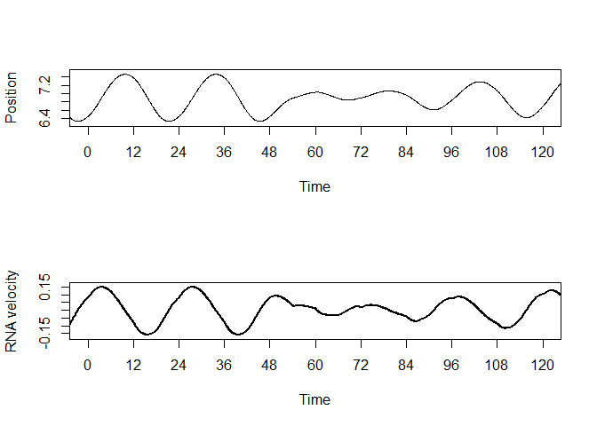
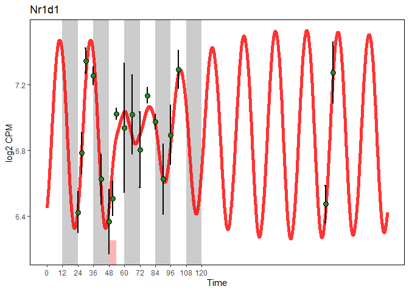

-   [Package](#package)
-   [Prepare data](#prepare-data)
-   [Run fitting](#run-fitting)
    -   [Process S Fit](#process-s-fit)
-   [Empirical bootstrap](#empirical-bootstrap)

Package
=======

load packages

``` r
library(SWDMr)
library(optimx)
library(ggplot2)
```

    ## Warning: package 'ggplot2' was built under R version 4.0.2

``` r
library(doSNOW)
```

    ## Loading required package: foreach

    ## Loading required package: iterators

    ## Loading required package: snow

Prepare data
============

Sleep-wake data per hour

``` r
# Data
# ****** Prepare Sleep-Wake data ****** 
files <- list.files(path="../Data/BXD_SleepWake_SDMJ2018/",pattern = paste("^","BL6",sep=""),full.names = T)
SWdf<-Read_SW(files,concattimesec = 360) # 300 = 5min, 180 = 3 min, 360 = 6min
SWdf<-SWdf_AddLD(SWdf) # Add Light and Dark
SWdf<-SWdf_DayMerging(SWdf,Daysformat=list(c(1,2),c(1,2),3,4,c(1,2)),concattimesec=360)
SWdf<-SWdf_AddSD(SWdf,c(48,54))
head(SWdf)
```

    ##         NREM         REM       Wake      Sleep LenW LenS Day Time Light Dark SD
    ## 1 0.03273148 0.001296296 0.06597222 0.03402778 59.5 30.5   1  0.1     1    0  0
    ## 2 0.03648148 0.002824074 0.06069444 0.03930556 55.0 35.0   1  0.2     1    0  0
    ## 3 0.04069444 0.004351852 0.05495370 0.04504630 49.5 40.5   1  0.3     1    0  0
    ## 4 0.04986111 0.002824074 0.04731481 0.05268519 42.5 47.5   1  0.4     1    0  0
    ## 5 0.06240741 0.003611111 0.03398148 0.06601852 30.5 59.5   1  0.5     1    0  0
    ## 6 0.06763889 0.009907407 0.02245370 0.07754630 20.5 69.5   1  0.6     1    0  0

Explained variable is gene expression

``` r
# ***** Prepare Gene expression data ******
# Gene expression
#load("../Data/C57BL6J_Cortex_TimeCourse_CHN2019/CHN2019_TimeCourse_NormalizedData_Genes.RData")
load("../Data/C57BL6J_Cortex_TimeCourse_CHN2019/B6Cortex_FilePrepSWDMr.Rdata")
```

Run fitting
===========

Build swdmr object

``` r
## If you want a greater timestep for Rk4
# SWdf<-SWdf[rep(seq_len(nrow(SWdf)), each = 10), ]
# SWdf$Time<-seq(0.01,120.0,by=0.01)
```

``` r
swdmr <- SWDMr(SWdist=SWdf, Gexp=rna_expr)
swdmr
```

    ## This is a SWDMr object
    ## This object contains:  17185 Genes Over 62 Time points
    ## Your force data frame contain 2640 values with the following possible forces:NREM;REM;Wake;Sleep;LenW;LenS;Day;Time;Light;Dark;SD

Initiate a Driven Damped Harmonic Oscillator \[DDHO\] model for a gene

``` r
Gene<-"Nr1d1"
model<-initDDHOmodel(swdmr,VarExp = Gene)
```

Set some parameter of our model

``` r
# Mean expression in baseline between highest and lowest value
MeanPerTime<-aggregate(rna_expr[rna_meta$SD_NSD == "NSD",Gene],list(rna_meta$Time[rna_meta$SD_NSD == "NSD"]),mean)
MeanGeneExprInBaseline<-(max(MeanPerTime$x)+min(MeanPerTime$x))/2

# Fix the intercepts
model<-FixIntercept(model,MeanGeneExprInBaseline)
# Add sleep-wake force
model<-AddForce(model,"Wake")
model<-AddForce(model,"Sleep")

# Start is set at intercept with speed of 0
model<-SetYinitMode(model,mode = "Intercept_0",values = c(0,48))
# We replicate baseline for 20 day
model<-ReplicateDrivingForce(model,c(0,24.0),40)
# A sin-wave force is applied with a period of 24h
model<-AddSinF(model,FixPer = 24)
# Compute the fit using RSS
model<-SetFittingValue(model,value = "RSS")
# Penalize the fitting for unstable value for 10 replicated days
model<-PenalizeUnstableFit(model,value = T,PredictedValueInterval = c(0,48), StabilityDayCheck = 10)
```

summary of the model

``` r
model
```

    ## ~~~~~~~~ This is a S4 SWDMr_DDHO object ~~~~~~~~ 
    ## 
    ## Display the current setting for your fitting
    ## 
    ## ~~~~~~~~~~~ Current parameter setting ~~~~~~~~~~ 
    ## 
    ## * [free parameters] omega (Core parameter) 
    ## * [free parameters] loggamma (Core parameter) 
    ## * [free parameters] Wake (Forces) 
    ## * [free parameters] Sleep (Forces) 
    ## * [free parameters] AmpSin (SinForce) 
    ## * [free parameters] PhiSin (SinForce) 
    ## 
    ## 
    ## * [fixed parameters] intercept (Core parameter) : 6.85399030064668
    ## * [fixed parameters] PerSin (SinForce) : 24

Fit data with optimx

``` r
# Get objective function
objfun<-SWDMrGetEvalFun(model)

# 1st Fit
params<-c(Wake=-0.1,Sleep=0.1,loggamma=log(1e-1),omega=2*pi/24,AmpSin=0,PhiSin=pi)
fits<-optimx(params,fn = objfun,method=c("nlminb"),control=list(maxit=1000))
params<-c(Wake=0.1,Sleep=-0.1,loggamma=log(1e-1),omega=2*pi/24,AmpSin=0,PhiSin=pi)
fits<-rbind(fits, optimx(params,fn = objfun,method=c("nlminb"),control=list(maxit=1000)))
params<-c(Wake=0,Sleep=0,loggamma=log(1e-1),omega=2*pi/24,AmpSin=0.01,PhiSin=pi)
fits<-rbind(fits, optimx(params,fn = objfun,method=c("nlminb"),control=list(maxit=1000)))
params<-c(Wake=0,Sleep=0,loggamma=log(1e-1),omega=2*pi/24,AmpSin=0.01,PhiSin=0)
fits<-rbind(fits, optimx(params,fn = objfun,method=c("nlminb"),control=list(maxit=1000)))


# Overdamped fit
params<-c(Wake=-1,Sleep=1,loggamma=1,omega=2*pi/24,AmpSin=0,PhiSin=pi)
fits<-rbind(fits, optimx(params,fn = objfun,method=c("nlminb"),control=list(maxit=1000)))
params<-c(Wake=1,Sleep=-1,loggamma=1,omega=2*pi/24,AmpSin=0,PhiSin=pi)
fits<-rbind(fits, optimx(params,fn = objfun,method=c("nlminb"),control=list(maxit=1000)))
params<-c(Wake=0,Sleep=0,loggamma=1,omega=2*pi/24,AmpSin=0.01,PhiSin=pi)
fits<-rbind(fits, optimx(params,fn = objfun,method=c("nlminb"),control=list(maxit=1000)))
params<-c(Wake=0,Sleep=0,loggamma=1,omega=2*pi/24,AmpSin=0.01,PhiSin=0)
fits<-rbind(fits, optimx(params,fn = objfun,method=c("nlminb"),control=list(maxit=1000)))

fits
```

    ##               Wake     Sleep   loggamma     omega       AmpSin     PhiSin
    ## nlminb  -0.1383653 0.2204592 -3.4424638 0.2449083  0.008010167  2.6442994
    ## nlminb1 -0.1383651 0.2204586 -3.4424727 0.2449083  0.008010186  2.6443017
    ## nlminb2 -0.1383652 0.2204590 -3.4424651 0.2449083  0.008010172  2.6442992
    ## nlminb3 -0.1383652 0.2204590 -3.4424647 0.2449083 -0.008010169 -0.4972934
    ## nlminb4 -1.4705834 2.2344881  0.9530210 0.6968801 -0.234601547  3.2938090
    ## nlminb5         NA        NA         NA        NA           NA         NA
    ## nlminb6 -1.4703914 2.2341875  0.9528893 0.6968299 -0.234567215  3.2938273
    ## nlminb7 -1.4703483 2.2341219  0.9528618 0.6968192  0.234560744  0.1522386
    ##                 value fevals gevals niter convcode  kkt1  kkt2 xtime
    ## nlminb   1.677829e+00     62    250    37        0  TRUE FALSE  0.77
    ## nlminb1  1.677829e+00     49    239    33        0 FALSE FALSE  0.72
    ## nlminb2  1.677829e+00     54    253    37        0  TRUE FALSE  0.77
    ## nlminb3  1.677829e+00     53    251    35        0  TRUE FALSE  0.75
    ## nlminb4  3.013493e+00     33    244    28        0  TRUE  TRUE  0.70
    ## nlminb5 8.988466e+307     NA     NA    NA     9999    NA    NA  1.11
    ## nlminb6  3.013493e+00     38    289    33        0  TRUE  TRUE  0.80
    ## nlminb7  3.013493e+00     41    275    34        0  TRUE  TRUE  0.82

``` r
if (! any(! is.na(fits$Wake))){
  params<-c(Wake=0,Sleep=0,loggamma=log(1e-1),omega=2*pi/24,AmpSin=0,PhiSin=pi)
  fits<-optimx(params,fn = objfun,method=c("newuoa"),control=list(maxit=10000))
}

if (any(fits$convcode == 0)){
  fits<-fits[fits$convcode == 0,,drop=F]
  optimxres<-fits[order(fits$value),,drop=F][1,]
}else{
  optimxres<-fits[order(fits$value),,drop=F][1,]
}

optimxres
```

    ##               Wake    Sleep  loggamma     omega      AmpSin   PhiSin    value
    ## nlminb2 -0.1383652 0.220459 -3.442465 0.2449083 0.008010172 2.644299 1.677829
    ##         fevals gevals niter convcode kkt1  kkt2 xtime
    ## nlminb2     54    253    37        0 TRUE FALSE  0.77

Get fit

``` r
out<-SWDMrFit(model,params = optimxres[1,])
par(mfrow=c(2,1))
plot(out$time,out$y1,type="l",ylab="Position",xlab="Time",xlim=c(0,120),xaxt="n")
axis(1,seq(0,120,by=12),seq(0,120,by=12))
plot(out$time,out$y2,type="l",xlab="Time",xlim=c(0,120),xaxt="n",ylab="RNA velocity",lwd=2)
axis(1,seq(0,120,by=12),seq(0,120,by=12))
```



Get some statistics for the fit (R2, and AdjR2 are not valid measure !
Do not use them !)

``` r
SWDMrStats(model,out,detailed = T)$stats
```

    ##   Variable      RSS       NLL       BIC BIC_flat  BayesFactor       AIC  n k
    ## 1    Nr1d1 1.677829 -23.92445 -23.08609 50.13979 7.957889e+15 -211.7973 62 6
    ##   ErrorVariance KendalTau
    ## 1    0.02706176 0.6907896

Plot fit and gene expression using ggplot2

``` r
SWDMr:::StandardFittingPlot(model,optimxres[1,])
```



Process S Fit
-------------

``` r
modelS<-initProcessSmodel(swdmr,VarExp = Gene)
modelS<-ReplicateDrivingForce(modelS,c(0,24.0),40)
modelS<-SetYinitMode(modelS,"Fixed",9)
modelS<-SetFittingValue(modelS,value = "NLL")
```

``` r
modelS
```

    ## ~~~~~~~~ This is a S4 SWDMr_ProcS object ~~~~~~~~ 
    ## 
    ## Display the current setting for your fitting
    ## 
    ## ~~~~~~~~~~~ Current parameter setting ~~~~~~~~~~ 
    ## 
    ## * [free parameters] AsympWake (Core parameter) 
    ## * [free parameters] AsympSleep (Core parameter) 
    ## * [free parameters] TauWake (Core parameter) 
    ## * [free parameters] TauSleep (Core parameter) 
    ## 
    ## 
    ## * [fixed parameters] start_pos (Yinit) : 9

``` r
objfun<-SWDMrGetEvalFun(modelS)
paramsS<-c("AsympWake"=6,AsympSleep=4,TauWake=10,TauSleep=10)
fitsS<-optimx(paramsS,fn = objfun,method=c("nlminb"),control=list(maxit=1000))

outS<-SWDMrFit(modelS,fitsS)
```

``` r
SWDMr:::StandardFittingPlot(modelS,fitsS[1,])
```


``` r
SWDMrStats(modelS,outS,detailed = T)$stats
```

    ##   Variable      RSS       NLL      BIC BIC_flat BayesFactor       AIC  n k
    ## 1    Nr1d1 3.747342 0.9854726 18.47948 50.13979     7498039 -165.9774 62 4
    ##   ErrorVariance KendalTau
    ## 1      0.060441 0.5472816

Mean force applied by each force on the oscillator

``` r
Fmod<-SWDMr:::AllForceApplied(model,optimxres)
sumF<-apply(abs(Fmod[,seq(2,6)]),1,sum)
Fmod[,seq(2,6)]<-abs(Fmod[,seq(2,6)])/sumF
apply(Fmod[Fmod$Time>48 & Fmod$Time < 72.1,],2,mean)
```

``` r
optimx2<-optimxres[1,]
optimx2["AmpSin"]<-0
SWDMr:::StandardFittingPlot(model,optimx2)

optimx2<-optimxres[1,]
optimx2["omega"]<-2*pi/24
SWDMr:::StandardFittingPlot(model,optimx2)

optimx2<-optimxres[1,]
optimx2["Sleep"]<-0
optimx2["Wake"]<-0
SWDMr:::StandardFittingPlot(model,optimx2)
```

Empirical bootstrap
===================

Compute confidence interval using empirical bootstrap

``` r
# See http://sia.webpopix.org/nonlinearRegression.html
EmpBoot<-function(model, optimxres, params, upper, lower, nboot = 100, NCORES = 7){
  
  out<-SWDMrFit(model,params = optimxres[1,])
  
  F <- matrix(nrow=nboot,ncol=length(out$y1))
  Y <- matrix(nrow=nboot,ncol=length(out$y1))
  
  pred<-SWDMrFit(model,params = optimxres[1,])
  predv<-pred$y1
  names(predv)<-pred$time
  predval<-predv[as.character(model@Gexp[,"Time"])]
  
  stats<-SWDMrStats(model,out,detailed = T)
  model2<-model
  
  paramsboot<-as.numeric(optimxres[1,names(params)])
  names(paramsboot)<-names(params)
  
  cl <- makeCluster(NCORES)
  #clusterExport(cl,c("lower","upper","model2","stats"))
  registerDoSNOW(cl)
  
  B <- foreach(i = 1:nboot,.packages=c("SWDMr","optimx"),.combine="rbind") %dopar% {
    n<-length(model2@Gexp[,1])
    model2@Gexp[,1]<- predval + sqrt(stats[["ErrorVariance"]])*rnorm(n)
    objfunboot<-SWDMrGetEvalFun(model2)
    #optimxresboot<-optimx(paramsboot,objfunboot,method=c("nlminb"),lower = lower,upper=upper)
    optimxresboot<-optimx(paramsboot,objfunboot,method=c("nlminb"))
    
    return(as.numeric(optimxresboot[1,names(params)]))
  }
  stopCluster(cl)
  
  for (l in 1:nrow(B)){
    bootpar<-B[l,]
    names(bootpar)<-names(params)
    outboot<-SWDMrFit(model,params = bootpar)
    F[l,] <- outboot$y1
    Y[l,] <- outboot$y1 + rnorm(1,0,sqrt(stats[["ErrorVariance"]]))
  }
  
  level <- 0.95
  alpha <- 1 - level
  df.mc<-data.frame(Time=out$time)
  df.mc[c("lwr.conf","upr.conf")] <- t(apply(F,MARGIN=2,function(x) quantile(x,c(alpha/2,1-alpha/2),na.rm=T)))
  df.mc[c("lwr.pred","upr.pred")] <- t(apply(Y,MARGIN=2,function(x) quantile(x,c(alpha/2,1-alpha/2),na.rm=T)))
  df.mc<-df.mc[df.mc$Time>0,]
  V.mc <- cov(B)
  
  se.mc <- sqrt(diag(V.mc))
  
  t.stat <- paramsboot/se.mc
  p.value <- 2*(1 - pt(abs(t.stat),51))
  
  Est.pvals<-cbind(Estimate=paramsboot,SE=se.mc,Tstat=t.stat,p.value)
  
  
  b <- c(apply(B,MARGIN=2,function(x) quantile(x,alpha/2,na.rm=T)),
         apply(B,MARGIN=2,function(x) quantile(x,1-alpha/2,na.rm=T)))
  ci.mc=matrix(b,ncol=2)
  row.names(ci.mc) <- names(paramsboot)
  colnames(ci.mc) <- c(paste0((1-level)/2*100,"%"),paste0((1+level)/2*100,"%"))

  return(list(B=B,Y=Y,F=F,CI=ci.mc,Est.pvals=Est.pvals,df.mc=df.mc))
}
```

Confidence intervals

``` r
EmpBootres<-EmpBoot(model,optimxres,params,upper,lower,nboot=200)
EmpBootres$CI
#EmpBootres$Est.pvals
```

``` r
p<-SWDMr:::StandardFittingPlot(model,optimxres[1,])
p <- p + annotate("ribbon",x=EmpBootres$df.mc$Time, ymin=EmpBootres$df.mc$lwr.pred, ymax=EmpBootres$df.mc$upr.pred, alpha=0.2, fill="blue")
p <- p + annotate("ribbon",x=EmpBootres$df.mc$Time, ymin=EmpBootres$df.mc$lwr.conf, ymax=EmpBootres$df.mc$upr.conf, alpha=0.4, fill="#339900")
p
```

``` r
sessionInfo()
```

    ## R version 4.0.0 (2020-04-24)
    ## Platform: x86_64-w64-mingw32/x64 (64-bit)
    ## Running under: Windows 10 x64 (build 18363)
    ## 
    ## Matrix products: default
    ## 
    ## locale:
    ## [1] LC_COLLATE=French_Switzerland.1252  LC_CTYPE=French_Switzerland.1252   
    ## [3] LC_MONETARY=French_Switzerland.1252 LC_NUMERIC=C                       
    ## [5] LC_TIME=French_Switzerland.1252    
    ## 
    ## attached base packages:
    ## [1] stats     graphics  grDevices utils     datasets  methods   base     
    ## 
    ## other attached packages:
    ## [1] doSNOW_1.0.18    snow_0.4-3       iterators_1.0.12 foreach_1.5.0   
    ## [5] ggplot2_3.3.2    optimx_2020-4.2  SWDMr_1.1       
    ## 
    ## loaded via a namespace (and not attached):
    ##  [1] Rcpp_1.0.4.6        pillar_1.4.3        compiler_4.0.0     
    ##  [4] tools_4.0.0         digest_0.6.25       evaluate_0.14      
    ##  [7] lifecycle_0.2.0     tibble_3.0.1        gtable_0.3.0       
    ## [10] pkgconfig_2.0.3     rlang_0.4.5         parallel_4.0.0     
    ## [13] yaml_2.2.1          xfun_0.13           withr_2.2.0        
    ## [16] stringr_1.4.0       dplyr_0.8.5         knitr_1.28         
    ## [19] vctrs_0.2.4         grid_4.0.0          tidyselect_1.0.0   
    ## [22] glue_1.4.0          R6_2.4.1            rmarkdown_2.1      
    ## [25] farver_2.0.3        purrr_0.3.4         magrittr_1.5       
    ## [28] scales_1.1.0        codetools_0.2-16    ellipsis_0.3.0     
    ## [31] htmltools_0.5.0     assertthat_0.2.1    colorspace_1.4-1   
    ## [34] numDeriv_2016.8-1.1 labeling_0.3        stringi_1.4.6      
    ## [37] munsell_0.5.0       crayon_1.3.4
