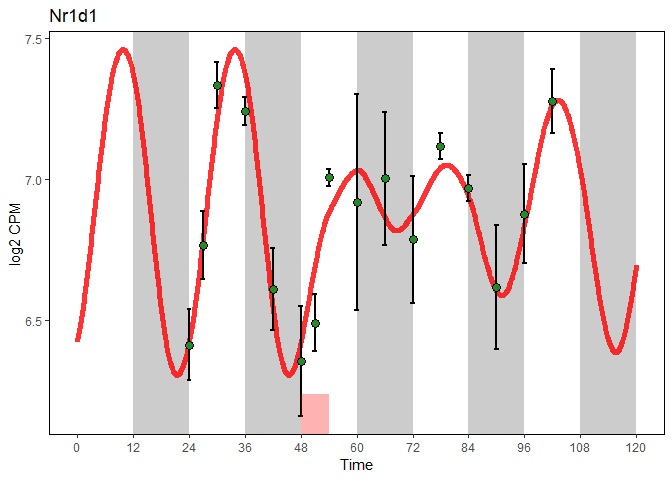

Package
=======

load packages

``` r
library(SWDMr)
library(optimx)
library(ggplot2)
```

Prepare data
============

Sleep-wake data per hour

``` r
# Data
# ****** Prepare Sleep-Wake data ****** 
files <- list.files(path="../data/Sleep_States/",pattern = paste("^","BL6",sep=""),full.names = T)
SWdf<-Read_SW(files,concattimesec = 360) # 300 = 5min, 180 = 3 min, 360 = 6min
SWdf<-SWdf_AddLD(SWdf) # Add Light and Dark
SWdf<-SWdf_DayMerging(SWdf,Daysformat=list(c(1,2),c(1,2),3,4,c(1,2)),concattimesec=360)
SWdf<-SWdf_AddSD(SWdf,c(48,54))
head(SWdf)
```

    ##         NREM         REM       Wake      Sleep LenW LenS Day Time Light
    ## 1 0.03273148 0.001296296 0.06597222 0.03402778 59.5 30.5   1  0.1     1
    ## 2 0.03648148 0.002824074 0.06069444 0.03930556 55.0 35.0   1  0.2     1
    ## 3 0.04069444 0.004351852 0.05495370 0.04504630 49.5 40.5   1  0.3     1
    ## 4 0.04986111 0.002824074 0.04731481 0.05268519 42.5 47.5   1  0.4     1
    ## 5 0.06240741 0.003611111 0.03398148 0.06601852 30.5 59.5   1  0.5     1
    ## 6 0.06763889 0.009907407 0.02245370 0.07754630 20.5 69.5   1  0.6     1
    ##   Dark SD
    ## 1    0  0
    ## 2    0  0
    ## 3    0  0
    ## 4    0  0
    ## 5    0  0
    ## 6    0  0

Explained variable is gene expression

``` r
# ***** Prepare Gene expression data ******
# Gene expression
load("../data/CHor2018_TimeCourse_NormalizedData_Genes.RData")
# Meta data
load("../data/CHor2018_TimeCourse_MetaData.RData")
# Remove data sampled 7days after SD
rna_expr<-rna_expr[,rna_meta$time<100]
rna_meta<-rna_meta[rna_meta$time<100,]
# Row = samples, column = gene
rna_expr<-t(rna_expr)
#rna_expr<-2^rna_expr
rna_expr<-as.data.frame(rna_expr)
# Add time factor
rna_expr$Time<-rna_meta$time+24
head(rna_expr[,c("Arntl","Dbp","Time")])
```

    ##          Arntl      Dbp Time
    ## ZT0A  5.944392 4.898669   24
    ## ZT0B  5.977196 4.750183   24
    ## ZT0H  5.849927 5.281751   24
    ## J70N1 5.860580 4.980111   24
    ## T3N2  5.835763 5.282515   27
    ## T3N3  5.900950 5.159076   27

Run fitting
===========

Build swdmr object

``` r
swdmr <- SWDMr(SWdist=SWdf, Gexp=rna_expr)
swdmr
```

    ## This is a SWDMr object
    ## This object contains:  17185 Genes Over 56 Time points
    ## Your force data frame contain 1200 values with the following possible forces:NREM;REM;Wake;Sleep;LenW;LenS;Day;Time;Light;Dark;SD

Initiate a Driven Damped Harmonic Oscillator \[DDHO\] model for Arntl

``` r
Gene<-"Arntl"
model<-initDDHOmodel(swdmr,VarExp = Gene)
```

Set some parameter of our model

``` r
# Mean expression in baseline between highest and lowest value
MeanPerTime<-aggregate(rna_expr[rna_meta$SD_NSD == "NSD",Gene],list(rna_meta$time[rna_meta$SD_NSD == "NSD"]),mean)
MeanGeneExprInBaseline<-(max(MeanPerTime$x)+min(MeanPerTime$x))/2

# Fix the intercepts
model<-FixIntercept(model,MeanGeneExprInBaseline)
# Add sleep-wake force
model<-AddForce(model,"Wake")
model<-AddForce(model,"Sleep")
# Start is set at intercept with speed of 0
model<-SetYinitMode(model,mode = "Intercept_0",values = c(0,48))
# We replicate baseline for 20 day
model<-ReplicateDrivingForce(model,c(0.1,24.0),20)
# A sin-wave force is applied with a period of 24h
model<-AddSinF(model,FixPer = 24)
# Compute the fit using RSS
model<-SetFittingValue(model,value = "RSS")
# Penalize the fitting for unstable value for 10 replicated days
model<-PenalizeUnstableFit(model,value = T,PredictedValueInterval = c(0,48), StabilityDayCheck = 10)
```

summary of the model

``` r
model
```

    ## ~~~~~~~~ This is a S4 SWDMr_DDHO object ~~~~~~~~ 
    ## 
    ## Display the current setting for your fitting
    ## 
    ## ~~~~~~~~~~~ Current parameter setting ~~~~~~~~~~ 
    ## 
    ## * [free parameters] omega (Core parameter) 
    ## * [free parameters] loggamma (Core parameter) 
    ## * [free parameters] Wake (Forces) 
    ## * [free parameters] Sleep (Forces) 
    ## * [free parameters] AmpSin (SinForce) 
    ## * [free parameters] PhiSin (SinForce) 
    ## 
    ## 
    ## * [fixed parameters] intercept (Core parameter) : 5.50170622932143
    ## * [fixed parameters] PerSin (SinForce) : 24

Fit data

``` r
# Get objective function
objfun<-SWDMrGetEvalFun(model)
# Limits of the model
params<-c(Wake=0,Sleep=0,loggamma=log(1e-1),omega=2*pi/23.8,AmpSin=1,PhiSin=5.2)
#params<-c(Wake=0.056834519219219,Sleep=0.00814929150840472,loggamma=-5.22,omega=0.296,AmpSin=0.00204,PhiSin=2.48179822476184)
lower<-c(Wake=-Inf,Sleep=-Inf,loggamma=-Inf,omega=2*pi/27,AmpSin=0,PhiSin=0)
upper<-c(Wake=Inf,Sleep=Inf,loggamma=Inf,omega=2*pi/20,AmpSin=Inf,PhiSin=2*pi)
# Fit
optimxres<-optimx(params,objfun,method=c("nlminb"),lower = lower,upper=upper)
optimxres
```

    ##             Wake     Sleep  loggamma     omega AmpSin   PhiSin    value
    ## nlminb 0.1928694 -0.206938 -2.444661 0.2429182      0 5.069304 0.503354
    ##        fevals gevals niter convcode  kkt1  kkt2 xtime
    ## nlminb     36    176    23        0 FALSE FALSE  0.39

Get fit

``` r
out<-SWDMrFit(model,params = optimxres[1,])
par(mfrow=c(2,1))
plot(out$time,out$y1,type="l",ylab="Position",xlab="Time")
plot(out$time,out$y2,type="l",ylab="Speed",xlab="Time")
```


Get some statistics for the fit

``` r
SWDMrStats(model,out,detailed = T)
```

    ##   Variable      RSS       NLL       BIC       AIC        R2     AdjR2
    ## 1    Arntl 0.503354 -52.47021 -76.76296 -249.8615 0.8681807 0.8549988
    ##      Fstat pvalF numdf rdf  n k ErrorVariance
    ## 1 65.86144     0     5  50 56 6   0.008988465

Plot fit and gene expression using ggplot2

``` r
SWDMr:::StandardFittingPlot(model,optimxres[1,])
```



``` r
sessionInfo()
```

    ## R version 3.5.1 (2018-07-02)
    ## Platform: x86_64-w64-mingw32/x64 (64-bit)
    ## Running under: Windows 10 x64 (build 17763)
    ## 
    ## Matrix products: default
    ## 
    ## locale:
    ## [1] LC_COLLATE=French_Switzerland.1252  LC_CTYPE=French_Switzerland.1252   
    ## [3] LC_MONETARY=French_Switzerland.1252 LC_NUMERIC=C                       
    ## [5] LC_TIME=French_Switzerland.1252    
    ## 
    ## attached base packages:
    ## [1] stats     graphics  grDevices utils     datasets  methods   base     
    ## 
    ## other attached packages:
    ## [1] ggplot2_3.1.0    optimx_2018-7.10 SWDMr_1.0       
    ## 
    ## loaded via a namespace (and not attached):
    ##  [1] Rcpp_1.0.0        knitr_1.22        magrittr_1.5     
    ##  [4] tidyselect_0.2.5  munsell_0.5.0     colorspace_1.4-0 
    ##  [7] R6_2.4.0          rlang_0.3.1       dplyr_0.8.0.1    
    ## [10] stringr_1.4.0     plyr_1.8.4        tools_3.5.1      
    ## [13] grid_3.5.1        gtable_0.2.0      xfun_0.6         
    ## [16] withr_2.1.2       htmltools_0.3.6   assertthat_0.2.0 
    ## [19] yaml_2.2.0        lazyeval_0.2.1    digest_0.6.18    
    ## [22] tibble_2.0.1      numDeriv_2016.8-1 crayon_1.3.4     
    ## [25] purrr_0.3.1       glue_1.3.1        evaluate_0.13    
    ## [28] rmarkdown_1.12    labeling_0.3      stringi_1.4.3    
    ## [31] compiler_3.5.1    pillar_1.3.1      scales_1.0.0     
    ## [34] pkgconfig_2.0.2
