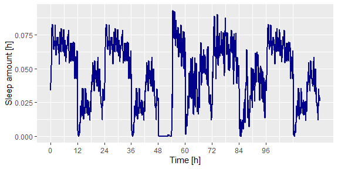
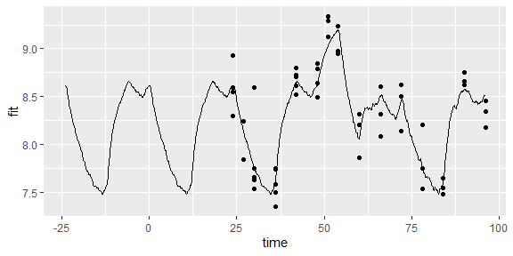
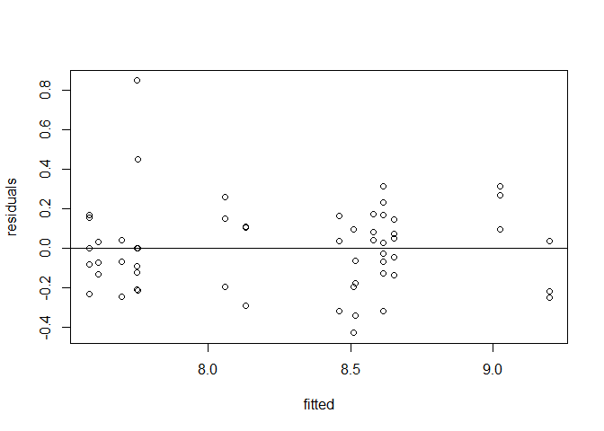
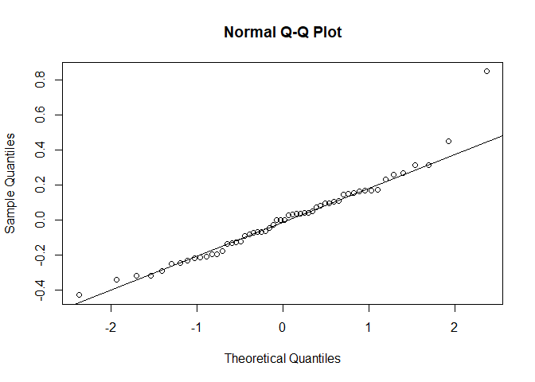
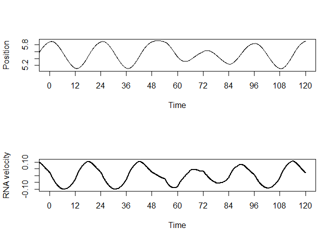
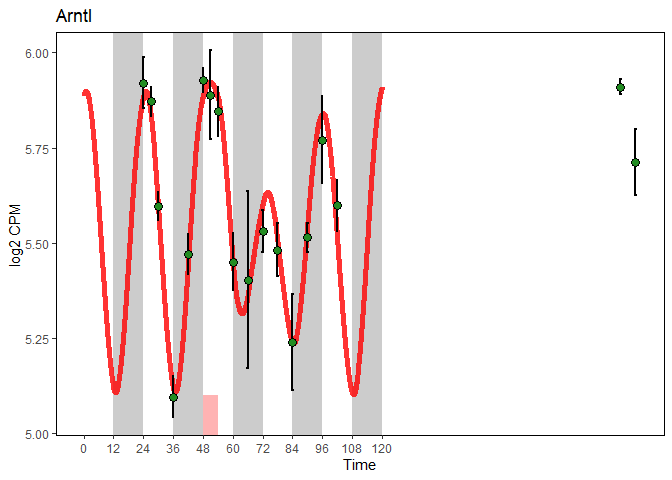

-   [Sleep-Wake Driven Models, an R package
    \[SWDMr\]](#sleep-wake-driven-models-an-r-package-swdmr)
-   [Format vigilant state](#format-vigilant-state)
-   [Fit a process-S dynamic on
    phenotype](#fit-a-process-s-dynamic-on-phenotype)
    -   [Data:](#data)
    -   [Create model](#create-model)
    -   [Optimization](#optimization)
    -   [Visualize fit](#visualize-fit)
    -   [Compute some statistics](#compute-some-statistics)
-   [Run fitting](#run-fitting)

Sleep-Wake Driven Models, an R package \[SWDMr\]
================================================

*An R package to fit models for sleep-wake driven phenotypes*

-   [x] Read and format vigilant state data
-   \[\] Read *smo* file format
-   [x] Fit a Process-S dynamic model
-   \[\] Fit a Process-C dynamic model
-   [x] Fit an driven damped harmonic oscillator model

``` r
library(SWDMr) # Package for model construction, objective function building

# External package
library(optimx) # Package for parameter optimization
library(ggplot2) # Package for visualization
```

    ## Warning: package 'ggplot2' was built under R version 4.0.2

``` r
library(doSNOW) # Package for multiprocessing
```

    ## Loading required package: foreach

    ## Loading required package: iterators

    ## Loading required package: snow

Format vigilant state
=====================

Get vigilant state of mice. Each row is a 4 seconds epoch containing the
vigilant state of the mouse

Wake = w \| 1 NREM sleep = n \| 2 REM sleep = r \| 3

``` r
data(SleepWakeData)
head(as.data.frame(SleepWakeData))
```

    ##   BL601 BL602 BL606 BL609 BL610 BL611 BL612 BL614 BL616 BL6V1 BL6V2 BL6V3
    ## 1     w     w     r     w     w     w     w     w     n     w     w     w
    ## 2     w     w     r     w     w     w     w     w     n     w     w     w
    ## 3     w     w     r     w     w     w     w     w     n     w     w     w
    ## 4     w     w     r     w     w     w     n     w     n     w     w     w
    ## 5     w     w     n     w     w     w     n     w     n     w     1     w
    ## 6     w     w     w     w     n     w     n     w     n     w     w     w

Compute the amount of wake,nrem and rem sleep per 6 minutes bin (0.1h)

``` r
# Read the matrix and transform it into a data.frame for time spent in each state per "concattimesec" bin [in sec]
SWdf<-Read_SW(SleepWakeData,concattimesec = 360) # 300 = 5min, 180 = 3 min, 360 = 6min

# We can add day and night cycle
SWdf<-SWdf_AddLD(SWdf)

# We merge day 1 and 2 that are "baseline", then following days are 3 and 4, then baseline sleep is reiterated
SWdf<-SWdf_DayMerging(SWdf,Daysformat=list(c(1,2),c(1,2),3,4,c(1,2)),concattimesec=360)

# We add sleep deprivation even at time 48
SWdf<-SWdf_AddSD(SWdf,c(48,54))

# End result:
head(SWdf)
```

    ##         NREM         REM       Wake      Sleep LenW LenS Day Time Light Dark SD
    ## 1 0.03273148 0.001296296 0.06597222 0.03402778 59.5 30.5   1  0.1     1    0  0
    ## 2 0.03648148 0.002824074 0.06069444 0.03930556 55.0 35.0   1  0.2     1    0  0
    ## 3 0.04069444 0.004351852 0.05495370 0.04504630 49.5 40.5   1  0.3     1    0  0
    ## 4 0.04986111 0.002824074 0.04731481 0.05268519 42.5 47.5   1  0.4     1    0  0
    ## 5 0.06240741 0.003611111 0.03398148 0.06601852 30.5 59.5   1  0.5     1    0  0
    ## 6 0.06763889 0.009907407 0.02245370 0.07754630 20.5 69.5   1  0.6     1    0  0

Sleep amount in the experiment

``` r
gg<-ggplot(aes(x=Time,y=Sleep),data=SWdf)+geom_line(color="darkblue",size=1)
gg<-gg+scale_x_continuous(breaks=seq(0,96,by=12))
gg<-gg+ylab("Sleep amount [h]")+xlab("Time [h]")
gg
```



Fit a process-S dynamic on phenotype
====================================

First we load data for time spent awake or asleep

Data:
-----

``` r
# Contain a data.frame of time spent asleep or awake
data(SWdf)
head(SWdf)
```

    ##         NREM         REM       Wake      Sleep LenW LenS Day Time Light Dark SD
    ## 1 0.03273148 0.001296296 0.06597222 0.03402778 59.5 30.5   1  0.1     1    0  0
    ## 2 0.03648148 0.002824074 0.06069444 0.03930556 55.0 35.0   1  0.2     1    0  0
    ## 3 0.04069444 0.004351852 0.05495370 0.04504630 49.5 40.5   1  0.3     1    0  0
    ## 4 0.04986111 0.002824074 0.04731481 0.05268519 42.5 47.5   1  0.4     1    0  0
    ## 5 0.06240741 0.003611111 0.03398148 0.06601852 30.5 59.5   1  0.5     1    0  0
    ## 6 0.06763889 0.009907407 0.02245370 0.07754630 20.5 69.5   1  0.6     1    0  0

We then load phenotypes containing also time of sampling corresponding
with the sleep-wake data.frame

``` r
data(RNAExpression)
head(RNAExpression)
```

    ##         Homer1    Arntl   Acot11 Time
    ## ZT0A  8.549128 5.959436 5.807318   24
    ## ZT0B  8.929343 5.993355 5.848576   24
    ## ZT0H  8.590908 5.858654 5.607724   24
    ## J70N1 8.298023 5.868748 5.829312   24
    ## T3N2  7.841878 5.848891 5.792511   27
    ## T3N3  8.240451 5.916294 5.733705   27

Let’s model the dynamics of Homer1

Create model
------------

We create a swdmr object containing sleep-wake data and phenotypes

``` r
swdmr <- SWDMr(SWdist=SWdf, Gexp=RNAExpression)
swdmr
```

    ## This is a SWDMr object
    ## This object contains:  3 Genes Over 62 Time points
    ## Your force data frame contain 1200 values with the following possible forces:NREM;REM;Wake;Sleep;LenW;LenS;Day;Time;Light;Dark;SD

We then initiate a model for a process-S dynamics

``` r
modelS<-initProcessSmodel(swdmr,VarExp = "Homer1")
```

We replicate the baseline time (time0-time24) 10x to have a stable
baseline dynamics

``` r
modelS<-ReplicateDrivingForce(modelS,c(0,24.0),10)
```

We fix the starting point as mean expression level

``` r
modelS<-SetYinitMode(modelS,"Fixed",mean(RNAExpression$Homer1))
```

We want to optimize our objective function to minimize the Residual Sum
of Square (RSS)

``` r
modelS<-SetFittingValue(modelS,value = "RSS")
```

Our model as the following free parameters:

``` r
modelS
```

    ## ~~~~~~~~ This is a S4 SWDMr_ProcS object ~~~~~~~~ 
    ## 
    ## Display the current setting for your fitting
    ## 
    ## ~~~~~~~~~~~ Current parameter setting ~~~~~~~~~~ 
    ## 
    ## * [free parameters] AsympWake (Core parameter) 
    ## * [free parameters] AsympSleep (Core parameter) 
    ## * [free parameters] TauWake (Core parameter) 
    ## * [free parameters] TauSleep (Core parameter) 
    ## 
    ## 
    ## * [fixed parameters] start_pos (Yinit) : 8.27131807832239

*We could fix some of these parameters*

``` r
# Here, asymptotic value for time spent awake is 10 for the phenotype of interest
anothermodel<-FixAsymptWake(modelS,10)
anothermodel
```

    ## ~~~~~~~~ This is a S4 SWDMr_ProcS object ~~~~~~~~ 
    ## 
    ## Display the current setting for your fitting
    ## 
    ## ~~~~~~~~~~~ Current parameter setting ~~~~~~~~~~ 
    ## 
    ## * [free parameters] AsympSleep (Core parameter) 
    ## * [free parameters] TauWake (Core parameter) 
    ## * [free parameters] TauSleep (Core parameter) 
    ## 
    ## 
    ## * [fixed parameters] AsympWake (Core parameter) : 10
    ## * [fixed parameters] start_pos (Yinit) : 8.27131807832239

Optimization
------------

We create an objective function:

``` r
objfun<-SWDMrGetEvalFun(modelS)
```

We use optimx to optimize the free parameter to minimize the RSS

``` r
paramsS<-c("AsympWake"=6,AsympSleep=4,TauWake=10,TauSleep=10)
# Many other algorithms and options exist ! See optimx manual to fit your needs
fitsS<-optimx(paramsS,fn = objfun,method=c("Nelder-Mead"))
fitsS
```

    ##             AsympWake AsympSleep  TauWake TauSleep    value fevals gevals niter
    ## Nelder-Mead  9.333525  -18.17969 3.518485 72.72382 2.670078    501     NA    NA
    ##             convcode  kkt1  kkt2 xtime
    ## Nelder-Mead        1 FALSE FALSE  0.48

Visualize fit
-------------

Let see the fit

``` r
outS<-SWDMrFit(modelS,fitsS)
```

``` r
# plot fitted lines
gg<-ggplot(aes(x=time,y=fit),data=cbind.data.frame(time=outS$time,fit=outS$y1))
gg<-gg+geom_line()
# Add expression points
gg <- gg + annotate("point",x=RNAExpression$Time,y=RNAExpression$Homer1)
gg<-gg + xlim(-24,96)
gg
```

    ## Warning: Removed 2399 row(s) containing missing values (geom_path).

    ## Warning: Removed 9 rows containing missing values (geom_point).



Compute some statistics
-----------------------

``` r
residuals<-SWDMrStats(modelS,outS,detailed = T)$residuals
fitted<-SWDMrStats(modelS,outS,detailed = T)$fitted
stats<-SWDMrStats(modelS,outS,detailed = T)$stats
```

-   Residual Sum of Square: RSS
-   Negative Log Likelihood: NLL
-   Bayesian Information Criterion: BIC
-   BIC of a linear model with an intercept only: BIC\_flat
-   Bayes Factor between our model and a flat model: BayesFactor
-   Akaike Information Criterion: AIC
-   Number of samples in model: n
-   Number of free parameters: k
-   Variance of resiudals: ErrorVariance
-   Kendall’s tau between data points and fit: KendalTau

``` r
stats
```

    ##   Variable      RSS       NLL      BIC BIC_flat  BayesFactor       AIC  n k
    ## 1   Homer1 2.670078 -5.750276 4.600854 93.52109 2.036032e+19 -162.4217 56 4
    ##   ErrorVariance KendalTau
    ## 1    0.04767996 0.7397206

*Here n=56 while dataset contains 62 points. Because fit was performed
up to Time96 while last points reach Time 216 and 222. If these points
needed to be integrated, then SWdf should go up to time 222*

``` r
plot(fitted,residuals);abline(h=mean(residuals))
```



``` r
qqnorm(residuals);qqline(residuals)
```



Run fitting
===========

Build swdmr object

``` r
## If you want a greater timestep for Rk4
# SWdf<-SWdf[rep(seq_len(nrow(SWdf)), each = 10), ]
# SWdf$Time<-seq(0.01,120.0,by=0.01)
```

``` r
swdmr <- SWDMr(SWdist=SWdf, Gexp=RNAExpression)
swdmr
```

    ## This is a SWDMr object
    ## This object contains:  3 Genes Over 62 Time points
    ## Your force data frame contain 1200 values with the following possible forces:NREM;REM;Wake;Sleep;LenW;LenS;Day;Time;Light;Dark;SD

Initiate a Driven Damped Harmonic Oscillator \[DDHO\] model for a gene

``` r
Gene<-"Arntl"
model<-initDDHOmodel(swdmr,VarExp = Gene)
```

Set some parameter of our model

``` r
# Mean expression in baseline between highest and lowest value
MeanPerTime<-aggregate(RNAExpression[RNAExpression$Time <= 48,Gene],list(RNAExpression$Time[RNAExpression$Time <= 48]),mean)
MeanGeneExprInBaseline<-(max(MeanPerTime$x)+min(MeanPerTime$x))/2

# Fix the intercepts
model<-FixIntercept(model,MeanGeneExprInBaseline)
# Add sleep-wake force
model<-AddForce(model,"Wake")
model<-AddForce(model,"Sleep")

# Start is set at intercept with speed of 0
model<-SetYinitMode(model,mode = "Intercept_0",values = c(0,48))
# We replicate baseline for 20 day
model<-ReplicateDrivingForce(model,c(0,24.0),40)
# A sin-wave force is applied with a period of 24h
model<-AddSinF(model,FixPer = 24)
# Compute the fit using RSS
model<-SetFittingValue(model,value = "RSS")
# Penalize the fitting for unstable value for 10 replicated days
model<-PenalizeUnstableFit(model,value = T,PredictedValueInterval = c(0,48), StabilityDayCheck = 10)
```

summary of the model

``` r
model
```

    ## ~~~~~~~~ This is a S4 SWDMr_DDHO object ~~~~~~~~ 
    ## 
    ## Display the current setting for your fitting
    ## 
    ## ~~~~~~~~~~~ Current parameter setting ~~~~~~~~~~ 
    ## 
    ## * [free parameters] omega (Core parameter) 
    ## * [free parameters] loggamma (Core parameter) 
    ## * [free parameters] Wake (Forces) 
    ## * [free parameters] Sleep (Forces) 
    ## * [free parameters] AmpSin (SinForce) 
    ## * [free parameters] PhiSin (SinForce) 
    ## 
    ## 
    ## * [fixed parameters] intercept (Core parameter) : 5.51174101310475
    ## * [fixed parameters] PerSin (SinForce) : 24

Fit data with optimx

``` r
# Get objective function
objfun<-SWDMrGetEvalFun(model)

# 1st Fit
params<-c(Wake=-0.1,Sleep=0.1,loggamma=log(1e-1),omega=2*pi/24,AmpSin=0,PhiSin=pi)
fits<-optimx(params,fn = objfun,method=c("nlminb"),control=list(maxit=1000))

fits
```

    ##             Wake      Sleep  loggamma     omega      AmpSin   PhiSin     value
    ## nlminb 0.1580769 -0.1786065 -2.192577 0.2157555 0.006161535 3.710265 0.3754079
    ##        fevals gevals niter convcode kkt1 kkt2 xtime
    ## nlminb     36    178    25        0 TRUE TRUE  0.47

``` r
if (! any(! is.na(fits$Wake))){
  params<-c(Wake=0,Sleep=0,loggamma=log(1e-1),omega=2*pi/24,AmpSin=0,PhiSin=pi)
  fits<-optimx(params,fn = objfun,method=c("newuoa"),control=list(maxit=10000))
}

if (any(fits$convcode == 0)){
  fits<-fits[fits$convcode == 0,,drop=F]
  optimxres<-fits[order(fits$value),,drop=F][1,]
}else{
  optimxres<-fits[order(fits$value),,drop=F][1,]
}

optimxres
```

    ##             Wake      Sleep  loggamma     omega      AmpSin   PhiSin     value
    ## nlminb 0.1580769 -0.1786065 -2.192577 0.2157555 0.006161535 3.710265 0.3754079
    ##        fevals gevals niter convcode kkt1 kkt2 xtime
    ## nlminb     36    178    25        0 TRUE TRUE  0.47

Get fit

``` r
out<-SWDMrFit(model,params = optimxres[1,])
par(mfrow=c(2,1))
plot(out$time,out$y1,type="l",ylab="Position",xlab="Time",xlim=c(0,120),xaxt="n")
axis(1,seq(0,120,by=12),seq(0,120,by=12))
plot(out$time,out$y2,type="l",xlab="Time",xlim=c(0,120),xaxt="n",ylab="RNA velocity",lwd=2)
axis(1,seq(0,120,by=12),seq(0,120,by=12))
```



Get some statistics for the fit (R2, and AdjR2 are not valid measure !
Do not use them !)

``` r
SWDMrStats(model,out,detailed = T)$stats
```

    ##   Variable       RSS       NLL       BIC BIC_flat  BayesFactor       AIC  n k
    ## 1    Arntl 0.3754079 -60.68207 -97.21203 13.06533 8.839435e+23 -268.2853 56 6
    ##   ErrorVariance KendalTau
    ## 1   0.006703712 0.7531092

Plot fit and gene expression using ggplot2

``` r
SWDMr:::StandardFittingPlot(model,optimxres[1,])
```



``` r
sessionInfo()
```

    ## R version 4.0.0 (2020-04-24)
    ## Platform: x86_64-w64-mingw32/x64 (64-bit)
    ## Running under: Windows 10 x64 (build 18363)
    ## 
    ## Matrix products: default
    ## 
    ## locale:
    ## [1] LC_COLLATE=French_Switzerland.1252  LC_CTYPE=French_Switzerland.1252   
    ## [3] LC_MONETARY=French_Switzerland.1252 LC_NUMERIC=C                       
    ## [5] LC_TIME=French_Switzerland.1252    
    ## 
    ## attached base packages:
    ## [1] stats     graphics  grDevices utils     datasets  methods   base     
    ## 
    ## other attached packages:
    ## [1] doSNOW_1.0.18    snow_0.4-3       iterators_1.0.12 foreach_1.5.0   
    ## [5] ggplot2_3.3.2    optimx_2020-4.2  SWDMr_1.1       
    ## 
    ## loaded via a namespace (and not attached):
    ##  [1] Rcpp_1.0.4.6        pillar_1.4.3        compiler_4.0.0     
    ##  [4] tools_4.0.0         digest_0.6.25       evaluate_0.14      
    ##  [7] lifecycle_0.2.0     tibble_3.0.1        gtable_0.3.0       
    ## [10] pkgconfig_2.0.3     rlang_0.4.5         parallel_4.0.0     
    ## [13] yaml_2.2.1          xfun_0.13           withr_2.2.0        
    ## [16] stringr_1.4.0       dplyr_0.8.5         knitr_1.28         
    ## [19] vctrs_0.2.4         grid_4.0.0          tidyselect_1.0.0   
    ## [22] glue_1.4.0          R6_2.4.1            rmarkdown_2.1      
    ## [25] farver_2.0.3        purrr_0.3.4         magrittr_1.5       
    ## [28] scales_1.1.0        codetools_0.2-16    ellipsis_0.3.0     
    ## [31] htmltools_0.5.0     assertthat_0.2.1    colorspace_1.4-1   
    ## [34] numDeriv_2016.8-1.1 labeling_0.3        stringi_1.4.6      
    ## [37] munsell_0.5.0       crayon_1.3.4
