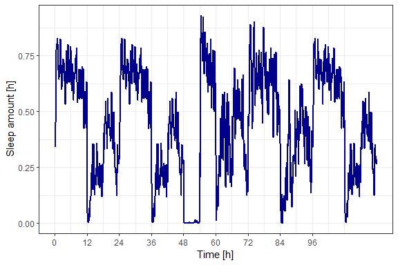
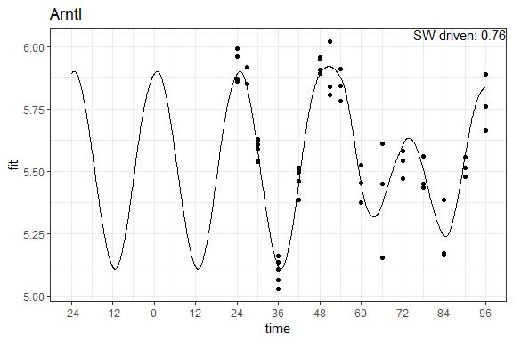
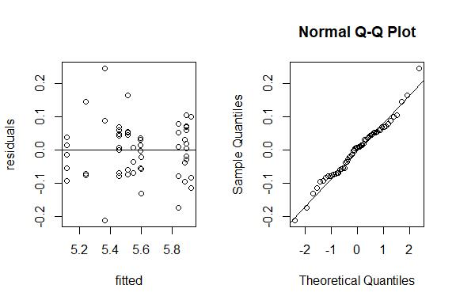
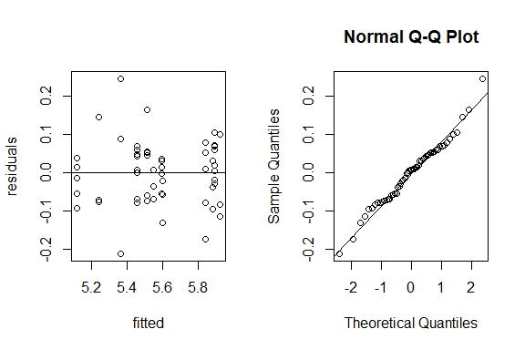

Examples
================
Maxime Jan
02 octobre, 2020

  - [Sleep-Wake Driven Models, an R package
    \[SWDMr\]](#sleep-wake-driven-models-an-r-package-swdmr)
  - [Format vigilant state](#format-vigilant-state)
  - [Fit a Driven Damped harmonic oscillator
    model](#fit-a-driven-damped-harmonic-oscillator-model)
      - [Data](#data)
      - [Create model](#create-model)
      - [Optimization](#optimization)
      - [Visualize fit](#visualize-fit)
      - [Compute some statistics](#compute-some-statistics)
      - [Other dynamics](#other-dynamics)
  - [Fit a process-S dynamic on
    phenotype](#fit-a-process-s-dynamic-on-phenotype)
      - [Data:](#data-1)
      - [Create model](#create-model-1)
      - [Optimization](#optimization-1)
      - [Visualize fit](#visualize-fit-1)
      - [Compute some statistics](#compute-some-statistics-1)

# Sleep-Wake Driven Models, an R package \[SWDMr\]

*An R package to fit models for sleep-wake driven phenotypes*

  - [x] Read and format vigilant state data
  - [ ] Read *smo* file format
  - [x] Fit a Process-S dynamic model
  - [ ] Fit a Process-C dynamic model
  - [x] Fit an driven damped harmonic oscillator model

Statistical methods are inspired by Jake Yeung method for model
selection. See [J.Yeung
github](https://github.com/jakeyeung/SleepDepAnalysis) and [PNAS
publication](https://doi.org/10.1073/pnas.1910590116)

``` r
library(SWDMr) # Package for model construction, objective function building

# External package
library(optimx) # Package for parameter optimization
library(ggplot2) # Package for visualization
```

# Format vigilant state

Get vigilant state of mice. Each row is a 4 seconds epoch containing the
vigilant state of the mouse

  - Wake = w | 1
  - NREM sleep = n | 2
  - REM sleep = r | 3

<!-- end list -->

``` r
data(SleepWakeData)
head(as.data.frame(SleepWakeData))
```

    ##   BL601 BL602 BL606 BL609 BL610 BL611 BL612 BL614 BL616 BL6V1 BL6V2 BL6V3
    ## 1     w     w     r     w     w     w     w     w     n     w     w     w
    ## 2     w     w     r     w     w     w     w     w     n     w     w     w
    ## 3     w     w     r     w     w     w     w     w     n     w     w     w
    ## 4     w     w     r     w     w     w     n     w     n     w     w     w
    ## 5     w     w     n     w     w     w     n     w     n     w     1     w
    ## 6     w     w     w     w     n     w     n     w     n     w     w     w

Compute the amount of wake,nrem and rem sleep per 6 minutes bin (0.1h)

``` r
# Read the matrix and transform it into a data.frame for time spent in each state per "concattimesec" bin [in sec]
SWdf<-Read_SW(SleepWakeData,concattimesec = 360) # 300 = 5min, 180 = 3 min, 360 = 6min

# We can add day and night cycle
SWdf<-SWdf_AddLD(SWdf)

# We merge day 1 and 2 that are "baseline", then following days are 3 and 4, then baseline sleep is reiterated
SWdf<-SWdf_DayMerging(SWdf,Daysformat=list(c(1,2),c(1,2),3,4,c(1,2)),concattimesec=360)

# We add sleep deprivation even at time 48
SWdf<-SWdf_AddSD(SWdf,c(48,54))

# End result:
head(SWdf)
```

    ##         NREM         REM       Wake      Sleep LenW LenS Day Time Light Dark SD
    ## 1 0.03273148 0.001296296 0.06597222 0.03402778 59.5 30.5   1  0.1     1    0  0
    ## 2 0.03648148 0.002824074 0.06069444 0.03930556 55.0 35.0   1  0.2     1    0  0
    ## 3 0.04069444 0.004351852 0.05495370 0.04504630 49.5 40.5   1  0.3     1    0  0
    ## 4 0.04986111 0.002824074 0.04731481 0.05268519 42.5 47.5   1  0.4     1    0  0
    ## 5 0.06240741 0.003611111 0.03398148 0.06601852 30.5 59.5   1  0.5     1    0  0
    ## 6 0.06763889 0.009907407 0.02245370 0.07754630 20.5 69.5   1  0.6     1    0  0

Sleep amount in the experiment

``` r
gg<-ggplot(aes(x=Time,y=Sleep),data=SWdf)+geom_line(color="darkblue",size=1)
gg<-gg+scale_x_continuous(breaks=seq(0,96,by=12))
gg<-gg+ylab("Sleep amount [h]")+xlab("Time [h]")+ theme_bw()
gg
```

<!-- -->

# Fit a Driven Damped harmonic oscillator model

In this model, sleep and wake change the phenotype speed and act as a
force on the oscillator.

We also use a second force driving the oscillator in the form of a
sine-wave representing the force applied by the circadian systems to
synchronize phenotypes to the current time.

In this example, we model the dynamics of Arntl (Bmal1)

## Data

First we load data for time spent awake or asleep

``` r
# Contain a data.frame of time spent asleep or awake
data(SWdf)
head(SWdf)
```

    ##         NREM         REM       Wake      Sleep LenW LenS Day Time Light Dark SD
    ## 1 0.03273148 0.001296296 0.06597222 0.03402778 59.5 30.5   1  0.1     1    0  0
    ## 2 0.03648148 0.002824074 0.06069444 0.03930556 55.0 35.0   1  0.2     1    0  0
    ## 3 0.04069444 0.004351852 0.05495370 0.04504630 49.5 40.5   1  0.3     1    0  0
    ## 4 0.04986111 0.002824074 0.04731481 0.05268519 42.5 47.5   1  0.4     1    0  0
    ## 5 0.06240741 0.003611111 0.03398148 0.06601852 30.5 59.5   1  0.5     1    0  0
    ## 6 0.06763889 0.009907407 0.02245370 0.07754630 20.5 69.5   1  0.6     1    0  0

We then load phenotypes containing also time of sampling corresponding
with the sleep-wake data.frame

``` r
data(RNAExpression)
head(RNAExpression)
```

    ##         Homer1    Arntl   Acot11    Cyth3 Time
    ## ZT0A  8.549128 5.959436 5.807318 5.319726   24
    ## ZT0B  8.929343 5.993355 5.848576 5.232212   24
    ## ZT0H  8.590908 5.858654 5.607724 5.282329   24
    ## J70N1 8.298023 5.868748 5.829312 5.253387   24
    ## T3N2  7.841878 5.848891 5.792511 5.257537   27
    ## T3N3  8.240451 5.916294 5.733705 5.127145   27

## Create model

We create a swdmr object containing sleep-wake data and phenotypes

``` r
swdmr <- SWDMr(SWdist=SWdf, Gexp=RNAExpression)
swdmr
```

    ## This is a SWDMr object
    ## This object contains:  4 Genes Over 62 Time points
    ## Your force data frame contain 1200 values with the following possible forces:NREM;REM;Wake;Sleep;LenW;LenS;Day;Time;Light;Dark;SD

We then initiate a model for a Driven Damped Harmonic Oscillator (DDHO)

``` r
model<-initDDHOmodel(swdmr,VarExp = "Arntl")
```

In our model, we fix the equilibrium position to the mean expression of
Arntl in baseline

``` r
MeanGeneExprInBaseline<-mean(RNAExpression$Arntl[RNAExpression$Time<=48])
model<-FixIntercept(model,MeanGeneExprInBaseline)
```

The force driving our oscillator are Sleep-Wake

``` r
model<-AddForce(model,"Wake")
model<-AddForce(model,"Sleep")
```

A second force is used, representing the sychronizing force with
biological time (CT). As mouse are under 12:12 LD cycle, this force has
a 24h period

``` r
model<-AddSinF(model,FixPer = 24)
```

Our model start at the equilibrium position with a speed of 0

``` r
model<-SetYinitMode(model,mode = "Intercept_0")
```

We replicate baseline sleep-wake distribution to allow the oscillator to
reach a stable oscillation

``` r
model<-ReplicateDrivingForce(model,c(0,24.0),40)
```

This is our model:

``` r
model
```

    ## ~~~~~~~~ This is a S4 SWDMr_DDHO object ~~~~~~~~ 
    ## 
    ## Display the current setting for your fitting
    ## 
    ## ~~~~~~~~~~~ Current parameter setting ~~~~~~~~~~ 
    ## 
    ## * [free parameters] omega (Core parameter) 
    ## * [free parameters] loggamma (Core parameter) 
    ## * [free parameters] Wake (Forces) 
    ## * [free parameters] Sleep (Forces) 
    ## * [free parameters] AmpSin (SinForce) 
    ## * [free parameters] PhiSin (SinForce) 
    ## 
    ## 
    ## * [fixed parameters] intercept (Core parameter) : 5.60879619259997
    ## * [fixed parameters] PerSin (SinForce) : 24

## Optimization

We create an objective function:

``` r
objfun<-SWDMrGetEvalFun(model)
```

We use optimx to optimize the free parameter to minimize the RSS

``` r
# We assume the following starting parameters:

# Natural frequency of our oscillator close to 24h
# low damping
params<-c(omega=2*pi/24,loggamma=-1,Wake=0,Sleep=0,AmpSin=0,PhiSin=pi)
# Many other algorithms and options exist ! See optimx manual to fit your needs. 
# In this case you may want to limit the natural frequency of the oscillator below 
# phenotype sampling rate and multiple start to avoid local optimum
fits<-optimx(params,fn = objfun,method=c("nlminb"))
fits
```

    ##            omega  loggamma      Wake      Sleep      AmpSin   PhiSin     value
    ## nlminb 0.2157555 -2.192577 0.1128973 -0.2237861 0.006161537 3.710265 0.3754079
    ##        fevals gevals niter convcode kkt1 kkt2 xtime
    ## nlminb     51    240    35        0 TRUE TRUE  0.51

## Visualize fit

Let see the fit

``` r
out<-SWDMrFit(model,fits)
```

``` r
# plot fitted lines
gg<-ggplot(aes(x=time,y=fit),data=cbind.data.frame(time=out$time,fit=out$y1))
gg<-gg+geom_line()
# Add expression points
gg <- gg + annotate("point",x=RNAExpression$Time,y=RNAExpression$Arntl)
gg<-gg +scale_x_continuous(breaks=seq(-24,96,by=12),limits = c(-24,96))+ theme_bw() + ggtitle("Arntl")
gg
```

<!-- -->

## Compute some statistics

``` r
residuals<-SWDMrStats(model,out,detailed = T)$residuals
fitted<-SWDMrStats(model,out,detailed = T)$fitted
stats<-SWDMrStats(model,out,detailed = T)$stats
```

  - Residual Sum of Square: RSS
  - Negative Log Likelihood: NLL
  - Bayesian Information Criterion: BIC
  - BIC of a linear model with an intercept only: BIC\_flat
  - Bayes Factor between our model and a flat model: BayesFactor
  - Akaike Information Criterion: AIC
  - Number of samples in model: n
  - Number of free parameters: k
  - Variance of resiudals: ErrorVariance
  - Kendall’s tau between data points and fit: KendalTau

<!-- end list -->

``` r
stats
```

    ##   Variable       RSS       NLL       BIC BIC_flat  BayesFactor       AIC  n k
    ## 1    Arntl 0.3754079 -60.68207 -97.21203 13.06533 8.839435e+23 -268.2853 56 6
    ##   ErrorVariance KendalTau
    ## 1   0.006703712 0.7531092

*Here n=56 while dataset contains 62 points. Because fit was performed
up to Time96 while last points reach Time 216 and 222. If these points
needed to be integrated, then SWdf should go up to time 222*

``` r
par(mfrow=c(1,2))
plot(fitted,residuals);abline(h=mean(residuals))
qqnorm(residuals);qqline(residuals)
```

<!-- -->

## Other dynamics

This model can also be applied to different dynamics like Homer1

``` r
model<-initDDHOmodel(swdmr,VarExp = "Homer1")
MeanGeneExprInBaseline<-mean(RNAExpression$Homer1[RNAExpression$Time<=48])
model<-FixIntercept(model,MeanGeneExprInBaseline)
model<-AddForce(model,"Wake")
model<-AddForce(model,"Sleep")
model<-AddSinF(model,FixPer = 24)
model<-SetYinitMode(model,mode = "Intercept_0")
model<-ReplicateDrivingForce(model,c(0,24.0),40)
objfun<-SWDMrGetEvalFun(model)
params<-c(omega=2*pi/24,loggamma=-1,Wake=0,Sleep=0,AmpSin=0,PhiSin=pi)
fits<-optimx(params,fn = objfun,method=c("nlminb"))
out<-SWDMrFit(model,fits)
gg<-ggplot(aes(x=time,y=fit),data=cbind.data.frame(time=out$time,fit=out$y1))
gg<-gg+geom_line()
gg <- gg + annotate("point",x=RNAExpression$Time,y=RNAExpression$Homer1)
gg<-gg +scale_x_continuous(breaks=seq(-24,96,by=12),limits = c(-24,96))+ theme_bw() + ggtitle("Homer1")
gg
```

    ## Warning: Removed 9600 row(s) containing missing values (geom_path).

    ## Warning: Removed 9 rows containing missing values (geom_point).

<!-- -->

Acot11

``` r
model<-initDDHOmodel(swdmr,VarExp = "Acot11")
MeanGeneExprInBaseline<-mean(RNAExpression$Acot11[RNAExpression$Time<=48])
model<-FixIntercept(model,MeanGeneExprInBaseline)
model<-AddForce(model,"Wake")
model<-AddForce(model,"Sleep")
model<-AddSinF(model,FixPer = 24)
model<-SetYinitMode(model,mode = "Intercept_0")
model<-ReplicateDrivingForce(model,c(0,24.0),40)
objfun<-SWDMrGetEvalFun(model)
params<-c(omega=2*pi/24,loggamma=-1,Wake=0,Sleep=0,AmpSin=0,PhiSin=pi)
fits<-optimx(params,fn = objfun,method=c("nlminb"))
out<-SWDMrFit(model,fits)
gg<-ggplot(aes(x=time,y=fit),data=cbind.data.frame(time=out$time,fit=out$y1))
gg<-gg+geom_line()
gg <- gg + annotate("point",x=RNAExpression$Time,y=RNAExpression$Acot11)
gg<-gg +scale_x_continuous(breaks=seq(-24,96,by=12),limits = c(-24,96))+ theme_bw() + ggtitle("Acot11")
gg
```

    ## Warning: Removed 9600 row(s) containing missing values (geom_path).

    ## Warning: Removed 9 rows containing missing values (geom_point).

<!-- -->

# Fit a process-S dynamic on phenotype

This is a simplified version of process-S like driven phenotypes, see
[J.Yeung github](https://github.com/jakeyeung/SleepDepAnalysis)

First we load data for time spent awake or asleep

## Data:

``` r
# Contain a data.frame of time spent asleep or awake
data(SWdf)
head(SWdf)
```

    ##         NREM         REM       Wake      Sleep LenW LenS Day Time Light Dark SD
    ## 1 0.03273148 0.001296296 0.06597222 0.03402778 59.5 30.5   1  0.1     1    0  0
    ## 2 0.03648148 0.002824074 0.06069444 0.03930556 55.0 35.0   1  0.2     1    0  0
    ## 3 0.04069444 0.004351852 0.05495370 0.04504630 49.5 40.5   1  0.3     1    0  0
    ## 4 0.04986111 0.002824074 0.04731481 0.05268519 42.5 47.5   1  0.4     1    0  0
    ## 5 0.06240741 0.003611111 0.03398148 0.06601852 30.5 59.5   1  0.5     1    0  0
    ## 6 0.06763889 0.009907407 0.02245370 0.07754630 20.5 69.5   1  0.6     1    0  0

We then load phenotypes containing also time of sampling corresponding
with the sleep-wake data.frame

``` r
data(RNAExpression)
head(RNAExpression)
```

    ##         Homer1    Arntl   Acot11    Cyth3 Time
    ## ZT0A  8.549128 5.959436 5.807318 5.319726   24
    ## ZT0B  8.929343 5.993355 5.848576 5.232212   24
    ## ZT0H  8.590908 5.858654 5.607724 5.282329   24
    ## J70N1 8.298023 5.868748 5.829312 5.253387   24
    ## T3N2  7.841878 5.848891 5.792511 5.257537   27
    ## T3N3  8.240451 5.916294 5.733705 5.127145   27

Let’s model the dynamics of Homer1

## Create model

We create a swdmr object containing sleep-wake data and phenotypes

``` r
swdmr <- SWDMr(SWdist=SWdf, Gexp=RNAExpression)
swdmr
```

    ## This is a SWDMr object
    ## This object contains:  4 Genes Over 62 Time points
    ## Your force data frame contain 1200 values with the following possible forces:NREM;REM;Wake;Sleep;LenW;LenS;Day;Time;Light;Dark;SD

We then initiate a model for a process-S dynamics

``` r
modelS<-initProcessSmodel(swdmr,VarExp = "Homer1")
```

We replicate the baseline time (time0-time24) 10x to have a stable
baseline dynamics

``` r
modelS<-ReplicateDrivingForce(modelS,c(0,24.0),10)
```

We fix the starting point as mean expression level

``` r
modelS<-SetYinitMode(modelS,"Fixed",mean(RNAExpression$Homer1))
```

We want to optimize our objective function to minimize the Residual Sum
of Square (RSS)

``` r
modelS<-SetFittingValue(modelS,value = "RSS")
```

Our model as the following free parameters:

``` r
modelS
```

    ## ~~~~~~~~ This is a S4 SWDMr_ProcS object ~~~~~~~~ 
    ## 
    ## Display the current setting for your fitting
    ## 
    ## ~~~~~~~~~~~ Current parameter setting ~~~~~~~~~~ 
    ## 
    ## * [free parameters] AsympWake (Core parameter) 
    ## * [free parameters] AsympSleep (Core parameter) 
    ## * [free parameters] TauWake (Core parameter) 
    ## * [free parameters] TauSleep (Core parameter) 
    ## 
    ## 
    ## * [fixed parameters] start_pos (Yinit) : 8.27131807832239

*We could fix some of these parameters*

``` r
# Here, asymptotic value for time spent awake is 10 for the phenotype of interest
anothermodel<-FixAsymptWake(modelS,10)
anothermodel
```

    ## ~~~~~~~~ This is a S4 SWDMr_ProcS object ~~~~~~~~ 
    ## 
    ## Display the current setting for your fitting
    ## 
    ## ~~~~~~~~~~~ Current parameter setting ~~~~~~~~~~ 
    ## 
    ## * [free parameters] AsympSleep (Core parameter) 
    ## * [free parameters] TauWake (Core parameter) 
    ## * [free parameters] TauSleep (Core parameter) 
    ## 
    ## 
    ## * [fixed parameters] AsympWake (Core parameter) : 10
    ## * [fixed parameters] start_pos (Yinit) : 8.27131807832239

## Optimization

We create an objective function:

``` r
objfun<-SWDMrGetEvalFun(modelS)
```

We use optimx to optimize the free parameter to minimize the RSS

``` r
paramsS<-c(AsympWake=6,AsympSleep=4,TauWake=10,TauSleep=10)
# Many other algorithms and options exist ! See optimx manual to fit your needs
fitsS<-optimx(paramsS,fn = objfun,method=c("Nelder-Mead"))
fitsS
```

    ##             AsympWake AsympSleep  TauWake TauSleep    value fevals gevals niter
    ## Nelder-Mead  9.333525  -18.17969 3.518485 72.72382 2.670078    501     NA    NA
    ##             convcode  kkt1  kkt2 xtime
    ## Nelder-Mead        1 FALSE FALSE  0.56

## Visualize fit

Let see the fit

``` r
outS<-SWDMrFit(modelS,fitsS)
```

``` r
# plot fitted lines
gg<-ggplot(aes(x=time,y=fit),data=cbind.data.frame(time=outS$time,fit=outS$y1))
gg<-gg+geom_line()
# Add expression points
gg <- gg + annotate("point",x=RNAExpression$Time,y=RNAExpression$Homer1)
gg<-gg +scale_x_continuous(breaks=seq(-24,96,by=12),limits = c(-24,96))+ theme_bw()
gg
```

<!-- -->

## Compute some statistics

``` r
residuals<-SWDMrStats(modelS,outS,detailed = T)$residuals
fitted<-SWDMrStats(modelS,outS,detailed = T)$fitted
stats<-SWDMrStats(modelS,outS,detailed = T)$stats
```

  - Residual Sum of Square: RSS
  - Negative Log Likelihood: NLL
  - Bayesian Information Criterion: BIC
  - BIC of a linear model with an intercept only: BIC\_flat
  - Bayes Factor between our model and a flat model: BayesFactor
  - Akaike Information Criterion: AIC
  - Number of samples in model: n
  - Number of free parameters: k
  - Variance of resiudals: ErrorVariance
  - Kendall’s tau between data points and fit: KendalTau

<!-- end list -->

``` r
stats
```

    ##   Variable      RSS       NLL      BIC BIC_flat  BayesFactor       AIC  n k
    ## 1   Homer1 2.670078 -5.750276 4.600854 93.52109 2.036032e+19 -162.4217 56 4
    ##   ErrorVariance KendalTau
    ## 1    0.04767996 0.7397206

*Here n=56 while dataset contains 62 points. Because fit was performed
up to Time96 while last points reach Time 216 and 222. If these points
needed to be integrated, then SWdf should go up to time 222*

``` r
par(mfrow=c(1,2))
plot(fitted,residuals);abline(h=mean(residuals))
qqnorm(residuals);qqline(residuals)
```

<!-- -->

``` r
sessionInfo()
```

    ## R version 4.0.1 (2020-06-06)
    ## Platform: x86_64-w64-mingw32/x64 (64-bit)
    ## Running under: Windows 10 x64 (build 18363)
    ## 
    ## Matrix products: default
    ## 
    ## locale:
    ## [1] LC_COLLATE=French_Switzerland.1252  LC_CTYPE=French_Switzerland.1252   
    ## [3] LC_MONETARY=French_Switzerland.1252 LC_NUMERIC=C                       
    ## [5] LC_TIME=French_Switzerland.1252    
    ## 
    ## attached base packages:
    ## [1] stats     graphics  grDevices utils     datasets  methods   base     
    ## 
    ## other attached packages:
    ## [1] ggplot2_3.3.1   optimx_2020-4.2 SWDMr_1.2      
    ## 
    ## loaded via a namespace (and not attached):
    ##  [1] Rcpp_1.0.4.6        knitr_1.28          magrittr_1.5       
    ##  [4] tidyselect_1.1.0    munsell_0.5.0       colorspace_1.4-1   
    ##  [7] R6_2.4.1            rlang_0.4.6         dplyr_1.0.0        
    ## [10] stringr_1.4.0       tools_4.0.1         grid_4.0.1         
    ## [13] gtable_0.3.0        xfun_0.14           withr_2.2.0        
    ## [16] htmltools_0.5.0     ellipsis_0.3.1      yaml_2.2.1         
    ## [19] digest_0.6.25       tibble_3.0.1        lifecycle_0.2.0    
    ## [22] crayon_1.3.4        numDeriv_2016.8-1.1 farver_2.0.3       
    ## [25] purrr_0.3.4         vctrs_0.3.1         glue_1.4.1         
    ## [28] evaluate_0.14       rmarkdown_2.4       labeling_0.3       
    ## [31] stringi_1.4.6       compiler_4.0.1      pillar_1.4.4       
    ## [34] generics_0.0.2      scales_1.1.1        pkgconfig_2.0.3
